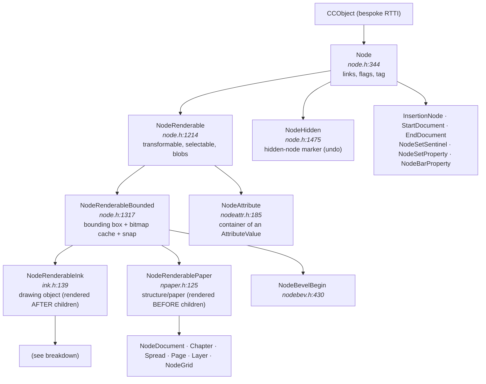

# Xara Xtreme (Xara LX) document model — analysis and proposal for a Rust reimplementation

> **Clean-room notice.** This document describes the *behaviour* and the *data
> formats* of the Xara Xtreme document model (GPL-2.0-only) for interoperability
> purposes, and proposes an original design in Rust. It does not reproduce
> source code from the original; the `file:line` references point at the
> reference tree in `xara-xtreme/` and serve only to locate the logic being
> described. Xarast is implemented from this specification, not by translating
> the original.

> **Source analysed:** `/home/user/xara-xtreme` (Xara LX / Xara Xtreme, GPLv2, Xara Group Ltd 1993‑2006).
> All `file:line` references are relative to `/home/user/xara-xtreme/Kernel/` unless stated otherwise.
> **A read-only document about the original C++.** None of the original source code has been modified.

---

## Index

1. [Kernel base concepts](#1-kernel-base-concepts)
2. [Node class hierarchy](#2-node-class-hierarchy)
3. [Structure of the document tree](#3-structure-of-the-document-tree)
4. [The attribute system](#4-the-attribute-system)
5. [Fills and transparencies](#5-fills-and-transparencies)
6. [Groups, composites and "live" objects](#6-groups-composites-and-live-objects)
7. [The text model](#7-the-text-model)
8. [Bitmaps](#8-bitmaps)
9. [Selection, operations and undo/redo](#9-selection-operations-and-undoredo)
10. [Rust design recommendation](#10-rust-design-recommendation)
11. [Appendices](#11-appendices)

---

## 1. Kernel base concepts

### 1.1 Units and primitive types

| Type | Definition | Comment |
|---|---|---|
| `MILLIPOINT` | `typedef INT32 MILLIPOINT;` — `../PreComp/camtypes.h:132` | The universal coordinate unit. 1 point = 1000 millipoints; 1 inch = 72,000 millipoints. The whole document is 32-bit integer. |
| `DocCoord` | `doccoord.h:104`, derives from `Coord` | An `(x, y)` pair in millipoints, **document coordinates**. |
| `DocRect` | `doccoord.h` | A `lo`/`hi` rectangle in millipoints; used for bounding boxes and the pasteboard. |
| `XMILLIPOINT` | `typedef XLONG XMILLIPOINT;` — `ccmaths.h:121` | A 64-bit coordinate for area/perimeter computations. |
| `FIXED16` | `fixed16.h` | 16.16 fixed point for fractal parameters (graininess, gravity, squash). |
| `TAG` | `basedoc.h` | A unique integer identifier for a node within a document (`Node::GetTag()`, `node.h:436`). Assigned by `BaseDocument::NewTag()` (`basedoc.h:109`). |

The use of 32-bit integers in millipoints (rather than floating point) is a **very** pervasive design decision: exact equality comparison of coordinates, the absence of NaN and bit-for-bit reproducibility of rendering all depend on it. In Rust it is worth preserving (an `i32` newtype) rather than migrating to `f64`.

### 1.2 Bespoke RTTI: `CCObject` and `CCRuntimeClass`

Xara does not use `dynamic_cast`. It implements its own type system (MFC style) with macros:

- `CC_DECLARE_DYNAMIC(Class)` / `CC_DECLARE_DYNCREATE(Class)` in the header.
- `CC_IMPLEMENT_DYNAMIC(Class, Base)` in the `.cpp`.
- `CC_RUNTIME_CLASS(Class)` returns a `CCRuntimeClass*` used as a **runtime type token**.
- `IS_A(p, Class)` / `p->IsKindOf(CC_RUNTIME_CLASS(Class))`.

This is essential to understanding the model: **a great deal of kernel logic dispatches on dynamic type**. For example `Node::FindFirstChild(CCRuntimeClass*)` (`node.h:576`), `AttrTypeSet` (`node.h:304`), `Node::RemoveAttrTypeFromSubtree(CCRuntimeClass*)` (`node.h:753`), `NodeRenderableInk::CanAttrBeAppliedToMe(CCRuntimeClass*)` (`ink.h:219`).

In addition, to avoid the cost of RTTI on hot paths, `Node` declares **~60 virtual fast type predicates** (`node.h:460‑520`):

`Node` declares one predicate per relevant category; all of them return false in the base
class and each subclass overrides its own. The ones that matter for tree traversal are
(`node.h:455-520`):

| Predicate | Answers | Reference |
|---|---|---|
| `IsAnObject` | is it a drawing object? | `node.h:460` |
| `IsAnAttribute` | is it an attribute node? | `node.h:455` |
| `IsPaper` | is it the paper of the spread? | `node.h:457` |
| `IsLayer` / `IsSpread` / `IsChapter` / `IsNodeDocument` | structural level of the tree | `node.h:460-520` |
| `IsNodeHidden` | is it a hidden node (an undoable deletion)? | ditto |
| `IsNodePath` | is it a path? | ditto |
| `IsCompound` / `IsController` | is it a composite? is it the controller of a composite? | ditto |
| `IsABlend` / `IsABevel` / `IsAContour` / `IsAShadow` / `IsEffect` | "live" object family | ditto |

The real list runs to some 60 predicates; the above are the ones traversal and
rendering consult on the hot path.

> **Reading for Rust:** this battery of predicates is exactly what an `enum NodeKind` + `matches!` solves for free and exhaustively. It is the clearest sign that the inheritance hierarchy was compensating for the lack of *sum types*.

### 1.3 The link structure: `Node`

`class CCAPI Node : public CCObject` — **`node.h:344`**

Instance data (`node.h:757‑784`):

Node flags (`node.h:758`), packed into 1-bit fields:

| Flag | Meaning |
|---|---|
| `Locked` | reserved; not used in this version |
| `Mangled` | used by the ArtWorks importer |
| `Marked` | used by the copying of marked objects |
| `Selected` | selected by the user |
| `Renderable` | the node is rendered |
| `SelectedChildren` | it has selected children (*select-inside*) |
| `OpPermission1`, `OpPermission2` | a pair of bits encoding an `OpPermissionState` |

Link and identity fields of `Node` itself:

| Field | Type | Meaning | Reference |
|---|---|---|---|
| `Tag` | unsigned 32-bit integer | unique identifier within the document | `node.h:773` |
| `Flags` | the flags above | node state | `node.h:774` |
| `Previous` | node pointer | previous sibling | `node.h:777` |
| `Next` | node pointer | next sibling | `node.h:778` |
| `Child` | node pointer | **first** child | `node.h:779` |
| `Parent` | node pointer | parent | `node.h:780` |
| `HiddenRefCnt` | unsigned 32-bit integer | number of `NodeHidden` nodes hiding this node | `node.h:784` |

That is: **a doubly linked sibling list + a pointer to the first child + a pointer to the parent**. There is no pointer to the last child (it is walked to: `Node::FindLastChild()`, `node.h:571`), nor a vector of children. This makes `AttachNode`/`MoveNode` O(1) and makes node identity the pointer.

Structural operations (`node.h:425‑428`):

| Method | Semantics |
|---|---|
| `AttachNode(ContextNode, Direction, ...)` | Links this node relative to another. `Direction ∈ {PREV, NEXT, FIRSTCHILD, LASTCHILD}` (`node.h:160`). |
| `MoveNode(Dest, Direction)` | Unlink + relink. |
| `CopyNode(Dest, Direction)` | Deep copy of the subtree. |
| `NodeCopy(Node**)` / `CloneNode(Node**, bool lightweight)` | Copy of the node. |
| `CascadeDelete()` | Recursively deletes the children. |
| `UnlinkNodeFromTree(BaseDocument*)` | Unlinks without deleting. |
| `InsertChainSimple(...)` | Inserts a chain of siblings by manipulating pointers only. |

Traversals (`node.h:601‑640`):

- `FindFirstDepthFirst()` / `FindNextDepthFirst(Subtree)` — post-order (children before parent): **this is the render order**.
- `FindFirstPreorder()` / `FindNextPreorder(pRoot, bSkipSubtree)` — pre-order.
- `FindNextNonHidden()` / `FindPrevNonHidden()` — skip `NodeHidden` nodes.
- `FindParentSpread()`, `FindOwnerDoc()`, `FindFirstChapter()`, `FindParent(CCRuntimeClass*)`.
- `IsUnder(pTestNode)` — checks precedence in render order.

### 1.4 Render order and the ink/paper "contract"

The central architectural distinction is:

- ***Paper* nodes** (`NodeRenderablePaper`, `npaper.h:125`) are rendered **before** their children (background).
- ***Ink* nodes** (`NodeRenderableInk`, `ink.h:139`) are rendered **after** their children (the children are its attributes, which must be active when the object is drawn).

The actual loop lives in `RenderRegion::RenderTree()`, `rndrgn.cpp:~7000‑7150`. The skeleton:

```
for each node in order:
    state := ask the node what to do with its subtree        # node.h:390 (virtual)
    if state == ROOTANDCHILDREN and the node has children:
        save the attribute context                           # rndrgn.cpp:7076  (descending)
        descend to the first child and repeat
    if state ∈ {ROOTONLY, ROOTANDCHILDREN, RUNTO}:
        render the node                                      # draws, or pushes an attribute
    tell the node its subtree has finished
    on returning to the parent:
        render the parent                                    # the composite's ink is drawn HERE
        restore the attribute context                        # rndrgn.cpp:7130  (ascending)
```

`SubtreeRenderState` (`node.h:203`):

| Value | Meaning |
|---|---|
| `SUBTREE_NORENDER` | Skip the node and its subtree (invisible layer, locked layer during hit-testing…). |
| `SUBTREE_ROOTONLY` | Render only the node (the `NodeAttribute` case, `nodeattr.cpp:477`). |
| `SUBTREE_ROOTANDCHILDREN` | Descend. |
| `SUBTREE_JUMPTO` | Jump to another node (caches, effects). |
| `SUBTREE_RUNTO` | Advance without drawing but **keeping the attribute stack** correct. |

> **Key semantic consequence (§4):** `SaveContext()`/`RestoreContext()` are emitted **on entering and leaving a child list**. Therefore the scope of an attribute node is *the sibling list it lives in, from its position to the end of that list, including the subtrees of those siblings and the parent node*.

---

## 2. Node class hierarchy

### 2.1 General diagram



### 2.2 Breakdown of `NodeRenderableInk`

```mermaid
graph TD
    NRI["NodeRenderableInk<br/><i>ink.h:139</i>"]

    NRI --> NP["NodePath <i>nodepath.h:128</i>"]
    NRI --> NSS["NodeSimpleShape <i>nodeshap.h:129</i>"]
    NRI --> NRS["NodeRegularShape <i>nodershp.h:145</i>"]
    NRI --> NC["NodeCompound <i>nodecomp.h:165</i>"]
    NRI --> NGL["NodeGuideline <i>guides.h:130</i>"]
    NRI --> NBL["NodeBlender <i>nodebldr.h:360</i>"]
    NRI --> NCT["NodeContour <i>nodecntr.h:121</i>"]
    NRI --> NSH["NodeShadow <i>nodeshad.h:138</i>"]
    NRI --> NBV["NodeBevel <i>nodebev.h:132</i>"]
    NRI --> NCV["NodeClipView <i>nodeclip.h:123</i>"]
    NRI --> NMB["NodeMouldBitmap <i>ndmldink.h:124</i>"]
    NRI --> NBM["NodeBrushMaker <i>ndbrshmk.h:154</i>"]
    NRI --> BTC["BaseTextClass <i>nodetxts.h:125</i>"]

    NP --> NBP["NodeBlendPath <i>ndbldpth.h:119</i>"]
    NP --> NMP["NodeMouldPath <i>ndmldpth.h:117</i>"]
    NBP --> NBrP["NodeBrushPath <i>ndbrshpt.h:121</i>"]

    NSS --> NRect["NodeRect <i>noderect.h:122</i>"]
    NSS --> NElip["NodeEllipse <i>nodeelip.h:120</i>"]
    NRect --> NBmp["NodeBitmap <i>nodebmp.h:124</i>"]
    NBmp --> NABmp["NodeAnimatingBitmap <i>nodeabmp.h:111</i>"]
    NBmp --> NCBmp["NodeCacheBitmap <i>ndcchbmp.h:111</i>"]

    NC --> NG["NodeGroup <i>group.h:122</i>"]
    NC --> NE["NodeEffect <i>nodepostpro.h:130</i>"]
    NG --> NBlend["NodeBlend <i>nodeblnd.h:129</i>"]
    NG --> NMould["NodeMould <i>nodemold.h:161</i>"]
    NG --> NMoulder["NodeMoulder <i>nodemldr.h:134</i>"]
    NG --> NMG["NodeMouldGroup <i>ndmldgrp.h:147</i>"]
    NG --> NBrush["NodeBrush <i>nodebrsh.h:121</i>"]
    NG --> NCC["NodeContourController <i>ncntrcnt.h:153</i>"]
    NG --> NBC["NodeBevelController <i>nbevcont.h:125</i>"]
    NG --> NCVC["NodeClipViewController <i>ndclpcnt.h:146</i>"]
    NE --> NSC["NodeShadowController <i>nodecont.h:215</i>"]
    NE --> NBE["NodeBitmapEffect <i>nodeliveeffect.h:163</i>"]
    NBE --> NLE["NodeLiveEffect <i>nodeliveeffect.h:293</i>"]
    NBE --> NLckE["NodeLockedEffect <i>nodeliveeffect.h:376</i>"]
    NLE --> NFE["NodeFeatherEffect <i>nodeliveeffect.h:463</i>"]

    BTC --> TS["TextStory <i>nodetxts.h:260</i>"]
    BTC --> TL["TextLine <i>nodetxtl.h:287</i>"]
    BTC --> VTN["VisibleTextNode <i>nodetext.h:126</i>"]
    VTN --> ATC["AbstractTextChar <i>nodetext.h:214</i>"]
    VTN --> Caret["CaretNode <i>nodetext.h:423</i>"]
    ATC --> TChar["TextChar <i>nodetext.h:289</i>"]
    ATC --> Kern["KernCode <i>nodetext.h:349</i>"]
    ATC --> HTab["HorizontalTab <i>nodetext.h:387</i>"]
    ATC --> EOL["EOLNode <i>nodetext.h:474</i>"]
```



### 2.3 Complete catalogue of node types

#### 2.3.1 Infrastructure (derive directly from `Node`, not renderable)
