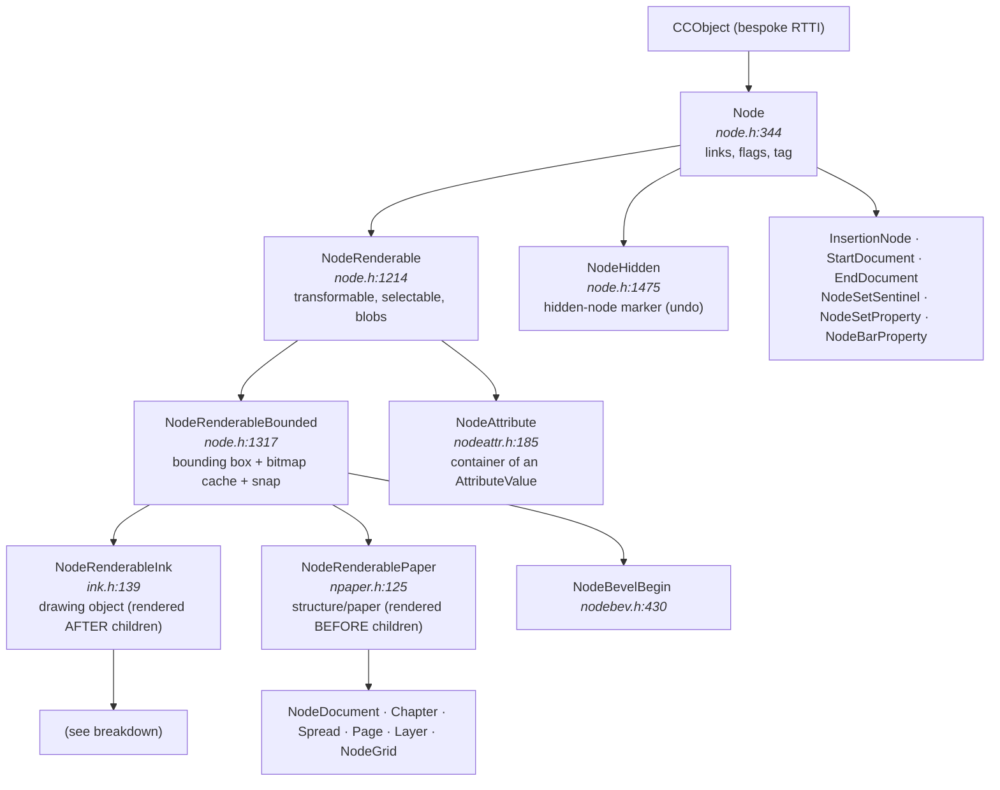
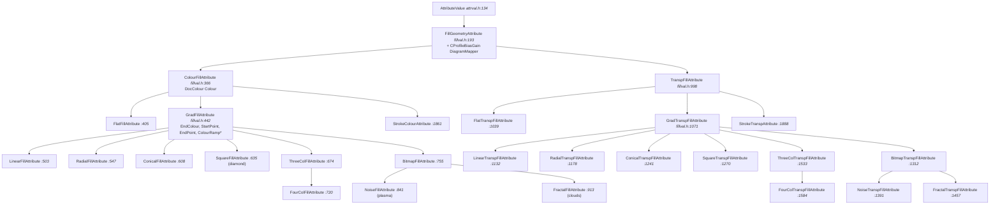
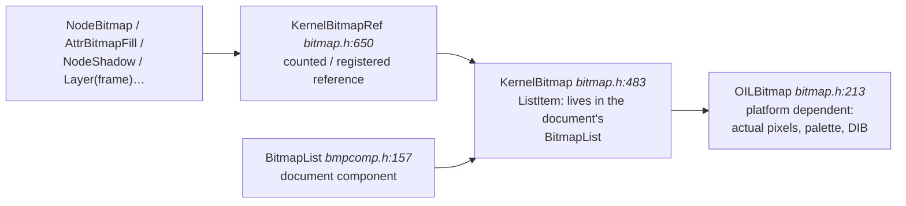

# Xara Xtreme (Xara LX) document model — analysis and proposal for a Rust reimplementation

> **Clean-room notice.** This document describes the *behaviour* and the *data
> formats* of the Xara Xtreme document model (GPL-2.0-only) for interoperability
> purposes, and proposes an original design in Rust. It does not reproduce
> source code from the original; the `file:line` references point at the
> reference tree in `xara-xtreme/` and serve only to locate the logic being
> described. Xarast is implemented from this specification, not by translating
> the original.

> **Source analysed:** `/home/user/xara-xtreme` (Xara LX / Xara Xtreme, GPLv2, Xara Group Ltd 1993‑2006).
> All `file:line` references are relative to `/home/user/xara-xtreme/Kernel/` unless stated otherwise.
> **A read-only document about the original C++.** None of the original source code has been modified.

---

## Index

1. [Kernel base concepts](#1-kernel-base-concepts)
2. [Node class hierarchy](#2-node-class-hierarchy)
3. [Structure of the document tree](#3-structure-of-the-document-tree)
4. [The attribute system](#4-the-attribute-system)
5. [Fills and transparencies](#5-fills-and-transparencies)
6. [Groups, composites and "live" objects](#6-groups-composites-and-live-objects)
7. [The text model](#7-the-text-model)
8. [Bitmaps](#8-bitmaps)
9. [Selection, operations and undo/redo](#9-selection-operations-and-undoredo)
10. [Rust design recommendation](#10-rust-design-recommendation)
11. [Appendices](#11-appendices)

---

## 1. Kernel base concepts

### 1.1 Units and primitive types

| Type | Definition | Comment |
|---|---|---|
| `MILLIPOINT` | `typedef INT32 MILLIPOINT;` — `../PreComp/camtypes.h:132` | The universal coordinate unit. 1 point = 1000 millipoints; 1 inch = 72,000 millipoints. The whole document is 32-bit integer. |
| `DocCoord` | `doccoord.h:104`, derives from `Coord` | An `(x, y)` pair in millipoints, **document coordinates**. |
| `DocRect` | `doccoord.h` | A `lo`/`hi` rectangle in millipoints; used for bounding boxes and the pasteboard. |
| `XMILLIPOINT` | `typedef XLONG XMILLIPOINT;` — `ccmaths.h:121` | A 64-bit coordinate for area/perimeter computations. |
| `FIXED16` | `fixed16.h` | 16.16 fixed point for fractal parameters (graininess, gravity, squash). |
| `TAG` | `basedoc.h` | A unique integer identifier for a node within a document (`Node::GetTag()`, `node.h:436`). Assigned by `BaseDocument::NewTag()` (`basedoc.h:109`). |

The use of 32-bit integers in millipoints (rather than floating point) is a **very** pervasive design decision: exact equality comparison of coordinates, the absence of NaN and bit-for-bit reproducibility of rendering all depend on it. In Rust it is worth preserving (an `i32` newtype) rather than migrating to `f64`.

### 1.2 Bespoke RTTI: `CCObject` and `CCRuntimeClass`

Xara does not use `dynamic_cast`. It implements its own type system (MFC style) with macros:

- `CC_DECLARE_DYNAMIC(Class)` / `CC_DECLARE_DYNCREATE(Class)` in the header.
- `CC_IMPLEMENT_DYNAMIC(Class, Base)` in the `.cpp`.
- `CC_RUNTIME_CLASS(Class)` returns a `CCRuntimeClass*` used as a **runtime type token**.
- `IS_A(p, Class)` / `p->IsKindOf(CC_RUNTIME_CLASS(Class))`.

This is essential to understanding the model: **a great deal of kernel logic dispatches on dynamic type**. For example `Node::FindFirstChild(CCRuntimeClass*)` (`node.h:576`), `AttrTypeSet` (`node.h:304`), `Node::RemoveAttrTypeFromSubtree(CCRuntimeClass*)` (`node.h:753`), `NodeRenderableInk::CanAttrBeAppliedToMe(CCRuntimeClass*)` (`ink.h:219`).

In addition, to avoid the cost of RTTI on hot paths, `Node` declares **~60 virtual fast type predicates** (`node.h:460‑520`):

`Node` declares one predicate per relevant category; all of them return false in the base
class and each subclass overrides its own. The ones that matter for tree traversal are
(`node.h:455-520`):

| Predicate | Answers | Reference |
|---|---|---|
| `IsAnObject` | is it a drawing object? | `node.h:460` |
| `IsAnAttribute` | is it an attribute node? | `node.h:455` |
| `IsPaper` | is it the paper of the spread? | `node.h:457` |
| `IsLayer` / `IsSpread` / `IsChapter` / `IsNodeDocument` | structural level of the tree | `node.h:460-520` |
| `IsNodeHidden` | is it a hidden node (an undoable deletion)? | ditto |
| `IsNodePath` | is it a path? | ditto |
| `IsCompound` / `IsController` | is it a composite? is it the controller of a composite? | ditto |
| `IsABlend` / `IsABevel` / `IsAContour` / `IsAShadow` / `IsEffect` | "live" object family | ditto |

The real list runs to some 60 predicates; the above are the ones traversal and
rendering consult on the hot path.

> **Reading for Rust:** this battery of predicates is exactly what an `enum NodeKind` + `matches!` solves for free and exhaustively. It is the clearest sign that the inheritance hierarchy was compensating for the lack of *sum types*.

### 1.3 The link structure: `Node`

`class CCAPI Node : public CCObject` — **`node.h:344`**

Instance data (`node.h:757‑784`):

Node flags (`node.h:758`), packed into 1-bit fields:

| Flag | Meaning |
|---|---|
| `Locked` | reserved; not used in this version |
| `Mangled` | used by the ArtWorks importer |
| `Marked` | used by the copying of marked objects |
| `Selected` | selected by the user |
| `Renderable` | the node is rendered |
| `SelectedChildren` | it has selected children (*select-inside*) |
| `OpPermission1`, `OpPermission2` | a pair of bits encoding an `OpPermissionState` |

Link and identity fields of `Node` itself:

| Field | Type | Meaning | Reference |
|---|---|---|---|
| `Tag` | unsigned 32-bit integer | unique identifier within the document | `node.h:773` |
| `Flags` | the flags above | node state | `node.h:774` |
| `Previous` | node pointer | previous sibling | `node.h:777` |
| `Next` | node pointer | next sibling | `node.h:778` |
| `Child` | node pointer | **first** child | `node.h:779` |
| `Parent` | node pointer | parent | `node.h:780` |
| `HiddenRefCnt` | unsigned 32-bit integer | number of `NodeHidden` nodes hiding this node | `node.h:784` |

That is: **a doubly linked sibling list + a pointer to the first child + a pointer to the parent**. There is no pointer to the last child (it is walked to: `Node::FindLastChild()`, `node.h:571`), nor a vector of children. This makes `AttachNode`/`MoveNode` O(1) and makes node identity the pointer.

Structural operations (`node.h:425‑428`):

| Method | Semantics |
|---|---|
| `AttachNode(ContextNode, Direction, ...)` | Links this node relative to another. `Direction ∈ {PREV, NEXT, FIRSTCHILD, LASTCHILD}` (`node.h:160`). |
| `MoveNode(Dest, Direction)` | Unlink + relink. |
| `CopyNode(Dest, Direction)` | Deep copy of the subtree. |
| `NodeCopy(Node**)` / `CloneNode(Node**, bool lightweight)` | Copy of the node. |
| `CascadeDelete()` | Recursively deletes the children. |
| `UnlinkNodeFromTree(BaseDocument*)` | Unlinks without deleting. |
| `InsertChainSimple(...)` | Inserts a chain of siblings by manipulating pointers only. |

Traversals (`node.h:601‑640`):

- `FindFirstDepthFirst()` / `FindNextDepthFirst(Subtree)` — post-order (children before parent): **this is the render order**.
- `FindFirstPreorder()` / `FindNextPreorder(pRoot, bSkipSubtree)` — pre-order.
- `FindNextNonHidden()` / `FindPrevNonHidden()` — skip `NodeHidden` nodes.
- `FindParentSpread()`, `FindOwnerDoc()`, `FindFirstChapter()`, `FindParent(CCRuntimeClass*)`.
- `IsUnder(pTestNode)` — checks precedence in render order.

### 1.4 Render order and the ink/paper "contract"

The central architectural distinction is:

- ***Paper* nodes** (`NodeRenderablePaper`, `npaper.h:125`) are rendered **before** their children (background).
- ***Ink* nodes** (`NodeRenderableInk`, `ink.h:139`) are rendered **after** their children (the children are its attributes, which must be active when the object is drawn).

The actual loop lives in `RenderRegion::RenderTree()`, `rndrgn.cpp:~7000‑7150`. The skeleton:

```
for each node in order:
    state := ask the node what to do with its subtree        # node.h:390 (virtual)
    if state == ROOTANDCHILDREN and the node has children:
        save the attribute context                           # rndrgn.cpp:7076  (descending)
        descend to the first child and repeat
    if state ∈ {ROOTONLY, ROOTANDCHILDREN, RUNTO}:
        render the node                                      # draws, or pushes an attribute
    tell the node its subtree has finished
    on returning to the parent:
        render the parent                                    # the composite's ink is drawn HERE
        restore the attribute context                        # rndrgn.cpp:7130  (ascending)
```

`SubtreeRenderState` (`node.h:203`):

| Value | Meaning |
|---|---|
| `SUBTREE_NORENDER` | Skip the node and its subtree (invisible layer, locked layer during hit-testing…). |
| `SUBTREE_ROOTONLY` | Render only the node (the `NodeAttribute` case, `nodeattr.cpp:477`). |
| `SUBTREE_ROOTANDCHILDREN` | Descend. |
| `SUBTREE_JUMPTO` | Jump to another node (caches, effects). |
| `SUBTREE_RUNTO` | Advance without drawing but **keeping the attribute stack** correct. |

> **Key semantic consequence (§4):** `SaveContext()`/`RestoreContext()` are emitted **on entering and leaving a child list**. Therefore the scope of an attribute node is *the sibling list it lives in, from its position to the end of that list, including the subtrees of those siblings and the parent node*.

---

## 2. Node class hierarchy

### 2.1 General diagram



### 2.2 Breakdown of `NodeRenderableInk`

```mermaid
graph TD
    NRI["NodeRenderableInk<br/><i>ink.h:139</i>"]

    NRI --> NP["NodePath <i>nodepath.h:128</i>"]
    NRI --> NSS["NodeSimpleShape <i>nodeshap.h:129</i>"]
    NRI --> NRS["NodeRegularShape <i>nodershp.h:145</i>"]
    NRI --> NC["NodeCompound <i>nodecomp.h:165</i>"]
    NRI --> NGL["NodeGuideline <i>guides.h:130</i>"]
    NRI --> NBL["NodeBlender <i>nodebldr.h:360</i>"]
    NRI --> NCT["NodeContour <i>nodecntr.h:121</i>"]
    NRI --> NSH["NodeShadow <i>nodeshad.h:138</i>"]
    NRI --> NBV["NodeBevel <i>nodebev.h:132</i>"]
    NRI --> NCV["NodeClipView <i>nodeclip.h:123</i>"]
    NRI --> NMB["NodeMouldBitmap <i>ndmldink.h:124</i>"]
    NRI --> NBM["NodeBrushMaker <i>ndbrshmk.h:154</i>"]
    NRI --> BTC["BaseTextClass <i>nodetxts.h:125</i>"]

    NP --> NBP["NodeBlendPath <i>ndbldpth.h:119</i>"]
    NP --> NMP["NodeMouldPath <i>ndmldpth.h:117</i>"]
    NBP --> NBrP["NodeBrushPath <i>ndbrshpt.h:121</i>"]

    NSS --> NRect["NodeRect <i>noderect.h:122</i>"]
    NSS --> NElip["NodeEllipse <i>nodeelip.h:120</i>"]
    NRect --> NBmp["NodeBitmap <i>nodebmp.h:124</i>"]
    NBmp --> NABmp["NodeAnimatingBitmap <i>nodeabmp.h:111</i>"]
    NBmp --> NCBmp["NodeCacheBitmap <i>ndcchbmp.h:111</i>"]

    NC --> NG["NodeGroup <i>group.h:122</i>"]
    NC --> NE["NodeEffect <i>nodepostpro.h:130</i>"]
    NG --> NBlend["NodeBlend <i>nodeblnd.h:129</i>"]
    NG --> NMould["NodeMould <i>nodemold.h:161</i>"]
    NG --> NMoulder["NodeMoulder <i>nodemldr.h:134</i>"]
    NG --> NMG["NodeMouldGroup <i>ndmldgrp.h:147</i>"]
    NG --> NBrush["NodeBrush <i>nodebrsh.h:121</i>"]
    NG --> NCC["NodeContourController <i>ncntrcnt.h:153</i>"]
    NG --> NBC["NodeBevelController <i>nbevcont.h:125</i>"]
    NG --> NCVC["NodeClipViewController <i>ndclpcnt.h:146</i>"]
    NE --> NSC["NodeShadowController <i>nodecont.h:215</i>"]
    NE --> NBE["NodeBitmapEffect <i>nodeliveeffect.h:163</i>"]
    NBE --> NLE["NodeLiveEffect <i>nodeliveeffect.h:293</i>"]
    NBE --> NLckE["NodeLockedEffect <i>nodeliveeffect.h:376</i>"]
    NLE --> NFE["NodeFeatherEffect <i>nodeliveeffect.h:463</i>"]

    BTC --> TS["TextStory <i>nodetxts.h:260</i>"]
    BTC --> TL["TextLine <i>nodetxtl.h:287</i>"]
    BTC --> VTN["VisibleTextNode <i>nodetext.h:126</i>"]
    VTN --> ATC["AbstractTextChar <i>nodetext.h:214</i>"]
    VTN --> Caret["CaretNode <i>nodetext.h:423</i>"]
    ATC --> TChar["TextChar <i>nodetext.h:289</i>"]
    ATC --> Kern["KernCode <i>nodetext.h:349</i>"]
    ATC --> HTab["HorizontalTab <i>nodetext.h:387</i>"]
    ATC --> EOL["EOLNode <i>nodetext.h:474</i>"]
```



### 2.3 Complete catalogue of node types

#### 2.3.1 Infrastructure (derive directly from `Node`, not renderable)

| Class | File:line | What it is |
|---|---|---|
| `Node` | `node.h:344` | Abstract node: tree links, flags, tag, operation permissions. |
| `NodeHidden` | `node.h:1475` | **Logical-deletion marker.** In Xara nodes are almost never destroyed: they are replaced by a `NodeHidden` that keeps a pointer to the hidden node (`HiddenNd`). `ShowNode()` reverts it. It is the substrate of undo. |
| `InsertionNode` | `insertnd.h:123` | Marks the insertion position for new objects; it lives as the last child of the active layer of the selected spread (`document.cpp:449`). |
| `StartDocument` | `dumbnode.h:122` | Sentinel at the start of the tree. |
| `EndDocument` | `dumbnode.h:162` | Sentinel at the end of the tree. |
| `NodeSetSentinel` | `ngsentry.h:273` | A dummy node carrying **one instance of every object name** (`TemplateAttribute`) present in the document, so that the Name Gallery can list names even when no object uses them. |
| `NodeSetProperty` | `ngsentry.h:125` | Child of `NodeSetSentinel`: per-set property records. |
| `NodeBarProperty` | `ngsentry.h:192` | Ditto, bar properties (web navigation). |

#### 2.3.2 "Paper" nodes (document structure)

| Class | File:line | What it is |
|---|---|---|
| `NodeRenderablePaper` | `npaper.h:125` | Base: adds `DocRect PasteboardRect` (`npaper.h:157`) and is rendered **before** its children. |
| `NodeDocument` | `nodedoc.h:123` | Root of the document tree. Holds `LowExtent`/`HighExtent` (total extent) and `pParentDoc` (`BaseDocument*`). |
| `Chapter` | `chapter.h:127` | Groups spreads. In practice, Xara LX creates exactly **one** chapter (`document.cpp:424`). |
| `Spread` | `spread.h:138` | The "spread": the working coordinate space; contains pages, grids and layers. |
| `Page` | `page.h:125` | A page rectangle (`DocRect PageRect`, `page.h:179`) inside the spread. |
| `Layer` | `layer.h:158` | Layer. Contains the ink objects. |
| `NodeGrid` | `grid.h:164` | Reference grid (non-printable). |
| `NodeGridRect` | `grid.h:306` | Rectangular grid. |
| `NodeGridIso` | `grid.h:379` | Isometric grid. |

#### 2.3.3 Primitive geometry

| Class | File:line | What it is |
|---|---|---|
| `NodePath` | `nodepath.h:128` | **The fundamental drawing object.** Holds a public `Path InkPath` (`nodepath.h:134`). |
| `NodeSimpleShape` | `nodeshap.h:129` | Abstract: a shape bounded by a parallelogram. Data: `Path InkPath` + `DocCoord Parallel[4]` (`nodeshap.h:212‑214`). |
| `NodeRect` | `noderect.h:122` | Rectangle (parallelogram). |
| `NodeEllipse` | `nodeelip.h:120` | Ellipse. |
| `NodeRegularShape` | `nodershp.h:145` | **QuickShape**: parametric polygon/star/ellipse. It does not derive from `NodeSimpleShape` but directly from `NodeRenderableInk`. |
| `NodeGuideline` | `guides.h:130` | Guideline (lives in the guides layer). |
| `NodeBrushMaker` | `ndbrshmk.h:154` | A node defining a brush out of objects. |

`NodeRegularShape` (`nodershp.h:299‑322`) is interesting for its parametric nature:

| Field | Type | Meaning |
|---|---|---|
| `EdgePath1` | path | primary edge → stellation point |
| `EdgePath2` | path | stellation point → primary point |
| `NumSides` | unsigned integer | number of sides (primary angle) |
| `Circular` | bit | the shape is based on a circle |
| `Stellated` | bit | it is stellated |
| `PrimaryCurvature`, `StellationCurvature` | bits | there is curvature on the primary / stellation edge |
| `StellRadiusToPrimary` | `double` | ratio of stellation radius to primary radius |
| `PrimaryCurveToPrimary`, `StellCurveToStell` | `double` | relative curvature control |
| `StellOffsetRatio` | `double` | angular offset; ±0.5 is equivalent to 360/`NumSides` |
| `UTCentrePoint`, `UTMajorAxes`, `UTMinorAxes` | document coordinates | **untransformed** cache ("UT" = *untransformed*) |
| `CachedRenderPath` | pointer to a path | cache of the generated path |
| `PathCacheInvalid` | bit | the cache above needs regenerating |
| `TransformMatrix` | matrix | transformation applied to the shape |

The last three groups are pure cache: they could be recomputed on the fly.

Note the pattern **parameters + matrix + cached path with an invalidation bit** (`InvalidateCache()`, `nodershp.h:296`). It is a model that translates almost literally into Rust.

`PathShape` (`pathshap.h:118‑133`) classifies the resulting path: `PATHSHAPE_PATH`, `_CIRCLE`, `_ELLIPSE`, `_SQUARE`, `_RECTANGLE`, `_ELLIPSE_ROTATED`, `_SQUARE_ROTATED`, `_RECTANGLE_ROTATED`.

#### 2.3.4 Composites and live objects (see §6)

| Class | File:line | What it is |
|---|---|---|
| `NodeCompound` | `nodecomp.h:165` | Base of every composite/controller object. Regeneration, render DPI, name, "blend created by". |
| `NodeGroup` | `group.h:122` | Group. Supports *tight groups* (a bitmap cache of the group). |
| `NodeBlend` | `nodeblnd.h:129` | Blend controller. |
| `NodeBlender` | `nodebldr.h:360` | A "pair" of the blend: generates the intermediate steps between two objects. |
| `NodeBlendPath` | `ndbldpth.h:119` | The path along which the blend is made (blend on a curve). |
| `NodeBrush` | `nodebrsh.h:121` | Brush stroke (a generated group). |
| `NodeBrushPath` | `ndbrshpt.h:121` | The brush path. |
| `NodeMould` | `nodemold.h:161` | Mould controller (envelope / perspective). |
| `NodeMoulder` | `nodemldr.h:134` | Child of the mould that does the deformation work. |
| `NodeMouldGroup` | `ndmldgrp.h:147` | Group holding the originals inside the mould. |
| `NodeMouldPath` | `ndmldpth.h:117` | Path defining the shape of the mould. |
| `NodeMouldBitmap` | `ndmldink.h:124` | Moulded bitmap. |
| `NodeContour` | `nodecntr.h:121` | A generated contour step. |
| `NodeContourController` | `ncntrcnt.h:153` | Contour controller. |
| `NodeShadow` | `nodeshad.h:138` | Generated shadow (bitmap + transparency). |
| `NodeShadowController` | `nodecont.h:215` | Shadow controller (derives from `NodeEffect`). |
| `NodeBevel` | `nodebev.h:132` | Generated bevel. |
| `NodeBevelController` | `nbevcont.h:125` | Bevel controller. |
| `NodeBevelBegin` | `nodebev.h:430` | Bevel start marker (derives from `NodeRenderableBounded`, not from Ink). |
| `NodeClipView` | `nodeclip.h:123` | The node that applies the clip. |
| `NodeClipViewController` | `ndclpcnt.h:146` | Controller of "ClipView" (clipping by the topmost shape). |
| `NodeEffect` | `nodepostpro.h:130` | Base of post-processing effects (XPE). |
| `NodeBitmapEffect` | `nodeliveeffect.h:163` | An effect that renders to a bitmap and post-processes it. |
| `NodeLiveEffect` | `nodeliveeffect.h:293` | A "live" effect (recomputable, holds `IXMLDOMDocumentPtr m_pEditsDoc`). |
| `NodeLockedEffect` | `nodeliveeffect.h:376` | An effect "frozen" to a bitmap. |
| `NodeFeatherEffect` | `nodeliveeffect.h:463` | Edge feathering. |

#### 2.3.5 Bitmaps

| Class | File:line | What it is |
|---|---|---|
| `NodeBitmap` | `nodebmp.h:124` | A placed image. Derives from `NodeRect`: it is a rectangle with a `KernelBitmapRef BitmapRef` (`nodebmp.h:180`). |
| `NodeAnimatingBitmap` | `nodeabmp.h:111` | A collection of bitmaps (animation). |
| `NodeCacheBitmap` | `ndcchbmp.h:111` | Cache bitmap; not serialised. |

#### 2.3.6 Text (see §7)

| Class | File:line | What it is |
|---|---|---|
| `BaseTextClass` | `nodetxts.h:125` | Common base of all text nodes. |
| `TextStory` | `nodetxts.h:260` | **Text story**: the complete text object. A composite. |
| `TextLine` | `nodetxtl.h:287` | A formatted line. A composite. |
| `VisibleTextNode` | `nodetext.h:126` | Base of everything that takes up space in a line. Carries a `Matrix CharMatrix` and a `MILLIPOINT PosInLine`. |
| `AbstractTextChar` | `nodetext.h:214` | Base of characters: cached metrics. |
| `TextChar` | `nodetext.h:289` | An actual Unicode character. |
| `KernCode` | `nodetext.h:349` | Manual kerning inserted between characters. |
| `HorizontalTab` | `nodetext.h:387` | Tab. |
| `EOLNode` | `nodetext.h:474` | End of paragraph/line. |
| `CaretNode` | `nodetext.h:423` | The editing caret (lives in the tree). |

#### 2.3.7 Attributes

`NodeAttribute` (`nodeattr.h:185`) and its ~90 subclasses: see the complete catalogue in **§4.6**.

---

## 3. Structure of the document tree

### 3.1 Canonical shape

`Document::InitTree()` (`document.cpp:415‑455`) builds exactly this:

```
BaseDocument (not a Node; it is the owner: basedoc.h:51)
│  TreeStart ──► StartDocument                       (dumbnode.h:122)
│
└──► NodeDocument                                     (nodedoc.h:123)  ROOT OF THE TREE
      ├── [block of DEFAULT ATTRIBUTES]               (document.cpp:485‑520)
      │     AttrFlatColourFill, AttrStrokeColour, AttrLineWidth,
      │     AttrWindingRule, AttrJoinType, AttrQuality, AttrStartCap,
      │     AttrStartArrow, AttrEndArrow, AttrMitreLimit, AttrDashPattern,
      │     AttrTxtFontTypeface, AttrTxtFontSize, ... (one per registered attribute)
      │
      └── Chapter                                     (chapter.h:127)
            ├── NodeSetSentinel                       (ngsentry.h:273)
            │     └── NodeBarProperty                 (ngsentry.h:192)
            │
            └── Spread                                (spread.h:138)
                  ├── Page                            (page.h:125)
                  ├── NodeGrid (NodeGridRect)         (grid.h:306)
                  ├── Layer  "guide layer"  (Guide=TRUE)             (layer.h:158)
                  │     └── NodeGuideline*            (guides.h:130)
                  ├── Layer  "page background" (m_PageBackground=TRUE)
                  │     └── NodeRect covering the page(s)
                  ├── Layer  ... ordinary layers ...
                  │     ├── [layer-local attributes]
                  │     ├── NodeGroup / NodePath / TextStory / NodeBitmap / ...
                  │     └── ...
                  └── InsertionNode                   (insertnd.h:123)
│
└──► EndDocument                                      (dumbnode.h:162)
```

The initialisation procedure (`document.cpp:415`, `Document::InitTree`) builds the
minimal skeleton in this order:

1. Create a `Chapter` as the last child of the `NodeDocument` it is given (`:424`).
2. Create the `NodeSetSentinel` as the first child of the chapter (`:429`) and hang a
   `NodeBarProperty` off it (`:431`).
3. Compute the pasteboard rectangle (`:435`) and use it to create a `Spread` as the first
   child of the chapter (`:441`).
4. Ask the spread to generate its default page and grid (`:445`).
5. Create the document's `InsertionNode` (`:452`) and attach it as the last child of the
   spread (`:454`), which thereby becomes the current insertion position.

### 3.2 The role of each level

#### `BaseDocument` / `Document`

- `BaseDocument` (`basedoc.h:51`) **is not a node**: it is the owner. It holds:
  - `Node* TreeStart` (`basedoc.h:101`), `INT32 NodesInTree` (`basedoc.h:102`).
  - `TAG TagCounter` (`basedoc.h:148`) → `NewTag()` assigns unique IDs.
  - `List* DocComponents` (`basedoc.h:145`) — **document components**: side lists that are not part of the tree but are serialised with it (the colour list `ColourListComponent`, the bitmap list `BitmapListComponent` (`bmpcomp.h:221`), the document info `DocInfoComponent`, the brush list, the fractal list…).
  - `ColourContextArray DefaultColourContexts` (`basedoc.h:134`).
- `Document` (`document.h:121`) adds: `OperationHistory` (undo/redo), `AttributeManager* AttributeMgr`, `InsertionNode* InsertPos`, `NodeSetSentinel* m_pSetSentinel`, metadata (title, comment, timestamps), flags (`SaveWithUndo`, `LayerMultilayer`, `LayerAllVisible`).

> **Design lesson:** a Xara "document" is **three things**: the node tree, a bag of side components indexed by type, and the operation history.

#### `NodeDocument` (`nodedoc.h:123`)

The root of the tree. Its data:

| Field | Type | Meaning | Reference |
|---|---|---|---|
| `LowExtent` | document coordinate | lower corner of the extent | `nodedoc.h:164` |
| `HighExtent` | document coordinate | upper corner of the extent | `nodedoc.h:166` |
| `pParentDoc` | pointer to `BaseDocument` | the document owning the tree | `nodedoc.h:168` |

Its block of **first children** contains the document's default attributes (§4.4). This is deliberate: being ancestors of everything, the ordinary attribute-inheritance mechanism delivers the default values with no special-case code.

#### `Chapter` (`chapter.h:127`)

A grouping of spreads. Almost vestigial in Xara LX (always exactly one). It inherits the pasteboard from `NodeRenderablePaper`.

#### `Spread` (`spread.h:138`)

This is the richest level. It defines a **coordinate space of its own**:

| Field | Type | Meaning | Reference |
|---|---|---|---|
| `BleedOffset` | millipoints | bleed around the page | `spread.h:329` |
| `ShowDropShadow` | boolean | draw the paper's shadow | `spread.h:330` |
| `RalphDontShowPaper` | boolean | hide the paper (viewer mode) | `spread.h:331` |
| `SpreadOrigin` | document coordinate | origin of the spread space | `spread.h:332` |
| `UserOrigin` | document coordinate | origin of the rulers (user coordinates) | `spread.h:333` |
| `m_AnimPropertiesParam` | parameter structure | GIF animation properties | `spread.h:334` |
| `SpreadDimScale` | dimension scale | drawing scale (e.g. 1:50) | `spread.h:383` |

Conversions (`spread.h:221‑232`): `SpreadCoordToDocCoord`, `DocCoordToSpreadCoord`, `SpreadCoordToPagesCoord`, `PagesCoordToSpreadCoord`, `TextToSpreadCoord`. And navigation: `FindFirstPageInSpread`, `FindActiveLayer`, `FindFirstGuideLayer` (`spread.cpp:1214`), `FindFirstPageBackgroundLayer` (`spread.cpp:1243`), `FindFirstFrameLayer`, `FindFirstDefaultGridInSpread`.

The **pasteboard** (the grey area around the pages) is managed here: `GetWidePasteboard`, `ExpandPasteboardToInclude`, `AdjustPasteboards`, `GetMaxPasteboardSize`.

#### `Page` (`page.h:125`)

Only `DocRect PageRect` (`page.h:179`) + `static DocColour PageColour`. Multiple pages per spread (`FindRightPage`, `FindBottomPage`) allow double pages and contiguous sheets. It implements `Snap()` to the page edges.

#### `Layer` (`layer.h:158`)

The layer is where things happen. State (`layer.h:341‑380`):

| Field | Type | Meaning |
|---|---|---|
| `LayerSt` | state structure | holds the layer's identifying string, unique within the spread |
| `Active` | boolean | active layer: the destination of new objects. Exactly one per spread |
| `Visible` | boolean | whether it is rendered |
| `Locked` | boolean | not modifiable; *hit-testing* ignores it |
| `Printable` | boolean | sent to the printer |
| `Background` | boolean | background layer (non-printable) |
| `Outline` | boolean | renders everything in outline mode (minimum quality) |
| `Guide` | boolean | **guide layer**: contains `NodeGuideline` nodes |
| `m_PageBackground` | boolean | **page-background layer**: a rectangle covering the page with a colour or bitmap |

Fields specific to GIF animation ("frames"):

| Field | Type | Meaning |
|---|---|---|
| `m_Overlay` | boolean | the frame is overlaid on the previous one instead of covering it |
| `m_Solid` | boolean | solid frame: acts as a background for those above |
| `m_Edited` | boolean | the frame's bitmap needs regenerating |
| `m_Frame` | boolean | the layer is an animation frame |
| `m_HiddenFrame` | boolean | hidden frame: not saved but taking part in rendering |
| `m_FrameDelay` | 32-bit integer | frame delay |
| `m_CaptureQuality` | quality | the quality at which the frame is captured |
| `m_GeneratedBitmap` | bitmap reference | the bitmap generated for the frame |
| `m_pReferencedBitmap` | pointer to a bitmap | referenced bitmap |
| `pGuideColour`, `pIndexedGuideColour` | colour / indexed colour | colour of this layer's guides |

**Special layers identified:**

| Type | Predicate | Creation | Contents |
|---|---|---|---|
| Ordinary layer | — | UI | ink objects |
| Active layer | `IsActive()` | exactly one per spread | insertion destination (`InsertionNode`) |
| **Guide layer** | `IsGuide()` | `Layer::CreateGuideLayer()` (`layer.cpp:3294`) | horizontal/vertical `NodeGuideline`s |
| **Page-background layer** | `IsPageBackground()` | `spread.cpp:589` | a `NodeRect` covering the pages, with a colour or bitmap fill |
| Background layer | `IsBackground()` | UI | non-printable |
| Outline layer | `IsOutline()` | UI | rendering forced to wireframe |
| **Animation frame** | `IsFrame()` / `IsHiddenFrame()` | GIF UI | one frame of the animated GIF |

`Layer::RenderSubtree()` (`layer.cpp:426‑500`) decides visibility and additionally **enables caching of the layer into a bitmap**:

The behaviour (`layer.cpp:481`, `Layer::EnableLayerCacheing`) is a three-level scale
adjustable by the user:

| Level | Condition for caching the whole layer into a bitmap |
|---|---|
| 0 | never |
| 1 | the layer is visible, is not a guide layer, and the cache capture succeeds |
| 2 | in addition to the above, the layer is **not** the active one |

When the cache is used, the subtree traversal is cut short: the layer is painted from the
bitmap and its children are not visited.

### 3.3 Tree invariants

1. The first block of children of any ink/composite node is its **attribute block**; the attribute walk stops if it meets a `NodeRenderableInk` (`ndoptmz.cpp:~330`).
2. Every spread has **exactly one** active layer.
3. The `InsertionNode` is the last child of the active layer (or of the spread when there is no layer).
4. `NodeHidden` nodes may appear in any position: they represent undoably deleted nodes.
5. `HiddenRefCnt` on a node counts how many `NodeHidden` nodes hide it (it can be > 1 in nested operations).
6. `Tag`s are unique per document and stable for as long as the node exists.

---

## 4. The attribute system

### 4.1 The central idea: attributes **are tree nodes**

In Xara there is no "style dictionary" hanging off each object. An attribute is a **child node**:

```
Layer
 ├── AttrFlatColourFill  (red)         ← applies to EVERYTHING that follows in this list
 ├── NodeGroup
 │     ├── AttrLineWidth (500)         ← applies inside the group
 │     ├── NodePath  A                 ← red, width 500
 │     │     └── AttrStrokeColour(blue) ← ONLY for A (it is its child)
 │     └── NodePath  B                 ← red, width 500, default stroke
 └── NodePath  C                       ← red, default width
```

The exact semantics are fixed by `RenderRegion::RenderTree()` (`rndrgn.cpp:7076` and `:7130`):

- **On descending** into a child list → `SaveContext()`.
- **On ascending** out of that list → `RestoreContext()`.
- A `NodeAttribute` returns `SUBTREE_ROOTONLY` (`nodeattr.cpp:477`) and, when rendered, **pushes its value** onto the attribute stack.

> **The scope of an attribute = from its position to the end of the sibling list it lives in, covering the subtrees of those siblings and the parent node as well** (because *ink* nodes are drawn on the way up, after their children).

That is why attributes "applied to an object" are stored as the **first children of that object**: since the object is an ink node drawn last, its child attributes are already active.

### 4.2 `NodeAttribute` and `AttributeValue`: node vs. value

There is a deliberate separation into two layers:

| Layer | Base class | File | Role |
|---|---|---|---|
| Tree node | `NodeAttribute : NodeRenderable` | `nodeattr.h:185` | Identity, position, undo, serialisation, UI (fill blobs), comparison. |
| Renderable value | `AttributeValue : CCObject` | `attrval.h:134` | The pure datum + how it is applied to a `RenderRegion`. |

Each concrete `NodeAttribute` contains **by value** (not by pointer) an instance of its `AttributeValue`, always named `Value`, and exposes it through a virtual accessor `GetAttributeValue()` returning its address. The pattern recurs throughout the kernel (for example, `fillattr2.h:132-138`).

The `AttributeValue` interface (`attrval.h:134‑173`):

| Virtual method | Role |
|---|---|
| `Render(RenderRegion*, bool temporal)` | *(pure)* the value becomes the current one for the first time |
| `Restore(RenderRegion*, bool temporal)` | *(pure)* the value becomes current again after a *pop* |
| `GoingOutOfScope(RenderRegion*)` | cleanup on leaving scope (e.g. `PathProcessor`s) |
| `SimpleCopy(AttributeValue*)` | *(pure)* flat copy of the value |
| `MakeNode()` | builds the attribute node equivalent to the value |
| `IsDifferent(AttributeValue*)` | value comparison (the basis of normalisation) |
| `Blend(BlendAttrParam*)` | interpolation of the value for blends |
| `MouldIntoStroke(PathStrokerVector*, double)` | deforms the value with a mould |
| `CanBeRenderedDirectly()` | can the engine paint it without a prior conversion? |

Defined in `attrval.h:134-173`.

`Render` vs `Restore` distinguishes "the first time this value comes into force" from "reactivation after popping another". It lets attributes with external state (e.g. `ClipRegionAttribute`, which installs a `PathProcessor` in the render region) do work only the first time.

The `NodeAttribute` interface (`nodeattr.h:198‑331`), the relevant parts:

| Method | File:line | What for |
|---|---|---|
| `GetAttributeType()` | `nodeattr.h:208` | Returns the `CCRuntimeClass*` identifying **the slot** it occupies (two attributes of the same type replace one another). |
| `GetAttributeIndex()` | `nodeattr.h:211` | Returns the `AttrIndex` (the index in the flat table of current attributes). |
| `GetAttributeClassID()` | `nodeattr.h:210` | Textual identifier (for user attributes / names). |
| `operator==` / `IsDifferent` | `nodeattr.h:203‑204` | Value comparison: the basis of all the optimisation. |
| `HasEquivalentDefaultValue(bAppearance)` | `nodeattr.h:215` | Is it equal to the default value? → it can be deleted. |
| `ShouldBeOptimized()` | `nodeattr.h:261` | Defaults to `!IsEffectAttribute()`. |
| `CanBeMultiplyApplied()` | `nodeattr.h:258` | User/name attributes can be applied several times to the same node. |
| `CanBeAppliedToObject()` | `nodeattr.h:253` | `AttrQuality`, for instance, is not applied to objects. |
| `GetOtherAttrToApply(BOOL* IsMutate)` | `nodeattr.h:219` | **Mutation**: applying one attribute may require applying another (e.g. setting a gradient fill forces the creation of the `AttrFillMapping`). |
| `OnMakeCurrent()` | `nodeattr.h:226` | Hook fired on becoming the "current attribute". |
| `ShouldBecomeCurrent()` | `nodeattr.h:277` | Should it become the current attribute when applied? |
| `Blend(BlendAttrParam*)` | `nodeattr.h:214` | Interpolation in blends. |
| `IsEffectAttribute()` | `nodeattr.h:265` | "Effect" attributes (feather, clipview) that divert rendering off-screen. |
| `EffectsParentBounds()` / `GetAttrBoundingRect()` | `nodeattr.h:271‑272` | Attributes that **enlarge** the object's box (line width, arrowheads, shadow, feather). |
| `IsLinkedToNodeGeometry()` | `nodeattr.h:297` | **Attributes linked to the geometry**: their coordinates live in the object's space (gradient fills, bevels). If the node changes they must be told: `LinkedNodeGeometryHasChanged()` (`nodeattr.h:307`). |
| `TransformToNewBounds(DocRect&)` | `nodeattr.h:275` | Readjust the attribute when the bounds change. |
| `IsSeeThrough(bool)` | `nodeattr.h:331` | Does it let the background show through? (to decide whether an alpha channel is needed). |

### 4.3 The "current attribute state" during rendering

`RenderRegion` (`rndrgn.h:345`) maintains:

| Field | Type | Meaning | Reference |
|---|---|---|---|
| `CurrentAttrs` | flat array of `AttributeEntry`, indexed by `AttrIndex` | the graphics state in force | `rndrgn.h:904` |
| `NumCurrentAttrs` | 32-bit integer | size of the array | `rndrgn.h:905` |
| `TheStack` | `RenderStack` | the *save/restore* stack | `rndrgn.h:935` |

`AttributeEntry` (`attrmgr.h:127`):

| Field | Type | Meaning |
|---|---|---|
| `pAttr` | pointer to `AttributeValue` | the value in force for that slot |
| `Temp` | bitfield | the value is temporary: it is discarded on completion |
| `Ignore` | bitfield | do not add to a path (used by defaults-based application) |

Access through macros (`rndrgn.h:971‑1008`) — this is literally **the current graphics state table**:

Access to the state in force is done with one macro per `AttrIndex`
(`rndrgn.h:971-1008`): each macro indexes the `CurrentAttrs` array with its `ATTR_*`
constant, casts the pointer to the concrete attribute type and returns the field of
interest. For example, the stroke colour is obtained from the `ATTR_STROKECOLOUR` slot as
the colour field of a `StrokeColourAttribute`, and the line width from the
`ATTR_LINEWIDTH` slot as the width field of a `LineWidthAttribute`.

| Macro | Slot consulted | Value returned |
|---|---|---|
| `RR_STROKECOLOUR()` | `ATTR_STROKECOLOUR` | stroke colour |
| `RR_FILLCOLOUR()` | `ATTR_FILLGEOMETRY` | fill colour |
| `RR_LINEWIDTH()` | `ATTR_LINEWIDTH` | line width |
| `RR_WINDINGRULE()` | `ATTR_WINDINGRULE` | fill rule |
| `RR_TXTFONTSIZE()` | `ATTR_TXTFONTSIZE` | font size |

There is an equivalent macro for every `AttrIndex`. Taken together, **this array is
literally the current graphics state table**.

`RenderStack` (`rndstack.h:121`):

| Operation | Effect | Reference |
|---|---|---|
| `Push(value, temporal)` | installs a value in its slot and records the previous one on the stack | `rndstack.h:128` |
| `SaveContext()` | increments the context level (a mark) | `rndstack.h:131` |
| `RestoreContext(RenderRegion*)` | undoes every entry back to the previous mark | `rndstack.h:132` |

The algorithm is an **undo log with level marks**: pushing an attribute saves the previous value of that slot; `RestoreContext` undoes everything back to the mark. It is exactly the pattern worth replicating in Rust.

### 4.4 Default attributes

A global, static, per-type registry (`attrmgr.h:251‑276`):

| Static operation | Role |
|---|---|
| `RegisterDefaultAttribute(node type, value)` | registers the default and returns the assigned `AttrIndex` |
| `GetDefaultAttributes()` | array of entries indexed by `AttrIndex` |
| `GetDefaultAttribute(AttrIndex)` | the default attribute node for that slot |
| `GetDefaultAttributeVal(AttrIndex)` | the default value for that slot |
| `GetNumAttributes()` | number of registered slots |
| `ApplyBasedOnDefaults(target node, entries)` | applies to the node only what differs from the defaults |

Declared in `attrmgr.h:251-276`.

Each attribute class registers itself in its `static BOOL Init()` (called at start-up). The `AttrIndex` returned is the index into the flat array.

Afterwards, `Document::InitDefaultAttributeNodes()` (`document.cpp:488‑535`) **materialises** one attribute node per default and hangs it as the first child of the `NodeDocument`:

The materialisation step walks the array of registered defaults and, for each one,
builds the equivalent attribute node (`MakeNode()`) and attaches it as the **first child**
of the document's root node (`document.cpp:520`). When it finishes, the tree has one
attribute node per registered slot, all of them ahead of the content.

A comment in the code itself (`document.cpp:481`): *"The Attribute optimisation routines will not work if the document does not contain the default attributes."* The defaults are the **base case** of the inheritance algorithm.

### 4.5 Current attributes, groups and application

#### Groups of current attributes

`AttributeManager` (`attrmgr.h:215`) maintains, **per document**, grouped lists of "current attributes":

`AttributeGroup` (`attrmgr.h:161`) groups the current attributes by family:

| Field | Type | Meaning |
|---|---|---|
| `AttrGroup` | runtime type token | identifier of the group |
| `BaseGroup` | type token or null | base group (inheritance between groups) |
| `AttrListHd` | list of attribute nodes | the group's current attributes |
| `GroupName` | string | human-readable name of the group |

The number of groups is fixed at **2** (`attrmgr.h:122`): graphics and text.

Every ink object declares which group it belongs to: `NodeRenderableInk::GetCurrentAttribGroup()` (`ink.h:225`); `BaseTextClass` overrides it to return the text group (`nodetxts.h:143`). Thus changing the font size with text selected does not disturb the "current fill" of the graphics group.

#### Application flow

```
UI (tool / gallery)
   │
   ├─► AttributeManager::AttributeSelected(pAttr)        attrmgr.h:246
   │       (apply to the selection)
   ├─► AttributeManager::AttributesSelected(List&, OpName) attrmgr.h:249
   │       (several at once: Paste Attributes)
   └─► AttributeManager::ApplyAttribToNode(pInk, pAttr)  attrmgr.h:252
           (drag & drop onto a specific object)
                │
                ▼
   NodeRenderableInk::GetObjectToApplyTo(AttrType)       ink.h:222
        (a controller may redirect the application to itself:
         NodeCompound::PromoteAttributeApplicationToMe, nodecomp.h:237)
                │
                ▼
   NodeRenderableInk::CanAttrBeAppliedToMe(AttrType)     ink.h:219
   NodeRenderableBounded::CanTakeAttributeType(...)      node.h:1343
                │
                ▼
   UndoableOperation::DoLocaliseForAttrChange(...)       undoop.h:385
        (localise common attributes before touching anything)
                │
                ▼
   NodeRenderableInk::ApplyAttributeToObject(pAttr, Redraw)  ink.h:209
        - attaches the attribute node as a child
        - replaces any attribute with the same GetAttributeType()
                │
                ▼
   NodeRenderableInk::NormaliseAttributes()              ink.h:378
        (deletes those already inherited with the same value)
                │
                ▼
   UndoableOperation::DoFactorOutAfterAttrChange(...)
        (factor back out upwards whatever is common)
                │
                ▼
   AttributeManager::UpdateCurrentAttr / UpdateCurrentAppliedAttr  attrmgr.h:282-286
        (does this attribute become the "current" one?  -> WeShouldMakeAttrCurrent, attrmgr.h:276)
```

**Mutation** (`attrmgr.h:284`, `nodeattr.h:219`): `GetOtherAttrToApply(BOOL* IsMutate)` lets applying one attribute drag another along. If `IsMutate` is true, the second *replaces* the first rather than accompanying it. It is used, for example, to turn a flat fill into a gradient while preserving the colour, or to make dropping a colour onto a gradient's blob (`AttrColourDrop`, `fillattr2.h:154`) turn into a modification of the existing gradient.

### 4.6 Complete catalogue of attribute types

#### 4.6.1 Indices (`AttrIndex`, `nodeattr.h:114‑170`)

This `enum` is the flat table of the current state. The order matters: it is the index into `CurrentAttrs[]`.

```
ATTR_STROKECOLOUR = 0   ATTR_STROKETRANSP        ATTR_FILLGEOMETRY
ATTR_TRANSPFILLGEOMETRY ATTR_FILLMAPPING         ATTR_TRANSPFILLMAPPING
ATTR_FILLEFFECT         ATTR_LINEWIDTH           ATTR_WINDINGRULE
ATTR_JOINTYPE           ATTR_QUALITY             ATTR_DASHPATTERN
ATTR_STARTCAP           ATTR_STARTARROW          ATTR_ENDARROW
ATTR_MITRELIMIT         ATTR_USERATTRIBUTE       ATTR_WEBADDRESS
ATTR_TXTFONTTYPEFACE    ATTR_TXTBOLD             ATTR_TXTITALIC
ATTR_TXTASPECTRATIO     ATTR_TXTJUSTIFICATION    ATTR_TXTTRACKING
ATTR_TXTUNDERLINE       ATTR_TXTFONTSIZE         ATTR_TXTSCRIPT
ATTR_TXTBASELINE        ATTR_TXTLINESPACE        ATTR_TXTLEFTMARGIN
ATTR_TXTRIGHTMARGIN     ATTR_TXTFIRSTINDENT      ATTR_TXTRULER
ATTR_OVERPRINTLINE      ATTR_OVERPRINTFILL       ATTR_PRINTONALLPLATES
ATTR_STROKETYPE         ATTR_VARWIDTH            ATTR_BEVELINDENT
ATTR_BEVELTYPE          ATTR_BEVELCONTRAST       ATTR_BEVELLIGHTANGLE
ATTR_BEVELLIGHTTILT     ATTR_BRUSHTYPE           ATTR_FEATHER
ATTR_CLIPREGION         ATTR_CLIPVIEW            ATTR_FIRST_FREE_ID
ATTR_MOULD  = 0   (alias)      ATTR_ENDCAP = 0   (alias)
ATTR_BAD_ID = (UINT32)~1
```

#### 4.6.2 Line attributes (`lineattr.h`)

| Class | File:line | `AttributeValue` | Data |
|---|---|---|---|
| `AttrLineWidth` | `lineattr.h:136` | `LineWidthAttribute` (`attrval.h:190`) | `MILLIPOINT LineWidth` |
| `AttrStrokeColour` | `lineattr.h:198` | `StrokeColourAttribute` (`fillval.h:1861`) | `DocColour` (derives from `ColourFillAttribute`) |
| `AttrStrokeTransp` | `lineattr.h:261` | `StrokeTranspAttribute` (`fillval.h:1888`) | stroke transparency |
| `AttrStartArrow` | `lineattr.h:434` | `StartArrowAttribute` (`attrval.h:234`) | `ArrowRec StartArrow` |
| `AttrEndArrow` | `lineattr.h:493` | `EndArrowAttribute` (`attrval.h:268`) | `ArrowRec EndArrow` |
| `AttrStartCap` | `lineattr.h:550` | `StartCapAttribute` (`attrval.h:296`) | `LineCapType` |
| `AttrJoinType` | `lineattr.h:606` | `JoinTypeAttribute` (`attrval.h:326`) | `JointType` |
| `AttrMitreLimit` | `lineattr.h:661` | `MitreLimitAttribute` (`attrval.h:355`) | `MILLIPOINT MitreLimit` |
| `AttrWindingRule` | `lineattr.h:717` | `WindingRuleAttribute` (`attrval.h:383`) | `WindingType` (NonZero / EvenOdd) |
| `AttrDashPattern` | `lineattr.h:771` | `DashPatternAttribute` | dash pattern |
| `AttrStrokeColourChange` | `lineattr.h:327` | — | a "value change": applies a modification to an already existing attribute |
| `AttrStrokeTranspChange` | `lineattr.h:374` | — | ditto |
| `AttrStrokeTranspTypeChange` | `lineattr.h:405` | — | ditto |

#### 4.6.3 Fill and transparency (`fillattr.h`, `fillattr2.h`) — see §5 for the geometry

| Class | File:line | Notes |
|---|---|---|
| `AttrFillGeometry` | `fillattr.h:206` | **Root of fills, transparencies and stroke colours.** |
| `AttrTranspFillGeometry` | `fillattr.h:562` | **Virtual** inheritance from `AttrFillGeometry`: marks the transparency branch. |
| `AttrValueChange` | `fillattr.h:583` | Base of the "change attributes" (not stored: they modify the attribute in force). |
| `AttrFlatFill` | `fillattr.h:618` | flat |
| `AttrFlatColourFill` / `AttrFlatTranspFill` | `fillattr2.h:578` / `:634` | |
| `AttrLinearFill` → `AttrLinearColourFill` / `AttrLinearTranspFill` | `fillattr2.h:693` / `:749` / `:808` | linear |
| `AttrRadialFill` → `AttrRadialColourFill` / `AttrRadialTranspFill` | `fillattr2.h:867` / `:930` / `:989` | elliptical |
| `AttrCircularColourFill` / `AttrCircularTranspFill` | `fillattr2.h:1049` / `:1068` | radial with a locked aspect ratio |
| `AttrConicalFill` → `AttrConicalColourFill` / `AttrConicalTranspFill` | `fillattr2.h:1087` / `:1149` / `:1207` | conical |
| `AttrSquareFill` → `AttrSquareColourFill` / `AttrSquareTranspFill` | `fillattr2.h:1267` / `:1317` / `:1375` | **diamond** (`FILLSHAPE_DIAMOND`) |
| `AttrThreeColFill` → `AttrThreeColColourFill` / `AttrThreeColTranspFill` | `fillattr2.h:1437` / `:1496` / `:1555` | three colours |
| `AttrFourColFill` → `AttrFourColColourFill` / `AttrFourColTranspFill` | `fillattr2.h:1621` / `:1680` / `:1739` | four colours |
| `AttrBitmapFill` → `AttrBitmapColourFill` / `AttrBitmapTranspFill` | `fillattr2.h:1804` / `:1891` / `:1958` | bitmap |
| `AttrFractalFill` | `fillattr2.h:2028` | base of the procedural textures (derives from `AttrBitmapFill`) |
| `AttrTextureColourFill` / `AttrTextureTranspFill` | `fillattr2.h:2076` / `:2303` | base of the two textures |
| `AttrFractalColourFill` / `AttrFractalTranspFill` | `fillattr2.h:2147` / `:2368` | **clouds** (`FILLSHAPE_CLOUDS`) |
| `AttrNoiseColourFill` / `AttrNoiseTranspFill` | `fillattr2.h:2194` / `:2414` | **plasma/noise** (`FILLSHAPE_PLASMA`) |
| `AttrFillMapping` → `AttrFillMappingLinear` / `AttrFillMappingSin` | `fillattr2.h:2525` / `:2568` / `:2614` | mapping profile of the gradient |
| `AttrTranspFillMapping` → `…Linear` / `…Sin` | `fillattr2.h:2824` / `:2861` / `:2908` | ditto for transparency |
| `AttrFillEffect` → `AttrFillEffectFade` / `AttrFillEffectRainbow` / `AttrFillEffectAltRainbow` | `fillattr2.h:2660` / `:2690` / `:2735` / `:2779` | colour interpolation: fade / rainbow / alternative rainbow |
| `AttrMould` | `fillattr2.h:2954` | the object is inside a mould |
| `AttrColourChange` / `AttrColourDrop` | `fillattr2.h:123` / `:154` | colour change / dropping a colour onto a blob |
| `AttrTranspChange` / `AttrTranspTypeChange` | `fillattr2.h:366` / `:401` | |
| `AttrBitmapChange` / `AttrBitmapTessChange` / `AttrBitmapDpiChange` | `fillattr2.h:204` / `:233` / `:258` | |
| `AttrFractalChange` / `AttrFractalGrainChange` / `AttrFractalTileableChange` | `fillattr2.h:288` / `:316` / `:341` | |
| `AttrNoiseScaleChange` | `fillattr2.h:432` | |
| `AttrColFillRampChange` / `AttrTranspFillRampChange` | `fillattr2.h:483` / `:528` | modification of a multi-stage ramp |

#### 4.6.4 Text attributes (`txtattr.h`)

They all derive from `AttrTxtBase : NodeAttribute` (`txtattr.h:802`), and their values from `TxtBaseClassAttribute : AttributeValue` (`txtattr.h:158`).

| Class | File:line | Value | Datum |
|---|---|---|---|
| `AttrTxtFontTypeface` | `txtattr.h:833` | `TxtFontTypefaceAttribute` (`:180`) | `HTypeface`, `IsBold`, `IsItalic` |
| `AttrTxtBold` | `txtattr.h:899` | `TxtBoldAttribute` (`:258`) | `BOOL BoldOn` |
| `AttrTxtItalic` | `txtattr.h:956` | `TxtItalicAttribute` (`:295`) | `BOOL ItalicOn` |
| `AttrTxtUnderline` | `txtattr.h:1013` | `TxtUnderlineAttribute` (`:333`) | `BOOL Underlined` |
| `AttrTxtAspectRatio` | `txtattr.h:1070` | `TxtAspectRatioAttribute` (`:444`) | `FIXED16 AspectRatio` |
| `AttrTxtJustification` | `txtattr.h:1128` | `TxtJustificationAttribute` (`:368`) | `Justification` ∈ `{JLEFT, JRIGHT, JCENTRE, JFULL}` (`txtattr.h:142`) |
| `AttrTxtTracking` | `txtattr.h:1187` | `TxtTrackingAttribute` (`:407`) | `MILLIPOINT Tracking` |
| `AttrTxtFontSize` | `txtattr.h:1244` | `TxtFontSizeAttribute` (`:219`) | `MILLIPOINT FontSize` |
| `AttrTxtScript` | `txtattr.h:1303` | `TxtScriptAttribute` (`:480`) | superscript/subscript |
| `AttrTxtBaseLine` | `txtattr.h:1360` | `TxtBaseLineAttribute` (`:517`) | `MILLIPOINT` baseline shift |
| `AttrTxtLeftMargin` | `txtattr.h:1418` | `TxtLeftMarginAttribute` (`:695`) | `MILLIPOINT` |
| `AttrTxtRightMargin` | `txtattr.h:1474` | `TxtRightMarginAttribute` (`:730`) | `MILLIPOINT` |
| `AttrTxtFirstIndent` | `txtattr.h:1530` | `TxtFirstIndentAttribute` (`:765`) | `MILLIPOINT` |
| `AttrTxtRuler` | `txtattr.h:1586` | `TxtRulerAttribute` (`:642`) | list of `TxtTabStop` (`:595`), types `{LeftTab, RightTab, CentreTab, DecimalTab}` (`txtattr.h:143`) |
| `AttrTxtLineSpace` | `txtattr.h:1643` | `TxtLineSpaceAttribute` (`:553`) | line spacing (absolute or proportional) |

`TextLine::IsAttrTypeLineLevel(CCRuntimeClass*)` (`nodetxtl.h:335`) distinguishes **line-level** attributes (justification, margins, indent, line spacing, ruler) from **character-level** ones: the former must live as children of the `TextLine`, not of the character.

#### 4.6.5 The remaining attributes

| Class | File:line | What it does |
|---|---|---|
| `AttrQuality` | `qualattr.h:149` | Render quality level (wireframe … full antialiasing). Not applicable to objects. |
| `AttrWebAddress` | `webattr.h:259` | URL / imagemap. |
| `AttrUser` | `userattr.h:164` | Generic user attribute: `Key`, `LongKey`, `Value` (strings). `CanBeMultiplyApplied() == TRUE`. |
| `TemplateAttribute` | `tmpltatr.h:124` | Derives from `AttrUser`. **It is the "object name"** of the Name Gallery: `<InternalName>[/<Param>][;<Question>]`. `IsAnObjectName()`. It is what implements *soft groups* / named sets. |
| `AttrImagesetting` | `isetattr.h:148` | Base for imagesetting. |
| `AttrOverprintLine` | `isetattr.h:228` | Line overprint. |
| `AttrOverprintFill` | `isetattr.h:328` | Fill overprint. |
| `AttrPrintOnAllPlates` | `isetattr.h:426` | Print on all plates. |
| `AttrStrokeType` | `strkattr.h:197` | Vector stroke type. |
| `AttrVariableWidth` | `strkattr.h:326` | Variable-width profile along the path. |
| `AttrBrushType` | `brshattr.h:320` | Brush applied to a path. |
| `AttrFeather` | `fthrattr.h:309` | Edge feathering. Value `FeatherAttrValue : OffscreenAttrValue` (`fthrattr.h:66`): size in MILLIPOINT + `CProfileBiasGain`. It is an **effect attribute** (`IsEffectAttribute()`) and diverts rendering into an off-screen bitmap. |
| `AttrClipView` | `clipattr.h:158` | "ClipView" clipping. |
| `ClipRegionAttribute` | `clipattr.h:121` | Value: `Path* m_pClipPath` + `m_bResponsibleForGrouping`. Installs a clip in the render region; uses `GoingOutOfScope` to remove it. |
| `AttrBevel` + 5 subclasses | `attrbev.h:156`, `:179`, `:266`, `:354`, `:482`, `:576` | `AttrBevelIndent`, `AttrBevelLightAngle`, `AttrBevelContrast`, `AttrBevelType`, `AttrBevelLightTilt`. Each bevel parameter is an independent attribute (so that they can be animated/blended separately). |

### 4.7 Attribute optimisation (`ndoptmz.cpp`)

This is one of the most original parts of the design: the attribute tree is **continuously normalised** so that the minimal state is represented.

| Function | File:line | What it does |
|---|---|---|
| `MakeAttributeComplete(Root, CheckDup, pAffected, IncludeDefaults, bIncludeEffectAttrs)` | `ink.h:372`, impl. `ndoptmz.cpp:183` | **Before moving a subtree.** Walks upwards to `Root` collecting *all* the attributes the subtree needs and adds them as first children. The subtree is thereby self-contained. |
| `NormaliseAttributes()` | `ink.h:378`, impl. `ndoptmz.cpp:318` | **After inserting.** Deletes every child attribute whose type **and value** match the one inherited from the new context (defaults included). |
| `RemoveSuperfluousAttribs()` | `ndoptmz.cpp:412` | Removes duplicates within the attribute block itself. |
| `FindCommonAttributesToFactorOut(CommonAttrSet*)` | `ndoptmz.cpp:559` | Looks for identical attributes across all the children. |
| `FactorOutCommonChildAttributes(Global, pAffected)` | `ink.h:380`, impl. `ndoptmz.cpp:703` | **Raises** to the parent the attributes common to all the children (e.g. grouping 5 red objects → a single `AttrFlatColourFill` on the group). |
| `LocaliseCommonAttributes(CheckDup, Global, pAffected, Recursive)` | `ink.h:383`, impl. `ndoptmz.cpp:847` | **Pushes** the parent's attributes down into each child. Needed before ungrouping or before changing an attribute on only some of the children. |
| `DeleteLocalisedAttributes` / `DeleteFactoredOutAttribs` | `ndoptmz.cpp:978` / `:1053` | Cleanup after the previous two. |
| `Node::OptimiseAttributes()` | `node.h:694`, impl. `ndoptmz.cpp:1127` | General entry point. |
| `DeleteAppliedAttributes()` | `ink.h:323`, impl. `noderend.cpp:4365` | Deletes the child attributes matching in type and value those applied from above. |
| `FindAppliedAttributes(CCAttrMap*, nMax, nFound, ExcludeGLA, bStrict)` | `ink.h:309`, impl. `hittest.cpp:1504` | **Resolves the inheritance**: builds the complete type→attribute-in-force map for a node by walking up the tree. |
| `FindAppliedAttribute(CCRuntimeClass*, ...)` | `ink.h:319` | Single-type version. |

There are **dedicated undo actions** for this: `FactorOutCommonChildAttrAct` and `LocaliseCommonAttrAct` (`ndoptmz.cpp:131‑132`), and corresponding methods on `UndoableOperation`: `DoLocaliseForAttrChange`, `DoFactorOutAfterAttrChange`, `DoFactorOutCommonChildAttributes`, `DoLocaliseCommonAttributes`.

> **Design assessment.** This machinery exists because the "attribute = node with list scope" model makes the *same appearance* have many possible representations, and it has to be canonicalised so that: (a) the file is compact, (b) comparing objects is cheap, (c) the UI shows the right thing. In Rust there are two ways out: keep the representation and replicate the routines, or normalise to a "per-node attribute map" and recover the attribute tree only in the (de)serialiser. See §10.6.

### 4.8 The "attribute gallery" and shared attributes

- There is no real *instancing* of attribute values in memory: each `NodeAttribute` **contains** its `AttributeValue` by value. Sharing is achieved by **factorisation in the tree** (one attribute on the ancestor serves N descendants).
- What *is* shared by reference:
  - **Named colours**: a `DocColour` can be a *reference* to an `IndexedColour` in the document's `ColourList` (`doccolor.h:105` `MakeRefToIndexedColour`). Changing the indexed colour repaints everything that uses it.
  - **Bitmaps**: `KernelBitmapRef` (`bitmap.h:650`) points at a `KernelBitmap` in the document's `BitmapList`.
  - **Object names**: `TemplateAttribute` (`tmpltatr.h:124`), with the `NodeSetSentinel` keeping every name alive.
- The UI for discovering common attributes lives in `AttributeAgglomerator` (`attraggl.h:258`): it walks the selection, obtains the applied attributes and computes the common ones for display in the gallery (`AppliedAttribute`, `attraggl.h:304`; `SingletonAppliedAttribute`, `attraggl.h:330`).

---

## 5. Fills and transparencies

### 5.1 The value hierarchy (`fillval.h`)



The colour branch and the transparency branch are **structurally identical**: the same geometry, with `DocColour` swapped for a `UINT32` (0–255). It is a complete duplication of the class tree which, in Rust, disappears with generics or with a "payload" enum.

### 5.2 The common interface: control points, colours and transparencies

`FillGeometryAttribute` (`fillval.h:193‑345`) defines an access interface **by implicit index** with up to **4 control points** and **4 colour/transparency stops**:

The common interface of the graduated fills exposes, for each end or control point,
a trio of virtual accessors following the same pattern:

| Accessor family | Returns | Variants |
|---|---|---|
| control point | document coordinate | start, end, end 2, end 3 |
| colour | document colour | start, end, end 2, end 3 |
| transparency | unsigned 32-bit integer | start, end, end 2, end 3 |

"End 2" and "end 3" exist only in the three- and four-colour fills and in those that
need a third control point (square, perspective).

Semantics of the points by fill type:

| Type | `StartPoint` | `EndPoint` | `EndPoint2` | `EndPoint3` | Notes |
|---|---|---|---|---|---|
| **Flat** | — | — | — | — | Only `Colour`. |
| **Linear** (`fillval.h:503`) | origin of the gradient | end of the gradient | secondary axis (perspective) | 4th corner (perspective) | `BOOL IsPersp` (`fillval.h:531`). Without perspective, Start/End suffice. |
| **Radial** (`fillval.h:547`) | centre | end of the major axis | end of the minor axis | (perspective) | `BOOL Circular` (`fillval.h:593`) → `IsAspectLocked()`: if true, a circle (`FILLSHAPE_CIRCULAR`), otherwise an ellipse (`FILLSHAPE_ELLIPTICAL`). |
| **Conical** (`fillval.h:608`) | centre | direction of angle 0 | — | — | `FILLSHAPE_CONICAL`. |
| **Square/diamond** (`fillval.h:635`) | centre | corner 1 | corner 2 | (perspective) | `FILLSHAPE_DIAMOND`. |
| **Three colour** (`fillval.h:674`) | origin | axis 1 (→ `EndColour`) | axis 2 (→ `EndColour2`) | (perspective) | Barycentric interpolation in a triangle. `SupportsFillRamps() == FALSE`. |
| **Four colour** (`fillval.h:720`) | origin | axis 1 | axis 2 | 4th corner (→ `EndColour3`) | Bilinear interpolation in a quadrilateral. |
| **Bitmap** (`fillval.h:755`) | tile origin | X axis of the tile | Y axis of the tile | (perspective) | + `KernelBitmapRef BitmapRef`, `INT32 Tesselation`, DPI. |
| **Fractal/Noise** | as for bitmap | | | | The bitmap is **generated** procedurally. |

### 5.3 Fill shapes (`FILLSHAPE_*`, `fillval.h:119‑130`)

```
FILLSHAPE_UNKNOWN    = -1
FILLSHAPE_FLAT       =  0
FILLSHAPE_LINEAR     =  1
FILLSHAPE_CIRCULAR   =  2
FILLSHAPE_ELLIPTICAL =  3
FILLSHAPE_CONICAL    =  4
FILLSHAPE_DIAMOND    =  5
FILLSHAPE_3POINT     =  6
FILLSHAPE_4POINT     =  7
FILLSHAPE_BITMAP     =  8
FILLSHAPE_CLOUDS     =  9    // FractalFillAttribute
FILLSHAPE_PLASMA     = 10    // NoiseFillAttribute
```

### 5.4 Repetition / tiling (`RepeatType`, `fillval.h:133‑138`)

| Value | Name | Meaning |
|---|---|---|
| 0 | `RT_NoRepeatType` | undefined |
| 1 | `RT_Simple` | a single copy; outside the tile the edge colour/transparency is used |
| 2 | `RT_Repeating` | ordinary tiling |
| 3 | `RT_RepeatInverted` | mirrored tiling (seamless) |

Accessible through `GetTesselation()` / `SetTesselation()` (`fillval.h:283‑284`) and modifiable with `AttrBitmapTessChange` (`fillattr2.h:233`).

### 5.5 Transparency types (`TranspType`, `fillval.h:144‑176`)

| Value | Name | Meaning |
|---|---|---|
| 0 | `TT_NoTranspType` | opaque |
| 1 | `TT_Mix` | ordinary mix (alpha) |
| 2 | `TT_StainGlass` | stained glass (multiplicative) |
| 3 | `TT_Bleach` | bleach (*screen*) |
| 4–6 | `TT_SPECIAL_1/2/3` | reserved; aligned with GDraw's `T_SPECIAL_*` |
| 7 onwards | `TT_CONTRAST`, `TT_SATURATION`, `TT_DARKEN`, `TT_LIGHTEN`, `TT_BRIGHTNESS`, `TT_LUMINOSITY`, `TT_HUE`, `TT_BEVEL` | blend modes, each with its flat (`TT_FLAT_*`) and graduated (`TT_GRAD_*`) variants |

The values in the second block **are not legal** in the document data structures:
they exist only as GDraw values. The last element of the enumeration, `TT_MAX`, marks the
total count. The numeric correspondence with GDraw's `TransparencyEnum` is in
`docs/research/03-render-engine.md` §2.7.

Transparency **is not a per-object alpha channel**: it is a complete *fill* (with a geometry of its own) whose "colour" is a 0–255 scalar, plus a **compositing mode**. That is, Xara has had blend-mode gradients since 1995.

### 5.6 Multi-stage ramps (`fillramp.h`)

Two-colour gradients are generalised with a **ramp**: a list of intermediate stops.

| Class | Reference | Contents |
|---|---|---|
| `RampItem` | `fillramp.h:134` | position in the gradient (`float`, 0..1) and selection state in the UI |
| `ColRampItem` | `fillramp.h:173` | adds a document colour |
| `TranspRampItem` | `fillramp.h:206` | adds a transparency (unsigned 32-bit integer) |
| `FillRamp` | `fillramp.h:243` | list of ramp items |
| `ColourRamp`, `TransparencyRamp` | ditto | specialisations of `FillRamp` for colour and transparency |

Access: `GradFillAttribute::GetColourRamp()` (`fillval.h:471`), `SetColourRamp`, `MakeNewColourRamp`, `SameColourRampAs`, `DeleteColourRamp` (`fillval.h:483‑487`); `SupportsFillRamps()` (`fillval.h:481`) is `TRUE` for every `GradFillAttribute` **except** three/four-colour (`fillval.h:697`).

The start (`Colour`) and end (`EndColour`) stops are **not** in the ramp: the ramp holds only the intermediate ones. The UI operations (`FillRamp::HitBlob`, `GetGeometryCoord`, `RenderRampBlobs`, `SortRamp`, `RotateSelRight/Left`) are in `fillramp.h:268‑290`.

### 5.7 Gradient profile: bias / gain

Every `FillGeometryAttribute` carries a profile (`fillval.h:328‑332`):

The profile is stored as a by-value member (`CProfileBiasGain`), with the usual
accessors to read and replace it (by value or by pointer).

`CProfileBiasGain : IProfile` (`biasgain.h:147`):

| Operation | Role | Reference |
|---|---|---|
| `SetBiasGain(bias, gain)` | sets both parameters, in the range −1..+1 | `biasgain.h:170` |
| `SetBias` / `SetGain`, `GetBias` / `GetGain` | individual access | ditto |
| `MapZeroToOne(x)` | **the mapping function**: 0..1 → 0..1 | `biasgain.h:180` |
| `SetIntervals(lo, hi)` and its 4-argument variant | defines the domain and range of the mapping | ditto |
| `MapInterval(x)` | mapping over the configured interval | ditto |
| `MapInterval(table, length)` | precomputes a complete LUT | ditto |
| `generatesInfiniteUndo` | flag: interactive adjustment does not generate one undo step per event | `biasgain.h:241` |
| `isAFeatherProfile` | flag: the profile is a feather's | `biasgain.h:243` |

The parameters are handled in the original's internal floating-point type (`AFp`).

It is the classic Schlick/Perlin *bias/gain* function, with bias and gain normalised to [-1, +1]. It is used in gradients, contours (`NodeContour::m_Profile`, `nodecntr.h:301`), shadows (`NodeShadow::m_BiasGain`, `nodeshad.h:316`), feathering and blends.

Additionally the **mapping** exists as a separate attribute:

- `AttrFillMapping` → `AttrFillMappingLinear` / `AttrFillMappingSin` (`fillattr2.h:2525` / `:2568` / `:2614`).
- `AttrTranspFillMapping` → linear / sine (`fillattr2.h:2824` / `:2861` / `:2908`).

And the **colour interpolation effect** (`AttrFillEffect`, `fillattr2.h:2660`):

| Effect | Class | Semantics |
|---|---|---|
| Fade | `AttrFillEffectFade` (`fillattr2.h:2690`) | interpolation in RGB space |
| Rainbow | `AttrFillEffectRainbow` (`fillattr2.h:2735`) | hue interpolation the short way round (HSV) |
| Alt. rainbow | `AttrFillEffectAltRainbow` (`fillattr2.h:2779`) | hue interpolation the long way round |

### 5.8 Procedural fills: fractal and noise

`FractalFillAttribute` (`fillval.h:913`) — **clouds** (`FILLSHAPE_CLOUDS`):

| Field | Type | Typical range | Meaning |
|---|---|---|---|
| `Seed` | 32-bit integer | — | generator seed |
| `Graininess` | 16.16 fixed point | 0 .. ~32 | graininess of the noise |
| `Gravity` | 16.16 fixed point | 0 .. ~255 | attraction towards the centre |
| `Squash` | 16.16 fixed point | — | squash |
| `Dpi` | 32-bit integer | — | generation resolution |
| `Tileable` | boolean | — | the result must be tileable |
| `Dim` | 32-bit integer | — | dimension of the generated bitmap |

`NoiseFillAttribute` (`fillval.h:841`) — **plasma** (`FILLSHAPE_PLASMA`):

| Field | Type | Meaning |
|---|---|---|
| `seed` | 32-bit integer | seed |
| `dpi` | unsigned 32-bit integer | resolution |
| `tileable` | boolean | tileable |
| `dim` | unsigned 32-bit integer | dimension of the bitmap |
| `grain` | 16.16 fixed point | graininess |

Both generate a `KernelBitmap` on demand:

| Operation | Role | Reference |
|---|---|---|
| generate the fractal bitmap | from seed, graininess, gravity, squash and dimension | `fillval.h:343` |
| generate the noise bitmap | from graininess and seed | `fillval.h:344` |
| `CacheFractalData(...)` | stores the parameters it was generated with | `fillval.h:317` |
| `IsSameAsCachedFractal(...)` | avoids regenerating when the parameters have not changed | `fillval.h:318` |
| `Randomise()` | new seed | `fillval.h:274` |
| `RecalcFractal()` | forces regeneration | `fillval.h:275` |

### 5.9 Interaction with moulds and blends

Every fill value implements two special transformations:

| Operation | Role | Reference |
|---|---|---|
| `Mould(...)` | deforms an array of *n* coordinates from source to destination | `fillval.h:296` |
| `MouldIntoStroke(...)` | deforms the fill along a stroke, with scaling | `fillval.h:337` |
| `Blend(...)` | interpolation of the fill in a blend | `fillval.h:288` |
| `BlendFillColours(...)` | interpolates the fill's extreme colours | — |
| `BlendFillTransp(...)` | interpolates the extreme transparencies | — |
| `BlendControlPoints(...)` | interpolates the control points, with an option to reverse the order | — |
| `CheckForGreyscaleBitmapBlend(...)` | special case: blending a greyscale bitmap between two colours | — |

That is, the fill **knows how to deform** with the object (the control points are moulded) and **knows how to interpolate** with another fill of the same type. `MouldIntoStroke` additionally scales line widths and transparencies.

### 5.10 Colours: `DocColour`

`DocColour` (`doccolor.h:81`) occupies three fields (`doccolor.h:204‑207`):

| Field | Type | Meaning |
|---|---|---|
| `Info` | `ColourInfo` | colour model and flags (among them, whether it is a reference to an `IndexedColour`) |
| `SourceColour` | packed colour | value in the source model |
| `CachedColour` | packed colour | cached value, already converted to the destination model |

Models (`colmodel.h:199‑215`):

| Value | Model |
|---|---|
| `COLOURMODEL_INDEXED` = 0 | a reference to an `IndexedColour` in the document's list |
| `COLOURMODEL_CIET` | CIE XYZ + transparency |
| `COLOURMODEL_RGBT` | RGB + transparency |
| `COLOURMODEL_CMYK` | CMYK |
| `COLOURMODEL_HSVT` | HSV + transparency |
| `COLOURMODEL_GREYT` | grey + transparency |
| `COLOURMODEL_WEBRGBT` | RGB restricted to the web palette |

With `MakeRefToIndexedColour(IndexedColour*)` (`doccolor.h:105`) the colour becomes a **live reference**: changing the palette entry repaints everything. `GetSpotParent()` (`doccolor.h:120`) recovers the parent flat colour of a tint. Tint mixing is done by generating local `IndexedColour`s (`MixTint`, `doccolor.h:176`).

The `ColourContext`s (`colcontx.h`) perform the conversion between models and depend on the document (profiles): `ColourContextRGBT`, `ColourContextCMYK`, `ColourContextHSVT`, `ColourContextGreyT`, `ColourContextWebRGBT`.

---

## 6. Groups, composites and "live" objects

### 6.1 The "controller + generated + originals" pattern

Every live object in Xara (blend, contour, shadow, bevel, mould, clipview, brush, effects) follows **the same structural pattern**:

```
NodeXxxController            (derives from NodeGroup or NodeEffect)   ← the object the user sees/selects
 ├── [controller attributes]
 ├── NodeXxx  (generated)     ← derived geometry/bitmap, recomputable
 │      └── ...
 └── NodeGroup / original object  ← the source data, untouched
```

The keys to the mechanism in `Node` / `NodeCompound`:

| Element | File:line | Role |
|---|---|---|
| `Node::IsController()` | `node.h:482` | The node controls its children. |
| `Node::GetParentController()` | `node.h:653` | A generated node returns whoever created it. |
| `Node::NeedsParent(Node* pClassNode)` | `node.h:745` | This node **cannot exist alone**: it requires a parent of a certain type. Used to exclude it from independent selection/copying. |
| `Node::ShouldITransformWithChildren()` | `node.h:742` | The controller transforms together with its children. |
| `Node::PromoteHitTestOnChildrenToMe()` | `node.h:739` | Clicking a child selects the controller. |
| `Node::MarqueeSelectNode()` | `node.h:748` | Exclude from marquee selection. |
| `Node::RegenerateNode(pOp, bCacheRender, bInformParents)` | `node.h:733` | **Recompute**. `bCacheRender = TRUE` → defer to the next repaint. |
| `NodeCompound::GetInsideBoundingRect()` | `nodecomp.h:212` | Box of the children **excluding** those with `NeedsParent`. |
| `NodeCompound::GetInkNodeFromController()` | `nodecomp.h:268` | Obtain the source object of a controller. |
| `NodeCompound::PromoteAttributeApplicationToMe(pAttrClass)` | `nodecomp.h:237` | When a colour is dropped on a generated child, apply it to the controller. |
| `NodeCompound::SetDPI / GetDPI` | `nodecomp.h:201‑202` | Resolution at which to regenerate the derived bitmaps. |
| `NodeCompound::RegenerateForPrinting()` | `nodecomp.h:209` | Regenerate at high resolution before printing/exporting. |

### 6.2 Triggering regeneration: `OnChildChange` and `ObjChangeParam`

The change propagator is `Node::WarnParentOfChange(ObjChangeParam*, AllParents)` (`node.h:667`), which climbs the tree invoking `Node::OnChildChange(ObjChangeParam*)` (`node.h:376`).

`ObjChangeParam` (`objchge.h:226`) carries:

- **The change type** (`ObjChangeType`, `objchge.h:138`):
  `OBJCHANGE_UNDEFINED`, `OBJCHANGE_STARTING`, `OBJCHANGE_RENDERCURRENTBLOBS`, `OBJCHANGE_RENDERCHANGEDBLOBS`, `OBJCHANGE_FINISHED`, `OBJCHANGE_IGNORE`, `OBJCHANGE_FAILED`.
- **The direction** (`objchge.h:122`): `OBJCHANGE_CALLEDBYOP`, `OBJCHANGE_CALLEDBYPARENT`, `OBJCHANGE_CALLEDBYCHILD`.
- **Physical-change flags** (`ObjChangeFlags`, `objchge.h:163`):

| Flag (1 bit) | What it announces |
|---|---|
| `DeleteNode` | the node is about to be deleted (or hidden) |
| `ReplaceNode` | it is being replaced by **one** node |
| `MoveNode` | it is moving elsewhere in the tree |
| `Attribute` | attributes are being applied to it |
| `MultiReplaceNode` | it is being replaced by one or more nodes |
| `TransformNode` | it is being transformed |
| `CopyNode` | it is being copied to the clipboard |
| `RegenerateNode` | it is being regenerated |

- **The notification mask** (`ObjChangeMask`, `objchge.h:202`): `EorBlobs`, `Finished`. Parents mark which messages they want to receive.
- A pointer to the operation (`GetOpPointer()`), to the calling child, and to the spread.

`ChangeCode` (`node.h:184`) is the reply: `CC_OK`, `CC_NORECORD` (done, but do not record undo), `CC_FAIL`.

And **operation permission** (`OpPermissionState`, `node.h:231`) is the complementary, top-down mechanism:

`OpPermissionState` has three values: `PERMISSION_UNDEFINED` (undecided),
`PERMISSION_DENIED` and `PERMISSION_ALLOWED`. It is encoded in the pair of
bits `OpPermission1`/`OpPermission2` of the node flags (§1.3).

`Node::AllowOp(ObjChangeParam*, SetOpPermissionState, DoPreTriggerEdit)` (`node.h:381`) asks the tree whether an operation is legal on a node; a blend can **deny** the deletion of its generated children. The `Range` class does not return nodes with `PERMISSION_DENIED`.

The core of `NodeCompound::OnChildChange` (`nodecomp.cpp:272‑320`):

The core of `NodeCompound::OnChildChange` (`nodecomp.cpp:272-320`) boils down to a single
rule: **if no operation is in progress**, the change is marked as *finished*, the
notification originates from a child, and the change mask asks for regeneration, then the
controller regenerates its derived subtree and returns "done" without recording undo. In any
other case the message continues on its normal way up.

### 6.3 Deferred regeneration

Besides immediate regeneration, there is a **global queue** in `Application` (`app.cpp:1830‑1860`):

The application keeps a **deferred regeneration list**: the nodes to be recomputed are
noted with `Application::AddNodeToRegenList(Node*)` (`app.cpp:1880`) and are processed
afterwards in `Application::RegenerateNodesInList()` (`app.cpp:1830`), whose loop is:

```text
for each entry in the regeneration list:
    if the node is not hidden (hidden count == 0):
        if the node has a box: invalidate its bounding box
        regenerate the node
        if the node has a box: invalidate its bounding box again
empty the list
```

The double invalidation is deliberate: the first covers the area the node occupied before
regenerating and the second the area it occupies afterwards, so that the redraw covers both.

The pattern: **invalidate the box → regenerate → invalidate the box again** (because the new box may be different). The list is emptied at repaint time (`bCacheRender = TRUE` in `RegenerateNode`).

### 6.4 Groups (`NodeGroup`, `group.h:122`)

It adds, on top of `NodeCompound`:

- `Describe`, `OnChildChange`, `OnClick` (selection of the whole group).
- **Tight groups** — caching the group as a bitmap (`group.h:204‑209`):
  four virtual operations: paint the group from its bitmap, capture it into a bitmap,
  query the group's resolution (in dots per inch, or its equivalent as a pixel width —
  72,000 millipoints per inch divided by the dpi) and transform the cached bitmap
  without regenerating it.
  A group with transparency or effects is rasterised once and reused for as long as the resolution does not change.
- `IsValidEffectAttr(NodeAttribute*)` (`group.h:211`): which effect attributes the group may carry.
- `CompoundName` (`nodecomp.h:298`): the group's name.

The **boxes** are managed in `NodeRenderableBounded` (`node.h:1425‑1440`):

| Field | Type | Meaning | Reference |
|---|---|---|---|
| `IsBoundingRectValid` | boolean | the cached box is valid | `node.h:1432` |
| `BoundingRectangle` | document rectangle | the cached box | `node.h:1435` |
| `Magnetic` | boolean | magnetic object (takes part in *snapping*) | `node.h:1438` |
| `MayBeCached` | boolean | if false, this node is **never** looked up in the bitmap cache | `node.h:1440` |

with `ValidateBoundingRect()` / `InvalidateBoundingRect(bool InvalidateChildBounds)` (`node.h:1346‑1345`) and `GetBoundingRect(DontUseAttrs, HitTest)` (`node.h:1351`). `InvalidateBoundingRect` **climbs**, invalidating the ancestors.

### 6.5 Bitmap caching

The interface is in `NodeRenderableBounded` (`node.h:1388‑1392`):

| Operation | Role |
|---|---|
| `RenderCached(RenderRegion*)` | attempts to paint the node from the cache |
| `CaptureCached(RenderRegion*)` | rasterises the node and stores the result in the cache |
| `ReleaseCached(parents, children, self, derived)` | selectively invalidates cache entries |
| `CopyCached(destination, resolution, variant)` | transfers the cache entries to a copy of the node |
| `TransformCached(transformation, pixel width)` | transforms the cache instead of regenerating it |
| `HasCachedDirectBitmap()` | is the node itself an already-cached bitmap? |

Three static switches control the subsystem: global enablement
(`node.h:1448`), a cap on the time spent capturing into the cache — in the original, 5% of
render time — (`node.h:1449`) and the display of debug markers (`node.h:1450`).

The store is global and associative (`bitmapcache.h`):

**Cache key** (`bitmapcachekey.h:104`):

| Field | Type | Meaning |
|---|---|---|
| owner | opaque pointer | the node owning the bitmap |
| pixel width | `double` | the resolution sought |
| variant | unsigned 32-bit integer | allows several bitmaps of the same node at the same resolution |

**Cached entry** (`bitmapcache.h:114`):

| Field | Type | Meaning |
|---|---|---|
| header + pixels | pointers | the bitmap proper |
| three document coordinates | parallelogram | allows the cache to be transformed without regenerating it |
| priority | 32-bit integer | `NORMAL`, `TEMPBITMAP_HIGH` (1000) or `PERMANENT` (8000) |
| full coverage | boolean | the bitmap covers the object in its entirety |

**The cache** (`bitmapcache.h:161`) is an ordered map from key to entry
(`bitmapcache.h:152`) with: store, extract, remove all of an owner's entries
(optionally only the opaque ones and up to a given priority), purge the low-priority ones, and
set a maximum size in bytes. By default the maximum is computed as a percentage of free
RAM.

Eviction policy: random, bounded by priority (`RemoveRandomBitmap`, `bitmapcache.h:215`).

The **parallelogram** trick (`coord0/1/2`) is important: dragging a cached object does not regenerate the bitmap, it blits it transformed.

### 6.6 Blends (`nodeblnd.h`, `nodebldr.h`, `ndbldpth.h`)

Structure:

```
NodeBlend (NodeGroup)                         nodeblnd.h:129
 ├── NodeBlender  #1                          nodebldr.h:360   (pair object0→object1)
 ├── NodeBlender  #2                                            (pair object1→object2)
 ├── NodeBlendPath (optional)                 ndbldpth.h:119   (blend along a curve)
 ├── original object 0
 ├── original object 1
 └── original object 2
```

State of `NodeBlend` (`nodeblnd.h:330‑369`):

| Field | Type | Meaning |
|---|---|---|
| `m_NumBlendSteps` | unsigned 32-bit integer | number of steps |
| `m_StepDistance` | `double` | distance between steps |
| `m_DistanceEntered` | `double` | last distance requested by the user |
| `m_AWEPSCompatible` (+ its cache) | boolean | compatibility with the ArtWorks EPS |
| `m_OneToOne` | boolean | 1-to-1 mapping of subpaths instead of automatic |
| `m_NotAntialiased` | boolean | no antialiasing on the intermediate steps |
| `m_Tangential` | boolean | the steps are oriented tangent to the curve |
| `m_BlendedOnCurve` | boolean | the blend follows a `NodeBlendPath` |
| `m_NumNodeBlendPaths` | unsigned 32-bit integer | number of blend paths |

There is also a static value holding the default "no antialiasing" setting.

**Colour** interpolation is done by `AttrFillEffect` (fade / rainbow / alt-rainbow) and **profile** interpolation by `CProfileBiasGain` (`nodeblnd.h:221` "Profile blending functions").

`NodeBlender` maintains the state of a pair:

`BlendPath` (`nodebldr.h:140`) represents one end of the blend:

| Field | Type | Meaning |
|---|---|---|
| path | pointer to a `Path` | the path of this end |
| blended node | pointer to an ink node | the node taking part in the blend |
| creator node | pointer to an ink node | the original node that generated it |
| applied attributes | attribute map | the original's already-resolved attributes |
| origin flag | boolean | it was created through a `NodeBlendPath` |
| copy path and attributes | pointers | working copies |

`BlendRef` (`nodebldr.h:287`) is the index of one end's paths: it gives access to the node,
looks up the applied attributes of a `BlendPath`, adds paths, counts and iterates over them
(first / next / by index) and removes the redundant blend paths by comparing against the
opposite end.

`Reinit()` / `Deinit()` (`nodeblnd.h:196‑197`) rebuild/release the whole cached structure of the blenders. `BeginBlendStep` / `EndBlendStep` (`ink.h:392‑395`) let composite nodes take part in each step.

> **Note:** the intermediate steps are **not materialised** as tree nodes in the general case: `NodeBlender` generates them during rendering. Only on "convert to editable shapes" (`DoBecomeA`) are real nodes created.

### 6.7 Moulds: envelope and perspective (`nodemold.h`, `moldshap.h`, `moldenv.h`, `moldpers.h`)

```
NodeMould (NodeGroup)               nodemold.h:161   owns a MouldGeometry*
 ├── NodeMouldPath                  ndmldpth.h:117   the shape of the mould (editable)
 ├── NodeMoulder                    nodemldr.h:134   does the work
 │     ├── NodeMouldBitmap          ndmldink.h:124   deformed bitmaps
 │     └── (deformed paths)
 └── NodeMouldGroup                 ndmldgrp.h:147   the original objects
```

`MouldGeometry` (`moldshap.h:130`) is the abstraction of the deformation:

| Operation | Role |
|---|---|
| `Validate(path, error id)` | is the path usable as a mould? |
| `Define(path, rectangle)` | fixes the mould's geometry |
| `Describe()` | returns the type: envelope, perspective or undefined |
| `MakeValidFrom(output, input, corner hint)` | corrects a path so that it is a valid mould |
| `MouldPathToPath(source, destination)` | deforms a path |
| `MouldBitmapToTile(source, destination)` | deforms a bitmap into a tile |
| `MouldPoint(p, q)` | deforms a point |
| `MouldPathRender(...)` / `MouldBitmapRender(...)` | draw the deformed result directly |
| `Transform(...)` | applies a transformation to the mould itself |
| `MakeCopy()` | duplicates the mould |
| `RecordContext(UndoableOperation*)` | records the state for undo |
| subdivision threshold | integer: controls the adaptive subdivision of the Béziers |

Implementations:

| Class | File:line | What it is |
|---|---|---|
| `MouldEnvelopeBase` | `moldenv.h:123` | Base of envelopes: converts a path into a mesh of control points. |
| `MouldEnvelope` | `moldenv.h:184` | A 4-sided envelope with Bézier curves (4×4 control points). |
| `MouldEnvelope2x2` | `moldenv.h:229` | A 2×2 envelope (simpler). |
| `MouldPerspective` | `moldpers.h:182` | Projective transformation by 4 corners. |
| `MouldTransform : TransformBase` | `moldshap.h:200` | An adapter so that any node can be transformed through the mould. `IsInvertable() == FALSE`. |

The `AttrMould` attribute (`fillattr2.h:2954`) with value `MouldAttribute` (`fillval.h:1915`) marks an object as being inside a mould, so that the fills are deformed too (`FillGeometryAttribute::Mould`, `fillval.h:296`).

### 6.8 Contours (`nodecntr.h`, `ncntrcnt.h`)

```
NodeContourController (NodeGroup)   ncntrcnt.h:153
 ├── NodeContour  (generated)       nodecntr.h:121
 └── original object
```

State of `NodeContour` (`nodecntr.h:215‑304`):

| Field | Type | Meaning |
|---|---|---|
| `m_SourcePath` | path | the source path |
| `m_pPathList`, `m_NumPaths` | array of paths + counter | the generated steps |
| `m_FirstRender` | boolean | first render after generation |
| `m_pSummedPath` | pointer to a path | the controller's accumulated path |
| `m_NumSteps` | 32-bit integer | number of steps |
| `m_Width` | millipoints | width of the contour; the **sign** indicates inside or outside |
| `m_bNodeIsPath` | boolean | the source node is already a path |
| `m_bOuter` | boolean | outer contour |
| `m_bIncludeLineWidths` | boolean | take line thickness into account |
| `m_Profile` | bias/gain profile | spacing of the steps |
| `m_Join` | join type | corners of the contour |
| `m_Flatness` | `double` | flattening of the Béziers |
| `m_bContourBrush` | boolean | the contour is used as a brush |

`ContourBecomeA` / `ContourBecomeA2` (`nodecntr.h:239` / `nodecntr.h:~285`) and `ContourNodePathProcessor` implement the conversion to shapes.

### 6.9 Shadows (`nodeshad.h`, `nodecont.h`)

```
NodeShadowController (NodeEffect)   nodecont.h:215
 ├── NodeShadow  (generated)        nodeshad.h:138
 └── original object
```

`NodeShadow` (`nodeshad.h:284‑336`):

| Field | Type | Meaning |
|---|---|---|
| `m_ShadowBitmap` | pointer to a kernel bitmap | the shadow, already rasterised and blurred |
| `m_pBMPTransFill` | pointer to a bitmap transparency attribute | the shadow is painted as a transparency |
| `m_Path`, `m_NonTranslatedPath` | paths | silhouette with and without the shadow's offset |
| `m_ShadowWidth`, `m_ShadowHeight` | 32-bit integers | size of the shadow bitmap |
| `m_bHaveTransformed`, `m_RenderBitmaps`, `m_bAmCopying`, `m_bAmLoading` | booleans | life-cycle state flags |
| `m_dDarkness` | `double` | darkness of the shadow |
| `m_SelectedRect` | document rectangle | selection box |
| `m_PreviousBlur` | 32-bit integer | previous blur radius |
| `m_pShadower` | pointer to the generator | the object that produces the bitmap |
| `m_BitmapXOffset` | 32-bit integer | horizontal offset of the bitmap |
| `m_BiasGain` | bias/gain profile | profile of the blur |
| `m_LastRequestedPixWidth`, `m_LastActualPixWidth`, `m_LastQualitySetting` | millipoints / `double` / quality | the resolution and quality it was generated with, to decide whether it needs regenerating |

The key pattern is **"the last state it was generated with"** (`m_LastRequestedPixWidth`, `m_LastQualitySetting`, `m_LastActualPixWidth`): regeneration is skipped when nothing relevant has changed. It is the manual equivalent of a keyed memoisation.

Shadow types: *wall*, *floor*, *glow* (defined in `opshadow.h` / `shadowop`), all resting on the same node.

### 6.10 Bevels (`nodebev.h`, `nbevcont.h`, `attrbev.h`, `bevfill.h`)

```
NodeBevelController (NodeGroup)     nbevcont.h:125
 ├── NodeBevelBegin                 nodebev.h:430   (marker)
 ├── NodeBevel  (generated)         nodebev.h:132
 └── original object
```

`NodeBevel` (`nodebev.h:277‑344`):

| Field | Type | Meaning |
|---|---|---|
| `m_BevelType` | 32-bit integer | type of bevel profile |
| `m_Indent` | 32-bit integer | width of the bevel |
| `m_LightAngle`, `m_Tilt` | `double` | angle and tilt of the light |
| `m_bOuter` | boolean | outer bevel |
| `m_Contrast` | 32-bit integer | contrast of the lighting |
| `m_IsABlendStepBevel` | boolean | the bevel belongs to a blend step |
| `m_BMPCentre`, `m_SubPixelOffset` | document coordinates | centring and sub-pixel adjustment of the bitmap |
| `m_SelectedRect`, `m_PixelAllignedRect` | document rectangles | selection box and pixel-aligned box |
| `m_JointType` | join type | corners of the bevel |
| `m_Path`, `m_OuterBevelPath` | paths | inner and outer silhouette |
| `m_pBevelBitmap` | pointer to a bitmap | the bevel's **lighting map** |
| `m_pCombiBitmap` | pointer to a bitmap | final combined bitmap |
| `m_pBMPFill`, `m_pTranspFill` | pointers to fill attributes | those the bevel is painted with |
| `m_BitmapWidth`, `m_BitmapHeight` | 32-bit integers | size of the generated bitmap |
| `m_MustRegenOnChildChange`, `m_bCached`, `m_bStopRender` | booleans | regeneration and render control |

Each bevel **parameter** is additionally an independent attribute (`attrbev.h`): `AttrBevelIndent`, `AttrBevelType`, `AttrBevelContrast`, `AttrBevelLightAngle`, `AttrBevelLightTilt`, with `BevelAttributeValue*` values. This allows them to be inherited, blended and applied from a gallery.

### 6.11 ClipView / clipping (`nodeclip.h`, `ndclpcnt.h`, `clipattr.h`)

```
NodeClipViewController (NodeGroup)  ndclpcnt.h:146
 ├── NodeClipView                   nodeclip.h:123   (the one that applies the clip)
 ├── clipping object (the topmost one in the stack)
 └── clipped objects
```

`NodeClipView` (`nodeclip.h:179‑212`):

| Field | Type | Meaning |
|---|---|---|
| `m_bRenderingForward` | boolean | direction of the traversal (apply or remove the clip) |
| `m_pRegion` | byte buffer | the rasterised clip region |
| `m_pContext` | pointer to the GDraw context | the context the region is installed on |
| `m_pSavedRegion` | pointer to the previous region | to restore it on the way out |
| `m_bGDrawClipRegionSet` | boolean | a region is already installed in GDraw |
| `m_SavedClipRect` | rectangle | previous rectangular clip |
| `m_ClipRegionAttribute` | clip region attribute | the value pushed onto the attribute stack |

And the `ClipRegionAttribute` attribute (`clipattr.h:121`) holds `Path* m_pClipPath` and implements `GoingOutOfScope()` to uninstall the clip on leaving scope — a perfect example of why `AttributeValue` needs the three hooks `Render` / `Restore` / `GoingOutOfScope`.

### 6.12 "Live" effects (XPE) (`nodepostpro.h`, `nodeliveeffect.h`)

| Class | Base | Own state |
|---|---|---|
| `NodeEffect` (`nodepostpro.h:130`) | `NodeCompound` | a string with the XPE effect's unique identifier |
| `NodeBitmapEffect` (`nodeliveeffect.h:163`) | `NodeEffect` | an XML document with the effect's parameter list; a "recently changed" flag; the display name; and the resolution (dots per inch) at which it is rasterised |

Flow (`nodeliveeffect.h:196‑260`):

1. `GetChildDirectBitmap(...)` / rendering the children into a bitmap → `SetOriginalBitmap(lpInfo, lpBits, rect)`.
2. `ProcessBitmap(pRender, ...)` applies the effect (delegating to the external XPE engine).
3. `SetProcessedBitmap(...)` returns the resulting rectangle (it may grow).
4. `FindCachedEffect(CBitmapCache*)` / `RenderCachedEffect(...)` avoid recomputation.
5. `CompareState(NodeEffect*)` decides whether the state has changed.

`NodeLockedEffect` (`nodeliveeffect.h:376`) freezes the result into a bitmap (it stops being recomputable). `NodeFeatherEffect` (`nodeliveeffect.h:463`) is the feathering.

### 6.13 "Soft groups" and object names

Xara has no "soft group" node. What it has is the **object names** mechanism, based on attributes:

- `TemplateAttribute` (`tmpltatr.h:124`), derived from `AttrUser`, with `IsAnObjectName() == TRUE` and `CanBeMultiplyApplied() == TRUE`. An object can carry N names.
- The **Name Gallery** (`sgname.h`) lists the names; selecting a name selects every object carrying it → that *is* the soft group.
- `NodeSetSentinel` (`ngsentry.h:273`) keeps every name alive even when no object uses it, **undoably** (creating/deleting a name are ordinary tree manipulations).
- `NodeSet` (`nodeset.h:106`) is merely a temporary collection of nodes for marking redraw areas.

> **There are no clones/instances** in the Xara LX model: duplicating means copying the subtree. The only things shared by reference are indexed colours and bitmaps.

### 6.14 Conversion between types: `BecomeA`

The generic "convert to" mechanism (`becomea.h`, `mkshapes.cpp`):

Conversion between representations goes through two virtual operations on `Node`:
`CanBecomeA(BecomeA*)` (`node.h:656`) asks whether the node knows how to convert itself to the requested type, and
`DoBecomeA(BecomeA*)` (`node.h:657`) performs the conversion. The `BecomeA` parameter carries the
target type, the undo operation in progress and the mode (count, pass back or replace).

`BecomeA` carries the reason (`BECOMEA_REPLACE`, `BECOMEA_PASSBACK`…), the target class and the undo operation. Specialised subclasses: `BlendBecomeA`, `ContourBecomeA`, `NodeShadowBecomeA`, `NodeCompoundBlendBecomeA`, `PathBecomeA`, `HandleBecomeA`. It is how a QuickShape becomes a `NodePath`, or a blend a `NodeGroup`.

---

## 7. The text model

### 7.1 Story → Line → Char: text **is a tree**

```
TextStory                              nodetxts.h:260   (NodeRenderableInk, IsCompound()==TRUE)
 ├── [story-level attributes: font, size, colour…]
 ├── NodePath (optional)                the path the text flows along
 ├── TextLine                           nodetxtl.h:287   (one FORMATTED line)
 │     ├── [line-level attributes: justification, margins, line spacing, ruler]
 │     ├── TextChar  'H'                nodetext.h:289
 │     ├── TextChar  'o'
 │     ├── KernCode  (-20)              nodetext.h:349   manual kerning
 │     ├── TextChar  'l'
 │     ├── HorizontalTab                nodetext.h:387
 │     ├── CaretNode                    nodetext.h:423   (if the focus is here)
 │     └── EOLNode                      nodetext.h:474   (end of line/paragraph)
 └── TextLine ...
```

Two important observations:

1. **`TextLine`s are already-formatted lines**, not paragraphs. Word wrapping **restructures the tree**: `TextLine::Wrap(pUndoOp, WrapWidth, Indent)` (`nodetxtl.h:329`) and `VisibleTextNode::WrapRestOfLineForward()` / `WrapFromStartOfLineBack()` (`nodetext.h:167‑168`) move character nodes between lines. An `EOLNode` marks the real end of a paragraph.
2. **The caret is a tree node** (`CaretNode`), with a static `TextStory::pFocusStory` (`nodetxts.h:456`). Moving the caret means moving a node (`MoveCaretLeftAChar`, `MoveCaretRightAWord`, `MoveCaretToStartOfLine`… `nodetxts.h:309‑315`).

### 7.2 `TextStory` (`nodetxts.h:260`)

| Field | Type | Meaning | Reference |
|---|---|---|---|
| the focused story | static pointer to a `TextStory` | the story receiving keyboard input | `nodetxts.h:456` |
| `StoryMatrix` | matrix | transformation of the whole story | `nodetxts.h:458` |
| `RedrawRect` | document rectangle | area to redraw | — |
| `CachedCaret` | pointer to a caret node | cached caret | `nodetxts.h:460` |
| `mLeftIndent`, `mRightIndent` | millipoints | indents along the path | — |
| `StoryWidth` | millipoints | width when it is **not** on a path; 0 means "text at a point" | — |
| `TextOnPathReversed` | bit | text reversed along the path | — |
| `TextOnPathTangential` | bit | characters tangent to the path (as opposed to horizontal) | — |
| `PrintAsShapes` | bit | print the text converted to shapes | — |
| `WordWrapping` | bit | the story wraps lines | — |
| `BeingCopied` | bit | the story is being copied | — |
| `ImportFormatWidth`, `ImportBaseShift` | millipoints / enumeration | compatibility with CDR import | — |
| `CharsScale`, `CharsAspect` | 16.16 fixed point | scale and aspect applied to the characters **before** fitting them to the path | — |
| `CharsRotation`, `CharsShear` | angles | rotation and shear, ditto | — |
| `pImportedStringList` | pointer to a list | imported strings pending resolution | — |
| `AutoKern` | boolean | automatic kerning from the font's tables | — |

**Three story modes:**

| Mode | Condition | Behaviour |
|---|---|---|
| Text at a point | `StoryWidth == 0`, no path | No wrapping; the lines grow freely. |
| Text in a column | `StoryWidth > 0`, no path | Wrapping to `StoryWidth`. |
| Text on a path | `GetTextPath() != NULL` (`nodetxts.h:327`) | Each character is placed along the curve. |

For text on a path: `CreateUntransformedPath(TextStoryInfo*)` (`nodetxts.h:336`), `MatrixFitToPath()` / `MatrixRemoveFromPath()` (`nodetxts.h:337‑338`). The path is stored as a child (a `NodePath`), so that it remains editable.

### 7.3 Formatting

`TextStory::FormatAndChildren(pUndoOp, UseNodeFlags, WordWrap)` (`nodetxts.h:340`) is the entry point. It uses two context structures:

`TextStoryInfo` (`nodetxts.h:229`) — story-level context:

| Field | Type | Meaning |
|---|---|---|
| `pUndoOp` | pointer to an undoable operation | the operation in progress, if any |
| `WordWrap` | boolean | false on undo/redo and when using the clipboard |
| `StoryWidth`, `WordWrapping` | millipoints / boolean | a copy of the story's line-wrapping settings |
| `pPath` | pointer to a path | the story's path, if any |
| `PathLength`, `PathClosed` | millipoints | length of the path and whether it is closed |
| `UnitDirectionVectorX/Y` | `double` | unit direction vector at the current point |
| `LeftPathIndent`, `RightPathIndent` | millipoints | indents along the path |
| `DescentLine`, `DescentLineValid` | millipoints / boolean | the computed descent line and its validity |

`TextLineInfo` (`nodetxtl.h:253`) — line-level context:

| Field | Type | Meaning |
|---|---|---|
| `SumCharAdvances` | millipoints | sum of the advances; it does **not** include the last character's tracking |
| `justification` | enumeration | justification in force |
| `LeftMargin`, `RightMargin` | millipoints | margins, relative to the start of the line |
| `ParaLeftMargin`, `ParaRightMargin` | millipoints | paragraph margins |
| `Ruler` | pointer to a tab ruler (read-only) | tab stops in force |
| `WordWrapping` | boolean | the line takes part in wrapping |
| `NumChars`, `NumSpaces` | 32-bit integers | counts needed for full justification |

`FormatState` (`nodetxtl.h:198`) — state of the formatting machine (tabs, remaining space, anchors):

| Field | Type | Meaning |
|---|---|---|
| `SetCharPositions` | boolean (constant) | set positions, or only measure? |
| `FitWidth` | millipoints (constant) | the width to fit to |
| `CharPosOffset`, `ExtraOnChars`, `ExtraOnSpaces` | millipoints (constants) | distribution of the surplus in full justification |
| `Width` | millipoints | width consumed |
| `ActiveTabPos` | millipoints | position of the active tab stop |
| `AnchorPos` | millipoints | anchor of the tab stop |
| `RemainingSpace` | millipoints | space left in the line |

Steps of `TextLine::Format(TextStoryInfo*)` (`nodetxtl.h:321`):

1. `ReCalcLineInfo(TextLineInfo*)` (`nodetxtl.h:323`) — read the line-level attributes off the stack and sum the advances.
2. `CalcBaseAndDescentLine(...)` (`nodetxtl.h:325`) — compute the maximum ascent/descent of the line.
3. `PositionCharsInLine(TextLineInfo*)` (`nodetxtl.h:324`) — distribute the space according to the justification.
4. `SetCharMatrices(LinePos)` (`nodetxtl.h:327`) or `FitTextToPath(pStoryInfo, LinePos)` (`nodetxtl.h:328`).
5. Where appropriate, `Wrap(pUndoOp, WrapWidth, Indent)` (`nodetxtl.h:329`) using `FindBreakChar(...)` (`nodetxtl.h:330`).

Per-line cached state (`nodetxtl.h:391‑404`):

| Field | Type | Meaning |
|---|---|---|
| `mLineDescent` | millipoints | largest descent of any character in the line |
| `mLineAscent` | millipoints | largest ascent |
| `mLineSize` | millipoints | largest size |
| `mJustification` | enumeration | **cache** of the value read from the attribute stack |
| `mLineSpacing`, `mLineSpaceRatio` | millipoints / 16.16 fixed point | absolute and proportional line spacing |
| `mLeftMargin`, `mFirstIndent`, `mRightMargin` | millipoints | margins and first-line indent |
| `mpRuler` | pointer to a tab ruler | tab stops in force |
| `mPosInStory` | millipoints | the *y* of the line's baseline, relative to the story |

> Note that the line **caches** the attributes resolved from the stack. It is Xara's answer to the fact that resolving attributes by inheritance is expensive and formatting needs them many times over.

### 7.4 Characters

`VisibleTextNode` (`nodetext.h:126`) — base of everything that takes up space:

| Member | Type | Meaning | Reference |
|---|---|---|---|
| `CharMatrix` | matrix | position and rotation of the character (including along a path) | `nodetext.h:200` |
| `PosInLine` | millipoints | the *x* of the character within the line | `nodetext.h:201` |

Virtual predicates and queries: whether the node is a caret or an end of line; whether it is a
space, a visible space, a hyphen or a decimal separator; the advance, the width and the
baseline shift of the character; the automatic kerning adjustment
(`nodetext.h:184`); and the accumulated distance along the line, with or without the current
character (`nodetext.h:166`).

`AbstractTextChar` (`nodetext.h:214`) — cached metrics (`nodetext.h:271‑278`):

| Field | Type | Meaning |
|---|---|---|
| `mCharWidth` | millipoints | width of the ink |
| `mCharAdvance` | millipoints | advance (includes the tracking) |
| `mBaseLineShift` | millipoints | baseline shift |
| `mFontAscent`, `mFontDescent`, `mFontSize` | millipoints | metrics of the font in force |
| `mAttrdCharBounds` | document rectangle | box of the character's path **including** the effect of the attributes |

Two virtual operations complete the class: obtaining the character's Unicode value
(`nodetext.h:240`) and recaching the metrics from a `FormatRegion`
(`nodetext.h:233`).

`TextChar` (`nodetext.h:289`) adds the actual Unicode code point (`WCHAR`).
`KernCode` (`nodetext.h:349`) is a **manual** kerning adjustment inserted as a node between two characters.
`HorizontalTab` (`nodetext.h:387`) and `EOLNode` (`nodetext.h:474`) are "abstract" characters (with no glyph).

### 7.5 `FormatRegion`: measuring without drawing

`FormatRegion : RenderRegion` (`nodetxtl.h:130`) is a *render region* that **raises an error if you try to draw into it**:

All the `FormatRegion`'s drawing primitives abort with a development error: the
format region **only measures**, it never paints. It is a degenerate `RenderRegion` that runs
attribute resolution and metric computation without producing pixels.

Its usefulness lies exclusively in **maintaining the attribute stack and resolving metrics**:

| Query | Returns | Source |
|---|---|---|
| kerning between two characters | millipoints | the font's kerning table (`nodetxtl.h:173`) |
| tracking | millipoints | the `ATTR_TXTTRACKING` slot of the stack |
| justification | enumeration | the `ATTR_TXTJUSTIFICATION` slot |
| line spacing | millipoints | the `ATTR_TXTLINESPACE` slot |
| font size | millipoints | the `ATTR_TXTFONTSIZE` slot |
| baseline shift | millipoints | the `ATTR_TXTBASELINE` slot |
| left / right margin | millipoints | the `ATTR_TXTLEFTMARGIN` / `ATTR_TXTRIGHTMARGIN` slots |
| first-line indent | millipoints | the `ATTR_TXTFIRSTINDENT` slot |

Apart from the kerning, they are all direct reads of the graphics state in force (§4.3).

> **Design lesson:** text formatting and rendering share the **same** attribute-resolution mechanism. In Rust this is modelled as a reusable `AttrResolver`/`AttrStack` independent of the graphics back-end.

### 7.6 Kerning, tracking and justification

| Concept | Where | Detail |
|---|---|---|
| **Automatic kerning** | `TextStory::AutoKern` (`nodetxts.h:483`), `FormatRegion::GetCharsKerning(l, r)` (`nodetxtl.h:173`), `VisibleTextNode::GetAutoKernSize(FormatRegion*)` (`nodetext.h:184`) | Pairs from the font's table. |
| **Manual kerning** | `KernCode` (`nodetext.h:349`) | A node inserted into the line. |
| **Tracking** | `AttrTxtTracking` (`txtattr.h:1187`) / `TxtTrackingAttribute` (`txtattr.h:407`) | A `MILLIPOINT` added to every advance. `TextLine::GetLastCharTracking()` (`nodetxtl.h:345`) discounts it from the last character. |
| **Justification** | `AttrTxtJustification` (`txtattr.h:1128`), enum `Justification {JLEFT, JRIGHT, JCENTRE, JFULL}` (`txtattr.h:142`) | `JFULL` distributes the surplus with `ExtraOnChars` / `ExtraOnSpaces` of `FormatState`. |
| **Line spacing** | `AttrTxtLineSpace` (`txtattr.h:1643`) | Absolute (`MILLIPOINT`) or proportional (`FIXED16 mLineSpaceRatio`). |
| **Margins and indents** | `AttrTxtLeftMargin`, `AttrTxtRightMargin`, `AttrTxtFirstIndent` (`txtattr.h:1418`, `:1474`, `:1530`) | Line level. |
| **Tab stops** | `AttrTxtRuler` (`txtattr.h:1586`), `TxtTabStop` (`txtattr.h:595`), `TxtTabType {LeftTab, RightTab, CentreTab, DecimalTab}` (`txtattr.h:143`) | The "ruler" is a list of stops. |
| **Aspect / script / baseline** | `AttrTxtAspectRatio` (`:1070`), `AttrTxtScript` (`:1303`), `AttrTxtBaseLine` (`:1360`) | |

### 7.7 Conversion to shapes

`TextLine::CreateNodeGroup(ppNodeGroup, pFormatRegion, pBecomeA)` (`nodetxtl.h:317`) and `TextStory::DoBecomeA` (`nodetxts.h:287`) convert the text into a `NodeGroup` of `NodePath`s. `TextStory::PrintAsShapes` forces this when printing.

---

## 8. Bitmaps

### 8.1 Three levels: OIL, kernel, reference



### 8.2 `KernelBitmap` (`bitmap.h:483`)

| Field | Type | Meaning | Reference |
|---|---|---|---|
| `ActualBitmap` | pointer to an OIL-layer bitmap | the actual pixels | `bitmap.h:627` |
| `m_pParentList` | pointer to a `BitmapList` | the document list it belongs to | `bitmap.h:630` |
| `m_bDontDeleteActualBitmap` | bit | the pixel bitmap is not owned by this object | `bitmap.h:632` |
| `m_bFractalAttached` | bit | it was generated by a fractal fill | `bitmap.h:633` |
| `m_bUsedByBrush` | bit | it is used by a brush | `bitmap.h:634` |

Relevant API (`bitmap.h:490‑624`):

| Group | Methods |
|---|---|
| Creation / deduplication | `MakeKernelBitmap(pOIL, bAlwaysNew)` (`:495`), `TryAndUseExistingBitmap(pOIL, pDoc, ...)` (`:528`), `operator==` (`:505`) |
| Query | `GetWidth()`, `GetHeight()`, `GetBPP()`, `GetNumPaletteEntries()`, `GetHorizontalDPI()`, `GetVerticalDPI()`, `GetRecommendedWidth/Height()` |
| Transparency | `SetTransparencyIndex(INT32)`, `GetTransparencyIndex(INT32*)`, `IsTransparent()` (`:554‑556`) |
| Classification | `IsDefaultBitmap()`, `HasBeenDeleted()`, `IsGreyscale()`, `IsLossy()` (`:558‑561`) |
| Contone (duotone) | `CreateGreyscaleVersion(ForceGreyBmp)`, `DestroyGreyscaleVersion()`, `GetGreyscaleVersion(...)` (`:568‑570`) |
| Origin | `GetOriginalSource(BitmapSource**, BaseBitmapFilter**)` (`:565`) |
| Animation | `GetDelay()`, `SetDelay(UINT32)`, `GetLeftOffset()`, `GetTopOffset()`, `GetInterpolation()` (`:580‑591`) |
| Palette | `IsBrowserPalette()`, `ArePalettesTheSame(pLogPalette, TransColour)` (`:593‑594`) |
| Pixels | `PlotPixel(x,y,Pixel32bpp)`, `ReadPixel32bpp(x,y,UsePalette)`, `ReadPixelGreyscale(x,y)`, `ReturnPaletteIndexUsed(x,y)` (`:531‑535`) — inline, with no checks in release builds |
| XPE effects | `SetXPEInfo(pMasterBitmap, pNewEditList)`, `GetXPEInfo(...)`, `IsXPEMaster()`, `DestroyXPEInfo()`, `ReplaceOILBitmap(pBits, pInfo)` (`:610‑617`) |
| Usage | `IsUsedInDocument(pDoc, bIncludeHidden)` (`:539`), `SetName/GetName` (`:599‑600`) |

`BitmapInfo` (`bitmpinf.h:104`) is the flat descriptor:

| Field | Type | Meaning |
|---|---|---|
| `PixelWidth`, `PixelHeight` | unsigned 32-bit integers | dimensions in pixels |
| `PixelDepth` | unsigned 32-bit integer | 1, 2, 4, 8, 16, 24 or 32 bpp |
| `NumPaletteEntries` | unsigned 32-bit integer | 0 means "no palette" |
| `RecommendedWidth` | millipoints | original size in the document |
| `HDPI`, `VDPI` | unsigned 32-bit integers | horizontal and vertical resolution |
| `MemoryUsed` | unsigned 32-bit integer | memory occupied |

### 8.3 `KernelBitmapRef` (`bitmap.h:650`)

| Member | Type | Meaning | Reference |
|---|---|---|---|
| `m_pTheBitmap` | pointer to a `KernelBitmap` | the referenced bitmap | `bitmap.h:671` |
| `m_bHidden` | boolean | the reference is in a hidden subtree (undo) | `bitmap.h:673` |

Operations: attach the reference to a bitmap, optionally within a document
(`bitmap.h:664`); detach it, with the option of withdrawing the bitmap from the document if it is left with no
uses; delete the bitmap; and remove or re-add the reference to the tree
(`bitmap.h:668-669`). Together they implement **reference counting by presence in the
tree**, not by an explicit counter.

The `RemoveFromTree` / `AddtoTree` distinction exists **because of undo**: when a node is hidden, its references to bitmaps must stop counting as a "use" so that the bitmap gallery stays coherent, but without freeing the bitmap (it could reappear on a *redo*).

### 8.4 The document's bitmap list

`BitmapList : List` (`bmpcomp.h:157`) with `AddItem`, `RemoveItem`, `MoveAfter`, `MoveBefore`, an existence check and a default bitmap.

`BitmapListComponent : DocComponent` (`bmpcomp.h:221`) integrates it as a **document component**: it is serialised with the file, takes part in copy/paste between documents (`StartComponentCopy` / `EndComponentCopy`, `bmpcomp.h:258‑259`) and in EPS export.

There is also a `GlobalBitmapList` (a friend of `BitmapList`, `bmpcomp.h:161`) for deduplication across documents.

`Node::EnumerateBitmaps(UINT32 Count)` (`node.h:535`) is the generic mechanism by which any node declares which bitmaps it uses: it is overridden by `NodeBitmap` (`nodebmp.h:145`), `NodeAnimatingBitmap` (`nodeabmp.h:137`), `Layer` (`layer.h:333`, for the frame's bitmap) and the bitmap fills. With it the gallery knows what is in use and what can be purged. `Node::ReplaceBitmap(pOrig, pNew)` (`node.h:541`) allows global substitution.

### 8.5 Internal formats and embedded JPEG

- Supported depths: 1, 2, 4, 8, 16, 24, 32 bpp (`bitmpinf.h:109`).
- 32 bpp carries an alpha channel; `Pixel32bpp` and `PixelGreyscale` are the access types.
- 8 bpp transparency by **index** (`SetTransparencyIndex`, GIF style).
- **Embedded JPEG**: `KernelBitmap::IsLossy()` (`bitmap.h:561`) / `SetAsLossy(bLossy)` (`bitmap.h:575`) marks that the bitmap comes from JPEG data and that **the original JPEG must be written back out** rather than recompressed. The specific pair of functions is:
  write the palette into a separate record (`bitmap.h:514`) and reconvert from 24 to 8 bpp from
  that palette (`bitmap.h:516`).
  That is: an 8 bpp JPEG is exported as a 24 bpp JPEG + a palette in a separate record, and on reimport the 8 bpp are reconstructed. `GetOriginalSource(BitmapSource**, BaseBitmapFilter**)` (`bitmap.h:565`) preserves the original file's buffer.
- Importing from the `.xar` file goes through `KernelBitmap::ImportBitmap(pFile, pBitmapFilter, pFilter, IsCompressed, pPalette, N, ppImported, pIsNew)` (`bitmap.h:519`), which **deduplicates** (`IsNew`).
- Fractal texture bitmaps are marked with `SetAsFractal()` (`bitmap.h:573`) and are **not saved**: they are regenerated from the seed.

### 8.6 `NodeBitmap` (`nodebmp.h:124`)

It derives from `NodeRect`: a placed bitmap **is** a rectangle (the parallelogram `Parallel[4]`) with an image. Data:

| Field | Type | Meaning | Reference |
|---|---|---|---|
| `BitmapRef` | kernel bitmap reference | the bitmap the node paints | `nodebmp.h:180` |
| `ApplyContoneColour` | boolean | duotone: colourise a greyscale bitmap | — |

Points of interest:

- `GetOriginalBitmapRect()` (`nodebmp.h:214`) and `GetInstanceTransform()` (`nodebmp.h:215`) give the applied transformation.
- `MakeContoneBitmap(UndoableOperation*)` (`nodebmp.h:178`) creates the duotone version; `SetStartColour`/`SetEndColour` (`nodebmp.h:189‑190`) are the two colours.
- `ApplyDefaultBitmapAttrs(pOp, pTranspBitmap)` (`nodebmp.h:162`) automatically applies an `AttrBitmapColourFill` referencing the bitmap; that is, **`NodeBitmap` is drawn as a rectangle with a bitmap fill**.
- `GetEffectiveBitmapMinDPI(pBitmap)` (`nodebmp.h:147`) → used to decide at what resolution to export.
- `CanSupplyDirectBitmap()` / `GetDirectBitmap(...)` (`nodebmp.h:219‑220`): a fast path that avoids rasterising.
- `HasSimpleOrientation(RenderRegion*)` (`nodebmp.h:197`): if the parallelogram is an aligned rectangle, it can be blitted directly.

---

## 9. Selection, operations and undo/redo

### 9.1 The selection

The selection **is not an external list**: it is a **flag on each node** (`NodeFlags::Selected`, `node.h:765`) plus a "I have selected children" flag (`SelectedChildren`, `node.h:767`, for *select-inside*).

`Range` / `SelRange` are built on top of that:

`RangeControl` (`range.h:219`) is a set of 1-bit flags defining **what**
a range walks:

| Flag | Effect |
|---|---|
| `Selected` | include selected nodes |
| `Unselected` | include unselected nodes |
| `CrossLayer` | the range may cross layers |
| `IgnoreLockedLayers` | skip locked layers |
| `IgnoreNoneRenderable` | skip non-renderable nodes |
| `IgnoreInvisibleLayers` | skip invisible layers |
| `SiblingsOnly` | only siblings of the first node |
| `PromoteToParent` | promote to the controller when the child transforms with its parents |

`Range` (`range.h:311`) and its selection specialisation
`SelRange` (`range.h:528`) are built on it.

`SelRange` (`range.h:528`) is a **per-application singleton** (`Application::FindSelection()`) with aggressive caching (`range.h:632‑662`):

| Field | Type | Meaning |
|---|---|---|
| `Cached` | boolean | the range is directly usable |
| `CachedBounds` | boolean | the cached box is valid |
| `CachedBBox` | document rectangle | box of the selection |
| `CachedBlobBBox` | document rectangle | box including the selection *blobs* |
| `CachedBoundsNoAttrs`, `CachedBBoxNoAttrs` | boolean + rectangle | ditto, without the effect of the attributes |
| `CachedCount` | 32-bit integer | number of objects; **invalid** if the range is not cached |

Invalidation by messages: `SelRangeMessageHandler` (`range.h:496`), `Update(TellWorld, SelectedNode)` (`range.h:547`), `UpdateBounds()` (`range.h:550`), `AttrsHaveChanged()` (`range.h:555`), `FreshenCache()` (`range.h:543`), `SetGag(BOOL)` (`range.h:618`, silencing notifications during long operations).

Utilities: `MakePartialSelectionWhole(...)` (`range.h:621`), `GetEffectsStack(...)` (`range.h:623`), `GetTopClassRange(pClass, ...)` (`range.h:624`).

Area selection: `NodeRenderableInk::SelectAllInRect(DocRect, Spread*, SelStateAction)` (`ink.h:203`) with `enum SelStateAction {CLEAR, SET, TOGGLE}` (`ink.h:195`), and `DeselectAll(RenderBlobs, InformImmediate)` (`ink.h:198`).

Hit-testing: `FindSimpleAtPoint(...)` (`ink.h:279`), `FindCompoundAtPoint(...)` (`ink.h:297`), `FindCompoundFromSimple(...)` (`ink.h:300`), `FindInnerCompound(pLow, pHigh)` (`ink.h:305`). During hit-testing a static `CCAttrMap` (`ink.h:343`) is built up so that the colour under the cursor can also be returned (`FindSimpleAtPointForColourPicker`, `ink.h:284`).

### 9.2 Operations (`Operation`, `ops.h:323`)

An operation is an atomic unit of change, undoable or not.

`Operation` (`ops.h:323`) derives from `MessageHandler`. Its interface groups like this:

| Group | Operations | Reference |
|---|---|---|
| Execution | `Do(OpDescriptor*)`, `DoWithParam(...)`, `DoSmart()`, `End()` | `ops.h:385-394`, `:337` |
| Undo/redo | `Undo()`, `Redo()` | `ops.h:377-378` |
| Failure handling | `FailAndExecute()` (undoes what was done and aborts), and its "all but the last", "discard" and "ignoring selection actions" variants; plus `SucceedAndDiscard()` (success, but without recording undo) | `ops.h:368`, `:374` |
| State | `OpStatus`: executing, undoing or redoing | `ops.h:404` |
| Dragging | pointer move, idle and end events; key presses during the drag; drawing of the drag *blobs* | — |

Behaviour flags on completion (`OpFlgsStr`, `ops.h:213`):

| Flag (1 bit) | Meaning |
|---|---|
| `Failed` | an action could not be created |
| `ExecuteOnEnd` | execute every action on completion |
| `AllButLast` | execute all but the last |
| `KeepOnEnd` | do not destroy the operation on completion |
| `UnwindingActions` | the operation is being undone |
| `HasOwnTimeIndicator` | the operation manages its own progress indicator |
| `SucceedAndDiscard` | on succeeding, discard the undo |
| `DeleteOnEnd` | destroy the operation on completion |
| `IgnoreSelectActions` | disregard selection actions |

`UndoableOperation : Operation` (`undoop.h:195`) is the real working class: it exposes a battery of **undoable primitives** which, besides making the change, **manufacture the inverse action**:

| Primitive | File:line (approx.) | What it does |
|---|---|---|
| `DoInvalidateNodeRegion(Node, ...)` / `DoInvalidateNodesRegions(Range, ...)` / `DoInvalidateRegion(Spread, DocRect)` | `undoop.h:263‑276` | Mark redraw areas (there and back). |
| `DoSaveCopyOfNode(NodeRenderable*)` / `DoSaveCopyOfNodes(Range)` | `undoop.h:281‑282` | Save a prior copy. |
| **`DoHideNode(Node, IncludeSubtreeSize, NodeHidden**, TellSubtree)`** | `undoop.h:289` | **Undoable deletion**: replaces the node with a `NodeHidden`. |
| `DoHideNodes(Range, ...)` / `DoHideComplexRange(Range&)` | `undoop.h:291‑292` | |
| `DoInsertNewNode(NewNode, ContextNode, Direction, ...)` | `undoop.h:298`, `:308` | Undoable insertion. |
| `DoMoveNode(...)` / `DoMoveNodes(Range, ...)` | `undoop.h:320`, `:324` | |
| `DoTransformNode(...)` / `DoTransformNodes(Range, ...)` | `undoop.h:337`, `:340` | |
| `DoMakeShapes(Range)` / `DoFlattenRange(Range)` | `undoop.h:345‑346` | |
| `DoCopyNodesToClipboard(Range)` | `undoop.h:348` | |
| `DoRemoveAttrTypeFromSubtree(Subtree, NodeClass, pExceptThis)` | `undoop.h:353` | |
| `DoChangeSelection(NodePath*, Index, NewState)` | `undoop.h:357` | Selection of control points. |
| `DoDeletePathSection` / `DoAlterPathElement` / `DoInsertPathElement` / `DoReversePath` / `DoSmoothNodePath` / `DoMakeNodeFromPath` | `undoop.h:358‑373` | Path editing. |
| `DoLocaliseForAttrChange(...)` (4 overloads) | `undoop.h:385‑398` | §4.7 |
| `DoFactorOutAfterAttrChange(...)` (6 overloads) | `undoop.h:404‑428` | §4.7 |
| `DoFactorOutCommonChildAttributes(...)` / `DoLocaliseCommonAttributes(...)` | `undoop.h:446`, `:454` | §4.7 |
| `DoSelectNode(...)` / `DoDeselectNode(...)` | `undoop.h:463‑464` | |
| `UpdateChangedNodes(ObjChangeParam*, Spread*)` | `undoop.h:500` | Triggers `WarnParentOfChange`. |

### 9.3 Actions (`Action`, `ops.h:559`)

An `Action` is an **atomically invertible** step living in a list:

`Action` (`ops.h:559`) derives from `ListItem`. The essentials:

| Member | Role | Reference |
|---|---|---|
| `Execute()` | executes the action **and** creates the inverse action in the opposite list | `ops.h:572` |
| `Init(operation, list, size, class, output)` | static factory: allocates the action and queues it | `ops.h:573` |
| `IsADiscardableAction()` | can it be thrown away under memory pressure? | `ops.h:581` |
| `Slaughter()` | aggressive destruction | `ops.h:571` |
| `GetSize()` | bytes it occupies | `ops.h:588` |
| `TransferToOtherOp(...)` | moves the action to another operation | `ops.h:594` |
| owning operation | which operation it belongs to | `ops.h:598` |
| opposite list | the undo ↔ redo list the inverse goes into | `ops.h:604` |
| size | accounting for the history budget | `ops.h:608` |

**Key trick:** `Execute()` does *not only* apply the change; it **creates the inverse action** in `pOppositeActLst`. That is why the same object serves for both undo and redo, alternating between lists.

`ActionList : List` (`ops.h:196`):

The action list is executed as a block forwards (`ops.h:203`) or backwards
(`ops.h:204`), in both cases with the option of leaving out the last action; the backwards
variant can additionally ignore selection actions. It is also possible to find the
last action of a given class within the list (`ops.h:208`).

Notable concrete actions (`ops.h:765‑1140`):

| Action | File:line | What it undoes |
|---|---|---|
| `InvalidateRegionAction` | `ops.h:765` | redraw area |
| `InvalidateRegionIfBgRedrawAction` | `ops.h:800` | ditto, conditional |
| `HideNodeAction` | `ops.h:829` | hiding a node (its inverse is `ShowNodeAction`) |
| `ShowNodeAction` | `ops.h:900` | showing a node |
| `UnApplyAction` / `ApplyAction` | `ops.h:940` / `:995` | applying/unapplying an attribute |
| `RestoreSelectionsAction` | `ops.h:1039` | restoring the whole selection |
| `SelectDeselectAction` | `ops.h:1095` | selecting/deselecting |
| `TransformNodeAction` | `ops.h:1129` | transformation |
| `LayerStateAction` / `LayerColourAction` | `layer.h` | layer state |
| `FactorOutCommonChildAttrAct` / `LocaliseCommonAttrAct` | `ndoptmz.cpp:131‑132` | attribute reorganisation |
| `RecordChangeCodesAction` | `nodemold.h:226` | mould state |

### 9.4 The history: `OperationHistory` (`ophist.h:141`)

| Field | Type | Meaning | Reference |
|---|---|---|---|
| `MaxSize` | unsigned 32-bit integer | budget **in bytes**, not in number of steps | `ophist.h:219` |
| `CurrentSize` | unsigned 32-bit integer | bytes occupied | `ophist.h:220` |
| `OpHistoryList` | list | past and future operations | `ophist.h:221` |
| `NowPtr` | pointer to a list item | the boundary between undo and redo | `ophist.h:223` |
| `Reduced` | boolean | records were discarded for lack of memory | `ophist.h:232` |

Semantics of `NowPtr`: everything **at or before** `NowPtr` is undoable; everything **after** it is redoable. `NULL` = there is nothing to undo.

API (`ophist.h:169‑210`):

| Group | Operations |
|---|---|
| Budget | set the maximum size, query the current and maximum size, and reduce the history to a given size (with options to exclude the last undo and to delete everything that can be deleted) |
| Query | the number of undo and redo steps, and whether the history has been trimmed |
| Navigation | undo the previous one, redo the next one, and the "can it undo / redo?" predicates |
| Labels | the name of the operation to undo and of the one to redo, for the UI |
| Merging | locate the last operation and the one before it, and delete either of them |
| Purging | delete all the undoable operations or all the redoable ones |

**Operation merging** (`Operation::PerformMergeProcessing()`, `undoop.h:492`) allows, for example, 50 drag steps to be collapsed into one.

**Memory pressure** is a first-order concern in this design: the macro `ALLOC_WITH_FAIL(Ptr, AllocExpr, pOp)` (`ops.h:660`) attempts the allocation and, if it fails, **asks the user whether they want to delete undo steps** and retries; if it still fails, it calls `FailAndExecute()`.

### 9.5 Why undo conditions the data model

Three very visible structural consequences:

1. **`NodeHidden` instead of deleting** (`node.h:1475`). Deleting a node is expensive to undo (it would have to be rebuilt and reconnected); hiding it is O(1) and preserves pointer identity. `HiddenRefCnt` (`node.h:784`) allows nested hidings.
   `NodeHidden` (`node.h:1475`) derives from `Node`, is constructed by wrapping the node it
   hides (`node.h:1479`), keeps a pointer to that node (`node.h:1481`) and exposes a single
   relevant operation: showing it again, which reconnects it in place and destroys the
   `NodeHidden` itself (`node.h:1480`).
   Hooks: `Node::HidingNode()` / `Node::ShowingNode()` (`node.h:697‑698`) and `Node::ComplexHide(pOp, pNextInRange)` (`node.h:699`) for nodes that must be hidden as a block (e.g. a `TextLine` with its characters, `nodetxtl.h:303`).

2. **Stable pointers**. Since the actions store `Node*`, no node may move in memory or be destroyed while undo exists. In Rust this translates directly into an **arena with generational ids**.

3. **Explicit memory accounting** (`Action::Size`, `Node::GetNodeSize()` (`node.h:438`), `Node::GetSubtreeSize()` (`node.h:440`)). Each class declares its size so that the history can be budgeted.

### 9.6 Copying nodes: simple vs. complex

Three enumerations govern copying (`node.h:245`, `:250`, `:256`):

| Enumeration | Values | Role |
|---|---|---|
| copy type | simple copy / complex copy | is duplicating the node enough, or is the staged protocol needed? |
| copy stage | copying object / copy finished | phase of the complex protocol |
| control flags | all, locked, *mangled*, marked, selected, renderable | which nodes go into the copy |

And three operations (`node.h:439`, `:786`, `:787`, `:418`): query the copy type the
node needs, make the simple copy, run the staged complex copy over a
range, and the higher-level utility that copies a whole range.

`COMPLEXCOPY` exists for nodes that **cannot exist alone** and which, when copied, must return a complete tree (e.g. copying a selected `TextLine` must produce a `TextStory` with that line in it). Implementations: `TextLine::ComplexCopy` (`nodetxtl.h:302`), the effect controllers.

Complementing this: `Node::PostDuplicate(UndoableOperation*)` (`node.h:434`) and `Node::PostImport()` (`node.h:433`) to fix up references after copying/importing (colours, bitmaps, fonts).

---

## 10. Rust design recommendation

> This section builds on the decisions already taken in
> [`05-technology-stack.md §9`](./05-technology-stack.md) (`slotmap`, `imbl`, `Arc<Resource>`,
> the command pattern) and **makes them concrete** for the document model. Where I disagree, I say so
> explicitly so that it can be reconciled in `10-architecture.md`.

### 10.1 What is worth keeping from the original design (and what is not)

**Keep (these are successes, not accidents):**

| Xara element | Why keep it |
|---|---|
| Integer coordinates in millipoints | Determinism, exact equality, perfect round-trip with `.xar`, no NaN. |
| A single tree whose paint order = tree order | One single concept of "in front / behind". No separate z lists to fall out of sync. |
| Attributes with **lexical scope** within the child list | It is what makes grouping/ungrouping preserve appearance and keeps the file compact. |
| Separation of `NodeAttribute` (node) / `AttributeValue` (datum) | It lets the same datum be used in the render stack, in text formatting and in hit-testing. |
| An attribute stack with `SaveContext`/`RestoreContext` | O(1) per attribute, with no walk up the ancestors at every node. |
| The controller + generated + originals pattern | It makes "live" objects non-destructive by construction. |
| Stable node identity (`Tag`) | Needed for undo, for cross-references and for the file format. |
| A history memory budget in bytes | It scales with real documents, not with a "number of steps". |
| Bitmap cache indexed by `(owner, resolution, variant)` with a parallelogram | It allows dragging without regenerating. |

**Do not keep:**

| Xara element | Problem | Rust replacement |
|---|---|---|
| Deep inheritance + ~60 virtual `IsXxx()` predicates | vtable cost, impossible to make exhaustive, hard to reason about | `enum NodeKind` + exhaustive `match` |
| Complete duplication of the colour/transparency tree | ~40 redundant classes | A single generic `FillGeometry` over the payload |
| Raw `Node*` pointers everywhere | Aliasing, use-after-free, impossible in safe Rust | Generational ids (`NodeId`) |
| `NodeHidden` as a real node in the tree | It contaminates every traversal (`FindNextNonHidden`, `HiddenRefCnt`…) | A node **detached but alive** in the arena |
| Bespoke RTTI (`CCRuntimeClass`) as a type token | Used as a map key, as a filter and as an identity | `AttrKind` (an `#[repr(u16)]` enum) and `NodeKindTag` |
| Global state (`static TextStory* pFocusStory`, static caches in hit-testing) | It prevents parallelism and testing | Explicit state in the `Document` / context |
| Copying with cascaded `SimpleCopy`/`ComplexCopy`/`CopyNodeContents` | Boilerplate in every class | `#[derive(Clone)]` + `Arc` for the heavy parts |

### 10.2 Architecture alternatives evaluated

| Approach | What it would look like | Advantages | Drawbacks | Verdict |
|---|---|---|---|---|
| **A. Trait objects** (`Box<dyn Node>`) | A literal translation of the inheritance | Familiar; extensible by plugins | Constant downcasting (`Any`), no exhaustive `match`, painful `Clone`, poor locality, `dyn` on the hot render path | ❌ Reproduces the original's defects |
| **B. Arena + `enum NodeKind` + components** | `SlotMap<NodeId, NodeData>`; `NodeData { links, flags, kind: NodeKind, … }` | Exhaustiveness, stable ids, locality, trivial `Clone`, direct serialisation, no `unsafe` | The enum grows; adding a type touches the `match` (which is *good*) | ✅ **Recommended** |
| **C. ECS** (`hecs`, `bevy_ecs`) | One entity per node; `Path`, `Bounds`, `Fill`… components | Very expressive queries and systems; data parallelism almost for free | The document is a **hierarchical tree with strict ordering**, not a soup of entities; paint order and attribute scope do not fit the query model; archetype churn while editing is real; it adds a whole engine as a dependency | 🟡 Tempting for the *render*, bad for the *model* |
| **D. A purely persistent tree** (`imbl` in the node) | `imbl::Vector<Arc<Node>>` of children | O(1) snapshots, trivial undo, branching history | HAMT indirection on the hottest path (render traversal, millions of accesses per frame); stable ids have to be reimplemented anyway; mutating a deep node rewrites the spine | 🟡 Excellent as a **checkpoint layer**, expensive as the **live store** |
| **E. `Rc<RefCell<Node>>`** | A literal translation of the pointers | Quick to write | Runtime panics from `BorrowMut`, parent↔child cycles, not `Send` | ❌ |

**Firm recommendation: B (arena + enum + components)**, with:

- **undo as an inverse-action log** (Xara's model, which is proven and gives coalescing, labels and a memory budget),
- **`Arc<T>` copy-on-write** on every heavy payload (long paths, bitmaps, ramp lists, fonts),
- and an **optional layer of persistent snapshots** (`imbl::HashMap<NodeId, Arc<NodeData>>`) built *over* the arena for autosave, checkpoints and session-persistent history.

> **Discrepancy to reconcile with [`05-technology-stack.md §9`](./05-technology-stack.md).**
> There it is proposed that the live document *be* the persistent structure. My recommendation is
> to invert the relationship: the arena is the live store and the persistent thing is the **photograph**.
> Reason: render/hit-test/formatting traversal accesses the nodes millions of times per
> second and by id; a `SlotMap` is a direct index (index + generation
> check), whereas a HAMT is 2–5 pointer hops with the attendant cache misses. The
> functional goal of 05 (O(1) undo, history branches, "undo after reopening") is
> met just as well with periodic snapshots + an action log between snapshots, which is also
> what makes it possible to budget memory. **Measure before closing this**: a microbenchmark of a
> full traversal of a 100,000-node document in both representations decides it.

### 10.3 The core: identities, arena and links

```rust
// crate: xarast-model  ── src/id.rs
use slotmap::{new_key_type, SlotMap};

new_key_type! {
    /// A stable, generational key for a node. It survives undo and
    /// detachment from the tree (the equivalent of a Xara `Node*`, but safe).
    pub struct NodeId;
}

/// Persistent identifier of the node, stable across saves.
/// Equivalent to `Node::Tag` (node.h:773). It is serialised; `NodeId` is not.
#[derive(Copy, Clone, PartialEq, Eq, Hash, PartialOrd, Ord, Debug)]
pub struct Tag(pub u32);
```

```rust
// ── src/tree.rs
use slotmap::SlotMap;
use std::collections::HashMap;

/// Tree links. An exact replica of node.h:777-780 plus `last_child`,
/// which Xara does not store (Node::FindLastChild walks) and we do, because
/// `append_child` is the most frequent operation when importing.
#[derive(Clone, Copy, Default, Debug, PartialEq, Eq)]
pub struct Links {
    pub parent:      Option<NodeId>,
    pub prev:        Option<NodeId>,
    pub next:        Option<NodeId>,
    pub first_child: Option<NodeId>,
    pub last_child:  Option<NodeId>,
}

bitflags::bitflags! {
    /// Equivalent to `Node::NodeFlags` (node.h:758). `Renderable` disappears:
    /// it is deduced from `NodeKind`. `Mangled` is only used by the ArtWorks importer.
    #[derive(Clone, Copy, Default, PartialEq, Eq)]
    pub struct NodeFlags: u16 {
        const SELECTED          = 1 << 0;
        const HAS_SELECTED_KIDS = 1 << 1;   // select-inside
        const LOCKED            = 1 << 2;
        const MARKED            = 1 << 3;   // temporary marking for traversals
        const DRAGGED           = 1 << 4;
        const MAGNETIC          = 1 << 5;   // snap
        /// Detached from the tree but alive in the arena: replaces `NodeHidden`.
        const DETACHED          = 1 << 6;
    }
}

/// A slot of the arena. Every node has this; the specifics go in `kind`.
#[derive(Clone)]
pub struct NodeData {
    pub tag:    Tag,
    pub links:  Links,
    pub flags:  NodeFlags,
    /// Geometry cache. `Cell`/mutable field: recomputed on demand.
    pub bounds: BoundsCache,
    pub kind:   NodeKind,
}

pub struct Tree {
    nodes:    SlotMap<NodeId, NodeData>,
    root:     NodeId,                    // the NodeKind::Document
    by_tag:   HashMap<Tag, NodeId>,      // resolution of references from the file
    next_tag: u32,
}
```

**Why `Option<NodeId>` and not a sentinel `NodeId`:** `slotmap` has no safe null key; `Option<NodeId>` fits in the same size thanks to the `KeyData` niche, so it costs nothing.

**Why a linked list and not a `Vec<NodeId>` of children:**

| | Linked list (Xara) | A `Vec<NodeId>` per node |
|---|---|---|
| Insert/delete in the middle | O(1) | O(n) memmove |
| Reorder (bring to front) | O(1) | O(n) |
| Sequential traversal | 1 pointer hop per node | contiguous, better caching |
| Index of a child | O(n) | O(1) |
| Serialise | it has to be linearised | direct |
| `move_node` | O(1), without touching the parent | O(n) across two parents |

The dominant operations in a vector editor are **insert, delete, move and reorder**, and the traversals are complete depth-first ones. **Keep the linked list.** (If profiling shows that traversal dominates, the way out is an arena with a *paint-order layout*, not changing the logical structure.)

```rust
// ── src/tree.rs (cont.)
#[derive(Copy, Clone, PartialEq, Eq, Debug)]
pub enum Attach { Prev, Next, FirstChild, LastChild }   // == AttachNodeDirection, node.h:158

impl Tree {
    pub fn get(&self, id: NodeId) -> Option<&NodeData>          { self.nodes.get(id) }
    pub fn get_mut(&mut self, id: NodeId) -> Option<&mut NodeData> { self.nodes.get_mut(id) }

    /// Creates a loose node (DETACHED). It appears in no traversal.
    pub fn create(&mut self, kind: NodeKind) -> NodeId {
        let tag = Tag(self.next_tag);
        self.next_tag += 1;
        let id = self.nodes.insert(NodeData {
            tag, links: Links::default(),
            flags: NodeFlags::DETACHED,
            bounds: BoundsCache::invalid(),
            kind,
        });
        self.by_tag.insert(tag, id);
        id
    }

    /// Equivalent to `Node::AttachNode` (node.h:425). Precondition: `id` is DETACHED.
    pub fn attach(&mut self, id: NodeId, anchor: NodeId, how: Attach) { /* … */ }

    /// Equivalent to `Node::UnlinkNodeFromTree` (node.h:649) **and** to the effect of
    /// `NodeHidden`: the node stays alive in the arena, keeps its NodeId and its
    /// subtree, but stops being reachable from the root.
    pub fn detach(&mut self, id: NodeId) { /* … */ }

    /// Real destruction. Only called by the history collector when the
    /// last undo step referencing the node has expired.
    pub fn destroy_subtree(&mut self, id: NodeId) { /* … */ }
}
```

> **This is the arena's great dividend.** `NodeHidden`, `HiddenRefCnt`, `IncHiddenCnt`,
> `DecHiddenCnt`, `FindNextNonHidden`, `IsOrHidesAnAttribute`, `HidingNode`, `ShowingNode`,
> `ComplexHide` and `KernelBitmapRef::RemoveFromTree/AddtoTree` — **all of that disappears**.
> A deleted node is simply a node with `DETACHED` whose `NodeId` remains valid
> because the undo action retains it.

#### Traversals

```rust
impl Tree {
    /// Pre-order (parent before children).
    pub fn preorder(&self, root: NodeId) -> Preorder<'_> { /* … */ }

    /// Post-order = Xara's **render order** for ink nodes
    /// (Node::FindNextDepthFirst, node.h:613).
    pub fn postorder(&self, root: NodeId) -> Postorder<'_> { /* … */ }

    pub fn children(&self, id: NodeId) -> Children<'_> { /* … */ }
    pub fn ancestors(&self, id: NodeId) -> Ancestors<'_> { /* … */ }

    /// Render traversal with scope events: the primitive that replaces
    /// RenderRegion::RenderTree (rndrgn.cpp:7000-7150).
    pub fn walk_render(&self, root: NodeId) -> RenderWalk<'_> { /* … */ }
}

/// Events of the render traversal. This is all the consumer needs in order to
/// keep the attribute stack correct.
pub enum WalkEvent {
    /// We enter the child list of `parent`  →  `attrs.push_scope()`
    EnterScope { parent: NodeId },
    /// We visit a node (it is not drawn yet if it is ink with children)
    Visit      { node: NodeId },
    /// We leave the child list  →  `attrs.pop_scope()`
    LeaveScope { parent: NodeId },
}
```

And the pruning control, equivalent to `SubtreeRenderState` (`node.h:203`):

```rust
#[derive(Copy, Clone, PartialEq, Eq)]
pub enum Descend {
    Skip,            // SUBTREE_NORENDER
    SelfOnly,        // SUBTREE_ROOTONLY      (attributes)
    SelfAndChildren, // SUBTREE_ROOTANDCHILDREN
    JumpTo(NodeId),  // SUBTREE_JUMPTO        (cache hit)
    RunTo(NodeId),   // SUBTREE_RUNTO         (advance while maintaining the stack)
}
```

### 10.4 `NodeKind`: the sum type that replaces the hierarchy

```rust
// ── src/kind.rs
#[derive(Clone)]
pub enum NodeKind {
    // ── structure (Xara's "paper" nodes) ───────────────────────────
    Document(Box<DocumentNode>),   // NodeDocument   nodedoc.h:123
    Chapter,                       // Chapter        chapter.h:127
    Spread(Box<SpreadNode>),       // Spread         spread.h:138
    Page(PageNode),                // Page           page.h:125
    Layer(Box<LayerNode>),         // Layer          layer.h:158
    Grid(GridNode),                // NodeGrid       grid.h:164

    // ── geometry ────────────────────────────────────────────────────
    Path(PathNode),                // NodePath       nodepath.h:128
    Shape(ShapeNode),              // NodeRect / NodeEllipse  (NodeSimpleShape)
    QuickShape(Box<QuickShape>),   // NodeRegularShape        nodershp.h:145
    Bitmap(BitmapNode),            // NodeBitmap     nodebmp.h:124
    Guideline(GuidelineNode),      // NodeGuideline  guides.h:130

    // ── grouping and live objects ───────────────────────────────────
    Group(GroupNode),              // NodeGroup      group.h:122
    Live(Box<LiveNode>),           // every controller + generated node
    ClipView(ClipViewNode),        // NodeClipView*  nodeclip.h / ndclpcnt.h

    // ── text ────────────────────────────────────────────────────────
    TextStory(Box<TextStoryNode>), // TextStory      nodetxts.h:260
    TextLine(Box<TextLineNode>),   // TextLine       nodetxtl.h:287
    TextItem(TextItem),            // TextChar / KernCode / Tab / EOL / Caret

    // ── attributes ──────────────────────────────────────────────────
    Attr(Box<AttrNode>),           // NodeAttribute  nodeattr.h:185
}
```

Hygiene rules:

1. **`Box<…>` on the large variants.** The size of `NodeKind` is set by its largest variant; without `Box`, a `TextChar` (which is 95% of the nodes in a document with text) would pay the size of a `SpreadNode`. Target: `size_of::<NodeData>() <= 64` bytes (one cache line). It must be put in a test:
   ```rust
   #[test] fn node_data_fits_in_a_cache_line() {
       assert!(std::mem::size_of::<NodeData>() <= 64,
               "NodeData = {} bytes", std::mem::size_of::<NodeData>());
   }
   ```
2. **Derived predicates, not duplicated ones.** Instead of the ~60 `IsXxx()` of `node.h:460-520`:
   ```rust
   impl NodeKind {
       /// Is it drawn AFTER its children?  (NodeRenderableInk, ink.h:139)
       pub fn is_ink(&self) -> bool {
           !matches!(self, NodeKind::Document(_) | NodeKind::Chapter
                         | NodeKind::Spread(_)   | NodeKind::Page(_)
                         | NodeKind::Layer(_)    | NodeKind::Grid(_)
                         | NodeKind::Attr(_))
       }
       /// Is it drawn BEFORE its children?  (NodeRenderablePaper, npaper.h:125)
       pub fn is_paper(&self) -> bool { !self.is_ink() && !self.is_attr() }
       pub fn is_attr(&self)  -> bool { matches!(self, NodeKind::Attr(_)) }
       /// Composite: it controls its children  (NodeCompound, nodecomp.h:165)
       pub fn is_compound(&self) -> bool {
           matches!(self, NodeKind::Group(_) | NodeKind::Live(_)
                        | NodeKind::ClipView(_) | NodeKind::TextStory(_)
                        | NodeKind::TextLine(_))
       }
       /// Cannot exist outside its controller  (Node::NeedsParent, node.h:745)
       pub fn needs_parent(&self) -> bool {
           matches!(self, NodeKind::Live(l) if l.role == LiveRole::Generated)
               || matches!(self, NodeKind::TextLine(_) | NodeKind::TextItem(_))
       }
   }
   ```
3. **One single place per behaviour.** Each of Xara's polymorphic operations (render, bounds, hit-test, describe, serialise) becomes **a free function with a `match`**, not one method per variant. That way the complete behaviour of one aspect is visible at a glance, which is precisely what inheritance prevented.

```rust
// ── src/bounds.rs : one match, all the model's "box" behaviour
pub fn compute_bounds(tree: &Tree, id: NodeId, attrs: &ResolvedAttrs) -> Rect {
    let n = &tree[id];
    match &n.kind {
        NodeKind::Path(p)        => p.data.bounds().inflated_by(attrs.stroke_extent()),
        NodeKind::Shape(s)       => s.parallelogram_bounds().inflated_by(attrs.stroke_extent()),
        NodeKind::QuickShape(q)  => q.render_path(tree).bounds(),
        NodeKind::Bitmap(b)      => b.parallelogram_bounds(),
        NodeKind::Group(_) | NodeKind::Live(_) | NodeKind::ClipView(_)
        | NodeKind::TextStory(_) | NodeKind::TextLine(_)
                                 => union_children_bounds(tree, id),
        NodeKind::TextItem(t)    => t.metrics_bounds(),
        NodeKind::Page(p)        => p.rect,
        NodeKind::Layer(_) | NodeKind::Spread(_) | NodeKind::Chapter
        | NodeKind::Document(_)  => union_children_bounds(tree, id),
        NodeKind::Grid(_) | NodeKind::Guideline(_) | NodeKind::Attr(_)
                                 => Rect::EMPTY,
    }
}
```

### 10.5 Payloads: `Arc` and copy-on-write

Rule: **anything that can be large goes behind an `Arc`.** That way, cloning a node (for undo, for the clipboard, for a blend step) copies a handful of pointers.

```rust
// ── src/geom.rs
/// Path in "parallel arrays" form, as in Xara (paths.h:253).
/// Verbs, coordinates and flags kept separate: better packing and SIMD-friendly.
#[derive(Clone, PartialEq, Eq, Default)]
pub struct PathData {
    pub verbs:  Vec<Verb>,      // 1 byte each
    pub coords: Vec<Point>,     // (i32, i32) millipoints
    pub flags:  Vec<PointFlags>,// 1 byte: selected, smooth, rotate, end_point
    pub filled:  bool,          // Path::IsFilled   paths.h:570
    pub stroked: bool,          // Path::IsStroked  paths.h:571
}

#[derive(Clone, Copy, PartialEq, Eq)]
#[repr(u8)]
pub enum Verb { MoveTo, LineTo, BezierTo, ClosePath }

bitflags::bitflags! {
    /// == struct PathFlags (pathtype.h:129)
    #[derive(Clone, Copy, Default, PartialEq, Eq)]
    pub struct PointFlags: u8 {
        const SELECTED  = 1 << 0;
        const SMOOTH    = 1 << 1;   // smoothed while editing
        const ROTATE    = 1 << 2;   // kept collinear with its partner
        const END_POINT = 1 << 3;
    }
}

#[derive(Clone)]
pub struct PathNode {
    /// COW: cloning the node does NOT copy the path. `Arc::make_mut` when editing it.
    pub data: Arc<PathData>,
}

impl PathNode {
    pub fn edit(&mut self) -> &mut PathData { Arc::make_mut(&mut self.data) }
}
```

The same for: `Arc<BitmapData>`, `Arc<ColourRamp>`, `Arc<TabRuler>`, `Arc<MouldGeometry>`, `Arc<str>` for names.

**The point-selection flags inside the path are a known problem:** they are mixed in with the geometry, so selecting a point invalidates the COW of the whole path. Two ways out:

- (a) take `PointFlags` out of `PathData` into a `SelectionOverlay: HashMap<NodeId, BitVec>` in the editing state — **preferred**, because point selection **should not go into the file or into undo** (Xara does put it there, with `DoChangeSelection` actions, `undoop.h:357`);
- (b) leave them and accept the cost.

I recommend (a): the geometry becomes purely structural and comparable with `==`, which enables deduplication and cheap comparison of subtrees (what in Xara is `Node::IsDifferent`, `node.h:708`).

### 10.6 Attributes in Rust: the most important decision in the model

There are **three** possible representations and they are not equivalent:

| Option | Representation | Advantages | Drawbacks |
|---|---|---|---|
| **A. Faithful** — the attribute is a node | `NodeKind::Attr(AttrNode)` as a child | Exact round-trip with `.xar`; identical scope semantics; grouping/ungrouping "for free"; Xara's factorisation can be replicated | Lots of tiny nodes; resolving "what fill does this object have?" requires walking up the tree |
| **B. A map per node** | `NodeData { attrs: AttrSet, … }` | O(1) query; fewer nodes; more "idiomatic" | **It loses list scope**: a loose attribute in a layer affecting the following siblings cannot be represented; on import the attributes have to be "pushed down" into every object, which **inflates the file** on re-export and breaks equivalence |
| **C. Hybrid** | An attribute node, **but** with a resolved map cached per ink node | The best of both | The cache has to be invalidated |

**Recommendation: A, with C's resolver as a derived cache.**

The decisive argument is **round-trip equivalence**: `.xar` stores attributes with exactly this scope semantics (see `01-xar-format.md`), and the validation corpus consists of real files. If the internal model cannot represent "a loose `AttrFlatColourFill` in the middle of a layer", the round-trip is not faithful. Moreover, the native `.xarast` format is SVG, and SVG **has exactly the same semantics**: presentation properties on a `<g>` affect all the descendants. Option A aligns all three formats.

```rust
// ── src/attr/mod.rs

/// Dense index of the attribute. Equivalent to `AttrIndex` (nodeattr.h:114) and it is
/// the position in the current-state table.
#[derive(Copy, Clone, PartialEq, Eq, Hash, PartialOrd, Ord, Debug)]
#[repr(u16)]
pub enum AttrSlot {
    StrokeColour = 0, StrokeTransp, FillGeometry, TranspFillGeometry,
    FillMapping, TranspFillMapping, FillEffect,
    LineWidth, WindingRule, JoinType, Quality, DashPattern, StartCap,
    StartArrow, EndArrow, MitreLimit,
    WebAddress,
    TxtFontTypeface, TxtBold, TxtItalic, TxtAspectRatio, TxtJustification,
    TxtTracking, TxtUnderline, TxtFontSize, TxtScript, TxtBaseline,
    TxtLineSpace, TxtLeftMargin, TxtRightMargin, TxtFirstIndent, TxtRuler,
    OverprintLine, OverprintFill, PrintOnAllPlates,
    StrokeType, VariableWidth, BrushType,
    BevelIndent, BevelType, BevelContrast, BevelLightAngle, BevelLightTilt,
    Feather, ClipRegion, ClipView,
}
pub const ATTR_SLOT_COUNT: usize = 46;

/// The attributes that do NOT occupy a unique slot because they can be applied
/// several times to the same node (AttrUser::CanBeMultiplyApplied, userattr.h:195).
#[derive(Clone, PartialEq, Eq)]
pub struct MultiAttr { pub key: Arc<str>, pub value: Arc<str> }

/// The attribute's VALUE. Equivalent to `AttributeValue` (attrval.h:134).
/// A single enum instead of ~90 classes.
#[derive(Clone, PartialEq)]
pub enum AttrValue {
    // line
    LineWidth(Millipoints),
    StrokeColour(Paint),                 // Paint = fill geometry with a Colour payload
    StrokeTransp(Paint),                 // Paint with a Transparency payload
    WindingRule(WindingRule),
    JoinType(JoinType),
    StartCap(LineCap),
    MitreLimit(Millipoints),
    DashPattern(Arc<DashPattern>),
    StartArrow(Arc<ArrowSpec>),
    EndArrow(Arc<ArrowSpec>),
    // fill and transparency
    Fill(Paint),
    TranspFill(Paint),
    FillMapping(RampMapping),            // Linear | Sin
    TranspFillMapping(RampMapping),
    FillEffect(FillEffect),              // Fade | Rainbow | AltRainbow
    // text
    FontTypeface(Arc<TypefaceRef>), FontSize(Millipoints),
    Bold(bool), Italic(bool), Underline(bool),
    AspectRatio(Fixed16), Justification(Justification),
    Tracking(Millipoints), Script(Script), Baseline(Millipoints),
    LineSpace(LineSpacing), LeftMargin(Millipoints), RightMargin(Millipoints),
    FirstIndent(Millipoints), Ruler(Arc<TabRuler>),
    // effects / clipping
    Feather { size: Millipoints, profile: BiasGain },
    ClipRegion(Arc<PathData>),
    ClipView(ClipViewMode),
    // bevels
    BevelIndent(Millipoints), BevelType(BevelType), BevelContrast(i32),
    BevelLightAngle(f64),     BevelLightTilt(f64),
    // stroke / brush
    StrokeType(Arc<StrokeDef>), VariableWidth(Arc<WidthProfile>),
    BrushType(Arc<BrushRef>),
    // imagesetting
    Overprint(bool), PrintOnAllPlates(bool),
    // generic and names (multiply applicable)
    Web(Arc<str>),
    User(MultiAttr),
    ObjectName(Arc<str>),                // == TemplateAttribute, tmpltatr.h:124
    Quality(Quality),
}

impl AttrValue {
    /// The slot it occupies. `None` = multiply applicable (it does not replace another).
    pub fn slot(&self) -> Option<AttrSlot> { /* match … */ }
    /// Does it enlarge the object's box? (NodeAttribute::EffectsParentBounds, nodeattr.h:271)
    pub fn affects_bounds(&self) -> bool { /* … */ }
    /// Does it divert rendering off-screen? (NodeAttribute::IsEffectAttribute, nodeattr.h:265)
    pub fn is_effect(&self) -> bool {
        matches!(self, AttrValue::Feather{..} | AttrValue::ClipView(_) | AttrValue::ClipRegion(_))
    }
    /// Do its coordinates live in the object's space?
    /// (NodeAttribute::IsLinkedToNodeGeometry, nodeattr.h:297)
    pub fn linked_to_geometry(&self) -> bool {
        matches!(self, AttrValue::Fill(p) | AttrValue::TranspFill(p) if p.has_control_points())
    }
    /// Interpolation for blends (AttributeValue::Blend, attrval.h:156)
    pub fn blend(&self, other: &AttrValue, t: f64) -> Option<AttrValue> { /* … */ }
}

/// The attribute node. Equivalent to `NodeAttribute` (nodeattr.h:185).
#[derive(Clone)]
pub struct AttrNode { pub value: AttrValue }
```

#### The attribute stack: a replica of `RenderStack` + `CurrentAttrs`

```rust
// ── src/attr/stack.rs
/// Current attribute state + scope stack.
/// Equivalent to `RenderRegion::CurrentAttrs` (rndrgn.h:904) + `RenderStack` (rndstack.h:121).
pub struct AttrStack {
    /// Dense table of the state in force. Index = AttrSlot.
    current: [Arc<AttrValue>; ATTR_SLOT_COUNT],
    /// Multiply-applicable attributes in force (names, user attributes).
    multi:   Vec<Arc<AttrValue>>,
    /// Undo log: (slot, previous_value). A replica of RenderStack::Push.
    undo:    Vec<(u16, Arc<AttrValue>)>,
    /// Level marks. push_scope pushes `undo.len()`.
    scopes:  Vec<ScopeMark>,
}

struct ScopeMark { undo_len: usize, multi_len: usize }

impl AttrStack {
    /// Starts with the document's default values
    /// (equivalent to the attribute nodes under NodeDocument, document.cpp:520).
    pub fn with_defaults(defaults: &DefaultAttrs) -> Self { /* … */ }

    #[inline]
    pub fn get(&self, slot: AttrSlot) -> &AttrValue { &self.current[slot as usize] }

    /// == RenderStack::Push (rndstack.h:128)
    pub fn push(&mut self, value: Arc<AttrValue>) {
        match value.slot() {
            Some(slot) => {
                let i = slot as usize;
                let prev = std::mem::replace(&mut self.current[i], value);
                self.undo.push((i as u16, prev));
            }
            None => self.multi.push(value),   // multiply applicable: it accumulates
        }
    }

    /// == RenderRegion::SaveContext (rndrgn.cpp:1094) — on DESCENDING into a child list
    #[inline]
    pub fn push_scope(&mut self) {
        self.scopes.push(ScopeMark { undo_len: self.undo.len(), multi_len: self.multi.len() });
    }

    /// == RenderRegion::RestoreContext (rndrgn.cpp:1103) — on ASCENDING out of a child list
    pub fn pop_scope(&mut self) {
        let mark = self.scopes.pop().expect("pop_scope without push_scope");
        while self.undo.len() > mark.undo_len {
            let (i, prev) = self.undo.pop().unwrap();
            self.current[i as usize] = prev;
        }
        self.multi.truncate(mark.multi_len);
    }

    /// A photograph of the state in force: what hit-testing, text formatting
    /// or a blend step needs.  == NodeRenderableInk::FindAppliedAttributes
    /// (ink.h:309, impl. hittest.cpp:1504)
    pub fn snapshot(&self) -> ResolvedAttrs {
        ResolvedAttrs { slots: self.current.clone(), multi: self.multi.clone() }
    }
}

/// Resolved, immutable state. Cheap to clone (46 Arcs).
#[derive(Clone)]
pub struct ResolvedAttrs {
    slots: [Arc<AttrValue>; ATTR_SLOT_COUNT],
    multi: Vec<Arc<AttrValue>>,
}
```

Used together with the traversal:

```rust
pub fn render(tree: &Tree, root: NodeId, defaults: &DefaultAttrs, out: &mut dyn Backend) {
    let mut attrs = AttrStack::with_defaults(defaults);
    for ev in tree.walk_render(root) {
        match ev {
            WalkEvent::EnterScope { .. } => attrs.push_scope(),
            WalkEvent::LeaveScope { .. } => attrs.pop_scope(),
            WalkEvent::Visit { node } => match &tree[node].kind {
                NodeKind::Attr(a) => attrs.push(Arc::new(a.value.clone())),
                k if k.is_ink()   => draw_ink(tree, node, &attrs, out),
                k if k.is_paper() => draw_paper(tree, node, &attrs, out),
                _ => {}
            },
        }
    }
}
```

**That is ~60 lines and it replaces the whole of `rndrgn.cpp:7000-7150` + `rndstack.cpp` + `nodeattr.cpp`.**

#### Resolver with a cache (the "C" part of the hybrid)

```rust
/// Cache of resolved attributes per node. Invalidated when nodes are moved or
/// any attribute on an ancestor is touched. It replaces the static `CCAttrMap`
/// of Xara's hit-testing (ink.h:343), which was global state.
pub struct AttrResolver {
    cache:  HashMap<NodeId, ResolvedAttrs>,
    epoch:  u64,       // incremented on every structural or attribute change
}

impl AttrResolver {
    pub fn resolve(&mut self, tree: &Tree, id: NodeId, defaults: &DefaultAttrs)
        -> &ResolvedAttrs
    { /* walks up the ancestors accumulating; memoises per path */ }

    pub fn invalidate_subtree(&mut self, tree: &Tree, root: NodeId) { /* … */ }
}
```

#### Normalisation: should `ndoptmz.cpp` be replicated?

**Yes, but only at two points** and not continuously as Xara does:

| Xara operation | Xarast equivalent | When |
|---|---|---|
| `MakeAttributeComplete` (`ndoptmz.cpp:183`) | `make_self_contained(tree, subtree, root)` | Before copying to the clipboard, exporting a fragment or moving a subtree between documents. |
| `NormaliseAttributes` (`ndoptmz.cpp:318`) | `strip_redundant(tree, node, &inherited)` | After pasting/inserting. |
| `FactorOutCommonChildAttributes` (`ndoptmz.cpp:703`) | `factor_out(tree, parent)` | On grouping and **on saving**. |
| `LocaliseCommonAttributes` (`ndoptmz.cpp:847`) | `localise(tree, parent)` | On ungrouping. |

The difference in philosophy: Xara **normalises after every edit** (so that the UI and the file are coherent at all times); Xarast can **normalise only at the boundaries** (save, copy, group/ungroup), because the resolver with its cache already gives correct answers without the tree being canonicalised. This removes a pile of undo actions (`FactorOutCommonChildAttrAct`, `LocaliseCommonAttrAct`).

```rust
/// Removes from `node` the child attributes whose value matches the inherited one.
/// == NodeRenderableInk::NormaliseAttributes (ndoptmz.cpp:318)
pub fn strip_redundant(tree: &mut Tree, node: NodeId, inherited: &ResolvedAttrs) -> Vec<NodeId> {
    let mut removed = Vec::new();
    let mut child = tree[node].links.first_child;
    while let Some(c) = child {
        let next = tree[c].links.next;
        match &tree[c].kind {
            NodeKind::Attr(a) => {
                if let Some(slot) = a.value.slot() {
                    if inherited.get(slot) == &a.value {
                        tree.detach(c);
                        removed.push(c);
                    }
                }
            }
            // the attribute block ends at the first ink node
            k if k.is_ink() => break,
            _ => {}
        }
        child = next;
    }
    removed
}
```

### 10.7 Fills and transparencies: a single generic type

The ~40 colour/transparency class pairs collapse into one type parameterised by the payload:

```rust
// ── src/paint.rs

/// Millipoints, i32, as in Xara (camtypes.h:132).
#[derive(Copy, Clone, PartialEq, Eq, PartialOrd, Ord, Debug, Default)]
pub struct Millipoints(pub i32);
#[derive(Copy, Clone, PartialEq, Eq, Debug, Default)]
pub struct Point { pub x: Millipoints, pub y: Millipoints }

/// The "payload" of a stop: colour or transparency.
/// Replaces the Colour*/Transp* duplication of fillval.h.
pub trait Stop: Clone + PartialEq {
    fn lerp(a: &Self, b: &Self, t: f64, mode: FillEffect) -> Self;
}
impl Stop for Colour       { /* … */ }
impl Stop for Transparency { /* … */ }

#[derive(Copy, Clone, PartialEq, Eq, Debug)]
pub struct Transparency { pub level: u8, pub mode: TranspMode }

/// == enum TranspType (fillval.h:144)
#[derive(Copy, Clone, PartialEq, Eq, Debug)]
#[repr(u8)]
pub enum TranspMode {
    None = 0, Mix, StainedGlass, Bleach,
    Contrast, Saturation, Darken, Lighten, Brightness, Luminosity, Hue, Bevel,
}

/// == enum RepeatType (fillval.h:133)
#[derive(Copy, Clone, PartialEq, Eq, Debug, Default)]
pub enum Tiling { #[default] None, Simple, Repeat, RepeatInverted }

/// An intermediate stop of the ramp. == RampItem (fillramp.h:134) without the
/// selection flag, which goes to the editing overlay.
#[derive(Clone, PartialEq)]
pub struct RampStop<S: Stop> { pub pos: f32, pub value: S }

/// == FillRamp / ColourRamp / TransparencyRamp (fillramp.h:243)
#[derive(Clone, PartialEq, Default)]
pub struct Ramp<S: Stop> { pub stops: Vec<RampStop<S>> }   // sorted by pos

/// Bias/gain profile. == CProfileBiasGain (biasgain.h:147)
#[derive(Copy, Clone, PartialEq, Debug)]
pub struct BiasGain { pub bias: f64, pub gain: f64 }   // both in [-1, 1]
impl BiasGain {
    pub const IDENTITY: BiasGain = BiasGain { bias: 0.0, gain: 0.0 };
    /// == CProfileBiasGain::MapZeroToOne (biasgain.h:180)
    pub fn map(&self, t: f64) -> f64 { /* Schlick bias/gain */ }
}

/// == enum FillMappingAttribute: linear or sine (fillval.h:1621)
#[derive(Copy, Clone, PartialEq, Eq, Debug, Default)]
pub enum RampMapping { #[default] Linear, Sin }

/// == AttrFillEffect (fillattr2.h:2660)
#[derive(Copy, Clone, PartialEq, Eq, Debug, Default)]
pub enum FillEffect { #[default] Fade, Rainbow, AltRainbow }

/// THE FILL GEOMETRY. A single enum replaces:
/// Flat/Linear/Radial/Conical/Square/ThreeCol/FourCol/Bitmap/Noise/Fractal
/// × {Colour, Transp}  =  20 classes of fillval.h and 40 of fillattr2.h.
#[derive(Clone, PartialEq)]
pub enum FillGeometry<S: Stop> {
    /// FILLSHAPE_FLAT
    Flat { value: S },

    /// FILLSHAPE_LINEAR — start/end + (optional) perspective
    Linear {
        start: Point, end: Point,
        persp: Option<Perspective>,          // EndPoint2 / EndPoint3 of fillval.h:530
        from: S, to: S, ramp: Ramp<S>,
    },

    /// FILLSHAPE_CIRCULAR / _ELLIPTICAL. `aspect_locked` == RadialFillAttribute::Circular
    Radial {
        centre: Point, major: Point, minor: Point,
        aspect_locked: bool,
        persp: Option<Perspective>,
        from: S, to: S, ramp: Ramp<S>,
    },

    /// FILLSHAPE_CONICAL
    Conical { centre: Point, zero_dir: Point, from: S, to: S, ramp: Ramp<S> },

    /// FILLSHAPE_DIAMOND (SquareFillAttribute)
    Diamond {
        centre: Point, corner1: Point, corner2: Point,
        persp: Option<Perspective>,
        from: S, to: S, ramp: Ramp<S>,
    },

    /// FILLSHAPE_3POINT — barycentric interpolation. Does NOT support a ramp.
    ThreeColour { origin: Point, axis1: Point, axis2: Point, c0: S, c1: S, c2: S },

    /// FILLSHAPE_4POINT — bilinear interpolation. Does NOT support a ramp.
    FourColour  { origin: Point, axis1: Point, axis2: Point, axis3: Point,
                  c0: S, c1: S, c2: S, c3: S },

    /// FILLSHAPE_BITMAP
    Bitmap {
        image: BitmapId,                     // index into the document's BitmapList
        origin: Point, axis_x: Point, axis_y: Point,
        persp: Option<Perspective>,
        tiling: Tiling,
        dpi: u32,
        /// contone: colourise a greyscale bitmap
        contone: Option<(S, S)>,
    },

    /// FILLSHAPE_CLOUDS (FractalFillAttribute, fillval.h:913)
    Fractal {
        origin: Point, axis_x: Point, axis_y: Point,
        tiling: Tiling,
        seed: i32, graininess: Fixed16, gravity: Fixed16, squash: Fixed16,
        dpi: u32, dim: u32, tileable: bool,
        from: S, to: S,
    },

    /// FILLSHAPE_PLASMA (NoiseFillAttribute, fillval.h:841)
    Noise {
        origin: Point, axis_x: Point, axis_y: Point,
        tiling: Tiling,
        seed: i32, grain: Fixed16,
        dpi: u32, dim: u32, tileable: bool,
        from: S, to: S,
    },
}

/// Extra control points that Xara stores as EndPoint2/EndPoint3 with an
/// `IsPersp` flag (fillval.h:531). Here it is explicit: either there is perspective or there is not.
#[derive(Copy, Clone, PartialEq, Eq, Debug)]
pub struct Perspective { pub p2: Point, pub p3: Point }

/// What goes into an `AttrValue::Fill` / `::TranspFill` / `::StrokeColour` / `::StrokeTransp`.
#[derive(Clone, PartialEq)]
pub enum Paint {
    Colour(Box<FillGeometry<Colour>>),
    Transp(Box<FillGeometry<Transparency>>),
}
```

Concrete advantages of this shape over Xara's:

1. **Perspective is an `Option<Perspective>`**, not two always-present `DocCoord`s plus a `BOOL IsPersp`. Impossible states eliminated.
2. **The types that do not support a ramp (`ThreeColour`, `FourColour`) have no `ramp` field.** In Xara that is `SupportsFillRamps()` returning `FALSE` at runtime (`fillval.h:697`).
3. **`aspect_locked` replaces the `AttrCircularColourFill : AttrRadialColourFill` hierarchy** (`fillattr2.h:1049`), which was an entire subclass for a boolean.
4. **Deformation by a mould is a free function**, not a repeated virtual method:
   ```rust
   /// == FillGeometryAttribute::Mould (fillval.h:296)
   pub fn mould<S: Stop>(g: &FillGeometry<S>, m: &dyn Mould) -> FillGeometry<S> { /* … */ }
   /// == FillGeometryAttribute::Blend (fillval.h:288)
   pub fn blend<S: Stop>(a: &FillGeometry<S>, b: &FillGeometry<S>, t: f64,
                         effect: FillEffect, profile: BiasGain) -> Option<FillGeometry<S>>
   { /* only if the discriminants are compatible */ }
   ```
5. **Fractals are regenerated, not saved.** `Fractal`/`Noise` carry only the parameters; the resulting bitmap lives in the cache indexed by `(hash of the parameters, dpi)`. It is what Xara does by hand with `CacheFractalData` / `IsSameAsCachedFractal` (`fillval.h:317-318`) and `KernelBitmap::SetAsFractal()` (`bitmap.h:573`).

### 10.8 Colour

```rust
// ── src/colour.rs   == DocColour (doccolor.h:81)
#[derive(Clone, PartialEq)]
pub enum Colour {
    /// A direct value in a concrete model.
    Direct(ColourValue),
    /// A live reference to the document's palette.
    /// == DocColour::MakeRefToIndexedColour (doccolor.h:105)
    Indexed { id: PaletteId, tint: Option<Tint> },
}

#[derive(Copy, Clone, PartialEq)]
pub enum ColourValue {          // == ColourModel (colmodel.h:199)
    Rgbt   { r: f32, g: f32, b: f32, t: f32 },
    Cmyk   { c: f32, m: f32, y: f32, k: f32 },
    Hsvt   { h: f32, s: f32, v: f32, t: f32 },
    Greyt  { v: f32, t: f32 },
    Ciet   { x: f32, y: f32, z: f32, t: f32 },
    WebRgb { r: u8, g: u8, b: u8 },
}
```

`Colour` is the only place in the model where I use `f32` instead of integers: conversion between colour spaces does not benefit from fixed point, and `.xar` stores the components as scaled integers that are converted at the boundary.

The document's palette (Xara's `ColourList`) lives in `DocumentResources` (§10.11), not in the tree.

### 10.9 Invalidation and geometry caches

Xara has four caching mechanisms, scattered about: `IsBoundingRectValid` (`node.h:1432`), `PathCacheInvalid` in QuickShapes (`nodershp.h:321`), `MayBeCached` + `CBitmapCache` (`node.h:1440`, `bitmapcache.h:161`) and the "last state it was generated with" of shadows/bevels (`nodeshad.h:308-316`). It is worth **unifying them into a single pattern**: *a cache with a key derived from the state*.

```rust
// ── src/cache.rs

/// Logical clock of the document. Every mutation increments it.
#[derive(Copy, Clone, PartialEq, Eq, PartialOrd, Ord, Debug, Default)]
pub struct Epoch(pub u64);

/// Cached box. == NodeRenderableBounded::{IsBoundingRectValid, BoundingRectangle}
#[derive(Clone, Copy, Default)]
pub struct BoundsCache { rect: Rect, valid_at: Option<Epoch> }

impl BoundsCache {
    #[inline]
    pub fn get(&self, now: Epoch) -> Option<Rect> {
        (self.valid_at == Some(now)).then_some(self.rect)
    }
    pub fn set(&mut self, rect: Rect, now: Epoch) { self.rect = rect; self.valid_at = Some(now); }
    pub fn invalid() -> Self { Self { rect: Rect::EMPTY, valid_at: None } }
}
```

> **Important note:** using a **global** `Epoch` invalidates every box on every edit, which is worse than Xara's targeted `InvalidateBoundingRect`. The correct form is a **per-node epoch with upward propagation**:

```rust
impl Tree {
    /// == NodeRenderableBounded::InvalidateBoundingRect (node.h:1347), but
    /// without virtual recursion: it climbs `links.parent` invalidating ancestors.
    pub fn invalidate_bounds(&mut self, id: NodeId) {
        let mut cur = Some(id);
        while let Some(n) = cur {
            let d = &mut self.nodes[n];
            if d.bounds.valid_at.is_none() { break; }   // the ancestors are already dirty
            d.bounds = BoundsCache::invalid();
            cur = d.links.parent;
        }
    }
}
```

The early cut-off (`if already invalid { break }`) is the optimisation that makes this amortised O(1) over bursts of edits.

For **expensive derived** caches (a group's bitmap, a shadow's silhouette, a bevel's lighting map, a fractal bitmap, an XPE effect) the key is explicit, not a boolean:

```rust
/// Key of the derived-bitmap cache.
/// == CBitmapCacheKey (bitmapcachekey.h:104), but with a hash of the STATE instead
/// of the owner's pointer, which makes it correct in the face of undo/redo and copies.
#[derive(Clone, PartialEq, Eq, Hash)]
pub struct RasterKey {
    pub owner:       NodeId,
    /// Hash of the state influencing the result: geometry + attributes + parameters.
    pub state_hash:  u64,
    /// Resolution in millipoints per pixel (equivalent to dPixelWidth).
    pub pixel_width: i32,
    pub variant:     u16,   // == nOption
}

pub struct RasterCache {
    map:      HashMap<RasterKey, CachedRaster>,
    budget:   u64,
    used:     u64,
}

#[derive(Clone)]
pub struct CachedRaster {
    pub pixels:   Arc<BitmapData>,
    /// Placement parallelogram: it allows the cache to be reused while dragging
    /// without regenerating. == CCachedBitmap::coord0/1/2 (bitmapcache.h:146-148)
    pub placement: [Point; 3],
    pub priority:  CachePriority,
    pub full_coverage: bool,
}

#[derive(Copy, Clone, PartialEq, Eq, PartialOrd, Ord)]
#[repr(u16)]
pub enum CachePriority { Low = 0, Normal = 100, TempHigh = 1000, Permanent = 8000 }
```

With `state_hash`, the fields `m_LastRequestedPixWidth`, `m_LastQualitySetting`, `m_LastActualPixWidth`, `m_PreviousBlur` of `NodeShadow` (`nodeshad.h:306-316`) and their equivalents in `NodeBevel` disappear: *if the hash matches, the result is good*.

### 10.10 Live objects: `LiveNode`

```rust
// ── src/live.rs

#[derive(Copy, Clone, PartialEq, Eq, Debug)]
pub enum LiveRole {
    /// The node the user sees and selects (== Xara's *Controller).
    Controller,
    /// A derived, recomputable result, not directly editable
    /// (== NodeBlender, NodeContour, NodeShadow, NodeBevel…). needs_parent() == true.
    Generated,
    /// The source data, untouched.
    Source,
}

#[derive(Clone)]
pub struct LiveNode {
    pub role:   LiveRole,
    pub kind:   LiveKind,
    /// Regeneration state. It replaces the flags m_MustRegenOnChildChange,
    /// m_FirstRender, m_bCached… scattered across nodebev.h/nodecntr.h/nodeshad.h.
    pub regen:  RegenState,
    pub name:   Option<Arc<str>>,            // == NodeCompound::CompoundName
}

#[derive(Clone)]
pub enum LiveKind {
    Blend(Box<BlendParams>),      // NodeBlend        nodeblnd.h:129
    Contour(Box<ContourParams>),  // NodeContour*     nodecntr.h / ncntrcnt.h
    Shadow(Box<ShadowParams>),    // NodeShadow*      nodeshad.h / nodecont.h
    Bevel(Box<BevelParams>),      // NodeBevel*       nodebev.h / nbevcont.h
    Mould(Box<MouldParams>),      // NodeMould*       nodemold.h
    Brush(Box<BrushParams>),      // NodeBrush        nodebrsh.h:121
    Effect(Box<EffectParams>),    // NodeEffect / NodeLiveEffect  nodeliveeffect.h
}

#[derive(Clone, Copy, PartialEq, Eq, Debug, Default)]
pub enum RegenState {
    /// The derived result is valid for `hash`.
    #[default]
    Clean,
    /// It must be recomputed; `Deferred` = at the next repaint
    /// (== RegenerateNode(bCacheRender = TRUE), node.h:733, and Application::RegenList, app.cpp:1830).
    Dirty,
    Deferred,
}
```

Parameters, aligned 1:1 with the C++:

```rust
#[derive(Clone, PartialEq)]
pub struct BlendParams {              // nodeblnd.h:330-369
    pub steps: u32,
    pub step_distance: Option<f64>,   // m_StepDistance / m_DistanceEntered
    pub one_to_one: bool,             // m_OneToOne
    pub antialias: bool,              // !m_NotAntialiased
    pub tangential: bool,             // m_Tangential
    pub along_path: Option<NodeId>,   // m_BlendedOnCurve + NodeBlendPath
    pub colour_effect: FillEffect,    // AttrFillEffect
    pub profile: BiasGain,            // spacing profile
    pub reverse: bool,
}

#[derive(Clone, PartialEq)]
pub struct ContourParams {            // nodecntr.h:290-304
    pub steps: i32,
    pub width: Millipoints,           // m_Width (sign = inside/outside)
    pub outer: bool,                  // m_bOuter
    pub include_line_widths: bool,    // m_bIncludeLineWidths
    pub join: JoinType,               // m_Join
    pub profile: BiasGain,            // m_Profile
    pub flatness: f64,                // m_Flatness
}

#[derive(Clone, PartialEq)]
pub struct ShadowParams {             // nodeshad.h:284-316
    pub kind: ShadowKind,             // Wall | Floor | Glow
    pub offset: Point,
    pub blur: Millipoints,
    pub darkness: f64,                // m_dDarkness
    pub profile: BiasGain,            // m_BiasGain
    pub scale: f64, pub tilt: f64,    // Floor only
}

#[derive(Clone, PartialEq)]
pub struct BevelParams {              // nodebev.h:277-298  (+ attrbev.h)
    pub bevel_type: BevelType,        // m_BevelType
    pub indent: Millipoints,          // m_Indent
    pub outer: bool,                  // m_bOuter
    pub light_angle: f64,             // m_LightAngle
    pub light_tilt: f64,              // m_Tilt
    pub contrast: i32,                // m_Contrast
    pub join: JoinType,               // m_JointType
}

#[derive(Clone, PartialEq)]
pub enum MouldParams {                // moldshap.h:130 and derivatives
    /// == MouldEnvelope (moldenv.h:184) — 4 Bézier sides
    Envelope   { shape: Arc<PathData>, source: Rect },
    /// == MouldEnvelope2x2 (moldenv.h:229)
    Envelope2x2{ shape: Arc<PathData>, source: Rect },
    /// == MouldPerspective (moldpers.h:182)
    Perspective{ corners: [Point; 4],  source: Rect },
}
```

And regeneration, as a **pure function** rather than a virtual method:

```rust
/// Recomputes the `Generated` subtree of a controller.
/// Replaces NodeXxxController::RegenerateNode (ncntrcnt.cpp:1339,
/// nodecont.cpp:2355, nbevcont.cpp:2130).
pub fn regenerate(
    tree: &mut Tree,
    controller: NodeId,
    attrs: &mut AttrResolver,
    rasters: &mut RasterCache,
    dpi: f64,
) -> Result<(), RegenError> {
    let (kind, params) = match &tree[controller].kind { /* … */ };
    // 1. locate the Source subtree
    // 2. compute the new result (pure: (source, params, dpi) -> geometry/raster)
    // 3. replace the Generated subtree (detach the old one, attach the new one)
    // 4. tree.invalidate_bounds(controller)
    // 5. tree[controller].regen = RegenState::Clean
    Ok(())
}

/// Deferred regeneration queue. == Application::RegenList (app.cpp:1830-1860)
pub struct RegenQueue { pending: Vec<NodeId> }
impl RegenQueue {
    pub fn mark(&mut self, id: NodeId) { /* dedup */ }
    /// Run just before repainting.
    pub fn flush(&mut self, tree: &mut Tree, /* … */) { /* … */ }
}
```

**Change propagation.** `ObjChangeParam` (`objchge.h:226`) translates into a typed event that climbs the ancestors:

```rust
bitflags::bitflags! {
    /// == ObjChangeFlags (objchge.h:163)
    #[derive(Clone, Copy, PartialEq, Eq)]
    pub struct ChangeKind: u8 {
        const DELETE    = 1 << 0;
        const REPLACE   = 1 << 1;
        const MOVE      = 1 << 2;
        const ATTRIBUTE = 1 << 3;
        const TRANSFORM = 1 << 4;
        const COPY      = 1 << 5;
        const REGENERATE= 1 << 6;
    }
}

pub enum ChangePhase { Starting, Finished, Failed }   // == ObjChangeType, objchge.h:138

/// == Node::WarnParentOfChange (node.h:667) + NodeCompound::OnChildChange (nodecomp.cpp:272)
pub fn notify_ancestors(
    tree: &mut Tree, from: NodeId, kind: ChangeKind, phase: ChangePhase,
    regen: &mut RegenQueue,
) {
    let mut cur = tree[from].links.parent;
    while let Some(p) = cur {
        if let NodeKind::Live(l) = &mut tree[p].kind {
            if phase == ChangePhase::Finished && kind.intersects(
                ChangeKind::TRANSFORM | ChangeKind::ATTRIBUTE | ChangeKind::REPLACE
                | ChangeKind::DELETE  | ChangeKind::REGENERATE)
            {
                l.regen = RegenState::Deferred;
                regen.mark(p);
            }
        }
        cur = tree[p].links.parent;
    }
    tree.invalidate_bounds(from);
}
```

**Permissions.** The three-state `OpPermissionState` (`node.h:231`) with two bits on every node is mutable global state in disguise. A clean replacement: a pure query before operating.

```rust
/// == Node::AllowOp (node.h:381) + AllowOp_AccountForCompound (node.h:383)
pub fn permits(tree: &Tree, id: NodeId, kind: ChangeKind) -> Permission {
    for anc in tree.ancestors(id) {
        if let NodeKind::Live(l) = &tree[anc].kind {
            match l.veto(kind, tree, anc, id) {
                Permission::Denied => return Permission::Denied,
                Permission::Allowed => return Permission::Allowed,
                Permission::Undefined => {}
            }
        }
    }
    Permission::Undefined
}
```

### 10.11 Text

I keep the story/line/item structure (it is the one that allows incremental editing and wrapping) but with two changes:

```rust
// ── src/text.rs
#[derive(Clone)]
pub struct TextStoryNode {                 // == TextStory, nodetxts.h:260
    pub transform: Matrix,                 // StoryMatrix
    pub layout: TextLayout,
    pub chars_transform: CharsTransform,   // CharsScale/Aspect/Rotation/Shear
    pub auto_kern: bool,                   // AutoKern
    pub print_as_shapes: bool,
}

#[derive(Clone, PartialEq)]
pub enum TextLayout {                      // the three modes of §7.2, made explicit
    AtPoint,
    InColumn { width: Millipoints, word_wrap: bool },
    OnPath   {
        path: NodeId,                      // a child NodeKind::Path, editable
        reversed: bool,                    // TextOnPathReversed
        tangential: bool,                  // TextOnPathTangential
        left_indent: Millipoints,          // mLeftIndent
        right_indent: Millipoints,         // mRightIndent
    },
}

#[derive(Clone, Default)]
pub struct TextLineNode {                  // == TextLine, nodetxtl.h:287
    /// Cached metrics from formatting. Recomputed in `format_line`.
    pub metrics: LineMetrics,
    pub pos_in_story: Millipoints,         // mPosInStory
}

#[derive(Clone, Copy, Default)]
pub struct LineMetrics {                   // nodetxtl.h:391-404
    pub ascent: Millipoints, pub descent: Millipoints, pub size: Millipoints,
    /// Line-level attributes already resolved (a cache of the stack).
    pub justification: Justification,
    pub line_spacing: LineSpacing,
    pub left_margin: Millipoints, pub right_margin: Millipoints,
    pub first_indent: Millipoints,
}

#[derive(Clone)]
pub enum TextItem {                        // replaces 5 classes of nodetext.h
    Char { code: char, placement: Placement, metrics: GlyphMetrics },
    Kern { amount: Millipoints },          // == KernCode, nodetext.h:349
    Tab  { placement: Placement },         // == HorizontalTab, nodetext.h:387
    LineBreak { paragraph: bool },         // == EOLNode, nodetext.h:474
}

#[derive(Clone, Copy, Default)]
pub struct Placement {                     // == VisibleTextNode, nodetext.h:200-201
    pub matrix: Matrix,                    // CharMatrix (position + rotation on a path)
    pub pos_in_line: Millipoints,          // PosInLine
}

#[derive(Clone, Copy, Default)]
pub struct GlyphMetrics {                  // == AbstractTextChar, nodetext.h:270-277
    pub width: Millipoints, pub advance: Millipoints,
    pub baseline_shift: Millipoints,
    pub font_ascent: Millipoints, pub font_descent: Millipoints,
    pub font_size: Millipoints,
    pub ink_bounds: Rect,                  // mAttrdCharBounds
}
```

**Change 1 — the caret leaves the tree.** `CaretNode` (`nodetext.h:423`) and the `static TextStory* pFocusStory` (`nodetxts.h:456`) are replaced by explicit editing state:

```rust
/// Lives in the text tool's state, NOT in the document.
pub struct TextCursor {
    pub story:  NodeId,
    pub anchor: TextPos,   // (line: NodeId, item_index: usize)
    pub head:   TextPos,
}
```
A node in the tree representing the caret contaminates undo, serialisation, copying and traversals. Out with it.

**Change 2 — shaping is a pure function, not a `FormatRegion`.** `FormatRegion : RenderRegion` (`nodetxtl.h:130`) was a render region that aborted on every drawing primitive (§7.5): a textbook case of inheritance misused. Replacement:

```rust
/// Measurement context. It does not draw. It only resolves attributes and metrics.
pub trait FontMetrics {
    fn glyph_metrics(&self, face: &TypefaceRef, size: Millipoints, c: char) -> GlyphMetrics;
    fn kern_pair(&self, face: &TypefaceRef, size: Millipoints, l: char, r: char) -> Millipoints;
}

/// == TextStory::FormatAndChildren (nodetxts.h:340). Pure apart from the mutation
/// of the subtree: it receives everything it needs.
pub fn format_story(
    tree: &mut Tree, story: NodeId,
    attrs: &mut AttrResolver, fonts: &dyn FontMetrics,
) -> Result<(), TextError> { /* … */ }
```

In practice `FontMetrics` will be implemented by the text layer chosen in `05-technology-stack.md` (`parley` / `swash`). What matters for the **model** is that shaping does not depend on the graphics backend.

### 10.12 Document resources

Everything that in Xara is a `DocComponent` (`basedoc.h:145`) leaves the tree for a resource table:

```rust
// ── src/resources.rs
slotmap::new_key_type! {
    pub struct BitmapId;    // == KernelBitmap in the BitmapList  (bmpcomp.h:157)
    pub struct PaletteId;   // == IndexedColour in the ColourList
    pub struct BrushId;
    pub struct TypefaceId;
}

pub struct DocumentResources {
    pub bitmaps:   SlotMap<BitmapId, BitmapResource>,
    pub palette:   SlotMap<PaletteId, NamedColour>,
    pub brushes:   SlotMap<BrushId, BrushDef>,
    pub typefaces: SlotMap<TypefaceId, TypefaceRef>,
    /// Deduplication by content on import: == KernelBitmap::TryAndUseExistingBitmap
    bitmap_by_hash: HashMap<[u8; 32], BitmapId>,
}

pub struct BitmapResource {
    pub name:    Arc<str>,
    pub info:    BitmapInfo,                 // == BitmapInfo, bitmpinf.h:104
    pub pixels:  Arc<BitmapData>,            // COW
    /// Bytes of the original file. If present, on export they are rewritten as they are
    /// instead of recompressing. == KernelBitmap::GetOriginalSource (bitmap.h:565)
    /// + IsLossy/SetAsLossy (bitmap.h:561, :575)  → embedded JPEG with no extra loss.
    pub original: Option<Arc<OriginalEncoded>>,
    /// Procedurally generated: NOT serialised, regenerated instead.
    /// == KernelBitmap::SetAsFractal (bitmap.h:573)
    pub procedural: Option<ProceduralSource>,
    /// Transparency by palette index (GIF style).
    /// == SetTransparencyIndex (bitmap.h:554)
    pub transparent_index: Option<u8>,
    pub greyscale_cache: Option<Arc<BitmapData>>,   // == CreateGreyscaleVersion (bitmap.h:568)
}

pub struct OriginalEncoded { pub format: ImageFormat, pub bytes: Arc<[u8]> }
```

**Reference counting comes from `Arc` and usage comes from a sweep.** `KernelBitmapRef` with `RemoveFromTree`/`AddtoTree` (`bitmap.h:668-669`) existed because nodes hidden by undo went on "using" bitmaps. With the arena that is solved like this:

```rust
/// Collection of orphaned resources. Run on saving and on pruning the
/// history, NOT on every edit. It walks the REACHABLE tree + the nodes
/// retained by the history.
pub fn collect_unused(doc: &mut Document) -> usize { /* … */ }
```

### 10.13 Undo/redo

```rust
// ── src/history.rs

/// Atomic invertible action. == Action (ops.h:559), but the inverse is
/// computed when it is constructed, not when it is executed (simpler and stateless).
#[derive(Clone)]
pub enum Action {
    Attach   { node: NodeId, anchor: NodeId, how: Attach },
    Detach   { node: NodeId, prev_anchor: NodeId, prev_how: Attach },
    SetKind  { node: NodeId, old: Box<NodeKind>, new: Box<NodeKind> },
    SetFlags { node: NodeId, old: NodeFlags,     new: NodeFlags },
    Transform{ node: NodeId, matrix: Matrix },              // inverse = the inverse matrix
    SetAttr  { node: NodeId, old: Arc<AttrValue>, new: Arc<AttrValue> },
    Resource { id: ResourceRef, old: Option<Arc<BitmapData>>, new: Option<Arc<BitmapData>> },
    /// An atomic group (e.g. the complete regeneration of a contour).
    Batch(Vec<Action>),
}

impl Action {
    pub fn apply(&self, doc: &mut Document);
    pub fn invert(&self) -> Action;
    /// Cost in bytes, for the history budget. == Action::Size (ops.h:608)
    pub fn size_hint(&self) -> usize;
}

/// One user operation: one undo step. == Operation (ops.h:323)
pub struct Transaction {
    pub label:   &'static str,      // "Move", "Apply fill"…
    pub actions: Vec<Action>,
    /// DETACHED nodes this transaction retains: they cannot be destroyed
    /// while it remains in the history. Replaces NodeHidden + HiddenRefCnt.
    pub retained: Vec<NodeId>,
    pub bytes:   usize,
}

/// == OperationHistory (ophist.h:141)
pub struct History {
    past:   Vec<Transaction>,   // undoable (before NowPtr)
    future: Vec<Transaction>,   // redoable  (after NowPtr)
    bytes:  usize,
    budget: usize,              // == MaxSize, the budget IN BYTES
    /// Persistent checkpoints every N transactions, for autosave
    /// and "undo after reopening" (05-technology-stack.md §9).
    checkpoints: Vec<(usize, Arc<Snapshot>)>,
}

impl History {
    pub fn commit(&mut self, doc: &mut Document, tx: Transaction) {
        self.future.clear();                       // a new edit erases the future
        self.bytes += tx.bytes;
        self.past.push(tx);
        self.evict_if_over_budget(doc);            // == ReduceSize (ophist.h:171)
    }
    pub fn undo(&mut self, doc: &mut Document) -> Option<&'static str> {
        let tx = self.past.pop()?;
        for a in tx.actions.iter().rev() { a.invert().apply(doc); }
        let label = tx.label;
        self.future.push(tx);
        Some(label)
    }
    pub fn redo(&mut self, doc: &mut Document) -> Option<&'static str> { /* symmetrical */ }
    /// Operation merging: == Operation::PerformMergeProcessing (undoop.h:492).
    /// Collapses 50 drag steps into one.
    pub fn coalesce_with_last(&mut self, tx: Transaction) -> bool { /* … */ }
    /// When a transaction is evicted, its `retained` nodes can really be destroyed.
    fn evict_if_over_budget(&mut self, doc: &mut Document) { /* … */ }
}
```

**Building transactions.** A builder pattern avoids Xara's manual `FailAndExecute` (`ops.h:368`): if the builder bails out through a `?`, nothing has been applied yet.

```rust
pub struct Tx<'d> { doc: &'d mut Document, actions: Vec<Action>, retained: Vec<NodeId> }

impl<'d> Tx<'d> {
    pub fn begin(doc: &'d mut Document) -> Self { /* … */ }
    pub fn delete(&mut self, node: NodeId) -> Result<(), EditError> {
        if permits(&self.doc.tree, node, ChangeKind::DELETE) == Permission::Denied {
            return Err(EditError::NotPermitted);
        }
        let (anchor, how) = self.doc.tree.anchor_of(node);
        self.doc.tree.detach(node);
        self.actions.push(Action::Detach { node, prev_anchor: anchor, prev_how: how });
        self.retained.push(node);            // the node stays alive in the arena
        Ok(())
    }
    pub fn commit(self, label: &'static str) { /* … */ }
    // If `self` is dropped without a commit, a Drop reverts the applied actions.
}
```

**An honest comparison with the persistent alternative:**

| | Inverse-action log (recommended) | Persistent snapshots (`imbl`) |
|---|---|---|
| Cost of one edit | O(size of the change) | O(log n) per node touched + reallocation of the spine |
| Cost of one undo | O(size of the change) | O(1): swap a pointer |
| Memory per step | Only the delta | The rewritten spine nodes |
| Render traversal | Direct access to the `SlotMap` | 2–5 HAMT hops per node |
| History branches | Requires extra work | Free |
| Labels and coalescing | Natural | They have to be added anyway |
| Budget in bytes | Direct (`size_hint`) | Hard to measure |
| Implementation complexity | Medium (one `invert` per variant) | Low for undo, high for stable identity |

That is why the recommendation is **an action log as the main mechanism + a persistent snapshot every N steps** as a safety net and as the basis of autosave. The best of each, without paying for the HAMT on the hot path.

```rust
/// A cheap photograph of the document for checkpointing/autosave.
/// It is built from the arena; it is not the live store.
#[derive(Clone)]
pub struct Snapshot {
    nodes:     imbl::HashMap<NodeId, Arc<NodeData>>,
    root:      NodeId,
    resources: Arc<DocumentResources>,
}
```

### 10.14 The complete document

```rust
// ── src/document.rs
pub struct Document {
    pub tree:      Tree,                  // == the node tree
    pub resources: DocumentResources,     // == DocComponents (basedoc.h:145)
    pub defaults:  DefaultAttrs,          // == the default attributes (document.cpp:488)
    pub meta:      DocumentMeta,          // title, comment, dates, producer
    pub history:   History,               // == OperationHistory
    // derived, rebuildable caches:
    pub attrs:     AttrResolver,
    pub rasters:   RasterCache,
    pub regen:     RegenQueue,
}

/// Session state: NOT part of the document, not serialised and not undone.
pub struct EditState {
    pub selection:     Selection,
    pub point_sel:     HashMap<NodeId, bitvec::vec::BitVec>,  // §10.5(a)
    pub active_layer:  NodeId,
    pub active_spread: NodeId,
    pub insert_point:  InsertPoint,       // == InsertionNode (insertnd.h:123), but outside the tree
    pub text_cursor:   Option<TextCursor>,
}

/// == SelRange (range.h:528), but with no flags on the nodes.
pub struct Selection {
    items:  IndexSet<NodeId>,             // stable order = selection order
    bounds: OnceCell<Rect>,               // cache, == CachedBBox (range.h:645)
    epoch:  Epoch,
}
```

> **Decision: the selection leaves the nodes.** In Xara it is one bit per node (`NodeFlags::Selected`,
> `node.h:765`) plus `SelectedChildren`, which forces a walk of the whole tree to enumerate the
> selection and requires keeping the cached `SelRange` in sync by messages. With an external
> `IndexSet<NodeId>`: enumeration is O(k), membership is O(1), and the selection **is neither serialised nor
> swept into undo by accident**. The `HAS_SELECTED_KIDS` flag is kept as an optional *cache* for
> select-inside hit-testing, rebuildable from the `IndexSet`.

### 10.15 Split into crates

Consistent with `10-architecture.md`:

| Crate | Contents | Dependencies |
|---|---|---|
| `xarast-geom` | `Millipoints`, `Point`, `Rect`, `Matrix`, `PathData`, `Verb`, boolean ops, flattening | none from the project |
| `xarast-model` | `Tree`, `NodeId`, `NodeKind`, `AttrValue`, `AttrStack`, `Paint`, `Colour`, `DocumentResources`, `History`, `Document` | `xarast-geom`, `slotmap`, `smallvec`, `bitflags` |
| `xarast-xar` | `.xar` importer/exporter | `xarast-model` |
| `xarast-xarast` | Native format (ZIP + SVG) | `xarast-model` |
| `xarast-text` | Shaping, `FontMetrics`, `format_story` | `xarast-model`, `parley`/`swash` |
| `xarast-live` | `regenerate` for blends, contours, shadows, bevels, moulds | `xarast-model`, `xarast-geom` |
| `xarast-render` | Traversal, scene, rasterisation | `xarast-model` |

`xarast-model` **must not depend on anything graphical**. That is the requirement that makes it possible to test the model without a GPU and to run the importer's fuzzer in CI.

### 10.16 Invariants the model must guarantee

They are worth encoding as `debug_assert!`s in a `Tree::validate()` and exercising them from the importer's fuzzer.

1. **Acyclic:** no node is an ancestor of itself.
2. **Coherent links:** `a.next == Some(b)` ⟺ `b.prev == Some(a)`; `parent.first_child` has no `prev`; `parent.last_child` has no `next`; every child points at the same `parent`.
3. **`DETACHED` is transitive downwards:** if a node is detached, none of its descendants is reachable from the root.
4. **A `Generated` node always has a `Controller` ancestor** of the same `LiveKind` (`needs_parent()`).
5. **Attribute block:** within a child list, the `NodeKind::Attr`s come before the first ink node (a *desirable* invariant, not a mandatory one; the importer must accept files that violate it).
6. **One spread, one active layer.**
7. **`Tag` unique and stable;** `by_tag` is a bijection with the live nodes.
8. **Invalid boxes propagate upwards:** if a node's `bounds` is invalid, so is that of all its ancestors.
9. **Referenced resources exist:** every `BitmapId`/`PaletteId`/`BrushId` appearing in the tree is in `DocumentResources`.
10. **The selection contains only nodes reachable** from the root.
11. **`TextItem` only under `TextLine`; `TextLine` only under `TextStory`.**
12. **Every `LiveNode::Controller` has exactly one `Source` subtree.**

### 10.17 Suggested implementation order

1. `xarast-geom`: `Millipoints`, `Point`, `Rect`, `Matrix`, `PathData` + round-trip tests.
2. `Tree` + `NodeId` + `Links` + traversals + `validate()` + property tests with `proptest` over attach/detach/move sequences.
3. A minimal `NodeKind`: `Document`, `Spread`, `Page`, `Layer`, `Path`, `Group`, `Attr`.
4. `AttrValue` + `AttrStack` + `walk_render` → the first traversal producing a list of primitives.
5. Complete `Paint` / `FillGeometry` (they are half of the `.xar` format).
6. `History` + `Action` + `Tx` with the invariants as assertions.
7. A `.xar` importer for the geometry and attribute tags → the first real document on screen.
8. `LiveNode` + `regenerate`, starting with contour and shadow (the most used).
9. Text.
10. Caches (`BoundsCache` from step 2 onwards; `RasterCache` when shadows/bevels arrive).

---

## 11. Appendices

### 11.1 Master cross-reference table C++ → Rust

| Concept | C++ (`Kernel/…`) | Rust proposal |
|---|---|---|
| Base node | `Node` — `node.h:344` | `NodeData` + `NodeId` |
| Tree links | `Previous/Next/Child/Parent` — `node.h:777‑780` | `Links` (+ `last_child`) |
| Node flags | `NodeFlags` — `node.h:758` | `NodeFlags: bitflags` |
| Unique ID | `Tag` — `node.h:773`, `BaseDocument::NewTag` — `basedoc.h:109` | `Tag(u32)` + generational `NodeId` |
| Attachment direction | `AttachNodeDirection` — `node.h:160` | `enum Attach` |
| Undoable deletion | `NodeHidden` — `node.h:1475`, `HiddenRefCnt` — `node.h:784` | `NodeFlags::DETACHED` + `Transaction::retained` |
| Renderable | `NodeRenderable` — `node.h:1214` | (implicit in `NodeKind`) |
| With a box | `NodeRenderableBounded` — `node.h:1317` | `BoundsCache` in `NodeData` |
| Drawing object | `NodeRenderableInk` — `ink.h:139` | `NodeKind::is_ink()` |
| Structure/paper | `NodeRenderablePaper` — `npaper.h:125` | `NodeKind::is_paper()` |
| Descent state | `SubtreeRenderState` — `node.h:203` | `enum Descend` |
| Root of the tree | `NodeDocument` — `nodedoc.h:123` | `NodeKind::Document` |
| Chapter | `Chapter` — `chapter.h:127` | `NodeKind::Chapter` |
| Spread | `Spread` — `spread.h:138` | `NodeKind::Spread` |
| Page | `Page` — `page.h:125` | `NodeKind::Page` |
| Layer | `Layer` — `layer.h:158` | `NodeKind::Layer` |
| Grid | `NodeGrid` — `grid.h:164` | `NodeKind::Grid` |
| Path | `NodePath` + `Path` — `nodepath.h:128`, `paths.h:253` | `NodeKind::Path(PathNode{ Arc<PathData> })` |
| Path verbs/flags | `PathVerb`, `PathFlags` — `pathtype.h:106`, `:129` | `Verb`, `PointFlags` |
| Simple shape | `NodeSimpleShape` — `nodeshap.h:129` | `NodeKind::Shape` |
| QuickShape | `NodeRegularShape` — `nodershp.h:145` | `NodeKind::QuickShape` |
| Placed bitmap | `NodeBitmap` — `nodebmp.h:124` | `NodeKind::Bitmap` |
| Group | `NodeGroup` — `group.h:122` | `NodeKind::Group` |
| Composite | `NodeCompound` — `nodecomp.h:165` | `NodeKind::is_compound()` |
| Live controller | `Node*Controller` (several) | `NodeKind::Live` + `LiveRole::Controller` |
| Blend | `NodeBlend`/`NodeBlender` — `nodeblnd.h:129`, `nodebldr.h:360` | `LiveKind::Blend(BlendParams)` |
| Contour | `NodeContour` — `nodecntr.h:121` | `LiveKind::Contour(ContourParams)` |
| Shadow | `NodeShadow` — `nodeshad.h:138` | `LiveKind::Shadow(ShadowParams)` |
| Bevel | `NodeBevel` — `nodebev.h:132` | `LiveKind::Bevel(BevelParams)` |
| Mould | `NodeMould` + `MouldGeometry` — `nodemold.h:161`, `moldshap.h:130` | `LiveKind::Mould(MouldParams)` |
| Clipping | `NodeClipView` + `ClipRegionAttribute` — `nodeclip.h:123`, `clipattr.h:121` | `NodeKind::ClipView` + `AttrValue::ClipRegion` |
| XPE effect | `NodeLiveEffect` — `nodeliveeffect.h:293` | `LiveKind::Effect(EffectParams)` |
| Text story | `TextStory` — `nodetxts.h:260` | `NodeKind::TextStory` |
| Text line | `TextLine` — `nodetxtl.h:287` | `NodeKind::TextLine` |
| Character | `TextChar` — `nodetext.h:289` | `TextItem::Char` |
| Manual kern | `KernCode` — `nodetext.h:349` | `TextItem::Kern` |
| End of line | `EOLNode` — `nodetext.h:474` | `TextItem::LineBreak` |
| Caret | `CaretNode` — `nodetext.h:423` | `TextCursor` **outside** the tree |
| Measuring without drawing | `FormatRegion` — `nodetxtl.h:130` | `trait FontMetrics` |
| Attribute node | `NodeAttribute` — `nodeattr.h:185` | `NodeKind::Attr(AttrNode)` |
| Attribute value | `AttributeValue` — `attrval.h:134` | `enum AttrValue` |
| Attribute index | `AttrIndex` — `nodeattr.h:114` | `enum AttrSlot` |
| Current state | `RenderRegion::CurrentAttrs` — `rndrgn.h:904` | `AttrStack::current` |
| Scope stack | `RenderStack` — `rndstack.h:121` | `AttrStack::{undo, scopes}` |
| Enter/leave scope | `SaveContext`/`RestoreContext` — `rndrgn.cpp:1094`, `:1103` | `push_scope()` / `pop_scope()` |
| Defaults | `AttributeManager::RegisterDefaultAttribute` — `attrmgr.h:253` | `DefaultAttrs` |
| Current-attribute groups | `AttributeGroup` — `attrmgr.h:161` | `CurrentAttrs { graphic, text }` |
| Resolve inheritance | `FindAppliedAttributes` — `ink.h:309` / `hittest.cpp:1504` | `AttrResolver::resolve` |
| Normalise | `NormaliseAttributes` — `ndoptmz.cpp:318` | `strip_redundant` |
| Make self-contained | `MakeAttributeComplete` — `ndoptmz.cpp:183` | `make_self_contained` |
| Factor out upwards | `FactorOutCommonChildAttributes` — `ndoptmz.cpp:703` | `factor_out` |
| Localise downwards | `LocaliseCommonAttributes` — `ndoptmz.cpp:847` | `localise` |
| Fill geometry | `FillGeometryAttribute` — `fillval.h:193` | `FillGeometry<S: Stop>` |
| Fill shape | `FILLSHAPE_*` — `fillval.h:119` | variants of `FillGeometry` |
| Tiling | `RepeatType` — `fillval.h:133` | `enum Tiling` |
| Transparency mode | `TranspType` — `fillval.h:144` | `enum TranspMode` |
| Ramp | `FillRamp`/`RampItem` — `fillramp.h:243`, `:134` | `Ramp<S>` / `RampStop<S>` |
| Profile | `CProfileBiasGain` — `biasgain.h:147` | `BiasGain { bias, gain }` |
| Mapping | `AttrFillMapping{Linear,Sin}` — `fillattr2.h:2568`, `:2614` | `enum RampMapping` |
| Colour effect | `AttrFillEffect*` — `fillattr2.h:2660` | `enum FillEffect` |
| Colour | `DocColour` — `doccolor.h:81` | `enum Colour` |
| Colour model | `ColourModel` — `colmodel.h:199` | `enum ColourValue` |
| Kernel bitmap | `KernelBitmap` — `bitmap.h:483` | `BitmapResource` |
| Bitmap reference | `KernelBitmapRef` — `bitmap.h:650` | `BitmapId` (a slotmap key) |
| Bitmap list | `BitmapList` — `bmpcomp.h:157` | `DocumentResources::bitmaps` |
| Bitmap info | `BitmapInfo` — `bitmpinf.h:104` | `BitmapInfo` |
| Bitmap cache | `CBitmapCache`/`CBitmapCacheKey` — `bitmapcache.h:161`, `bitmapcachekey.h:104` | `RasterCache` / `RasterKey` |
| Document components | `DocComponent` — `basedoc.h:145` | `DocumentResources` |
| Selection | `NodeFlags::Selected` + `SelRange` — `node.h:765`, `range.h:528` | `Selection { IndexSet<NodeId> }` |
| Range | `Range`/`RangeControl` — `range.h:311`, `:219` | iterators + filters |
| Operation | `Operation` — `ops.h:323` | `Transaction` + `Tx` |
| Undoable op | `UndoableOperation` — `undoop.h:195` | methods of `Tx` |
| Action | `Action` — `ops.h:559` | `enum Action` |
| Action list | `ActionList` — `ops.h:196` | `Vec<Action>` |
| History | `OperationHistory` — `ophist.h:141` | `History` |
| Change in a child | `ObjChangeParam` — `objchge.h:226` | `ChangeKind` + `ChangePhase` |
| Warning the parent | `WarnParentOfChange` — `node.h:667` | `notify_ancestors` |
| Operation permission | `OpPermissionState` — `node.h:231` | `fn permits(...) -> Permission` |
| Regeneration | `RegenerateNode` — `node.h:733` | `fn regenerate(...)` + `RegenState` |
| Regeneration queue | `Application::RegenList` — `app.cpp:1830` | `RegenQueue` |
| Invalidate the box | `InvalidateBoundingRect` — `node.h:1347` | `Tree::invalidate_bounds` |
| Convert to | `CanBecomeA`/`DoBecomeA` — `node.h:656‑657` | `fn convert_to(kind) -> Result<…>` |
| Insertion point | `InsertionNode` — `insertnd.h:123` | `EditState::insert_point` |
| Object names | `TemplateAttribute` — `tmpltatr.h:124` | `AttrValue::ObjectName` |
| Name sentinel | `NodeSetSentinel` — `ngsentry.h:273` | a name table in `DocumentResources` |

### 11.2 Inventory of relevant source files

| File | Contents |
|---|---|
| `node.h` / `node.cpp` | `Node`, `NodeRenderable`, `NodeRenderableBounded`, `NodeHidden`, traversals |
| `noderend.cpp` | Implementation of `NodeRenderable*` (bounds, blobs, applied attributes) |
| `ink.h` | `NodeRenderableInk`: hit-testing, attribute application and optimisation |
| `npaper.h` | `NodeRenderablePaper`, pasteboard |
| `nodedoc.h` / `.cpp` | `NodeDocument` |
| `chapter.h` / `.cpp` | `Chapter` |
| `spread.h` / `.cpp` | `Spread`: coordinates, pasteboard, pages, animation |
| `page.h` / `.cpp` | `Page` |
| `layer.h` / `.cpp` | `Layer`, `LayerStatus`, special layers, GIF frames |
| `grid.h`, `guides.h` | `NodeGrid*`, `NodeGuideline` |
| `document.h` / `.cpp`, `basedoc.h` / `.cpp` | `Document`, `BaseDocument`, `InitTree`, defaults |
| `insertnd.h`, `dumbnode.h`, `ngsentry.h`, `nodeset.h` | Infrastructure nodes |
| `nodepath.h` / `.cpp`, `paths.h` / `.cpp`, `pathtype.h`, `pathshap.h` | Paths |
| `nodeshap.h`, `noderect.h`, `nodeelip.h`, `nodershp.h` | Shapes |
| `nodecomp.h` / `.cpp`, `group.h` / `.cpp` | Composites and groups |
| `nodeblnd.h`, `nodebldr.h`, `ndbldpth.h` | Blends |
| `nodemold.h`, `nodemldr.h`, `ndmldgrp.h`, `ndmldpth.h`, `ndmldink.h`, `moldshap.h`, `moldenv.h`, `moldpers.h`, `gmould.h` | Moulds |
| `nodecntr.h`, `ncntrcnt.h` | Contours |
| `nodeshad.h`, `nodecont.h` | Shadows |
| `nodebev.h`, `nbevcont.h`, `attrbev.h`, `bevfill.h` | Bevels |
| `nodeclip.h`, `ndclpcnt.h`, `clipattr.h` | Clipping |
| `nodepostpro.h`, `nodeliveeffect.h`, `fthrattr.h` | Live effects and feathering |
| `nodebrsh.h`, `ndbrshpt.h`, `ndbrshmk.h`, `brshattr.h`, `brshcomp.h` | Brushes |
| `nodetxts.h`, `nodetxtl.h`, `nodetext.h`, `ndtxtpth.h`, `txtattr.h` | Text |
| `nodebmp.h`, `nodeabmp.h`, `ndcchbmp.h`, `bitmap.h`, `bmpcomp.h`, `bmplist.h`, `bitmpinf.h` | Bitmaps |
| `bitmapcache.h`, `bitmapcachekey.h`, `nodecach.h` | Bitmap caching |
| `nodeattr.h` / `.cpp`, `attrval.h`, `attrmgr.h`, `attraggl.h`, `attr.h` | Attributes: infrastructure |
| `fillattr.h`, `fillattr2.h`, `fillval.h`, `fillramp.h`, `fracfill.h`, `biasgain.h` | Fills |
| `lineattr.h`, `strkattr.h`, `qualattr.h`, `isetattr.h`, `webattr.h`, `userattr.h`, `tmpltatr.h` | Other attributes |
| `doccolor.h`, `colmodel.h`, `colcontx.h`, `colourix.h` | Colour |
| `ndoptmz.h` / `.cpp` | Attribute optimisation |
| `ops.h` / `.cpp`, `undoop.h` / `.cpp`, `ophist.h` / `.cpp`, `opdesc.h` | Operations and undo |
| `range.h` / `.cpp`, `selop.h`, `selstate.h` | Selection |
| `objchge.h` / `.cpp` | Change propagation |
| `rndrgn.h` / `.cpp`, `rndstack.h` / `.cpp` | Render region and attribute stack |
| `becomea.h`, `mkshapes.cpp` | Conversion between types |
| `hittest.cpp` | Hit-testing and resolution of applied attributes |

### 11.3 Glossary

| Xara term | Meaning |
|---|---|
| **Ink node** | A drawing object. Rendered **after** its children (which are its attributes). |
| **Paper node** | A structural node (document, chapter, spread, page, layer, grid). Rendered **before** its children. |
| **Spread** | The working unit with its own coordinate space; it contains pages and layers. |
| **Pasteboard** | The working area around the pages where objects can be left. |
| **Blob** | A UI handle (selection, path points, fill controls). |
| **Current attribute** | The attribute value that will be applied to the next object created. |
| **Default attribute** | The factory value, materialised as a child node of the `NodeDocument`. |
| **Factor out** | Raising to the parent the attributes common to all the children. |
| **Localise** | Pushing the parent's attributes down into each child. |
| **Attribute complete** | A subtree carrying every attribute it needs: it can be moved without changing appearance. |
| **Mutate** | On applying an attribute, replacing it with a related one (`GetOtherAttrToApply`). |
| **Mould** | Deformation by envelope or perspective. |
| **Contour** | A repeated offset of a shape (inner or outer contour). |
| **Blend** | An N-step interpolation between two or more objects. |
| **Tight group** | A group cached as a bitmap. |
| **ClipView** | Clipping by the shape of the topmost object in the selection. |
| **Soft group** | Selection by name (`TemplateAttribute` + Name Gallery); it is not a node. |
| **Story / Line / Char** | The three levels of the text model. |
| **Contone** | Colouring a greyscale bitmap with two colours (duotone). |
| **XPE** | Xara Picture Editor: the engine for "live" image effects. |
| **Ralph** | The code name of the embedded viewer/player (code marked `RALPH`). |
| **OIL** | *Operating-system Interface Layer*: the platform-dependent layer (`wxOil/`). |
| **Camelot** | The project's original code name; it appears all over the code. |
