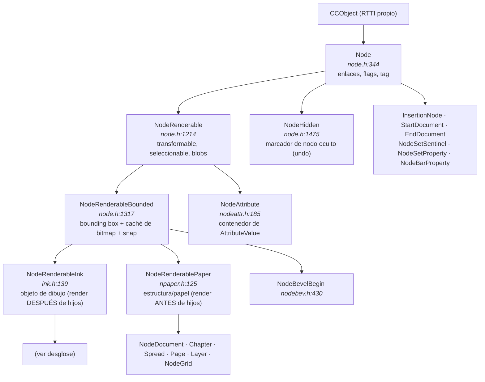
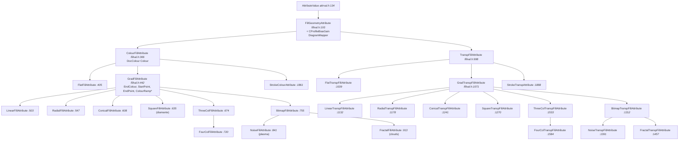
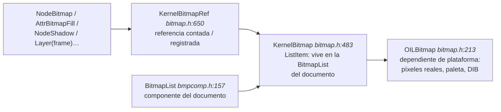

# Modelo de documento de Xara Xtreme (Xara LX) — análisis y propuesta de reimplementación en Rust

> **Fuente analizada:** `/home/user/xara-xtreme` (Xara LX / Xara Xtreme, GPLv2, Xara Group Ltd 1993‑2006).
> Todas las referencias `fichero:línea` son relativas a `/home/user/xara-xtreme/Kernel/` salvo que se indique otra cosa.
> **Documento de solo lectura sobre el C++ original.** Nada del código fuente original ha sido modificado.

---

## Índice

1. [Conceptos base del kernel](#1-conceptos-base-del-kernel)
2. [Jerarquía de clases de nodos](#2-jerarquía-de-clases-de-nodos)
3. [Estructura del árbol del documento](#3-estructura-del-árbol-del-documento)
4. [Sistema de atributos](#4-sistema-de-atributos)
5. [Rellenos y transparencias](#5-rellenos-y-transparencias)
6. [Grupos, compuestos y objetos «live»](#6-grupos-compuestos-y-objetos-live)
7. [Modelo de texto](#7-modelo-de-texto)
8. [Bitmaps](#8-bitmaps)
9. [Selección, operaciones y undo/redo](#9-selección-operaciones-y-undoredo)
10. [Recomendación de diseño en Rust](#10-recomendación-de-diseño-en-rust)
11. [Apéndices](#11-apéndices)

---

## 1. Conceptos base del kernel

### 1.1 Unidades y tipos primitivos

| Tipo | Definición | Comentario |
|---|---|---|
| `MILLIPOINT` | `typedef INT32 MILLIPOINT;` — `../PreComp/camtypes.h:132` | Unidad universal de coordenadas. 1 punto = 1000 millipoints; 1 pulgada = 72 000 millipoints. Todo el documento es entero de 32 bits. |
| `DocCoord` | `doccoord.h:104`, deriva de `Coord` | Par `(x, y)` en millipoints, **coordenadas de documento**. |
| `DocRect` | `doccoord.h` | Rectángulo `lo`/`hi` en millipoints; se usa para bounding boxes y pasteboard. |
| `XMILLIPOINT` | `typedef XLONG XMILLIPOINT;` — `ccmaths.h:121` | Coordenada de 64 bits para cálculos de área/perímetro. |
| `FIXED16` | `fixed16.h` | Punto fijo 16.16 para parámetros de fractales (graininess, gravity, squash). |
| `TAG` | `basedoc.h` | Identificador entero único de nodo dentro de un documento (`Node::GetTag()`, `node.h:436`). Lo asigna `BaseDocument::NewTag()` (`basedoc.h:109`). |

El uso de enteros de 32 bits en millipoints (y no de coma flotante) es una decisión de diseño **muy** presente: la comparación de igualdad exacta de coordenadas, la ausencia de NaN y la reproducibilidad bit a bit del renderizado dependen de ello. En Rust conviene conservarlo (`i32` newtype) en lugar de migrar a `f64`.

### 1.2 RTTI propio: `CCObject` y `CCRuntimeClass`

Xara no usa `dynamic_cast`. Implementa su propio sistema de tipos (estilo MFC) con macros:

- `CC_DECLARE_DYNAMIC(Clase)` / `CC_DECLARE_DYNCREATE(Clase)` en la cabecera.
- `CC_IMPLEMENT_DYNAMIC(Clase, Base)` en el `.cpp`.
- `CC_RUNTIME_CLASS(Clase)` devuelve un `CCRuntimeClass*` que se usa como **token de tipo en tiempo de ejecución**.
- `IS_A(p, Clase)` / `p->IsKindOf(CC_RUNTIME_CLASS(Clase))`.

Esto es capital para entender el modelo: **muchísima lógica del kernel enruta por tipo dinámico**. Por ejemplo `Node::FindFirstChild(CCRuntimeClass*)` (`node.h:576`), `AttrTypeSet` (`node.h:304`), `Node::RemoveAttrTypeFromSubtree(CCRuntimeClass*)` (`node.h:753`), `NodeRenderableInk::CanAttrBeAppliedToMe(CCRuntimeClass*)` (`ink.h:219`).

Además, para evitar el coste del RTTI en caminos calientes, `Node` declara **~60 predicados virtuales de tipo rápido** (`node.h:460‑520`):

```cpp
virtual BOOL IsAnObject()      const {return FALSE;}   // node.h:460
virtual BOOL IsAnAttribute()   const {return FALSE;}   // node.h:455
virtual BOOL IsPaper()         const {return FALSE;}   // node.h:457
virtual BOOL IsLayer()         const {return FALSE;}
virtual BOOL IsSpread()        const {return FALSE;}
virtual BOOL IsChapter()       const {return FALSE;}
virtual BOOL IsNodeDocument()  const {return FALSE;}
virtual BOOL IsNodeHidden()    const {return FALSE;}
virtual BOOL IsNodePath()      const {return FALSE;}
virtual BOOL IsCompound()      const {return FALSE;}
virtual BOOL IsController()          {return FALSE;}
virtual BOOL IsABlend()              {return FALSE;}
virtual BOOL IsABevel()        const {return FALSE;}
virtual BOOL IsAContour()      const {return FALSE;}
virtual BOOL IsAShadow()       const {return FALSE;}
virtual BOOL IsEffect()        const {return FALSE;}
// ... etcétera
```

> **Lectura para Rust:** esta batería de predicados es exactamente lo que un `enum NodeKind` + `matches!` resuelve de forma gratuita y exhaustiva. Es la señal más clara de que la jerarquía de herencia estaba compensando la falta de *sum types*.

### 1.3 La estructura de enlace: `Node`

`class CCAPI Node : public CCObject` — **`node.h:344`**

Datos de instancia (`node.h:757‑784`):

```cpp
struct CCAPI NodeFlags            // node.h:758
{
    BOOL Locked: 1;               // no usado actualmente
    BOOL Mangled: 1;              // usado por el importador de ArtWorks
    BOOL Marked: 1;               // usado por CopyMarkedObjects
    BOOL Selected: 1;             // seleccionado por el usuario
    BOOL Renderable:1;            // el nodo es renderizable
    BOOL SelectedChildren: 1;     // tiene hijos seleccionados (select-inside)
    BOOL OpPermission1: 1;        // par de bits -> OpPermissionState
    BOOL OpPermission2: 1;
};

UINT32     Tag;            // node.h:773  identificador único en el documento
NodeFlags  Flags;          // node.h:774
Node      *Previous;       // node.h:777  hermano anterior
Node      *Next;           // node.h:778  hermano siguiente
Node      *Child;          // node.h:779  PRIMER hijo
Node      *Parent;         // node.h:780  padre
UINT32     HiddenRefCnt;   // node.h:784  nº de NodeHidden que ocultan este nodo
```

Es decir: **lista doblemente enlazada de hermanos + puntero a primer hijo + puntero a padre**. No hay puntero a último hijo (se recorre: `Node::FindLastChild()`, `node.h:571`), ni vector de hijos. Esto hace que `AttachNode`/`MoveNode` sean O(1) y que la identidad de nodo sea el puntero.

Operaciones estructurales (`node.h:425‑428`):

| Método | Semántica |
|---|---|
| `AttachNode(ContextNode, Direction, ...)` | Enlaza este nodo relativo a otro. `Direction ∈ {PREV, NEXT, FIRSTCHILD, LASTCHILD}` (`node.h:160`). |
| `MoveNode(Dest, Direction)` | Desenlaza + reenlaza. |
| `CopyNode(Dest, Direction)` | Copia profunda del subárbol. |
| `NodeCopy(Node**)` / `CloneNode(Node**, bool lightweight)` | Copia del nodo. |
| `CascadeDelete()` | Borra recursivamente los hijos. |
| `UnlinkNodeFromTree(BaseDocument*)` | Desenlaza sin borrar. |
| `InsertChainSimple(...)` | Inserta una cadena de hermanos manipulando solo punteros. |

Recorridos (`node.h:601‑640`):

- `FindFirstDepthFirst()` / `FindNextDepthFirst(Subtree)` — post-orden (hijos antes que padre): **es el orden de renderizado**.
- `FindFirstPreorder()` / `FindNextPreorder(pRoot, bSkipSubtree)` — pre-orden.
- `FindNextNonHidden()` / `FindPrevNonHidden()` — saltan nodos `NodeHidden`.
- `FindParentSpread()`, `FindOwnerDoc()`, `FindFirstChapter()`, `FindParent(CCRuntimeClass*)`.
- `IsUnder(pTestNode)` — comprueba precedencia en orden de renderizado.

### 1.4 Orden de renderizado y el «contrato» ink/paper

La distinción arquitectónica central es:

- **Nodos *paper*** (`NodeRenderablePaper`, `npaper.h:125`) se renderizan **antes** que sus hijos (fondo).
- **Nodos *ink*** (`NodeRenderableInk`, `ink.h:139`) se renderizan **después** que sus hijos (los hijos son sus atributos, que deben estar activos cuando el objeto se dibuja).

El bucle real está en `RenderRegion::RenderTree()`, `rndrgn.cpp:~7000‑7150`. El esqueleto:

```
para cada nodo en orden:
    state = pNode->RenderSubtree(this, &pNextNode, bClip)   // node.h:390 (virtual)
    si state == SUBTREE_ROOTANDCHILDREN y tiene hijos:
        SaveContext();                 // rndrgn.cpp:7076   <<<< bajando
        pNode = primerHijo; continue;
    si state ∈ {ROOTONLY, ROOTANDCHILDREN, RUNTO}:
        RenderNode(pNode);             // dibuja o empuja atributo
    pNode->RenderAfterSubtree(this);
    ... al subir al padre:
        RenderNode(padre);             // el ink se dibuja AQUÍ
        RestoreContext();              // rndrgn.cpp:7130   >>>> subiendo
```

`SubtreeRenderState` (`node.h:203`):

| Valor | Significado |
|---|---|
| `SUBTREE_NORENDER` | Saltar el nodo y su subárbol (capa invisible, capa bloqueada en hit-test…). |
| `SUBTREE_ROOTONLY` | Renderizar solo el nodo (caso de `NodeAttribute`, `nodeattr.cpp:477`). |
| `SUBTREE_ROOTANDCHILDREN` | Descender. |
| `SUBTREE_JUMPTO` | Saltar a otro nodo (cachés, efectos). |
| `SUBTREE_RUNTO` | Avanzar sin dibujar pero **manteniendo la pila de atributos** correcta. |

> **Consecuencia semántica clave (§4):** `SaveContext()`/`RestoreContext()` se emiten **al entrar y salir de una lista de hijos**. Por tanto el ámbito de un nodo de atributo es *la lista de hermanos en la que vive, desde su posición hasta el final de esa lista, incluidos los subárboles de esos hermanos y el nodo padre*.

---

## 2. Jerarquía de clases de nodos

### 2.1 Diagrama general



### 2.2 Desglose de `NodeRenderableInk`

```mermaid
graph TD
    NRI["NodeRenderableInk<br/><i>ink.h:139</i>"]

    NRI --> NP["NodePath <i>nodepath.h:128</i>"]
    NRI --> NSS["NodeSimpleShape <i>nodeshap.h:129</i>"]
    NRI --> NRS["NodeRegularShape <i>nodershp.h:145</i>"]
    NRI --> NC["NodeCompound <i>nodecomp.h:165</i>"]
    NRI --> NGL["NodeGuideline <i>guides.h:130</i>"]
    NRI --> NBL["NodeBlender <i>nodebldr.h:360</i>"]
    NRI --> NCT["NodeContour <i>nodecntr.h:121</i>"]
    NRI --> NSH["NodeShadow <i>nodeshad.h:138</i>"]
    NRI --> NBV["NodeBevel <i>nodebev.h:132</i>"]
    NRI --> NCV["NodeClipView <i>nodeclip.h:123</i>"]
    NRI --> NMB["NodeMouldBitmap <i>ndmldink.h:124</i>"]
    NRI --> NBM["NodeBrushMaker <i>ndbrshmk.h:154</i>"]
    NRI --> BTC["BaseTextClass <i>nodetxts.h:125</i>"]

    NP --> NBP["NodeBlendPath <i>ndbldpth.h:119</i>"]
    NP --> NMP["NodeMouldPath <i>ndmldpth.h:117</i>"]
    NBP --> NBrP["NodeBrushPath <i>ndbrshpt.h:121</i>"]

    NSS --> NRect["NodeRect <i>noderect.h:122</i>"]
    NSS --> NElip["NodeEllipse <i>nodeelip.h:120</i>"]
    NRect --> NBmp["NodeBitmap <i>nodebmp.h:124</i>"]
    NBmp --> NABmp["NodeAnimatingBitmap <i>nodeabmp.h:111</i>"]
    NBmp --> NCBmp["NodeCacheBitmap <i>ndcchbmp.h:111</i>"]

    NC --> NG["NodeGroup <i>group.h:122</i>"]
    NC --> NE["NodeEffect <i>nodepostpro.h:130</i>"]
    NG --> NBlend["NodeBlend <i>nodeblnd.h:129</i>"]
    NG --> NMould["NodeMould <i>nodemold.h:161</i>"]
    NG --> NMoulder["NodeMoulder <i>nodemldr.h:134</i>"]
    NG --> NMG["NodeMouldGroup <i>ndmldgrp.h:147</i>"]
    NG --> NBrush["NodeBrush <i>nodebrsh.h:121</i>"]
    NG --> NCC["NodeContourController <i>ncntrcnt.h:153</i>"]
    NG --> NBC["NodeBevelController <i>nbevcont.h:125</i>"]
    NG --> NCVC["NodeClipViewController <i>ndclpcnt.h:146</i>"]
    NE --> NSC["NodeShadowController <i>nodecont.h:215</i>"]
    NE --> NBE["NodeBitmapEffect <i>nodeliveeffect.h:163</i>"]
    NBE --> NLE["NodeLiveEffect <i>nodeliveeffect.h:293</i>"]
    NBE --> NLckE["NodeLockedEffect <i>nodeliveeffect.h:376</i>"]
    NLE --> NFE["NodeFeatherEffect <i>nodeliveeffect.h:463</i>"]

    BTC --> TS["TextStory <i>nodetxts.h:260</i>"]
    BTC --> TL["TextLine <i>nodetxtl.h:287</i>"]
    BTC --> VTN["VisibleTextNode <i>nodetext.h:126</i>"]
    VTN --> ATC["AbstractTextChar <i>nodetext.h:214</i>"]
    VTN --> Caret["CaretNode <i>nodetext.h:423</i>"]
    ATC --> TChar["TextChar <i>nodetext.h:289</i>"]
    ATC --> Kern["KernCode <i>nodetext.h:349</i>"]
    ATC --> HTab["HorizontalTab <i>nodetext.h:387</i>"]
    ATC --> EOL["EOLNode <i>nodetext.h:474</i>"]
```



### 2.3 Catálogo completo de tipos de nodo

#### 2.3.1 Infraestructura (derivan directamente de `Node`, no renderizables)

| Clase | Fichero:línea | Qué es |
|---|---|---|
| `Node` | `node.h:344` | Nodo abstracto: enlaces de árbol, flags, tag, permisos de operación. |
| `NodeHidden` | `node.h:1475` | **Marcador de borrado lógico.** En Xara los nodos casi nunca se destruyen: se sustituyen por un `NodeHidden` que guarda un puntero al nodo oculto (`HiddenNd`). `ShowNode()` lo revierte. Es el sustrato del undo. |
| `InsertionNode` | `insertnd.h:123` | Marca la posición de inserción de nuevos objetos; vive como último hijo de la capa activa del spread seleccionado (`document.cpp:449`). |
| `StartDocument` | `dumbnode.h:122` | Centinela al inicio del árbol. |
| `EndDocument` | `dumbnode.h:162` | Centinela al final del árbol. |
| `NodeSetSentinel` | `ngsentry.h:273` | Nodo ficticio que lleva aplicada **una instancia de cada nombre de objeto** (`TemplateAttribute`) existente en el documento, para que la Name Gallery pueda listar nombres aunque ningún objeto los use. |
| `NodeSetProperty` | `ngsentry.h:125` | Hijo de `NodeSetSentinel`: registros de propiedades por conjunto. |
| `NodeBarProperty` | `ngsentry.h:192` | Ídem, propiedades de barra (navegación web). |

#### 2.3.2 Nodos «paper» (estructura del documento)

| Clase | Fichero:línea | Qué es |
|---|---|---|
| `NodeRenderablePaper` | `npaper.h:125` | Base: añade `DocRect PasteboardRect` (`npaper.h:157`) y se renderiza **antes** que sus hijos. |
| `NodeDocument` | `nodedoc.h:123` | Raíz del árbol de documento. Guarda `LowExtent`/`HighExtent` (extensión total) y `pParentDoc` (`BaseDocument*`). |
| `Chapter` | `chapter.h:127` | Agrupa spreads. En la práctica, Xara LX crea exactamente **un** capítulo (`document.cpp:424`). |
| `Spread` | `spread.h:138` | «Pliego»: espacio de coordenadas de trabajo, contiene páginas, rejillas y capas. |
| `Page` | `page.h:125` | Un rectángulo de página (`DocRect PageRect`, `page.h:179`) dentro del spread. |
| `Layer` | `layer.h:158` | Capa. Contiene los objetos ink. |
| `NodeGrid` | `grid.h:164` | Rejilla de referencia (no imprimible). |
| `NodeGridRect` | `grid.h:306` | Rejilla rectangular. |
| `NodeGridIso` | `grid.h:379` | Rejilla isométrica. |

#### 2.3.3 Geometría primitiva

| Clase | Fichero:línea | Qué es |
|---|---|---|
| `NodePath` | `nodepath.h:128` | **El objeto de dibujo fundamental.** Contiene `Path InkPath` público (`nodepath.h:134`). |
| `NodeSimpleShape` | `nodeshap.h:129` | Abstracta: forma delimitada por un paralelogramo. Datos: `Path InkPath` + `DocCoord Parallel[4]` (`nodeshap.h:212‑214`). |
| `NodeRect` | `noderect.h:122` | Rectángulo (paralelogramo). |
| `NodeEllipse` | `nodeelip.h:120` | Elipse. |
| `NodeRegularShape` | `nodershp.h:145` | **QuickShape**: polígono/estrella/elipse paramétrica. No deriva de `NodeSimpleShape` sino directamente de `NodeRenderableInk`. |
| `NodeGuideline` | `guides.h:130` | Línea guía (vive en la capa de guías). |
| `NodeBrushMaker` | `ndbrshmk.h:154` | Nodo que define un pincel a partir de objetos. |

`NodeRegularShape` (`nodershp.h:299‑322`) es interesante por su naturaleza paramétrica:

```cpp
Path  EdgePath1;              // arista primaria -> punto de estelación
Path  EdgePath2;              // punto de estelación -> punto primario
UINT32 NumSides;              // nº de lados (ángulo primario)
BOOL   Circular : 1;          // basada en círculo
BOOL   Stellated : 1;         // estrellada
BOOL   PrimaryCurvature : 1;
BOOL   StellationCurvature : 1;
double StellRadiusToPrimary;  // ratio radio estelación / radio primario
double PrimaryCurveToPrimary;
double StellCurveToStell;
double StellOffsetRatio;      // ±0.5 = 360/NumSides
// caché (podrían calcularse al vuelo):
DocCoord UTCentrePoint, UTMajorAxes, UTMinorAxes;   // "UT" = untransformed
Path*    CachedRenderPath;
BOOL     PathCacheInvalid : 1;
Matrix   TransformMatrix;
```

Nótese el patrón **parámetros + matriz + path cacheado con bit de invalidación** (`InvalidateCache()`, `nodershp.h:296`). Es un modelo que en Rust se expresa casi literalmente.

`PathShape` (`pathshap.h:118‑133`) clasifica el path resultante: `PATHSHAPE_PATH`, `_CIRCLE`, `_ELLIPSE`, `_SQUARE`, `_RECTANGLE`, `_ELLIPSE_ROTATED`, `_SQUARE_ROTATED`, `_RECTANGLE_ROTATED`.

#### 2.3.4 Compuestos y objetos vivos (ver §6)

| Clase | Fichero:línea | Qué es |
|---|---|---|
| `NodeCompound` | `nodecomp.h:165` | Base de todo objeto compuesto/controlador. Regeneración, DPI de render, nombre, «blend created by». |
| `NodeGroup` | `group.h:122` | Grupo. Soporta *tight group* (caché de bitmap del grupo). |
| `NodeBlend` | `nodeblnd.h:129` | Controlador de mezcla (blend). |
| `NodeBlender` | `nodebldr.h:360` | Un «par» de la mezcla: genera los pasos intermedios entre dos objetos. |
| `NodeBlendPath` | `ndbldpth.h:119` | Path a lo largo del cual se hace la mezcla (blend on a curve). |
| `NodeBrush` | `nodebrsh.h:121` | Trazo de pincel (grupo generado). |
| `NodeBrushPath` | `ndbrshpt.h:121` | Path del pincel. |
| `NodeMould` | `nodemold.h:161` | Controlador de molde (envelope / perspectiva). |
| `NodeMoulder` | `nodemldr.h:134` | Hijo del molde que hace el trabajo de deformación. |
| `NodeMouldGroup` | `ndmldgrp.h:147` | Grupo con los originales dentro del molde. |
| `NodeMouldPath` | `ndmldpth.h:117` | Path que define la forma del molde. |
| `NodeMouldBitmap` | `ndmldink.h:124` | Bitmap moldeado. |
| `NodeContour` | `nodecntr.h:121` | Paso de contorno generado. |
| `NodeContourController` | `ncntrcnt.h:153` | Controlador de contorno. |
| `NodeShadow` | `nodeshad.h:138` | Sombra generada (bitmap + transparencia). |
| `NodeShadowController` | `nodecont.h:215` | Controlador de sombra (deriva de `NodeEffect`). |
| `NodeBevel` | `nodebev.h:132` | Bisel generado. |
| `NodeBevelController` | `nbevcont.h:125` | Controlador de bisel. |
| `NodeBevelBegin` | `nodebev.h:430` | Marcador de inicio de bisel (deriva de `NodeRenderableBounded`, no de Ink). |
| `NodeClipView` | `nodeclip.h:123` | Nodo que aplica el recorte. |
| `NodeClipViewController` | `ndclpcnt.h:146` | Controlador de «ClipView» (recorte por la forma de arriba). |
| `NodeEffect` | `nodepostpro.h:130` | Base de efectos de post-proceso (XPE). |
| `NodeBitmapEffect` | `nodeliveeffect.h:163` | Efecto que renderiza a bitmap y lo post-procesa. |
| `NodeLiveEffect` | `nodeliveeffect.h:293` | Efecto «vivo» (recalculable, guarda `IXMLDOMDocumentPtr m_pEditsDoc`). |
| `NodeLockedEffect` | `nodeliveeffect.h:376` | Efecto «congelado» a bitmap. |
| `NodeFeatherEffect` | `nodeliveeffect.h:463` | Difuminado de bordes. |

#### 2.3.5 Bitmaps

| Clase | Fichero:línea | Qué es |
|---|---|---|
| `NodeBitmap` | `nodebmp.h:124` | Imagen colocada. Deriva de `NodeRect`: es un rectángulo con un `KernelBitmapRef BitmapRef` (`nodebmp.h:180`). |
| `NodeAnimatingBitmap` | `nodeabmp.h:111` | Colección de bitmaps (animación). |
| `NodeCacheBitmap` | `ndcchbmp.h:111` | Bitmap de caché, no se serializa. |

#### 2.3.6 Texto (ver §7)

| Clase | Fichero:línea | Qué es |
|---|---|---|
| `BaseTextClass` | `nodetxts.h:125` | Base común de todos los nodos de texto. |
| `TextStory` | `nodetxts.h:260` | **Historia de texto**: el objeto de texto completo. Compuesto. |
| `TextLine` | `nodetxtl.h:287` | Una línea formateada. Compuesto. |
| `VisibleTextNode` | `nodetext.h:126` | Base de todo lo que ocupa sitio en una línea. Lleva `Matrix CharMatrix` y `MILLIPOINT PosInLine`. |
| `AbstractTextChar` | `nodetext.h:214` | Base de caracteres: métricas cacheadas. |
| `TextChar` | `nodetext.h:289` | Un carácter Unicode real. |
| `KernCode` | `nodetext.h:349` | Kerning manual insertado entre caracteres. |
| `HorizontalTab` | `nodetext.h:387` | Tabulador. |
| `EOLNode` | `nodetext.h:474` | Fin de párrafo/línea. |
| `CaretNode` | `nodetext.h:423` | Cursor de edición (vive en el árbol). |

#### 2.3.7 Atributos

`NodeAttribute` (`nodeattr.h:185`) y sus ~90 subclases: ver el catálogo completo en **§4.6**.

---

## 3. Estructura del árbol del documento

### 3.1 Forma canónica

`Document::InitTree()` (`document.cpp:415‑455`) construye exactamente esto:

```
BaseDocument (no es un Node; es el dueño: basedoc.h:51)
│  TreeStart ──► StartDocument                       (dumbnode.h:122)
│
└──► NodeDocument                                     (nodedoc.h:123)  RAÍZ DEL ÁRBOL
      ├── [bloque de ATRIBUTOS POR DEFECTO]           (document.cpp:485‑520)
      │     AttrFlatColourFill, AttrStrokeColour, AttrLineWidth,
      │     AttrWindingRule, AttrJoinType, AttrQuality, AttrStartCap,
      │     AttrStartArrow, AttrEndArrow, AttrMitreLimit, AttrDashPattern,
      │     AttrTxtFontTypeface, AttrTxtFontSize, ... (uno por atributo registrado)
      │
      └── Chapter                                     (chapter.h:127)
            ├── NodeSetSentinel                       (ngsentry.h:273)
            │     └── NodeBarProperty                 (ngsentry.h:192)
            │
            └── Spread                                (spread.h:138)
                  ├── Page                            (page.h:125)
                  ├── NodeGrid (NodeGridRect)         (grid.h:306)
                  ├── Layer  "capa de guías"  (Guide=TRUE)           (layer.h:158)
                  │     └── NodeGuideline*            (guides.h:130)
                  ├── Layer  "fondo de página" (m_PageBackground=TRUE)
                  │     └── NodeRect que cubre la(s) página(s)
                  ├── Layer  ... capas normales ...
                  │     ├── [atributos locales de la capa]
                  │     ├── NodeGroup / NodePath / TextStory / NodeBitmap / ...
                  │     └── ...
                  └── InsertionNode                   (insertnd.h:123)
│
└──► EndDocument                                      (dumbnode.h:162)
```

El fragmento real:

```cpp
// document.cpp:415
BOOL Document::InitTree(NodeDocument* pRootNode)
{
    Chapter* pChapter = new Chapter(pRootNode, LASTCHILD);          // :424
    m_pSetSentinel = new NodeSetSentinel(pChapter, FIRSTCHILD);     // :429
    NodeBarProperty* pbp = new NodeBarProperty(m_pSetSentinel, LASTCHILD); // :431
    DocRect PasteRect(...);                                          // :435
    Spread *pSpread = new Spread(pChapter, FIRSTCHILD, PasteRect);   // :441
    pSpread->CreateDefaultPageAndGrid(TRUE);                         // :445
    InsertPos = new InsertionNode(this);                             // :452
    InsertPos->AttachNode(pSpread, LASTCHILD);                       // :454
    return TRUE;
}
```

### 3.2 Rol de cada nivel

#### `BaseDocument` / `Document`

- `BaseDocument` (`basedoc.h:51`) **no es un nodo**: es el propietario. Guarda:
  - `Node* TreeStart` (`basedoc.h:101`), `INT32 NodesInTree` (`basedoc.h:102`).
  - `TAG TagCounter` (`basedoc.h:148`) → `NewTag()` asigna IDs únicos.
  - `List* DocComponents` (`basedoc.h:145`) — **componentes del documento**: listas laterales que no son parte del árbol pero se serializan con él (lista de colores `ColourListComponent`, lista de bitmaps `BitmapListComponent` (`bmpcomp.h:221`), info del documento `DocInfoComponent`, lista de pinceles, lista de fractales…).
  - `ColourContextArray DefaultColourContexts` (`basedoc.h:134`).
- `Document` (`document.h:121`) añade: `OperationHistory` (undo/redo), `AttributeManager* AttributeMgr`, `InsertionNode* InsertPos`, `NodeSetSentinel* m_pSetSentinel`, metadatos (título, comentario, tiempos), flags (`SaveWithUndo`, `LayerMultilayer`, `LayerAllVisible`).

> **Lección de diseño:** el «documento» de Xara son **tres cosas**: el árbol de nodos, una bolsa de componentes laterales indexados por tipo, y el historial de operaciones.

#### `NodeDocument` (`nodedoc.h:123`)

Raíz del árbol. Sus datos:

```cpp
DocCoord      LowExtent;   // nodedoc.h:164
DocCoord      HighExtent;  // nodedoc.h:166
BaseDocument *pParentDoc;  // nodedoc.h:168
```

Su bloque de **primeros hijos** contiene los atributos por defecto del documento (§4.4). Esto es intencional: al ser ancestros de todo, el mecanismo normal de herencia de atributos entrega los valores por defecto sin código especial.

#### `Chapter` (`chapter.h:127`)

Agrupación de spreads. Casi vestigial en Xara LX (siempre uno). Hereda el pasteboard de `NodeRenderablePaper`.

#### `Spread` (`spread.h:138`)

Es el nivel más rico. Define un **espacio de coordenadas propio**:

```cpp
MILLIPOINT BleedOffset;    // spread.h:329   sangrado
BOOL   ShowDropShadow;     // spread.h:330
BOOL   RalphDontShowPaper; // spread.h:331
DocCoord SpreadOrigin;     // spread.h:332   origen del espacio de spread (en coords de documento)
DocCoord UserOrigin;       // spread.h:333   origen de las reglas (coords de usuario)
AnimPropertiesParam m_AnimPropertiesParam;  // spread.h:334  props de animación GIF
DimScale SpreadDimScale;   // spread.h:383   escala de dibujo (ej. 1:50)
```

Conversiones (`spread.h:221‑232`): `SpreadCoordToDocCoord`, `DocCoordToSpreadCoord`, `SpreadCoordToPagesCoord`, `PagesCoordToSpreadCoord`, `TextToSpreadCoord`. Y navegación: `FindFirstPageInSpread`, `FindActiveLayer`, `FindFirstGuideLayer` (`spread.cpp:1214`), `FindFirstPageBackgroundLayer` (`spread.cpp:1243`), `FindFirstFrameLayer`, `FindFirstDefaultGridInSpread`.

El **pasteboard** (zona gris alrededor de las páginas) se gestiona aquí: `GetWidePasteboard`, `ExpandPasteboardToInclude`, `AdjustPasteboards`, `GetMaxPasteboardSize`.

#### `Page` (`page.h:125`)

Solo `DocRect PageRect` (`page.h:179`) + `static DocColour PageColour`. Múltiples páginas por spread (`FindRightPage`, `FindBottomPage`) permiten dobles páginas y hojas contiguas. Implementa `Snap()` a los bordes de página.

#### `Layer` (`layer.h:158`)

La capa es donde pasan las cosas. Estado (`layer.h:341‑380`):

```cpp
LayerStatus LayerSt;     // contiene String_256 StringLayerID (nombre único en el spread)
BOOL Active;             // capa activa: destino de los objetos nuevos. Exactamente una por spread.
BOOL Visible;            // se renderiza o no
BOOL Locked;             // no modificable; el hit-test la ignora
BOOL Printable;          // se envía a impresora
BOOL Background;         // capa de fondo (no imprimible)
BOOL Outline;            // renderiza todo en modo contorno (calidad mínima)
BOOL Guide;              // CAPA DE GUÍAS: contiene NodeGuideline
BOOL m_PageBackground;   // CAPA DE FONDO DE PÁGINA: rect que cubre la página con color o bitmap
// --- animación GIF / "frames" ---
BOOL   m_Overlay;        // este frame se superpone al anterior en vez de taparlo
BOOL   m_Solid;          // frame sólido: hace de fondo para los de arriba
BOOL   m_Edited;         // hay que regenerar el bitmap del frame
BOOL   m_Frame;          // es un frame de animación GIF
BOOL   m_HiddenFrame;    // frame oculto: no se guarda pero participa en el render
DWORD  m_FrameDelay;     // retardo del frame
Quality m_CaptureQuality;
KernelBitmapRef m_GeneratedBitmap;    // bitmap generado para el frame
KernelBitmap*   m_pReferencedBitmap;
DocColour*     pGuideColour;          // color de las guías de esta capa
IndexedColour* pIndexedGuideColour;
```

**Capas especiales identificadas:**

| Tipo | Predicado | Creación | Contenido |
|---|---|---|---|
| Capa normal | — | UI | objetos ink |
| Capa activa | `IsActive()` | exactamente una por spread | destino de inserción (`InsertionNode`) |
| **Capa de guías** | `IsGuide()` | `Layer::CreateGuideLayer()` (`layer.cpp:3294`) | `NodeGuideline` horizontales/verticales |
| **Capa de fondo de página** | `IsPageBackground()` | `spread.cpp:589` | un `NodeRect` cubriendo las páginas, con relleno de color o bitmap |
| Capa de fondo | `IsBackground()` | UI | no imprimible |
| Capa de contorno | `IsOutline()` | UI | render forzado a wireframe |
| **Frame de animación** | `IsFrame()` / `IsHiddenFrame()` | UI GIF | un frame del GIF animado |

`Layer::RenderSubtree()` (`layer.cpp:426‑500`) decide la visibilidad y además **activa el cacheo de capa en bitmap**:

```cpp
// layer.cpp:481 — Layer::EnableLayerCacheing
case 1:  // cachear todas las capas
    if (IsVisible() && !IsGuide() && RenderCached(pRender)) return SUBTREE_NORENDER;
case 2:  // cachear todas menos la activa
    if (IsVisible() && !IsGuide() && !IsActive() && RenderCached(pRender)) return SUBTREE_NORENDER;
```

### 3.3 Invariantes del árbol

1. El primer bloque de hijos de cualquier nodo ink/compuesto es su **bloque de atributos**; el recorrido de atributos para si encuentra un `NodeRenderableInk` (`ndoptmz.cpp:~330`).
2. Cada spread tiene **exactamente una** capa activa.
3. El `InsertionNode` es el último hijo de la capa activa (o del spread si no hay capa).
4. Los `NodeHidden` pueden aparecer en cualquier posición: representan nodos borrados de forma deshacible.
5. `HiddenRefCnt` en un nodo cuenta cuántos `NodeHidden` lo ocultan (puede ser > 1 en operaciones anidadas).
6. Los `Tag` son únicos por documento y estables mientras el nodo exista.

---

## 4. Sistema de atributos

### 4.1 Idea central: los atributos **son nodos del árbol**

En Xara no hay un «diccionario de estilos» colgando de cada objeto. Un atributo es un **nodo hijo**:

```
Layer
 ├── AttrFlatColourFill  (rojo)        ← aplica a TODO lo que venga después en esta lista
 ├── NodeGroup
 │     ├── AttrLineWidth (500)         ← aplica dentro del grupo
 │     ├── NodePath  A                 ← rojo, ancho 500
 │     │     └── AttrStrokeColour(azul)  ← SOLO para A (es hijo suyo)
 │     └── NodePath  B                 ← rojo, ancho 500, contorno por defecto
 └── NodePath  C                       ← rojo, ancho por defecto
```

La semántica exacta la fija `RenderRegion::RenderTree()` (`rndrgn.cpp:7076` y `:7130`):

- **Al bajar** a una lista de hijos → `SaveContext()`.
- **Al subir** de esa lista → `RestoreContext()`.
- Un `NodeAttribute` devuelve `SUBTREE_ROOTONLY` (`nodeattr.cpp:477`) y al renderizarse **empuja su valor** sobre la pila de atributos.

> **Ámbito de un atributo = desde su posición hasta el final de la lista de hermanos en la que vive, cubriendo los subárboles de esos hermanos y también el nodo padre** (porque los nodos *ink* se dibujan al subir, después de sus hijos).

Por eso los atributos «aplicados a un objeto» se guardan como **primeros hijos de ese objeto**: al ser el objeto un nodo ink que se dibuja al final, sus atributos hijos ya están activos.

### 4.2 `NodeAttribute` y `AttributeValue`: nodo vs. valor

Hay una separación deliberada en dos capas:

| Capa | Clase base | Fichero | Rol |
|---|---|---|---|
| Nodo del árbol | `NodeAttribute : NodeRenderable` | `nodeattr.h:185` | Identidad, posición, undo, serialización, UI (blobs de relleno), comparación. |
| Valor renderizable | `AttributeValue : CCObject` | `attrval.h:134` | El dato puro + cómo se aplica a un `RenderRegion`. |

Cada `NodeAttribute` concreto contiene por **valor** (no por puntero) una instancia de su `AttributeValue`, siempre llamada `Value`, y la expone:

```cpp
// patrón repetido en todo el kernel, p.ej. fillattr2.h:132-138
virtual AttributeValue* GetAttributeValue() { return &Value; }
...
FlatFillAttribute Value;
```

Interfaz de `AttributeValue` (`attrval.h:134‑173`):

```cpp
virtual void Render (RenderRegion*, BOOL Temp = FALSE) = 0;  // hacerse "current" por 1ª vez
virtual void Restore(RenderRegion*, BOOL Temp)         = 0;  // volver a ser "current" al hacer pop
virtual void GoingOutOfScope(RenderRegion*)                ; // limpiar PathProcessors, etc.
virtual void SimpleCopy(AttributeValue*)               = 0;
virtual NodeAttribute* MakeNode();                            // valor -> nodo
virtual BOOL IsDifferent(AttributeValue*);
virtual BOOL Blend(BlendAttrParam*);                          // interpolación para blends
virtual AttributeValue* MouldIntoStroke(PathStrokerVector*, double);  // deformar con un molde
virtual BOOL CanBeRenderedDirectly();
```

`Render` vs `Restore` distingue «primera vez que este valor entra en vigor» de «reactivación tras hacer pop de otro». Permite que atributos con estado externo (p. ej. `ClipRegionAttribute`, que instala un `PathProcessor` en la render region) hagan trabajo sólo la primera vez.

Interfaz de `NodeAttribute` (`nodeattr.h:198‑331`), lo relevante:

| Método | Fichero:línea | Para qué |
|---|---|---|
| `GetAttributeType()` | `nodeattr.h:208` | Devuelve el `CCRuntimeClass*` que identifica **el hueco** que ocupa (dos atributos del mismo tipo se sustituyen). |
| `GetAttributeIndex()` | `nodeattr.h:211` | Devuelve el `AttrIndex` (índice en la tabla plana de atributos actuales). |
| `GetAttributeClassID()` | `nodeattr.h:210` | Identificador textual (para atributos de usuario / nombres). |
| `operator==` / `IsDifferent` | `nodeattr.h:203‑204` | Comparación de valor: la base de toda la optimización. |
| `HasEquivalentDefaultValue(bAppearance)` | `nodeattr.h:215` | ¿Es igual al valor por defecto? → se puede borrar. |
| `ShouldBeOptimized()` | `nodeattr.h:261` | Por defecto `!IsEffectAttribute()`. |
| `CanBeMultiplyApplied()` | `nodeattr.h:258` | Los atributos de usuario/nombres pueden aplicarse varias veces al mismo nodo. |
| `CanBeAppliedToObject()` | `nodeattr.h:253` | `AttrQuality` p.ej. no se aplica a objetos. |
| `GetOtherAttrToApply(BOOL* IsMutate)` | `nodeattr.h:219` | **Mutación**: aplicar un atributo puede exigir aplicar otro (p. ej. poner un relleno degradado obliga a crear el `AttrFillMapping`). |
| `OnMakeCurrent()` | `nodeattr.h:226` | Gancho al convertirse en «atributo actual». |
| `ShouldBecomeCurrent()` | `nodeattr.h:277` | ¿Debe pasar a ser el atributo actual al aplicarse? |
| `Blend(BlendAttrParam*)` | `nodeattr.h:214` | Interpolación en mezclas. |
| `IsEffectAttribute()` | `nodeattr.h:265` | Atributos «de efecto» (feather, clipview) que desvían el render a offscreen. |
| `EffectsParentBounds()` / `GetAttrBoundingRect()` | `nodeattr.h:271‑272` | Atributos que **agrandan** la caja del objeto (ancho de línea, flechas, sombra, feather). |
| `IsLinkedToNodeGeometry()` | `nodeattr.h:297` | **Atributos ligados a la geometría**: sus coordenadas viven en el espacio del objeto (rellenos degradados, biseles). Si el nodo cambia, hay que avisarles: `LinkedNodeGeometryHasChanged()` (`nodeattr.h:307`). |
| `TransformToNewBounds(DocRect&)` | `nodeattr.h:275` | Reajustar el atributo cuando cambian los límites. |
| `IsSeeThrough(bool)` | `nodeattr.h:331` | ¿Deja ver el fondo? (para decidir si hace falta canal alfa). |

### 4.3 El «estado de atributo actual» durante el renderizado

`RenderRegion` (`rndrgn.h:345`) mantiene:

```cpp
AttributeEntry *CurrentAttrs;   // rndrgn.h:904  ARRAY plano indexado por AttrIndex
INT32 NumCurrentAttrs;          // rndrgn.h:905
RenderStack TheStack;           // rndrgn.h:935  pila de save/restore
```

`AttributeEntry` (`attrmgr.h:127`):

```cpp
AttributeValue* pAttr;   // puntero al valor vigente
BOOL Temp   : 2;         // temporal: borrar al terminar
BOOL Ignore : 2;         // no añadir a un path (ApplyBasedOnDefaults)
```

Acceso mediante macros (`rndrgn.h:971‑1008`) — esto es literalmente **la tabla de estado gráfico actual**:

```cpp
#define RR_STROKECOLOUR() (((StrokeColourAttribute*) CurrentAttrs[ATTR_STROKECOLOUR ].pAttr)->Colour)
#define RR_FILLCOLOUR()   (((ColourFillAttribute  *) CurrentAttrs[ATTR_FILLGEOMETRY ].pAttr)->Colour)
#define RR_LINEWIDTH()    (((LineWidthAttribute   *) CurrentAttrs[ATTR_LINEWIDTH    ].pAttr)->LineWidth)
#define RR_WINDINGRULE()  (((WindingRuleAttribute *) CurrentAttrs[ATTR_WINDINGRULE  ].pAttr)->WindingRule)
#define RR_TXTFONTSIZE()  (((TxtFontSizeAttribute *) CurrentAttrs[ATTR_TXTFONTSIZE  ].pAttr)->FontSize)
// ... uno por cada AttrIndex
```

`RenderStack` (`rndstack.h:121`):

```cpp
BOOL Push(AttributeValue* pAttrValue, BOOL Temporary = FALSE);  // rndstack.h:128
void SaveContext()  { ContextLevel++; }                          // rndstack.h:131
void RestoreContext(RenderRegion* pRegion);                      // rndstack.h:132
```

El algoritmo es un **undo-log con marcas de nivel**: al empujar un atributo se guarda el valor anterior de ese slot; `RestoreContext` deshace todo hasta la marca. Es exactamente el patrón que conviene replicar en Rust.

### 4.4 Atributos por defecto

Registro global, estático, por tipo (`attrmgr.h:251‑276`):

```cpp
static UINT32 RegisterDefaultAttribute(CCRuntimeClass* pNodeType, AttributeValue* pValue);
static AttributeEntry* GetDefaultAttributes();          // array indexado por AttrIndex
static NodeAttribute*  GetDefaultAttribute(AttrIndex);
static AttributeValue* GetDefaultAttributeVal(AttrIndex);
static UINT32 GetNumAttributes();
static BOOL ApplyBasedOnDefaults(Node* Target, AttributeEntry* AttrsToApply);
```

Cada clase de atributo se registra en su `static BOOL Init()` (llamado al arrancar). El `AttrIndex` devuelto es el índice en el array plano.

Después, `Document::InitDefaultAttributeNodes()` (`document.cpp:488‑535`) **materializa** un nodo de atributo por cada default y lo cuelga como primer hijo del `NodeDocument`:

```cpp
for (UINT32 i = 0; i < NumDefaultAttribs; i++) {
    Node* NodeAttr = DefaultAttribs[i].pAttr->MakeNode();
    NodeAttr->AttachNode(TreeRoot, FIRSTCHILD, FALSE);   // document.cpp:520
    ...
}
```

Comentario del propio código (`document.cpp:481`): *«The Attribute optimisation routines will not work if the document does not contain the default attributes.»* Los defaults son el **caso base** del algoritmo de herencia.

### 4.5 Atributos actuales, grupos y aplicación

#### Grupos de atributos actuales

`AttributeManager` (`attrmgr.h:215`) mantiene, **por documento**, listas de «atributos actuales» agrupadas:

```cpp
class AttributeGroup : public ListItem {     // attrmgr.h:161
    CCRuntimeClass* AttrGroup;   // identificador del grupo (una RuntimeClass)
    CCRuntimeClass* BaseGroup;   // grupo base (herencia de grupos), puede ser NULL
    NodeAttribute*  AttrListHd;  // lista de atributos actuales del grupo
    String_256      GroupName;
};
const INT32 NUM_ATTR_GROUPS = 2;   // attrmgr.h:122 — actualmente: gráfico y texto
```

Cada objeto ink declara a qué grupo pertenece: `NodeRenderableInk::GetCurrentAttribGroup()` (`ink.h:225`); `BaseTextClass` lo sobreescribe para devolver el grupo de texto (`nodetxts.h:143`). Así, cambiar el tamaño de fuente con texto seleccionado no altera el «relleno actual» del grupo gráfico.

#### Flujo de aplicación

```
UI (herramienta / galería)
   │
   ├─► AttributeManager::AttributeSelected(pAttr)        attrmgr.h:246
   │       (aplicar a la selección)
   ├─► AttributeManager::AttributesSelected(List&, OpName) attrmgr.h:249
   │       (varios a la vez: Pegar Atributos)
   └─► AttributeManager::ApplyAttribToNode(pInk, pAttr)  attrmgr.h:252
           (drag & drop sobre un objeto concreto)
                │
                ▼
   NodeRenderableInk::GetObjectToApplyTo(AttrType)       ink.h:222
        (un controlador puede redirigir la aplicación a sí mismo:
         NodeCompound::PromoteAttributeApplicationToMe, nodecomp.h:237)
                │
                ▼
   NodeRenderableInk::CanAttrBeAppliedToMe(AttrType)     ink.h:219
   NodeRenderableBounded::CanTakeAttributeType(...)      node.h:1343
                │
                ▼
   UndoableOperation::DoLocaliseForAttrChange(...)       undoop.h:385
        (localizar atributos comunes antes de tocar nada)
                │
                ▼
   NodeRenderableInk::ApplyAttributeToObject(pAttr, Redraw)  ink.h:209
        - engancha el nodo de atributo como hijo
        - reemplaza cualquier atributo del mismo GetAttributeType()
                │
                ▼
   NodeRenderableInk::NormaliseAttributes()              ink.h:378
        (borra los que ya se heredan con el mismo valor)
                │
                ▼
   UndoableOperation::DoFactorOutAfterAttrChange(...)
        (volver a factorizar hacia arriba lo que sea común)
                │
                ▼
   AttributeManager::UpdateCurrentAttr / UpdateCurrentAppliedAttr  attrmgr.h:282-286
        (¿este atributo pasa a ser el "actual"?  -> WeShouldMakeAttrCurrent, attrmgr.h:276)
```

**Mutación** (`attrmgr.h:284`, `nodeattr.h:219`): `GetOtherAttrToApply(BOOL* IsMutate)` permite que aplicar un atributo arrastre otro. Si `IsMutate` es cierto, el segundo *sustituye* al primero en lugar de acompañarlo. Se usa, por ejemplo, para convertir un relleno plano en degradado conservando el color, o para que soltar un color sobre el blob de un degradado (`AttrColourDrop`, `fillattr2.h:154`) se convierta en una modificación del degradado existente.

### 4.6 Catálogo completo de tipos de atributo

#### 4.6.1 Índices (`AttrIndex`, `nodeattr.h:114‑170`)

Este `enum` es la tabla plana del estado actual. El orden importa: es el índice en `CurrentAttrs[]`.

```
ATTR_STROKECOLOUR = 0   ATTR_STROKETRANSP        ATTR_FILLGEOMETRY
ATTR_TRANSPFILLGEOMETRY ATTR_FILLMAPPING         ATTR_TRANSPFILLMAPPING
ATTR_FILLEFFECT         ATTR_LINEWIDTH           ATTR_WINDINGRULE
ATTR_JOINTYPE           ATTR_QUALITY             ATTR_DASHPATTERN
ATTR_STARTCAP           ATTR_STARTARROW          ATTR_ENDARROW
ATTR_MITRELIMIT         ATTR_USERATTRIBUTE       ATTR_WEBADDRESS
ATTR_TXTFONTTYPEFACE    ATTR_TXTBOLD             ATTR_TXTITALIC
ATTR_TXTASPECTRATIO     ATTR_TXTJUSTIFICATION    ATTR_TXTTRACKING
ATTR_TXTUNDERLINE       ATTR_TXTFONTSIZE         ATTR_TXTSCRIPT
ATTR_TXTBASELINE        ATTR_TXTLINESPACE        ATTR_TXTLEFTMARGIN
ATTR_TXTRIGHTMARGIN     ATTR_TXTFIRSTINDENT      ATTR_TXTRULER
ATTR_OVERPRINTLINE      ATTR_OVERPRINTFILL       ATTR_PRINTONALLPLATES
ATTR_STROKETYPE         ATTR_VARWIDTH            ATTR_BEVELINDENT
ATTR_BEVELTYPE          ATTR_BEVELCONTRAST       ATTR_BEVELLIGHTANGLE
ATTR_BEVELLIGHTTILT     ATTR_BRUSHTYPE           ATTR_FEATHER
ATTR_CLIPREGION         ATTR_CLIPVIEW            ATTR_FIRST_FREE_ID
ATTR_MOULD  = 0   (alias)      ATTR_ENDCAP = 0   (alias)
ATTR_BAD_ID = (UINT32)~1
```

#### 4.6.2 Atributos de línea (`lineattr.h`)

| Clase | Fichero:línea | `AttributeValue` | Datos |
|---|---|---|---|
| `AttrLineWidth` | `lineattr.h:136` | `LineWidthAttribute` (`attrval.h:190`) | `MILLIPOINT LineWidth` |
| `AttrStrokeColour` | `lineattr.h:198` | `StrokeColourAttribute` (`fillval.h:1861`) | `DocColour` (deriva de `ColourFillAttribute`) |
| `AttrStrokeTransp` | `lineattr.h:261` | `StrokeTranspAttribute` (`fillval.h:1888`) | transparencia del contorno |
| `AttrStartArrow` | `lineattr.h:434` | `StartArrowAttribute` (`attrval.h:234`) | `ArrowRec StartArrow` |
| `AttrEndArrow` | `lineattr.h:493` | `EndArrowAttribute` (`attrval.h:268`) | `ArrowRec EndArrow` |
| `AttrStartCap` | `lineattr.h:550` | `StartCapAttribute` (`attrval.h:296`) | `LineCapType` |
| `AttrJoinType` | `lineattr.h:606` | `JoinTypeAttribute` (`attrval.h:326`) | `JointType` |
| `AttrMitreLimit` | `lineattr.h:661` | `MitreLimitAttribute` (`attrval.h:355`) | `MILLIPOINT MitreLimit` |
| `AttrWindingRule` | `lineattr.h:717` | `WindingRuleAttribute` (`attrval.h:383`) | `WindingType` (NonZero / EvenOdd) |
| `AttrDashPattern` | `lineattr.h:771` | `DashPatternAttribute` | patrón de guiones |
| `AttrStrokeColourChange` | `lineattr.h:327` | — | «cambio de valor»: aplica una modificación a un atributo ya existente |
| `AttrStrokeTranspChange` | `lineattr.h:374` | — | ídem |
| `AttrStrokeTranspTypeChange` | `lineattr.h:405` | — | ídem |

#### 4.6.3 Relleno y transparencia (`fillattr.h`, `fillattr2.h`) — ver §5 para la geometría

| Clase | Fichero:línea | Notas |
|---|---|---|
| `AttrFillGeometry` | `fillattr.h:206` | **Raíz de rellenos, transparencias y colores de trazo.** |
| `AttrTranspFillGeometry` | `fillattr.h:562` | Herencia **virtual** de `AttrFillGeometry`: marca la rama de transparencia. |
| `AttrValueChange` | `fillattr.h:583` | Base de «atributos de cambio» (no se almacenan: modifican el atributo vigente). |
| `AttrFlatFill` | `fillattr.h:618` | plano |
| `AttrFlatColourFill` / `AttrFlatTranspFill` | `fillattr2.h:578` / `:634` | |
| `AttrLinearFill` → `AttrLinearColourFill` / `AttrLinearTranspFill` | `fillattr2.h:693` / `:749` / `:808` | lineal |
| `AttrRadialFill` → `AttrRadialColourFill` / `AttrRadialTranspFill` | `fillattr2.h:867` / `:930` / `:989` | elíptico |
| `AttrCircularColourFill` / `AttrCircularTranspFill` | `fillattr2.h:1049` / `:1068` | radial con relación de aspecto bloqueada |
| `AttrConicalFill` → `AttrConicalColourFill` / `AttrConicalTranspFill` | `fillattr2.h:1087` / `:1149` / `:1207` | cónico |
| `AttrSquareFill` → `AttrSquareColourFill` / `AttrSquareTranspFill` | `fillattr2.h:1267` / `:1317` / `:1375` | **diamante** (`FILLSHAPE_DIAMOND`) |
| `AttrThreeColFill` → `AttrThreeColColourFill` / `AttrThreeColTranspFill` | `fillattr2.h:1437` / `:1496` / `:1555` | tres colores |
| `AttrFourColFill` → `AttrFourColColourFill` / `AttrFourColTranspFill` | `fillattr2.h:1621` / `:1680` / `:1739` | cuatro colores |
| `AttrBitmapFill` → `AttrBitmapColourFill` / `AttrBitmapTranspFill` | `fillattr2.h:1804` / `:1891` / `:1958` | bitmap |
| `AttrFractalFill` | `fillattr2.h:2028` | base de texturas procedurales (deriva de `AttrBitmapFill`) |
| `AttrTextureColourFill` / `AttrTextureTranspFill` | `fillattr2.h:2076` / `:2303` | base de las dos texturas |
| `AttrFractalColourFill` / `AttrFractalTranspFill` | `fillattr2.h:2147` / `:2368` | **nubes/clouds** (`FILLSHAPE_CLOUDS`) |
| `AttrNoiseColourFill` / `AttrNoiseTranspFill` | `fillattr2.h:2194` / `:2414` | **plasma/ruido** (`FILLSHAPE_PLASMA`) |
| `AttrFillMapping` → `AttrFillMappingLinear` / `AttrFillMappingSin` | `fillattr2.h:2525` / `:2568` / `:2614` | perfil de mapeo del degradado |
| `AttrTranspFillMapping` → `…Linear` / `…Sin` | `fillattr2.h:2824` / `:2861` / `:2908` | ídem para transparencia |
| `AttrFillEffect` → `AttrFillEffectFade` / `AttrFillEffectRainbow` / `AttrFillEffectAltRainbow` | `fillattr2.h:2660` / `:2690` / `:2735` / `:2779` | interpolación de color: fundido / arcoíris / arcoíris alternativo |
| `AttrMould` | `fillattr2.h:2954` | el objeto está dentro de un molde |
| `AttrColourChange` / `AttrColourDrop` | `fillattr2.h:123` / `:154` | cambio de color / soltar color sobre un blob |
| `AttrTranspChange` / `AttrTranspTypeChange` | `fillattr2.h:366` / `:401` | |
| `AttrBitmapChange` / `AttrBitmapTessChange` / `AttrBitmapDpiChange` | `fillattr2.h:204` / `:233` / `:258` | |
| `AttrFractalChange` / `AttrFractalGrainChange` / `AttrFractalTileableChange` | `fillattr2.h:288` / `:316` / `:341` | |
| `AttrNoiseScaleChange` | `fillattr2.h:432` | |
| `AttrColFillRampChange` / `AttrTranspFillRampChange` | `fillattr2.h:483` / `:528` | modificación de una rampa multietapa |

#### 4.6.4 Atributos de texto (`txtattr.h`)

Todos derivan de `AttrTxtBase : NodeAttribute` (`txtattr.h:802`), y sus valores de `TxtBaseClassAttribute : AttributeValue` (`txtattr.h:158`).

| Clase | Fichero:línea | Valor | Dato |
|---|---|---|---|
| `AttrTxtFontTypeface` | `txtattr.h:833` | `TxtFontTypefaceAttribute` (`:180`) | `HTypeface`, `IsBold`, `IsItalic` |
| `AttrTxtBold` | `txtattr.h:899` | `TxtBoldAttribute` (`:258`) | `BOOL BoldOn` |
| `AttrTxtItalic` | `txtattr.h:956` | `TxtItalicAttribute` (`:295`) | `BOOL ItalicOn` |
| `AttrTxtUnderline` | `txtattr.h:1013` | `TxtUnderlineAttribute` (`:333`) | `BOOL Underlined` |
| `AttrTxtAspectRatio` | `txtattr.h:1070` | `TxtAspectRatioAttribute` (`:444`) | `FIXED16 AspectRatio` |
| `AttrTxtJustification` | `txtattr.h:1128` | `TxtJustificationAttribute` (`:368`) | `Justification` ∈ `{JLEFT, JRIGHT, JCENTRE, JFULL}` (`txtattr.h:142`) |
| `AttrTxtTracking` | `txtattr.h:1187` | `TxtTrackingAttribute` (`:407`) | `MILLIPOINT Tracking` |
| `AttrTxtFontSize` | `txtattr.h:1244` | `TxtFontSizeAttribute` (`:219`) | `MILLIPOINT FontSize` |
| `AttrTxtScript` | `txtattr.h:1303` | `TxtScriptAttribute` (`:480`) | super/subíndice |
| `AttrTxtBaseLine` | `txtattr.h:1360` | `TxtBaseLineAttribute` (`:517`) | `MILLIPOINT` desplazamiento de línea base |
| `AttrTxtLeftMargin` | `txtattr.h:1418` | `TxtLeftMarginAttribute` (`:695`) | `MILLIPOINT` |
| `AttrTxtRightMargin` | `txtattr.h:1474` | `TxtRightMarginAttribute` (`:730`) | `MILLIPOINT` |
| `AttrTxtFirstIndent` | `txtattr.h:1530` | `TxtFirstIndentAttribute` (`:765`) | `MILLIPOINT` |
| `AttrTxtRuler` | `txtattr.h:1586` | `TxtRulerAttribute` (`:642`) | lista de `TxtTabStop` (`:595`), tipos `{LeftTab, RightTab, CentreTab, DecimalTab}` (`txtattr.h:143`) |
| `AttrTxtLineSpace` | `txtattr.h:1643` | `TxtLineSpaceAttribute` (`:553`) | interlineado (absoluto o proporcional) |

`TextLine::IsAttrTypeLineLevel(CCRuntimeClass*)` (`nodetxtl.h:335`) distingue los atributos **de nivel de línea** (justificación, márgenes, sangría, interlineado, regla) de los **de nivel de carácter**: los primeros deben vivir como hijos de la `TextLine`, no del carácter.

#### 4.6.5 Resto de atributos

| Clase | Fichero:línea | Qué hace |
|---|---|---|
| `AttrQuality` | `qualattr.h:149` | Nivel de calidad de render (wireframe … antialias completo). No aplicable a objetos. |
| `AttrWebAddress` | `webattr.h:259` | URL / imagemap. |
| `AttrUser` | `userattr.h:164` | Atributo de usuario genérico: `Key`, `LongKey`, `Value` (strings). `CanBeMultiplyApplied() == TRUE`. |
| `TemplateAttribute` | `tmpltatr.h:124` | Deriva de `AttrUser`. **Es el «nombre de objeto»** de la Name Gallery: `<InternalName>[/<Param>][;<Question>]`. `IsAnObjectName()`. Es lo que implementa los *soft groups* / conjuntos nombrados. |
| `AttrImagesetting` | `isetattr.h:148` | Base de filmación. |
| `AttrOverprintLine` | `isetattr.h:228` | Sobreimpresión de línea. |
| `AttrOverprintFill` | `isetattr.h:328` | Sobreimpresión de relleno. |
| `AttrPrintOnAllPlates` | `isetattr.h:426` | Imprimir en todas las planchas. |
| `AttrStrokeType` | `strkattr.h:197` | Tipo de trazo (stroke) vectorial. |
| `AttrVariableWidth` | `strkattr.h:326` | Perfil de ancho variable a lo largo del path. |
| `AttrBrushType` | `brshattr.h:320` | Pincel aplicado a un path. |
| `AttrFeather` | `fthrattr.h:309` | Difuminado de bordes. Valor `FeatherAttrValue : OffscreenAttrValue` (`fthrattr.h:66`): tamaño en MILLIPOINT + `CProfileBiasGain`. Es un **atributo de efecto** (`IsEffectAttribute()`), desvía el render a un bitmap fuera de pantalla. |
| `AttrClipView` | `clipattr.h:158` | Recorte «ClipView». |
| `ClipRegionAttribute` | `clipattr.h:121` | Valor: `Path* m_pClipPath` + `m_bResponsibleForGrouping`. Instala un recorte en la render region; usa `GoingOutOfScope` para quitarlo. |
| `AttrBevel` + 5 subclases | `attrbev.h:156`, `:179`, `:266`, `:354`, `:482`, `:576` | `AttrBevelIndent`, `AttrBevelLightAngle`, `AttrBevelContrast`, `AttrBevelType`, `AttrBevelLightTilt`. Cada parámetro del bisel es un atributo independiente (para poder animarlos/mezclarlos por separado). |

### 4.7 Optimización de atributos (`ndoptmz.cpp`)

Esta es una de las partes más originales del diseño: el árbol de atributos se **normaliza continuamente** para que el estado mínimo esté representado.

| Función | Fichero:línea | Qué hace |
|---|---|---|
| `MakeAttributeComplete(Root, CheckDup, pAffected, IncludeDefaults, bIncludeEffectAttrs)` | `ink.h:372`, impl. `ndoptmz.cpp:183` | **Antes de mover un subárbol.** Recorre hacia arriba hasta `Root` recogiendo *todos* los atributos que el subárbol necesita y los añade como primeros hijos. Así el subárbol queda autocontenido. |
| `NormaliseAttributes()` | `ink.h:378`, impl. `ndoptmz.cpp:318` | **Después de insertar.** Borra todo atributo hijo cuyo tipo **y valor** coincida con el heredado del nuevo contexto (incluidos los defaults). |
| `RemoveSuperfluousAttribs()` | `ndoptmz.cpp:412` | Elimina duplicados dentro del propio bloque de atributos. |
| `FindCommonAttributesToFactorOut(CommonAttrSet*)` | `ndoptmz.cpp:559` | Busca atributos idénticos en todos los hijos. |
| `FactorOutCommonChildAttributes(Global, pAffected)` | `ink.h:380`, impl. `ndoptmz.cpp:703` | **Sube** al padre los atributos comunes a todos los hijos (p. ej. agrupar 5 objetos rojos → un solo `AttrFlatColourFill` en el grupo). |
| `LocaliseCommonAttributes(CheckDup, Global, pAffected, Recursive)` | `ink.h:383`, impl. `ndoptmz.cpp:847` | **Baja** los atributos del padre a cada hijo. Necesario antes de desagrupar o de cambiar un atributo solo en algunos hijos. |
| `DeleteLocalisedAttributes` / `DeleteFactoredOutAttribs` | `ndoptmz.cpp:978` / `:1053` | Limpieza tras las dos anteriores. |
| `Node::OptimiseAttributes()` | `node.h:694`, impl. `ndoptmz.cpp:1127` | Punto de entrada general. |
| `DeleteAppliedAttributes()` | `ink.h:323`, impl. `noderend.cpp:4365` | Borra los atributos hijos que coincidan en tipo y valor con los aplicados desde arriba. |
| `FindAppliedAttributes(CCAttrMap*, nMax, nFound, ExcludeGLA, bStrict)` | `ink.h:309`, impl. `hittest.cpp:1504` | **Resuelve la herencia**: construye el mapa completo tipo→atributo vigente para un nodo, subiendo por el árbol. |
| `FindAppliedAttribute(CCRuntimeClass*, ...)` | `ink.h:319` | Versión de un solo tipo. |

Hay **acciones de undo dedicadas** para esto: `FactorOutCommonChildAttrAct` y `LocaliseCommonAttrAct` (`ndoptmz.cpp:131‑132`), y métodos correspondientes en `UndoableOperation`: `DoLocaliseForAttrChange`, `DoFactorOutAfterAttrChange`, `DoFactorOutCommonChildAttributes`, `DoLocaliseCommonAttributes`.

> **Valoración de diseño.** Esta maquinaria existe porque el modelo «atributo = nodo con ámbito de lista» hace que la *misma apariencia* tenga muchas representaciones posibles, y hay que canonicalizar para: (a) que el fichero sea compacto, (b) que la comparación de objetos sea barata, (c) que la UI muestre lo correcto. En Rust hay dos salidas: conservar la representación y replicar las rutinas, o normalizar a «mapa de atributos por nodo» y recuperar el árbol de atributos solo en el (de)serializador. Ver §10.6.

### 4.8 «Attribute gallery» y atributos compartidos

- No hay *instancing* real de valores de atributo en memoria: cada `NodeAttribute` **contiene** su `AttributeValue` por valor. El compartido se consigue por **factorización en el árbol** (un atributo en el ancestro sirve a N descendientes).
- Lo que sí se comparte por referencia:
  - **Colores nombrados**: `DocColour` puede ser una *referencia* a un `IndexedColour` de la `ColourList` del documento (`doccolor.h:105` `MakeRefToIndexedColour`). Cambiar el color indexado repinta todo lo que lo usa.
  - **Bitmaps**: `KernelBitmapRef` (`bitmap.h:650`) apunta a un `KernelBitmap` de la `BitmapList` del documento.
  - **Nombres de objeto**: `TemplateAttribute` (`tmpltatr.h:124`), con el `NodeSetSentinel` manteniendo vivo cada nombre.
- La UI de descubrimiento de atributos comunes está en `AttributeAgglomerator` (`attraggl.h:258`): recorre la selección, obtiene los atributos aplicados y calcula los comunes para mostrarlos en la galería (`AppliedAttribute`, `attraggl.h:304`; `SingletonAppliedAttribute`, `attraggl.h:330`).

---

## 5. Rellenos y transparencias

### 5.1 La jerarquía de valores (`fillval.h`)



La rama de color y la de transparencia son **estructuralmente idénticas**: la misma geometría, cambiando `DocColour` por `UINT32` (0–255). Es una duplicación completa del árbol de clases que en Rust desaparece con genéricos o con un enum de «carga útil».

### 5.2 Interfaz común: puntos de control, colores y transparencias

`FillGeometryAttribute` (`fillval.h:193‑345`) define una interfaz de acceso **por índice implícito** con hasta **4 puntos de control** y **4 paradas de color/transparencia**:

```cpp
virtual DocCoord*  GetStartPoint();  GetEndPoint();  GetEndPoint2();  GetEndPoint3();
virtual DocColour* GetStartColour(); GetEndColour(); GetEndColour2(); GetEndColour3();
virtual UINT32*    GetStartTransp(); GetEndTransp(); GetEndTransp2(); GetEndTransp3();
```

Semántica de los puntos por tipo de relleno:

| Tipo | `StartPoint` | `EndPoint` | `EndPoint2` | `EndPoint3` | Notas |
|---|---|---|---|---|---|
| **Flat** | — | — | — | — | Sólo `Colour`. |
| **Linear** (`fillval.h:503`) | origen del degradado | fin del degradado | eje secundario (perspectiva) | 4.ª esquina (perspectiva) | `BOOL IsPersp` (`fillval.h:531`). Sin perspectiva basta Start/End. |
| **Radial** (`fillval.h:547`) | centro | extremo del eje mayor | extremo del eje menor | (perspectiva) | `BOOL Circular` (`fillval.h:593`) → `IsAspectLocked()`: si es cierto, círculo (`FILLSHAPE_CIRCULAR`), si no elipse (`FILLSHAPE_ELLIPTICAL`). |
| **Conical** (`fillval.h:608`) | centro | dirección de ángulo 0 | — | — | `FILLSHAPE_CONICAL`. |
| **Square/diamante** (`fillval.h:635`) | centro | esquina 1 | esquina 2 | (perspectiva) | `FILLSHAPE_DIAMOND`. |
| **Three colour** (`fillval.h:674`) | origen | eje 1 (→ `EndColour`) | eje 2 (→ `EndColour2`) | (perspectiva) | Interpolación baricéntrica en un triángulo. `SupportsFillRamps() == FALSE`. |
| **Four colour** (`fillval.h:720`) | origen | eje 1 | eje 2 | 4.ª esquina (→ `EndColour3`) | Interpolación bilineal en un cuadrilátero. |
| **Bitmap** (`fillval.h:755`) | origen del tile | eje X del tile | eje Y del tile | (perspectiva) | + `KernelBitmapRef BitmapRef`, `INT32 Tesselation`, DPI. |
| **Fractal/Noise** | igual que bitmap | | | | El bitmap se **genera** procedimentalmente. |

### 5.3 Formas de relleno (`FILLSHAPE_*`, `fillval.h:119‑130`)

```
FILLSHAPE_UNKNOWN    = -1
FILLSHAPE_FLAT       =  0
FILLSHAPE_LINEAR     =  1
FILLSHAPE_CIRCULAR   =  2
FILLSHAPE_ELLIPTICAL =  3
FILLSHAPE_CONICAL    =  4
FILLSHAPE_DIAMOND    =  5
FILLSHAPE_3POINT     =  6
FILLSHAPE_4POINT     =  7
FILLSHAPE_BITMAP     =  8
FILLSHAPE_CLOUDS     =  9    // FractalFillAttribute
FILLSHAPE_PLASMA     = 10    // NoiseFillAttribute
```

### 5.4 Repetición / teselado (`RepeatType`, `fillval.h:133‑138`)

```cpp
enum RepeatType {
    RT_NoRepeatType = 0,
    RT_Simple,          // una sola copia; fuera del tile se usa el color/transparencia de borde
    RT_Repeating,       // mosaico normal
    RT_RepeatInverted   // mosaico espejado (sin costuras)
};
```

Accesible por `GetTesselation()` / `SetTesselation()` (`fillval.h:283‑284`) y modificable con `AttrBitmapTessChange` (`fillattr2.h:233`).

### 5.5 Tipos de transparencia (`TranspType`, `fillval.h:144‑176`)

```cpp
enum TranspType {
    TT_NoTranspType = 0,   // opaco
    TT_Mix,                // mezcla normal (alpha)
    TT_StainGlass,         // vidriera (multiplicativo)
    TT_Bleach,             // blanqueado (screen)
    TT_SPECIAL_1 = T_SPECIAL_1, TT_SPECIAL_2, TT_SPECIAL_3,
    // valores de GDraw, no legales en las estructuras de datos de Camelot:
    TT_CONTRAST,   TT_FLAT_CONTRAST,   TT_GRAD_CONTRAST,
    TT_SATURATION, TT_FLAT_SATURATION, TT_GRAD_SATURATION,
    TT_DARKEN,     TT_FLAT_DARKEN,     TT_GRAD_DARKEN,
    TT_LIGHTEN,    TT_FLAT_LIGHTEN,    TT_GRAD_LIGHTEN,
    TT_BRIGHTNESS, TT_FLAT_BRIGHTNESS, TT_GRAD_BRIGHTNESS,
    TT_LUMINOSITY, TT_FLAT_LUMINOSITY, TT_GRAD_LUMINOSITY,
    TT_HUE,        TT_FLAT_HUE,        TT_GRAD_HUE,
    TT_BEVEL,      TT_FLAT_BEVEL,      TT_GRAD_BEVEL,
    TT_MAX
};
```

La transparencia **no es un canal alfa por objeto**: es un *relleno* completo (con su propia geometría) cuyo «color» es un escalar 0–255, más un **modo de composición**. Es decir, Xara tiene degradados de modo de mezcla desde 1995.

### 5.6 Rampas multietapa (`fillramp.h`)

Los degradados de dos colores se generalizan con una **rampa**: lista de paradas intermedias.

```cpp
class RampItem : public ListItem {        // fillramp.h:134
    float Position;    // 0..1  posición a lo largo del degradado
    BOOL  Selected;    // estado de selección en la UI
};
class ColRampItem : public RampItem {     // fillramp.h:173
    DocColour Colour;
};
class TranspRampItem : public RampItem {  // fillramp.h:206
    UINT32 Transparency;
};
class FillRamp : public List { ... };     // fillramp.h:243
class ColourRamp       : public FillRamp;
class TransparencyRamp : public FillRamp;
```

Acceso: `GradFillAttribute::GetColourRamp()` (`fillval.h:471`), `SetColourRamp`, `MakeNewColourRamp`, `SameColourRampAs`, `DeleteColourRamp` (`fillval.h:483‑487`); `SupportsFillRamps()` (`fillval.h:481`) es `TRUE` para todos los `GradFillAttribute` **salvo** three/four-colour (`fillval.h:697`).

Las paradas de inicio (`Colour`) y fin (`EndColour`) **no** están en la rampa: la rampa sólo contiene las intermedias. Las operaciones de UI (`FillRamp::HitBlob`, `GetGeometryCoord`, `RenderRampBlobs`, `SortRamp`, `RotateSelRight/Left`) están en `fillramp.h:268‑290`.

### 5.7 Perfil del degradado: bias / gain

Todo `FillGeometryAttribute` lleva un perfil (`fillval.h:328‑332`):

```cpp
CProfileBiasGain DiagramMapper;
void              SetProfile(CProfileBiasGain&);
CProfileBiasGain& GetProfile();
CProfileBiasGain* GetProfilePtr();
```

`CProfileBiasGain : IProfile` (`biasgain.h:147`):

```cpp
virtual void SetBiasGain(AFp BiasMinus1ToPlus1, AFp GainMinus1ToPlus1);  // biasgain.h:170
virtual void SetBias(AFp);  SetGain(AFp);
virtual AFp  GetBias() const;  GetGain() const;
virtual AFp  MapZeroToOne(AFp ZeroToOne) const;   // biasgain.h:180 — la función de mapeo
virtual void SetIntervals(AFp Low, AFp High);
virtual void SetIntervals(AFp DomainLow, AFp DomainHigh, AFp RangeLow, AFp RangeHigh);
virtual AFp  MapInterval(AFp) const;
virtual void MapInterval(AFp Table[], INT32 length) const;   // precálculo de LUT
BOOL generatesInfiniteUndo;   // biasgain.h:241
BOOL isAFeatherProfile;       // biasgain.h:243
```

Es la clásica función *bias/gain* de Schlick/Perlin, con bias y gain normalizados a [-1, +1]. Se usa en degradados, contornos (`NodeContour::m_Profile`, `nodecntr.h:301`), sombras (`NodeShadow::m_BiasGain`, `nodeshad.h:316`), feather y blends.

Adicionalmente existe el **mapeo** como atributo separado:

- `AttrFillMapping` → `AttrFillMappingLinear` / `AttrFillMappingSin` (`fillattr2.h:2525` / `:2568` / `:2614`).
- `AttrTranspFillMapping` → lineal / seno (`fillattr2.h:2824` / `:2861` / `:2908`).

Y el **efecto de interpolación de color** (`AttrFillEffect`, `fillattr2.h:2660`):

| Efecto | Clase | Semántica |
|---|---|---|
| Fundido | `AttrFillEffectFade` (`fillattr2.h:2690`) | interpolación en espacio RGB |
| Arcoíris | `AttrFillEffectRainbow` (`fillattr2.h:2735`) | interpolación de tono por el camino corto (HSV) |
| Arcoíris alt. | `AttrFillEffectAltRainbow` (`fillattr2.h:2779`) | interpolación de tono por el camino largo |

### 5.8 Rellenos procedurales: fractal y ruido

`FractalFillAttribute` (`fillval.h:913`) — **nubes** (`FILLSHAPE_CLOUDS`):

```cpp
INT32   Seed;         // semilla
FIXED16 Graininess;   // 0 .. ~32
FIXED16 Gravity;      // 0 .. ~255
FIXED16 Squash;
INT32   Dpi;
BOOL    Tileable;
INT32   Dim;          // dimensión (tamaño del bitmap generado)
```

`NoiseFillAttribute` (`fillval.h:841`) — **plasma** (`FILLSHAPE_PLASMA`):

```cpp
INT32   seed;
UINT32  dpi;
BOOL    tileable;
UINT32  dim;
FIXED16 grain;
```

Ambos generan un `KernelBitmap` bajo demanda:

```cpp
// fillval.h:343-344
KernelBitmap* GenerateFractalBitmap(INT32 seed, double grain, double gravity, double squash, UINT32 dim);
KernelBitmap* GenerateNoiseBitmap(FIXED16 grain, INT32 seed);
// fillval.h:317-318  — caché: evitar regenerar si los parámetros no cambiaron
virtual void CacheFractalData(FillGeometryAttribute* pCachedFractal);
virtual BOOL IsSameAsCachedFractal(FillGeometryAttribute* pCachedFractal);
virtual BOOL Randomise();       // fillval.h:274
virtual BOOL RecalcFractal();   // fillval.h:275
```

### 5.9 Interacción con moldes y blends

Cada valor de relleno implementa dos transformaciones especiales:

```cpp
virtual INT32 Mould(MouldAttribute*, DocCoord* src, INT32 n, DocCoord* dst);  // fillval.h:296
virtual AttributeValue* MouldIntoStroke(PathStrokerVector*, double TransScale); // fillval.h:337
virtual BOOL Blend(BlendAttrParam*);                                          // fillval.h:288
virtual BOOL BlendFillColours(DocColour* S, DocColour* E, DocColour* B, double& r, ...);
virtual BOOL BlendFillTransp (UINT32* S, UINT32* E, UINT32* B, double& r, ...);
virtual BOOL BlendControlPoints(DocCoord* S, DocCoord* E, DocCoord* B, double& r, ..., BOOL swapOrder);
virtual BOOL CheckForGreyscaleBitmapBlend(KernelBitmap*, DocColour* Start, DocColour* End);
```

Es decir, el relleno **sabe deformarse** con el objeto (los puntos de control se moldean) y **sabe interpolarse** con otro relleno del mismo tipo. `MouldIntoStroke` además escala anchos de línea y transparencias.

### 5.10 Colores: `DocColour`

`DocColour` (`doccolor.h:81`) ocupa tres campos (`doccolor.h:204‑207`):

```cpp
ColourInfo   Info;            // modelo + flags (¿es referencia a IndexedColour?)
ColourPacked SourceColour;    // valor en el modelo de origen
ColourPacked CachedColour;    // valor cacheado en el modelo de destino
```

Modelos (`colmodel.h:199‑215`):

| Valor | Modelo |
|---|---|
| `COLOURMODEL_INDEXED` = 0 | referencia a un `IndexedColour` de la lista del documento |
| `COLOURMODEL_CIET` | CIE XYZ + transparencia |
| `COLOURMODEL_RGBT` | RGB + transparencia |
| `COLOURMODEL_CMYK` | CMYK |
| `COLOURMODEL_HSVT` | HSV + transparencia |
| `COLOURMODEL_GREYT` | gris + transparencia |
| `COLOURMODEL_WEBRGBT` | RGB restringido a paleta web |

Con `MakeRefToIndexedColour(IndexedColour*)` (`doccolor.h:105`) el color pasa a ser una **referencia viva**: cambiar la entrada de la paleta repinta todo. `GetSpotParent()` (`doccolor.h:120`) recupera el color plano padre de un tinte. La mezcla de tintes se hace generando `IndexedColour` locales (`MixTint`, `doccolor.h:176`).

Los `ColourContext` (`colcontx.h`) hacen la conversión entre modelos y dependen del documento (perfiles): `ColourContextRGBT`, `ColourContextCMYK`, `ColourContextHSVT`, `ColourContextGreyT`, `ColourContextWebRGBT`.

---

## 6. Grupos, compuestos y objetos «live»

### 6.1 El patrón «controlador + generados + originales»

Todos los objetos vivos de Xara (blend, contorno, sombra, bisel, molde, clipview, pincel, efectos) siguen **el mismo patrón estructural**:

```
NodeXxxController            (deriva de NodeGroup o NodeEffect)   ← el objeto que el usuario ve/selecciona
 ├── [atributos del controlador]
 ├── NodeXxx  (generado)     ← geometría/bitmap derivado, recalculable
 │      └── ...
 └── NodeGroup / objeto original  ← los datos fuente, intactos
```

Claves del mecanismo en `Node` / `NodeCompound`:

| Elemento | Fichero:línea | Rol |
|---|---|---|
| `Node::IsController()` | `node.h:482` | El nodo controla a sus hijos. |
| `Node::GetParentController()` | `node.h:653` | Un nodo generado devuelve quién lo creó. |
| `Node::NeedsParent(Node* pClassNode)` | `node.h:745` | Este nodo **no puede existir solo**: exige un padre de cierto tipo. Se usa para excluirlo de la selección/copia independiente. |
| `Node::ShouldITransformWithChildren()` | `node.h:742` | El controlador se transforma junto a sus hijos. |
| `Node::PromoteHitTestOnChildrenToMe()` | `node.h:739` | Al pinchar un hijo se selecciona el controlador. |
| `Node::MarqueeSelectNode()` | `node.h:748` | Excluir de la selección por marco. |
| `Node::RegenerateNode(pOp, bCacheRender, bInformParents)` | `node.h:733` | **Recalcular**. `bCacheRender = TRUE` → diferir al próximo repintado. |
| `NodeCompound::GetInsideBoundingRect()` | `nodecomp.h:212` | Caja de los hijos **sin** los que tienen `NeedsParent`. |
| `NodeCompound::GetInkNodeFromController()` | `nodecomp.h:268` | Obtener el objeto fuente de un controlador. |
| `NodeCompound::PromoteAttributeApplicationToMe(pAttrClass)` | `nodecomp.h:237` | Al soltar un color sobre un hijo generado, aplicarlo al controlador. |
| `NodeCompound::SetDPI / GetDPI` | `nodecomp.h:201‑202` | Resolución a la que regenerar los bitmaps derivados. |
| `NodeCompound::RegenerateForPrinting()` | `nodecomp.h:209` | Regenerar a alta resolución antes de imprimir/exportar. |

### 6.2 Disparo de la regeneración: `OnChildChange` y `ObjChangeParam`

El propagador de cambios es `Node::WarnParentOfChange(ObjChangeParam*, AllParents)` (`node.h:667`), que sube el árbol invocando `Node::OnChildChange(ObjChangeParam*)` (`node.h:376`).

`ObjChangeParam` (`objchge.h:226`) lleva:

- **Tipo de cambio** (`ObjChangeType`, `objchge.h:138`):
  `OBJCHANGE_UNDEFINED`, `OBJCHANGE_STARTING`, `OBJCHANGE_RENDERCURRENTBLOBS`, `OBJCHANGE_RENDERCHANGEDBLOBS`, `OBJCHANGE_FINISHED`, `OBJCHANGE_IGNORE`, `OBJCHANGE_FAILED`.
- **Dirección** (`objchge.h:122`): `OBJCHANGE_CALLEDBYOP`, `OBJCHANGE_CALLEDBYPARENT`, `OBJCHANGE_CALLEDBYCHILD`.
- **Flags de cambio físico** (`ObjChangeFlags`, `objchge.h:163`):

```cpp
BYTE DeleteNode        : 1;   // el nodo se va a borrar (u ocultar)
BYTE ReplaceNode       : 1;   // se sustituye por *uno* otro
BYTE MoveNode          : 1;   // se mueve a otro sitio del árbol
BYTE Attribute         : 1;   // se le aplican atributos
BYTE MultiReplaceNode  : 1;   // se sustituye por uno o más nodos
BYTE TransformNode     : 1;   // se transforma
BYTE CopyNode          : 1;   // se copia al portapapeles
BYTE RegenerateNode    : 1;   // se regenera
```

- **Máscara de notificación** (`ObjChangeMask`, `objchge.h:202`): `EorBlobs`, `Finished`. Los padres marcan qué mensajes quieren recibir.
- Puntero a la operación (`GetOpPointer()`), al hijo que llama, y al spread.

`ChangeCode` (`node.h:184`) es la respuesta: `CC_OK`, `CC_NORECORD` (hecho, pero no grabes undo), `CC_FAIL`.

Y **el permiso de operación** (`OpPermissionState`, `node.h:231`) es el mecanismo complementario, de arriba a abajo:

```cpp
enum OpPermissionState { PERMISSION_UNDEFINED, PERMISSION_DENIED, PERMISSION_ALLOWED };
```

`Node::AllowOp(ObjChangeParam*, SetOpPermissionState, DoPreTriggerEdit)` (`node.h:381`) pregunta al árbol si una operación es legal sobre un nodo; un blend puede **denegar** el borrado de sus hijos generados. La clase `Range` no devuelve nodos con `PERMISSION_DENIED`.

Núcleo de `NodeCompound::OnChildChange` (`nodecomp.cpp:272‑320`):

```cpp
if (!pOp && pParam->GetChangeType()  == OBJCHANGE_FINISHED &&
            pParam->GetDirection()   == OBJCHANGE_CALLEDBYCHILD &&
            pParam->GetChangeFlags().RegenerateNode)
{
    RegenerateNode(NULL, FALSE, FALSE);
    return CC_OK;
}
```

### 6.3 Regeneración diferida

Además de la regeneración inmediata, hay una **cola global** en `Application` (`app.cpp:1830‑1860`):

```cpp
BOOL Application::AddNodeToRegenList(Node* pNode);   // app.cpp:1880
void Application::RegenerateNodesInList()            // app.cpp:1830
{
    for (cada pItem en RegenList) {
        if (pItem->pNode->GetHiddenCnt() == 0) {
            if (IsBounded()) InvalidateBoundingRect();
            pItem->pNode->RegenerateNode(NULL, FALSE, FALSE);
            if (IsBounded()) InvalidateBoundingRect();
        }
    }
    RegenList.DeleteAll();
}
```

Patrón: **invalidar caja → regenerar → invalidar caja otra vez** (porque la caja nueva puede ser distinta). La lista se vacía en el momento del repintado (`bCacheRender = TRUE` en `RegenerateNode`).

### 6.4 Grupos (`NodeGroup`, `group.h:122`)

Añade sobre `NodeCompound`:

- `Describe`, `OnChildChange`, `OnClick` (selección del grupo entero).
- **Tight groups** — cacheo del grupo como bitmap (`group.h:204‑209`):
  ```cpp
  virtual BOOL   RenderTight(RenderRegion*);
  virtual BOOL   CaptureTight(RenderRegion*);
  virtual double GetTightGroupPixelsPerInch(RenderRegion* = NULL) const;
  virtual double GetTightGroupPixelWidth(RenderRegion* = NULL) const {return 72000.0/GetTightGroupPixelsPerInch(...);}
  virtual void   TransformTight(TransformBase&, double dTestPixelWidth);
  ```
  Un grupo con transparencia o efectos se rasteriza una vez y se reutiliza mientras no cambie la resolución.
- `IsValidEffectAttr(NodeAttribute*)` (`group.h:211`): qué atributos de efecto puede llevar el grupo.
- `CompoundName` (`nodecomp.h:298`): nombre del grupo.

Las **cajas** se gestionan en `NodeRenderableBounded` (`node.h:1425‑1440`):

```cpp
BOOL    IsBoundingRectValid;   // node.h:1432
DocRect BoundingRectangle;     // node.h:1435
BOOL    Magnetic;              // node.h:1438  objeto magnético (snap)
BOOL    MayBeCached;           // node.h:1440  FALSE => nunca buscar en la caché de bitmaps
```

con `ValidateBoundingRect()` / `InvalidateBoundingRect(bool InvalidateChildBounds)` (`node.h:1346‑1345`) y `GetBoundingRect(DontUseAttrs, HitTest)` (`node.h:1351`). `InvalidateBoundingRect` **sube** invalidando a los ancestros.

### 6.5 Cacheo de bitmaps

Interfaz en `NodeRenderableBounded` (`node.h:1388‑1392`):

```cpp
virtual BOOL RenderCached(RenderRegion*);
virtual BOOL CaptureCached(RenderRegion*);
virtual BOOL ReleaseCached(BOOL bAndParents = TRUE, BOOL bAndChildren = TRUE,
                           BOOL bSelf = TRUE, BOOL bAndDerived = TRUE);
virtual void CopyCached(NodeRenderableBounded* pCopy, double dRes, INT32 maxOption = 0);
virtual void TransformCached(TransformBase&, double dTestPixelWidth);
virtual BOOL HasCachedDirectBitmap() {return FALSE;}
static BOOL bEnableCacheing;     // node.h:1448
static BOOL bThrottleCacheing;   // node.h:1449  limitar al 5% del tiempo de render
static BOOL bShowCacheBlobs;     // node.h:1450
```

El almacén es global y asociativo (`bitmapcache.h`):

```cpp
class CBitmapCacheKey {          // bitmapcachekey.h:104
    LPVOID pOwner;        // puntero al nodo dueño
    double dPixelWidth;   // resolución buscada
    UINT32 nOption;       // variante (varios bitmaps del mismo nodo a la misma resolución)
};
class CCachedBitmap {            // bitmapcache.h:114
    LPBITMAPINFO pbmpInfo;  LPBYTE pbmpBits;
    DocCoord coord0, coord1, coord2;   // paralelogramo: permite transformar la caché sin regenerar
    INT32 nPriority;                   // CACHEPRIORITY_NORMAL / _TEMPBITMAP_HIGH(1000) / _PERMANENT(8000)
    BOOL  bFullCoverage;               // el bitmap cubre por completo al objeto
};
typedef std::map<CBitmapCacheKey, CCachedBitmap, LessBitmapCacheKey> CCacheKeyMap;  // bitmapcache.h:152
class CBitmapCache {             // bitmapcache.h:161
    void StoreBitmap(key, bitmap);
    CCachedBitmap RemoveBitmap(key);
    BOOL RemoveAllOwnedBitmaps(key, bOpaqueOnly, maxpriority);
    void RemoveLowPriorityBitmaps(maxpriority);
    void SetMaximumDataSize(UINT64);          // por defecto: % de la RAM libre
    static UINT64 CalcRecommendedMaximumDataSize();
private:
    CCacheKeyMap m_map;  UINT64 m_lMaxDataSize;  UINT32 m_lCurrentDataSize;
};
```

Política de desalojo: aleatoria acotada por prioridad (`RemoveRandomBitmap`, `bitmapcache.h:215`).

El truco del **paralelogramo** (`coord0/1/2`) es importante: al arrastrar un objeto cacheado no se regenera el bitmap, se blitea transformado.

### 6.6 Blends (`nodeblnd.h`, `nodebldr.h`, `ndbldpth.h`)

Estructura:

```
NodeBlend (NodeGroup)                         nodeblnd.h:129
 ├── NodeBlender  #1                          nodebldr.h:360   (par objeto0→objeto1)
 ├── NodeBlender  #2                                            (par objeto1→objeto2)
 ├── NodeBlendPath (opcional)                 ndbldpth.h:119   (mezcla a lo largo de una curva)
 ├── objeto original 0
 ├── objeto original 1
 └── objeto original 2
```

Estado de `NodeBlend` (`nodeblnd.h:330‑369`):

```cpp
UINT32 m_NumBlendSteps;      // nº de pasos
double m_StepDistance;       // distancia entre pasos
double m_DistanceEntered;    // la última distancia pedida por el usuario
BOOL   m_AWEPSCompatible;    // compatible con EPS de ArtWorks
BOOL   m_AWEPSCompatibleCache;
BOOL   m_OneToOne;           // mapeo 1-a-1 de subpaths en vez de automático
BOOL   m_NotAntialiased;     // no antialias en los pasos intermedios
BOOL   m_Tangential;         // los pasos se orientan tangentes a la curva
BOOL   m_BlendedOnCurve;     // hay un NodeBlendPath
UINT32 m_NumNodeBlendPaths;
static BOOL s_DefaultNotAntialiased;
```

Interpolación de **color** por `AttrFillEffect` (fade / rainbow / alt-rainbow) y de **perfil** por `CProfileBiasGain` (`nodeblnd.h:221` «Profile blending functions»).

`NodeBlender` mantiene el estado de un par:

```cpp
class BlendPath : public ListItem {           // nodebldr.h:140
    Path*              m_pPath;               // el path de este extremo
    NodeRenderableInk* m_pBlendNode;          // nodo mezclado
    NodeRenderableInk* m_pCreatedByNode;      // nodo original que lo generó
    CCAttrMap*         m_pAppliedAttrs;       // atributos resueltos del original
    BOOL               m_bCreatedViaNodeBlendPath;
    Path*              m_pCopyPath;  CCAttrMap* m_pCopyAttrs;
};
class BlendRef {                              // nodebldr.h:287
    NodeRenderableInk* GetNode();
    CCAttrMap* FindAppliedAttributes(BlendPath*);
    BOOL AddBlendPath(BlendPath*);
    UINT32 GetNumBlendPaths();
    BlendPath* GetFirstBlendPath() / GetNextBlendPath(...) / GetBlendPath(INT32);
    void StripRedundantNodeBlendPaths(BlendRef* spouse);
};
```

`Reinit()` / `Deinit()` (`nodeblnd.h:196‑197`) reconstruyen/liberan toda la estructura cacheada de los blenders. `BeginBlendStep` / `EndBlendStep` (`ink.h:392‑395`) permiten a los nodos compuestos participar en cada paso.

> **Nota:** los pasos intermedios **no se materializan** como nodos del árbol en el caso general: `NodeBlender` los genera durante el render. Solo al hacer «convertir a formas editables» (`DoBecomeA`) se crean nodos reales.

### 6.7 Moldes: envelope y perspectiva (`nodemold.h`, `moldshap.h`, `moldenv.h`, `moldpers.h`)

```
NodeMould (NodeGroup)               nodemold.h:161   posee un MouldGeometry*
 ├── NodeMouldPath                  ndmldpth.h:117   la forma del molde (editable)
 ├── NodeMoulder                    nodemldr.h:134   hace el trabajo
 │     ├── NodeMouldBitmap          ndmldink.h:124   bitmaps deformados
 │     └── (paths deformados)
 └── NodeMouldGroup                 ndmldgrp.h:147   los objetos originales
```

`MouldGeometry` (`moldshap.h:130`) es la abstracción de la deformación:

```cpp
virtual BOOL       Validate(Path*, UINT32& errorID);
virtual BOOL       Define(Path*, DocRect*);
virtual MouldSpace Describe();                 // MOULDSPACE_ENVELOPE / _PERSPECTIVE / _UNDEFINED
virtual BOOL       MakeValidFrom(Path** Out, Path* In, INT32* CornersHint);
virtual BOOL       MouldPathToPath(Path* src, Path* dst);
virtual BOOL       MouldBitmapToTile(KernelBitmap* src, KernelBitmap* dst);
virtual BOOL       MouldPoint(DocCoord p, DocCoord& q);
virtual void       MouldPathRender(Path*, RenderRegion*);
virtual void       MouldBitmapRender(KernelBitmap*, DocCoord* pParallel, RenderRegion*);
virtual void       Transform(Path* pNewPath, DocRect*, TransformBase&);
virtual MouldGeometry* MakeCopy();
virtual ChangeCode RecordContext(UndoableOperation*);   // undo
virtual void       SetThreshold(INT32 t);   INT32 MouldThreshold;   // subdivisión adaptativa
```

Implementaciones:

| Clase | Fichero:línea | Qué es |
|---|---|---|
| `MouldEnvelopeBase` | `moldenv.h:123` | Base de envolventes: convierte un path en una malla de puntos de control. |
| `MouldEnvelope` | `moldenv.h:184` | Envolvente de 4 lados con curvas Bézier (4×4 puntos de control). |
| `MouldEnvelope2x2` | `moldenv.h:229` | Envolvente 2×2 (más simple). |
| `MouldPerspective` | `moldpers.h:182` | Transformación proyectiva por 4 esquinas. |
| `MouldTransform : TransformBase` | `moldshap.h:200` | Adaptador para que cualquier nodo se transforme a través del molde. `IsInvertable() == FALSE`. |

El atributo `AttrMould` (`fillattr2.h:2954`) con valor `MouldAttribute` (`fillval.h:1915`) marca que un objeto está dentro de un molde, para que los rellenos también se deformen (`FillGeometryAttribute::Mould`, `fillval.h:296`).

### 6.8 Contornos (`nodecntr.h`, `ncntrcnt.h`)

```
NodeContourController (NodeGroup)   ncntrcnt.h:153
 ├── NodeContour  (generado)        nodecntr.h:121
 └── objeto original
```

Estado de `NodeContour` (`nodecntr.h:215‑304`):

```cpp
Path  m_SourcePath;         // path de origen
Path* m_pPathList;          // pasos generados
INT32 m_NumPaths;
BOOL  m_FirstRender;
// del controlador / parámetros:
Path* m_pSummedPath;
INT32 m_NumSteps;
INT32 m_Width;              // anchura del contorno (MILLIPOINT); signo = dentro/fuera
BOOL  m_bNodeIsPath;
BOOL  m_bOuter;             // contorno exterior
BOOL  m_bIncludeLineWidths;
CProfileBiasGain m_Profile; // perfil de espaciado de los pasos
JointType m_Join;           // tipo de unión
double m_Flatness;          // aplanado de las Béziers
BOOL  m_bContourBrush;
```

`ContourBecomeA` / `ContourBecomeA2` (`nodecntr.h:239` / `nodecntr.h:~285`) y `ContourNodePathProcessor` implementan la conversión a formas.

### 6.9 Sombras (`nodeshad.h`, `nodecont.h`)

```
NodeShadowController (NodeEffect)   nodecont.h:215
 ├── NodeShadow  (generado)         nodeshad.h:138
 └── objeto original
```

`NodeShadow` (`nodeshad.h:284‑336`):

```cpp
KernelBitmap*              m_ShadowBitmap;   // la sombra rasterizada y desenfocada
BitmapTranspFillAttribute* m_pBMPTransFill;  // se pinta como transparencia de bitmap
Path   m_Path;                  Path m_NonTranslatedPath;
INT32  m_ShadowWidth, m_ShadowHeight;
BOOL   m_bHaveTransformed, m_RenderBitmaps, m_bAmCopying, m_bAmLoading;
double m_dDarkness;             // oscuridad
DocRect m_SelectedRect;
INT32  m_PreviousBlur;
CBitmapShadow* m_pShadower;     // el generador
INT32  m_BitmapXOffset;
CProfileBiasGain m_BiasGain;    // perfil del desenfoque
MILLIPOINT m_LastRequestedPixWidth;      // resolución con la que se generó
enum Quality::Fill m_LastQualitySetting;
double m_LastActualPixWidth;
```

El patrón clave es **«último estado con el que se generó»** (`m_LastRequestedPixWidth`, `m_LastQualitySetting`, `m_LastActualPixWidth`): la regeneración se salta si nada relevante ha cambiado. Es el equivalente manual de una memoización con clave.

Tipos de sombra: *wall*, *floor*, *glow* (definidos en `opshadow.h` / `shadowop`), todos apoyados en el mismo nodo.

### 6.10 Biseles (`nodebev.h`, `nbevcont.h`, `attrbev.h`, `bevfill.h`)

```
NodeBevelController (NodeGroup)     nbevcont.h:125
 ├── NodeBevelBegin                 nodebev.h:430   (marcador)
 ├── NodeBevel  (generado)          nodebev.h:132
 └── objeto original
```

`NodeBevel` (`nodebev.h:277‑344`):

```cpp
INT32  m_BevelType;      // tipo de perfil de bisel
INT32  m_Indent;         // anchura
double m_LightAngle;     // ángulo de la luz
BOOL   m_bOuter;         // bisel exterior
INT32  m_Contrast;
double m_Tilt;           // inclinación de la luz
BOOL   m_IsABlendStepBevel;
DocCoord m_BMPCentre;   DocRect m_SelectedRect;   JointType m_JointType;
Path   m_Path;   Path m_OuterBevelPath;
KernelBitmap* m_pBevelBitmap;      // mapa de iluminación
KernelBitmap* m_pCombiBitmap;
BitmapFillAttribute*       m_pBMPFill;
BitmapTranspFillAttribute* m_pTranspFill;
INT32 m_BitmapWidth, m_BitmapHeight;
DocCoord m_SubPixelOffset;   DocRect m_PixelAllignedRect;
BOOL m_MustRegenOnChildChange;   BOOL m_bCached;   BOOL m_bStopRender;
```

Cada **parámetro** del bisel es además un atributo independiente (`attrbev.h`): `AttrBevelIndent`, `AttrBevelType`, `AttrBevelContrast`, `AttrBevelLightAngle`, `AttrBevelLightTilt`, con valores `BevelAttributeValue*`. Esto permite heredarlos, mezclarlos y aplicarlos por galería.

### 6.11 ClipView / recorte (`nodeclip.h`, `ndclpcnt.h`, `clipattr.h`)

```
NodeClipViewController (NodeGroup)  ndclpcnt.h:146
 ├── NodeClipView                   nodeclip.h:123   (el que aplica el recorte)
 ├── objeto de recorte (el de arriba en la pila)
 └── objetos recortados
```

`NodeClipView` (`nodeclip.h:179‑212`):

```cpp
BOOL           m_bRenderingForward;
BYTE*          m_pRegion;              // región de recorte rasterizada
GCONTEXT*      m_pContext;
CONST REGION*  m_pSavedRegion;         // región previa (para restaurar)
BOOL           m_bGDrawClipRegionSet;
RECT           m_SavedClipRect;
ClipRegionAttribute m_ClipRegionAttribute;
```

Y el atributo `ClipRegionAttribute` (`clipattr.h:121`) guarda `Path* m_pClipPath` e implementa `GoingOutOfScope()` para desinstalar el recorte al salir del ámbito — un ejemplo perfecto de por qué `AttributeValue` necesita los tres ganchos `Render` / `Restore` / `GoingOutOfScope`.

### 6.12 Efectos «live» (XPE) (`nodepostpro.h`, `nodeliveeffect.h`)

```
NodeEffect (NodeCompound)           nodepostpro.h:130
 └── String_256 m_strPostProID;     // identificador único del efecto XPE

NodeBitmapEffect (NodeEffect)       nodeliveeffect.h:163
 ├── IXMLDOMDocumentPtr m_pEditsDoc;   // lista de parámetros en XML
 ├── BOOL   m_bHasChangedRecently;
 ├── String_64 m_strDisplayName;
 └── double m_dPixelsPerInch;
```

Flujo (`nodeliveeffect.h:196‑260`):

1. `GetChildDirectBitmap(...)` / render de los hijos a un bitmap → `SetOriginalBitmap(lpInfo, lpBits, rect)`.
2. `ProcessBitmap(pRender, ...)` aplica el efecto (delegando en el motor XPE externo).
3. `SetProcessedBitmap(...)` devuelve el rectángulo resultante (puede crecer).
4. `FindCachedEffect(CBitmapCache*)` / `RenderCachedEffect(...)` evitan recalcular.
5. `CompareState(NodeEffect*)` decide si el estado cambió.

`NodeLockedEffect` (`nodeliveeffect.h:376`) congela el resultado en un bitmap (deja de ser recalculable). `NodeFeatherEffect` (`nodeliveeffect.h:463`) es el difuminado.

### 6.13 «Soft groups» y nombres de objeto

Xara no tiene un nodo «soft group». Lo que hay es el mecanismo de **nombres de objeto** basado en atributos:

- `TemplateAttribute` (`tmpltatr.h:124`), derivado de `AttrUser`, con `IsAnObjectName() == TRUE` y `CanBeMultiplyApplied() == TRUE`. Un objeto puede llevar N nombres.
- La **Name Gallery** (`sgname.h`) lista los nombres; seleccionar un nombre selecciona todos los objetos que lo llevan → eso *es* el soft group.
- `NodeSetSentinel` (`ngsentry.h:273`) mantiene vivo cada nombre aunque ningún objeto lo use, de forma **deshacible** (crear/borrar un nombre son manipulaciones del árbol normales).
- `NodeSet` (`nodeset.h:106`) es solo una colección temporal de nodos para marcar zonas de redibujado.

> **No existen clones/instancias** en el modelo de Xara LX: duplicar es copiar el subárbol. Lo único compartido por referencia son colores indexados y bitmaps.

### 6.14 Conversión entre tipos: `BecomeA`

El mecanismo genérico de «convertir a» (`becomea.h`, `mkshapes.cpp`):

```cpp
virtual BOOL Node::CanBecomeA(BecomeA* pBecomeA);   // node.h:656
virtual BOOL Node::DoBecomeA (BecomeA* pBecomeA);   // node.h:657
```

`BecomeA` lleva la razón (`BECOMEA_REPLACE`, `BECOMEA_PASSBACK`…), la clase destino y la operación de undo. Subclases especializadas: `BlendBecomeA`, `ContourBecomeA`, `NodeShadowBecomeA`, `NodeCompoundBlendBecomeA`, `PathBecomeA`, `HandleBecomeA`. Es como un QuickShape se convierte en `NodePath`, o un blend en `NodeGroup`.

---

## 7. Modelo de texto

### 7.1 Story → Line → Char: el texto **es árbol**

```
TextStory                              nodetxts.h:260   (NodeRenderableInk, IsCompound()==TRUE)
 ├── [atributos de nivel de historia: fuente, tamaño, color…]
 ├── NodePath (opcional)               el path sobre el que fluye el texto
 ├── TextLine                          nodetxtl.h:287   (una línea FORMATEADA)
 │     ├── [atributos de nivel de línea: justificación, márgenes, interlineado, regla]
 │     ├── TextChar  'H'               nodetext.h:289
 │     ├── TextChar  'o'
 │     ├── KernCode  (-20)             nodetext.h:349   kerning manual
 │     ├── TextChar  'l'
 │     ├── HorizontalTab               nodetext.h:387
 │     ├── CaretNode                   nodetext.h:423   (si el foco está aquí)
 │     └── EOLNode                     nodetext.h:474   (fin de línea/párrafo)
 └── TextLine ...
```

Dos observaciones importantes:

1. **Las `TextLine` son líneas ya formateadas**, no párrafos. El ajuste de línea (*word wrap*) **reestructura el árbol**: `TextLine::Wrap(pUndoOp, WrapWidth, Indent)` (`nodetxtl.h:329`) y `VisibleTextNode::WrapRestOfLineForward()` / `WrapFromStartOfLineBack()` (`nodetext.h:167‑168`) mueven nodos de carácter entre líneas. Un `EOLNode` marca el fin de párrafo real.
2. **El cursor es un nodo del árbol** (`CaretNode`), con `TextStory::pFocusStory` estático (`nodetxts.h:456`). Mover el cursor es mover un nodo (`MoveCaretLeftAChar`, `MoveCaretRightAWord`, `MoveCaretToStartOfLine`… `nodetxts.h:309‑315`).

### 7.2 `TextStory` (`nodetxts.h:260`)

```cpp
static TextStory* pFocusStory;   // nodetxts.h:456  la historia con el foco de entrada
Matrix     StoryMatrix;          // nodetxts.h:458  matriz de la historia completa
DocRect    RedrawRect;
CaretNode* CachedCaret;          // nodetxts.h:460
MILLIPOINT mLeftIndent;          // sangría izquierda a lo largo del path
MILLIPOINT mRightIndent;         // sangría derecha
MILLIPOINT StoryWidth;           // ancho cuando NO está sobre un path; 0 => "texto en un punto"
BOOL TextOnPathReversed   : 1;   // texto invertido sobre el path
BOOL TextOnPathTangential : 1;   // caracteres tangentes al path (vs. horizontales)
BOOL PrintAsShapes        : 1;
BOOL WordWrapping         : 1;   // la historia ajusta líneas
BOOL BeingCopied          : 1;
MILLIPOINT    ImportFormatWidth; // compat. importación CDR
BaseShiftEnum ImportBaseShift;
FIXED16 CharsScale;              // transformaciones aplicadas a los caracteres
FIXED16 CharsAspect;             //   ANTES de ajustarlos al path
ANGLE   CharsRotation;
ANGLE   CharsShear;
ImportedStringList* pImportedStringList;
bool    AutoKern;                // kerning automático desde las tablas de la fuente
```

**Tres modos de historia:**

| Modo | Condición | Comportamiento |
|---|---|---|
| Texto en un punto | `StoryWidth == 0`, sin path | Sin ajuste; las líneas crecen libremente. |
| Texto en columna | `StoryWidth > 0`, sin path | Ajuste a `StoryWidth`. |
| Texto sobre path | `GetTextPath() != NULL` (`nodetxts.h:327`) | Cada carácter se coloca a lo largo de la curva. |

Para el texto sobre path: `CreateUntransformedPath(TextStoryInfo*)` (`nodetxts.h:336`), `MatrixFitToPath()` / `MatrixRemoveFromPath()` (`nodetxts.h:337‑338`). El path se guarda como hijo (un `NodePath`), de modo que es editable.

### 7.3 Formateo

`TextStory::FormatAndChildren(pUndoOp, UseNodeFlags, WordWrap)` (`nodetxts.h:340`) es el punto de entrada. Usa dos estructuras de contexto:

`TextStoryInfo` (`nodetxts.h:229`) — contexto a nivel de historia:

```cpp
UndoableOperation* pUndoOp;
BOOL       WordWrap;            // FALSE para undo/redo y para el portapapeles
MILLIPOINT StoryWidth;   BOOL WordWrapping;
Path*      pPath;               // el path (si lo hay)
MILLIPOINT PathLength;   MILLIPOINT PathClosed;
double     UnitDirectionVectorX, UnitDirectionVectorY;
MILLIPOINT LeftPathIndent, RightPathIndent;
MILLIPOINT DescentLine;  BOOL DescentLineValid;
```

`TextLineInfo` (`nodetxtl.h:253`) — contexto a nivel de línea:

```cpp
MILLIPOINT      SumCharAdvances;   // NO incluye el tracking del último carácter
Justification   justification;
MILLIPOINT      LeftMargin, RightMargin;        // relativos al inicio de línea
MILLIPOINT      ParaLeftMargin, ParaRightMargin;
const TxtRuler* Ruler;
BOOL            WordWrapping;
INT32           NumChars, NumSpaces;
```

`FormatState` (`nodetxtl.h:198`) — estado de la máquina de formateo (tabuladores, espacio restante, anclas):

```cpp
const BOOL       SetCharPositions;   // ¿fijar posiciones o solo medir?
const MILLIPOINT FitWidth;
const MILLIPOINT CharPosOffset, ExtraOnChars, ExtraOnSpaces;  // para justificación completa
MILLIPOINT       Width;              // ancho consumido
MILLIPOINT       ActiveTabPos;
MILLIPOINT       AnchorPos;
MILLIPOINT       RemainingSpace;
```

Pasos de `TextLine::Format(TextStoryInfo*)` (`nodetxtl.h:321`):

1. `ReCalcLineInfo(TextLineInfo*)` (`nodetxtl.h:323`) — leer los atributos de nivel de línea de la pila y sumar avances.
2. `CalcBaseAndDescentLine(...)` (`nodetxtl.h:325`) — calcular ascenso/descenso máximos de la línea.
3. `PositionCharsInLine(TextLineInfo*)` (`nodetxtl.h:324`) — repartir el espacio según la justificación.
4. `SetCharMatrices(LinePos)` (`nodetxtl.h:327`) o `FitTextToPath(pStoryInfo, LinePos)` (`nodetxtl.h:328`).
5. Si procede, `Wrap(pUndoOp, WrapWidth, Indent)` (`nodetxtl.h:329`) usando `FindBreakChar(...)` (`nodetxtl.h:330`).

Estado cacheado por línea (`nodetxtl.h:391‑404`):

```cpp
MILLIPOINT    mLineDescent;    // mayor descenso de cualquier carácter
MILLIPOINT    mLineAscent;     // mayor ascenso
MILLIPOINT    mLineSize;       // mayor tamaño
Justification mJustification;  // caché del valor leído de la pila de atributos
MILLIPOINT    mLineSpacing;    FIXED16 mLineSpaceRatio;
MILLIPOINT    mLeftMargin, mFirstIndent, mRightMargin;
TxtRuler*     mpRuler;
MILLIPOINT    mPosInStory;     // y de la base de la línea relativa a la historia
```

> Obsérvese que la línea **cachea** los atributos resueltos de la pila. Es la solución de Xara al hecho de que resolver atributos por herencia es caro y el formateo los necesita muchas veces.

### 7.4 Caracteres

`VisibleTextNode` (`nodetext.h:126`) — base de todo lo que ocupa hueco:

```cpp
Matrix     CharMatrix;   // nodetext.h:200  matriz del carácter (posición + rotación en path)
MILLIPOINT PosInLine;    // nodetext.h:201  x del carácter dentro de la línea
// predicados:
virtual BOOL IsACaret()        const;  IsAnEOLNode() const;
virtual BOOL IsASpace();  IsAVisibleSpace();  IsAHyphen();  IsADecimalPoint();
virtual MILLIPOINT GetCharAdvance();  GetCharWidth();  GetBaseLineShift();
virtual MILLIPOINT GetAutoKernSize(FormatRegion*);   // nodetext.h:184
MILLIPOINT CalcCharDistAlongLine(BOOL IncludeThisChar);  // nodetext.h:166
```

`AbstractTextChar` (`nodetext.h:214`) — métricas cacheadas (`nodetext.h:271‑278`):

```cpp
MILLIPOINT mCharWidth;      // ancho de la tinta
MILLIPOINT mCharAdvance;    // avance (incluye tracking)
MILLIPOINT mBaseLineShift;
MILLIPOINT mFontAscent;
MILLIPOINT mFontDescent;
MILLIPOINT mFontSize;
DocRect    mAttrdCharBounds; // caja del path del carácter incluyendo el efecto de los atributos
virtual WCHAR GetUnicodeValue();               // nodetext.h:240
virtual BOOL  ReCacheMetrics(FormatRegion*);   // nodetext.h:233
```

`TextChar` (`nodetext.h:289`) añade el código Unicode real (`WCHAR`).
`KernCode` (`nodetext.h:349`) es un ajuste de kerning **manual** insertado como nodo entre dos caracteres.
`HorizontalTab` (`nodetext.h:387`) y `EOLNode` (`nodetext.h:474`) son caracteres «abstractos» (sin glifo).

### 7.5 `FormatRegion`: medir sin dibujar

`FormatRegion : RenderRegion` (`nodetxtl.h:130`) es una *render region* que **lanza un error si intentas dibujar en ella**:

```cpp
virtual void DrawPathToOutputDevice(...) { ERROR3("Rendering into a FormatRegion"); }
// ... todas las primitivas de dibujo abortan
```

Su utilidad es exclusivamente **mantener la pila de atributos y resolver métricas**:

```cpp
MILLIPOINT    GetCharsKerning(WCHAR chLeft, WCHAR chRight);   // nodetxtl.h:173
MILLIPOINT    GetTracking()       { return RR_TXTTRACKING(); }
Justification GetJustification()  { return RR_TXTJUSTIFICATION(); }
MILLIPOINT    GetLineSpacing()    { return RR_TXTLINESPACE(); }
MILLIPOINT    GetFontSize()       { return RR_TXTFONTSIZE(); }
MILLIPOINT    GetBaseLineShift()  { return RR_TXTBASELINE(); }
MILLIPOINT    GetLeftMargin()     { return RR_TXTLEFTMARGIN(); }
MILLIPOINT    GetRightMargin()    { return RR_TXTRIGHTMARGIN(); }
MILLIPOINT    GetFirstIndent()    { return RR_TXTFIRSTINDENT(); }
```

> **Lección de diseño:** el formateo de texto y el renderizado comparten el **mismo** mecanismo de resolución de atributos. En Rust, esto se modela como un `AttrResolver`/`AttrStack` reutilizable e independiente del back-end gráfico.

### 7.6 Kerning, tracking y justificación

| Concepto | Dónde | Detalle |
|---|---|---|
| **Kerning automático** | `TextStory::AutoKern` (`nodetxts.h:483`), `FormatRegion::GetCharsKerning(l, r)` (`nodetxtl.h:173`), `VisibleTextNode::GetAutoKernSize(FormatRegion*)` (`nodetext.h:184`) | Pares de la tabla de la fuente. |
| **Kerning manual** | `KernCode` (`nodetext.h:349`) | Nodo insertado en la línea. |
| **Tracking** | `AttrTxtTracking` (`txtattr.h:1187`) / `TxtTrackingAttribute` (`txtattr.h:407`) | `MILLIPOINT` añadido a cada avance. `TextLine::GetLastCharTracking()` (`nodetxtl.h:345`) lo descuenta del último carácter. |
| **Justificación** | `AttrTxtJustification` (`txtattr.h:1128`), enum `Justification {JLEFT, JRIGHT, JCENTRE, JFULL}` (`txtattr.h:142`) | `JFULL` reparte el sobrante con `ExtraOnChars` / `ExtraOnSpaces` de `FormatState`. |
| **Interlineado** | `AttrTxtLineSpace` (`txtattr.h:1643`) | Absoluto (`MILLIPOINT`) o proporcional (`FIXED16 mLineSpaceRatio`). |
| **Márgenes y sangrías** | `AttrTxtLeftMargin`, `AttrTxtRightMargin`, `AttrTxtFirstIndent` (`txtattr.h:1418`, `:1474`, `:1530`) | Nivel de línea. |
| **Tabuladores** | `AttrTxtRuler` (`txtattr.h:1586`), `TxtTabStop` (`txtattr.h:595`), `TxtTabType {LeftTab, RightTab, CentreTab, DecimalTab}` (`txtattr.h:143`) | La «regla» es una lista de paradas. |
| **Aspecto / script / línea base** | `AttrTxtAspectRatio` (`:1070`), `AttrTxtScript` (`:1303`), `AttrTxtBaseLine` (`:1360`) | |

### 7.7 Conversión a formas

`TextLine::CreateNodeGroup(ppNodeGroup, pFormatRegion, pBecomeA)` (`nodetxtl.h:317`) y `TextStory::DoBecomeA` (`nodetxts.h:287`) convierten el texto en un `NodeGroup` de `NodePath`. `TextStory::PrintAsShapes` fuerza esto al imprimir.

---

## 8. Bitmaps

### 8.1 Tres niveles: OIL, kernel, referencia



### 8.2 `KernelBitmap` (`bitmap.h:483`)

```cpp
OILBitmap*  ActualBitmap;             // bitmap.h:627  los píxeles reales
BitmapList* m_pParentList;            // bitmap.h:630  lista del documento a la que pertenece
BOOL m_bDontDeleteActualBitmap : 1;   // bitmap.h:632
BOOL m_bFractalAttached : 1;          // bitmap.h:633  generado por un relleno fractal
BOOL m_bUsedByBrush : 1;              // bitmap.h:634
```

API relevante (`bitmap.h:490‑624`):

| Grupo | Métodos |
|---|---|
| Creación / deduplicación | `MakeKernelBitmap(pOIL, bAlwaysNew)` (`:495`), `TryAndUseExistingBitmap(pOIL, pDoc, ...)` (`:528`), `operator==` (`:505`) |
| Consulta | `GetWidth()`, `GetHeight()`, `GetBPP()`, `GetNumPaletteEntries()`, `GetHorizontalDPI()`, `GetVerticalDPI()`, `GetRecommendedWidth/Height()` |
| Transparencia | `SetTransparencyIndex(INT32)`, `GetTransparencyIndex(INT32*)`, `IsTransparent()` (`:554‑556`) |
| Clasificación | `IsDefaultBitmap()`, `HasBeenDeleted()`, `IsGreyscale()`, `IsLossy()` (`:558‑561`) |
| Contone (duotono) | `CreateGreyscaleVersion(ForceGreyBmp)`, `DestroyGreyscaleVersion()`, `GetGreyscaleVersion(...)` (`:568‑570`) |
| Origen | `GetOriginalSource(BitmapSource**, BaseBitmapFilter**)` (`:565`) |
| Animación | `GetDelay()`, `SetDelay(UINT32)`, `GetLeftOffset()`, `GetTopOffset()`, `GetInterpolation()` (`:580‑591`) |
| Paleta | `IsBrowserPalette()`, `ArePalettesTheSame(pLogPalette, TransColour)` (`:593‑594`) |
| Píxeles | `PlotPixel(x,y,Pixel32bpp)`, `ReadPixel32bpp(x,y,UsePalette)`, `ReadPixelGreyscale(x,y)`, `ReturnPaletteIndexUsed(x,y)` (`:531‑535`) — inline, sin comprobaciones en release |
| Efectos XPE | `SetXPEInfo(pMasterBitmap, pNewEditList)`, `GetXPEInfo(...)`, `IsXPEMaster()`, `DestroyXPEInfo()`, `ReplaceOILBitmap(pBits, pInfo)` (`:610‑617`) |
| Uso | `IsUsedInDocument(pDoc, bIncludeHidden)` (`:539`), `SetName/GetName` (`:599‑600`) |

`BitmapInfo` (`bitmpinf.h:104`) es el descriptor plano:

```cpp
UINT32 PixelWidth, PixelHeight;
UINT32 PixelDepth;            // 1,2,4,8,16,24,32
UINT32 NumPaletteEntries;     // 0 = sin paleta
MILLIPOINT RecommendedWidth;  // tamaño original en el documento
UINT32 HDPI, VDPI;
UINT32 MemoryUsed;
```

### 8.3 `KernelBitmapRef` (`bitmap.h:650`)

```cpp
KernelBitmap* m_pTheBitmap;   // bitmap.h:671
BOOL          m_bHidden;      // bitmap.h:673  la referencia está en un subárbol oculto (undo)
void Attach(KernelBitmap*, Document* = NULL);   // bitmap.h:664
void Detach(BOOL bTryRemoveFromDoc = FALSE);
void DeleteBmp();
void RemoveFromTree();   void AddtoTree();       // bitmap.h:668-669
```

La distinción `RemoveFromTree` / `AddtoTree` existe **por el undo**: cuando un nodo se oculta, sus referencias a bitmaps deben dejar de contar como «uso» para que la galería de bitmaps sea coherente, pero sin liberar el bitmap (podría reaparecer con un *redo*).

### 8.4 La lista de bitmaps del documento

`BitmapList : List` (`bmpcomp.h:157`) con `AddItem`, `RemoveItem`, `MoveAfter`, `MoveBefore`, comprobación de existencia y bitmap por defecto.

`BitmapListComponent : DocComponent` (`bmpcomp.h:221`) la integra como **componente del documento**: se serializa con el fichero, participa en copy/paste entre documentos (`StartComponentCopy` / `EndComponentCopy`, `bmpcomp.h:258‑259`) y en la exportación EPS.

Además existe un `GlobalBitmapList` (amigo de `BitmapList`, `bmpcomp.h:161`) para deduplicar entre documentos.

`Node::EnumerateBitmaps(UINT32 Count)` (`node.h:535`) es el mecanismo genérico por el que cualquier nodo declara qué bitmaps usa: lo sobreescriben `NodeBitmap` (`nodebmp.h:145`), `NodeAnimatingBitmap` (`nodeabmp.h:137`), `Layer` (`layer.h:333`, por el bitmap del frame) y los rellenos de bitmap. Con él la galería sabe qué se usa y qué se puede purgar. `Node::ReplaceBitmap(pOrig, pNew)` (`node.h:541`) permite sustituir globalmente.

### 8.5 Formatos internos y JPEG embebido

- Profundidades soportadas: 1, 2, 4, 8, 16, 24, 32 bpp (`bitmpinf.h:109`).
- 32 bpp lleva canal alfa; `Pixel32bpp` y `PixelGreyscale` son los tipos de acceso.
- Transparencia de 8 bpp por **índice** (`SetTransparencyIndex`, estilo GIF).
- **JPEG embebido**: `KernelBitmap::IsLossy()` (`bitmap.h:561`) / `SetAsLossy(bLossy)` (`bitmap.h:575`) marca que el bitmap proviene de datos JPEG y que hay que **volver a escribir el JPEG original** en lugar de recomprimir. El par de funciones específico es:
  ```cpp
  virtual BOOL WritePalette(BaseCamelotFilter*);                               // bitmap.h:514
  virtual BOOL Convert24To8(RGBTRIPLE* pPalette, UINT32 NumberOfPaletteEntries); // bitmap.h:516
  ```
  es decir: un JPEG de 8 bpp se exporta como JPEG de 24 bpp + una paleta en un registro aparte, y al reimportarlo se reconstruyen los 8 bpp. `GetOriginalSource(BitmapSource**, BaseBitmapFilter**)` (`bitmap.h:565`) conserva el buffer del fichero original.
- La importación desde el fichero `.xar` pasa por `KernelBitmap::ImportBitmap(pFile, pBitmapFilter, pFilter, IsCompressed, pPalette, N, ppImported, pIsNew)` (`bitmap.h:519`), que **deduplica** (`IsNew`).
- Los bitmaps de textura fractal se marcan con `SetAsFractal()` (`bitmap.h:573`) y **no se guardan**: se regeneran desde la semilla.

### 8.6 `NodeBitmap` (`nodebmp.h:124`)

Deriva de `NodeRect`: un bitmap colocado **es** un rectángulo (paralelogramo `Parallel[4]`) con una imagen. Datos:

```cpp
KernelBitmapRef BitmapRef;        // nodebmp.h:180
BOOL ApplyContoneColour;          // duotono: colorear un bitmap en escala de grises
```

Puntos de interés:

- `GetOriginalBitmapRect()` (`nodebmp.h:214`) y `GetInstanceTransform()` (`nodebmp.h:215`) dan la transformación aplicada.
- `MakeContoneBitmap(UndoableOperation*)` (`nodebmp.h:178`) crea la versión duotono; `SetStartColour`/`SetEndColour` (`nodebmp.h:189‑190`) son los dos colores.
- `ApplyDefaultBitmapAttrs(pOp, pTranspBitmap)` (`nodebmp.h:162`) aplica automáticamente un `AttrBitmapColourFill` que referencia el bitmap; es decir, **`NodeBitmap` se dibuja como un rectángulo con relleno de bitmap**.
- `GetEffectiveBitmapMinDPI(pBitmap)` (`nodebmp.h:147`) → usado para decidir a qué resolución exportar.
- `CanSupplyDirectBitmap()` / `GetDirectBitmap(...)` (`nodebmp.h:219‑220`): ruta rápida que evita rasterizar.
- `HasSimpleOrientation(RenderRegion*)` (`nodebmp.h:197`): si el paralelogramo es un rectángulo alineado, se puede bliteear directo.

---

## 9. Selección, operaciones y undo/redo

### 9.1 La selección

La selección **no es una lista externa**: es un **flag en cada nodo** (`NodeFlags::Selected`, `node.h:765`) más un flag de «tengo hijos seleccionados» (`SelectedChildren`, `node.h:767`, para *select-inside*).

Sobre eso se construye `Range` / `SelRange`:

```cpp
struct CCAPI RangeControl {          // range.h:219
    BOOL Selected             :1;    // incluir nodos seleccionados
    BOOL Unselected           :1;    // incluir no seleccionados
    BOOL CrossLayer           :1;    // el rango puede cruzar capas
    BOOL IgnoreLockedLayers   :1;
    BOOL IgnoreNoneRenderable :1;
    BOOL IgnoreInvisibleLayers:1;
    BOOL SiblingsOnly         :1;    // solo hermanos del primero
    BOOL PromoteToParent      :1;    // promover al controlador (ShouldITransformWithChildren)
};
class Range : public CCObject { ... };        // range.h:311
class SelRange : public Range { ... };        // range.h:528
```

`SelRange` (`range.h:528`) es un **singleton por aplicación** (`Application::FindSelection()`) con caché agresiva (`range.h:632‑662`):

```cpp
BOOL    Cached;                // el rango es directamente usable
BOOL    CachedBounds;
DocRect CachedBBox;            // caja de la selección
DocRect CachedBlobBBox;        // caja incluyendo los blobs de selección
BOOL    CachedBoundsNoAttrs;   DocRect CachedBBoxNoAttrs;
INT32   CachedCount;           // nº de objetos (INVÁLIDO si !Cached)
```

Invalidación por mensajes: `SelRangeMessageHandler` (`range.h:496`), `Update(TellWorld, SelectedNode)` (`range.h:547`), `UpdateBounds()` (`range.h:550`), `AttrsHaveChanged()` (`range.h:555`), `FreshenCache()` (`range.h:543`), `SetGag(BOOL)` (`range.h:618`, silenciar notificaciones durante operaciones largas).

Utilidades: `MakePartialSelectionWhole(...)` (`range.h:621`), `GetEffectsStack(...)` (`range.h:623`), `GetTopClassRange(pClass, ...)` (`range.h:624`).

Selección por área: `NodeRenderableInk::SelectAllInRect(DocRect, Spread*, SelStateAction)` (`ink.h:203`) con `enum SelStateAction {CLEAR, SET, TOGGLE}` (`ink.h:195`), y `DeselectAll(RenderBlobs, InformImmediate)` (`ink.h:198`).

Hit-testing: `FindSimpleAtPoint(...)` (`ink.h:279`), `FindCompoundAtPoint(...)` (`ink.h:297`), `FindCompoundFromSimple(...)` (`ink.h:300`), `FindInnerCompound(pLow, pHigh)` (`ink.h:305`). Durante el hit-test se va construyendo un `CCAttrMap` estático (`ink.h:343`) para poder devolver también el color bajo el cursor (`FindSimpleAtPointForColourPicker`, `ink.h:284`).

### 9.2 Operaciones (`Operation`, `ops.h:323`)

Una operación es una unidad atómica de cambio, deshacible o no.

```cpp
class CCAPI Operation : public MessageHandler {   // ops.h:323
    virtual void Do(OpDescriptor*);                        // ops.h:391
    virtual void DoWithParam(OpDescriptor*, OpParam*);     // ops.h:394
    virtual void DoSmart();                                // ops.h:385
    virtual void End();                                    // ops.h:337
    virtual BOOL Undo();  virtual BOOL Redo();             // ops.h:377-378
    // gestión de fallo:
    void FailAndExecute();                     // ops.h:368  deshace lo hecho y aborta
    void FailAndExecuteAllButLast();
    void FailAndDiscard();
    void FailAndExecuteIgnoreSelActions();
    void SucceedAndDiscard();                  // ops.h:374  éxito pero sin undo
    OperationStatus OpStatus;                  // ops.h:404  DO / UNDO / REDO
    // eventos de arrastre:
    virtual void DragPointerMove(...);  DragPointerIdle(...);  DragFinished(...);
    virtual BOOL DragKeyPress(KeyPress*, BOOL bSolidDrag);
    virtual void RenderDragBlobs(DocRect, Spread*, BOOL bSolidDrag);
};
```

Flags de comportamiento al terminar (`OpFlgsStr`, `ops.h:213`):

```cpp
BOOL Failed               : 1;  // no se pudo crear una acción
BOOL ExecuteOnEnd         : 1;  // ejecutar todas las acciones en End()
BOOL AllButLast           : 1;
BOOL KeepOnEnd            : 1;  // no borrar en End()
BOOL UnwindingActions     : 1;  // la op se está deshaciendo
BOOL HasOwnTimeIndicator  : 1;
BOOL SucceedAndDiscard    : 1;  // tras terminar, descartar el undo
BOOL DeleteOnEnd          : 1;
BOOL IgnoreSelectActions  : 1;
```

`UndoableOperation : Operation` (`undoop.h:195`) es la clase de trabajo real: expone una batería de **primitivas deshacibles** que, además de hacer el cambio, **fabrican la acción inversa**:

| Primitiva | Fichero:línea (aprox.) | Qué hace |
|---|---|---|
| `DoInvalidateNodeRegion(Node, ...)` / `DoInvalidateNodesRegions(Range, ...)` / `DoInvalidateRegion(Spread, DocRect)` | `undoop.h:263‑276` | Marcar zonas de redibujado (ida y vuelta). |
| `DoSaveCopyOfNode(NodeRenderable*)` / `DoSaveCopyOfNodes(Range)` | `undoop.h:281‑282` | Guardar copia previa. |
| **`DoHideNode(Node, IncludeSubtreeSize, NodeHidden**, TellSubtree)`** | `undoop.h:289` | **Borrado deshacible**: sustituye el nodo por un `NodeHidden`. |
| `DoHideNodes(Range, ...)` / `DoHideComplexRange(Range&)` | `undoop.h:291‑292` | |
| `DoInsertNewNode(NewNode, ContextNode, Direction, ...)` | `undoop.h:298`, `:308` | Inserción deshacible. |
| `DoMoveNode(...)` / `DoMoveNodes(Range, ...)` | `undoop.h:320`, `:324` | |
| `DoTransformNode(...)` / `DoTransformNodes(Range, ...)` | `undoop.h:337`, `:340` | |
| `DoMakeShapes(Range)` / `DoFlattenRange(Range)` | `undoop.h:345‑346` | |
| `DoCopyNodesToClipboard(Range)` | `undoop.h:348` | |
| `DoRemoveAttrTypeFromSubtree(Subtree, NodeClass, pExceptThis)` | `undoop.h:353` | |
| `DoChangeSelection(NodePath*, Index, NewState)` | `undoop.h:357` | Selección de puntos de control. |
| `DoDeletePathSection` / `DoAlterPathElement` / `DoInsertPathElement` / `DoReversePath` / `DoSmoothNodePath` / `DoMakeNodeFromPath` | `undoop.h:358‑373` | Edición de paths. |
| `DoLocaliseForAttrChange(...)` (4 sobrecargas) | `undoop.h:385‑398` | §4.7 |
| `DoFactorOutAfterAttrChange(...)` (6 sobrecargas) | `undoop.h:404‑428` | §4.7 |
| `DoFactorOutCommonChildAttributes(...)` / `DoLocaliseCommonAttributes(...)` | `undoop.h:446`, `:454` | §4.7 |
| `DoSelectNode(...)` / `DoDeselectNode(...)` | `undoop.h:463‑464` | |
| `UpdateChangedNodes(ObjChangeParam*, Spread*)` | `undoop.h:500` | Dispara `WarnParentOfChange`. |

### 9.3 Acciones (`Action`, `ops.h:559`)

Una `Action` es un paso **invertible atómico** que vive en una lista:

```cpp
class CCAPI Action : public ListItem {     // ops.h:559
    virtual ActionCode Execute();          // ops.h:572  -> ejecuta Y crea la acción inversa
    static  ActionCode Init(Operation* pOp, ActionList* pActionList, UINT32 Size,
                            CCRuntimeClass* ActionClass, Action** NewAction);  // ops.h:573
    virtual BOOL IsADiscardableAction() { return FALSE; }   // ops.h:581
    virtual void Slaughter();              // ops.h:571  destrucción agresiva
    UINT32 GetSize();                      // ops.h:588
    BOOL TransferToOtherOp(Operation*, ActionList* pAdd, ActionList* pOther);  // ops.h:594
protected:
    Operation*  pOperation;       // ops.h:598  op a la que pertenece
    ActionList* pOppositeActLst;  // ops.h:604  lista opuesta (undo <-> redo)
    UINT32      Size;             // ops.h:608  bytes que ocupa (para el presupuesto del historial)
};
```

**Truco clave:** `Execute()` *no solo* aplica el cambio; **crea la acción inversa** en `pOppositeActLst`. Por eso el mismo objeto sirve para undo y para redo, alternando entre listas.

`ActionList : List` (`ops.h:196`):

```cpp
BOOL ExecuteForwards(BOOL AllButLast);                                  // ops.h:203
BOOL ExecuteBackwards(BOOL AllButLast, BOOL bIgnoreSelectActions=FALSE);// ops.h:204
Action* FindActionOfClass(CCRuntimeClass*, Action* LastAction = NULL);  // ops.h:208
```

Acciones concretas destacadas (`ops.h:765‑1140`):

| Acción | Fichero:línea | Qué deshace |
|---|---|---|
| `InvalidateRegionAction` | `ops.h:765` | zona de redibujado |
| `InvalidateRegionIfBgRedrawAction` | `ops.h:800` | ídem, condicional |
| `HideNodeAction` | `ops.h:829` | ocultar nodo (su inversa es `ShowNodeAction`) |
| `ShowNodeAction` | `ops.h:900` | mostrar nodo |
| `UnApplyAction` / `ApplyAction` | `ops.h:940` / `:995` | aplicar/desaplicar atributo |
| `RestoreSelectionsAction` | `ops.h:1039` | restaurar selección completa |
| `SelectDeselectAction` | `ops.h:1095` | seleccionar/deseleccionar |
| `TransformNodeAction` | `ops.h:1129` | transformación |
| `LayerStateAction` / `LayerColourAction` | `layer.h` | estado de capa |
| `FactorOutCommonChildAttrAct` / `LocaliseCommonAttrAct` | `ndoptmz.cpp:131‑132` | reorganización de atributos |
| `RecordChangeCodesAction` | `nodemold.h:226` | estado del molde |

### 9.4 El historial: `OperationHistory` (`ophist.h:141`)

```cpp
UINT32    MaxSize;        // ophist.h:219  presupuesto en BYTES (no en nº de pasos)
UINT32    CurrentSize;    // ophist.h:220
List      OpHistoryList;  // ophist.h:221  operaciones pasadas y futuras
ListItem* NowPtr;         // ophist.h:223  frontera undo/redo
BOOL      Reduced;        // ophist.h:232  se descartaron registros por falta de memoria
```

Semántica de `NowPtr`: todo lo que está **en o antes** de `NowPtr` es deshacible; todo lo que está **después** es rehacible. `NULL` = no hay nada que deshacer.

API (`ophist.h:169‑210`):

```cpp
BOOL SetNewMaxSize(UINT32);   UINT32 GetSize();  UINT32 GetMaxSize();
BOOL ReduceSize(UINT32 MaxSize, BOOL ExcludeLastUndo, BOOL DeleteWhatYouCan = FALSE);
UINT32 GetNumUndoSteps();  GetNumRedoSteps();  BOOL IsReduced();
BOOL UndoPrev();  BOOL RedoNext();  BOOL CanUndo();  BOOL CanRedo();
void GetUndoOpName(String_256*);  void GetRedoOpName(String_256*);
// fusión de operaciones:
Operation* FindLastOp();   Operation* FindPrevToLastOp();
void DeleteLastOp(BOOL ReduceOpHistSize = TRUE);
void DeletePrevToLastOp(BOOL ReduceOpHistSize = TRUE);
void DeleteUndoableOps();  void DeleteRedoableOps();
```

La **fusión de operaciones** (`Operation::PerformMergeProcessing()`, `undoop.h:492`) permite colapsar, por ejemplo, 50 pasos de arrastre en uno solo.

La **presión de memoria** es de primer orden en este diseño: el macro `ALLOC_WITH_FAIL(Ptr, AllocExpr, pOp)` (`ops.h:660`) intenta reservar y, si falla, **pregunta al usuario si quiere borrar pasos de undo** y reintenta; si aún falla, llama a `FailAndExecute()`.

### 9.5 Por qué el undo condiciona el modelo de datos

Tres consecuencias estructurales muy visibles:

1. **`NodeHidden` en lugar de borrar** (`node.h:1475`). Borrar un nodo es caro de deshacer (habría que reconstruirlo y reconectarlo); ocultarlo es O(1) y conserva la identidad del puntero. El `HiddenRefCnt` (`node.h:784`) permite ocultamientos anidados.
   ```cpp
   class NodeHidden : public Node {   // node.h:1475
       NodeHidden(Node* HiddenNode);  // node.h:1479
       Node* ShowNode();              // node.h:1480  reconecta y se autodestruye
       Node* HiddenNd;                // node.h:1481
   };
   ```
   Ganchos: `Node::HidingNode()` / `Node::ShowingNode()` (`node.h:697‑698`) y `Node::ComplexHide(pOp, pNextInRange)` (`node.h:699`) para nodos que deben ocultarse en bloque (p. ej. una `TextLine` con sus caracteres, `nodetxtl.h:303`).

2. **Punteros estables**. Como las acciones guardan `Node*`, ningún nodo puede moverse en memoria ni destruirse mientras haya undo. En Rust esto se traduce directamente en **arena con claves generacionales**.

3. **Contabilidad de memoria explícita** (`Action::Size`, `Node::GetNodeSize()` (`node.h:438`), `Node::GetSubtreeSize()` (`node.h:440`)). Cada clase declara su tamaño para que el historial pueda presupuestarse.

### 9.6 Copia de nodos: simple vs. compleja

```cpp
typedef enum CopyType  { SIMPLECOPY, COMPLEXCOPY };   // node.h:245
typedef enum CopyStage { COPYOBJECT, COPYFINISHED };  // node.h:250
typedef enum CopyControlFlags { ccALL, ccLOCKED, ccMANGLED, ccMARKED, ccSELECTED, ccRENDERABLE }; // node.h:256
virtual CopyType GetCopyType();                                           // node.h:439
virtual Node*    SimpleCopy();                                            // node.h:786
virtual INT32    ComplexCopy(CopyStage, Range& RangeToCopy, Node** pOut);  // node.h:787
BOOL CopyComplexRange(Range& RangeToCopy);                                // node.h:418
```

`COMPLEXCOPY` existe para nodos que **no pueden existir solos** y que, al copiarse, deben devolver un árbol completo (p. ej. copiar una `TextLine` seleccionada debe producir una `TextStory` con esa línea). Implementaciones: `TextLine::ComplexCopy` (`nodetxtl.h:302`), los controladores de efectos.

Complemento: `Node::PostDuplicate(UndoableOperation*)` (`node.h:434`) y `Node::PostImport()` (`node.h:433`) para arreglar referencias tras copiar/importar (colores, bitmaps, fuentes).

---

## 10. Recomendación de diseño en Rust

> Esta sección se apoya en las decisiones ya tomadas en
> [`05-stack-tecnologico.md §9`](./05-stack-tecnologico.md) (`slotmap`, `imbl`, `Arc<Resource>`,
> command pattern) y las **concreta** para el modelo de documento. Donde discrepo, lo señalo
> explícitamente para que se reconcilie en `10-arquitectura.md`.

### 10.1 Qué hay que conservar del diseño original (y qué no)

**Conservar (son aciertos, no accidentes):**

| Elemento de Xara | Por qué conservarlo |
|---|---|
| Coordenadas enteras en millipoints | Determinismo, igualdad exacta, round-trip perfecto con `.xar`, sin NaN. |
| Árbol único con orden de pintado = orden del árbol | Un solo concepto de «delante/detrás». Sin listas z separadas que desincronizar. |
| Atributos con **ámbito léxico** en la lista de hijos | Es lo que hace que agrupar/desagrupar preserve la apariencia y que el fichero sea compacto. |
| Separación `NodeAttribute` (nodo) / `AttributeValue` (dato) | Permite que el mismo dato se use en la pila de render, en el formateo de texto y en el hit-test. |
| Pila de atributos con `SaveContext`/`RestoreContext` | O(1) por atributo, sin recorrer ancestros en cada nodo. |
| Patrón controlador + generados + originales | Hace que los objetos «vivos» sean no destructivos por construcción. |
| Identidad de nodo estable (`Tag`) | Necesaria para undo, para referencias cruzadas y para el formato de fichero. |
| Presupuesto de memoria del historial en bytes | Escala con documentos reales, no con «nº de pasos». |
| Caché de bitmaps indexada por `(dueño, resolución, variante)` con paralelogramo | Permite arrastrar sin regenerar. |

**No conservar:**

| Elemento de Xara | Problema | Sustituto en Rust |
|---|---|---|
| Herencia profunda + ~60 predicados `IsXxx()` virtuales | Coste de vtable, imposible de exhaustivar, difícil de razonar | `enum NodeKind` + `match` exhaustivo |
| Duplicación completa del árbol color/transparencia | ~40 clases redundantes | Un solo `FillGeometry` genérico sobre la carga útil |
| Punteros crudos `Node*` por todas partes | Aliasing, use-after-free, imposible en Rust seguro | Claves generacionales (`NodeId`) |
| `NodeHidden` como nodo real en el árbol | Contamina todos los recorridos (`FindNextNonHidden`, `HiddenRefCnt`…) | Nodo **desvinculado pero vivo** en la arena |
| RTTI propio (`CCRuntimeClass`) como token de tipo | Se usa como clave de mapa, como filtro y como identidad | `AttrKind` (enum `#[repr(u16)]`) y `NodeKindTag` |
| Estado global (`static TextStory* pFocusStory`, cachés estáticas en hit-test) | Impide paralelismo y tests | Estado explícito en el `Document` / contexto |
| Copia con `SimpleCopy`/`ComplexCopy`/`CopyNodeContents` en cascada | Boilerplate en cada clase | `#[derive(Clone)]` + `Arc` para lo pesado |

### 10.2 Alternativas de arquitectura evaluadas

| Enfoque | Cómo sería | Ventajas | Inconvenientes | Veredicto |
|---|---|---|---|---|
| **A. Trait objects** (`Box<dyn Node>`) | Traducción literal de la herencia | Familiar; extensible por plugins | Downcasting constante (`Any`), sin `match` exhaustivo, `Clone` doloroso, mala localidad, `dyn` en el camino caliente del render | ❌ Reproduce los defectos del original |
| **B. Arena + `enum NodeKind` + componentes** | `SlotMap<NodeId, NodeData>`; `NodeData { links, flags, kind: NodeKind, … }` | Exhaustividad, IDs estables, localidad, `Clone` trivial, serialización directa, sin `unsafe` | El enum crece; añadir un tipo toca el `match` (lo cual es *bueno*) | ✅ **Recomendado** |
| **C. ECS** (`hecs`, `bevy_ecs`) | Entidad por nodo; componentes `Path`, `Bounds`, `Fill`… | Consultas y sistemas muy expresivos; paralelismo de datos casi gratis | El documento es un **árbol jerárquico con orden estricto**, no una sopa de entidades; el orden de pintado y el ámbito de atributos no encajan con el modelo de consultas; el archetype churn al editar es real; añade un motor entero de dependencia | 🟡 Tentador para el *render*, malo para el *modelo* |
| **D. Árbol persistente puro** (`imbl` en el nodo) | `imbl::Vector<Arc<Node>>` de hijos | Snapshots O(1), undo trivial, historial ramificado | Indirección HAMT en el camino más caliente (recorrido de render, millones de accesos/frame); los IDs estables hay que reimplementarlos igualmente; mutar un nodo profundo reescribe la espina | 🟡 Excelente como **capa de checkpoint**, caro como **almacén vivo** |
| **E. `Rc<RefCell<Node>>`** | Traducción literal de punteros | Rápido de escribir | Pánico en tiempo de ejecución por `BorrowMut`, ciclos padre↔hijo, no `Send` | ❌ |

**Recomendación firme: B (arena + enum + componentes)**, con:

- **undo por registro de acciones inversas** (el modelo de Xara, que está probado y da coalescing, etiquetas y presupuesto de memoria),
- **`Arc<T>` copy-on-write** en toda carga útil pesada (paths largos, bitmaps, listas de rampa, fuentes),
- y una **capa opcional de snapshots persistentes** (`imbl::HashMap<NodeId, Arc<NodeData>>`) construida *sobre* la arena para autoguardado, checkpoints e historial persistente entre sesiones.

> **Discrepancia a reconciliar con `05-stack-tecnologico.md §9.**
> Allí se propone que el documento vivo *sea* la estructura persistente. Mi recomendación es
> invertir la relación: la arena es el almacén vivo y lo persistente es la **fotografía**.
> Razón: el recorrido de render/hit-test/formateo accede a los nodos millones de veces por
> segundo y por ID; un `SlotMap` es una indexación directa (índice + comprobación de
> generación), mientras que un HAMT son 2–5 saltos de puntero con fallos de caché. El
> objetivo funcional de 05 (undo O(1), ramas de historial, «deshacer tras reabrir») se
> cumple igual con snapshots periódicos + log de acciones entre snapshots, que es además
> lo que permite presupuestar memoria. **Medir antes de cerrar**: un microbenchmark de
> recorrido completo de un documento de 100 000 nodos en ambas representaciones decide.

### 10.3 Núcleo: identidades, arena y enlaces

```rust
// crate: xarast-model  ── src/id.rs
use slotmap::{new_key_type, SlotMap};

new_key_type! {
    /// Clave estable y generacional de un nodo. Sobrevive al undo y a la
    /// desvinculación del árbol (equivalente a un `Node*` de Xara, pero segura).
    pub struct NodeId;
}

/// Identificador persistente del nodo, estable entre guardados.
/// Equivale a `Node::Tag` (node.h:773). Se serializa; `NodeId` no.
#[derive(Copy, Clone, PartialEq, Eq, Hash, PartialOrd, Ord, Debug)]
pub struct Tag(pub u32);
```

```rust
// ── src/tree.rs
use slotmap::SlotMap;
use std::collections::HashMap;

/// Enlaces del árbol. Réplica exacta de node.h:777-780 más `last_child`,
/// que Xara no guarda (Node::FindLastChild recorre) y nosotros sí, porque
/// `append_child` es la operación más frecuente al importar.
#[derive(Clone, Copy, Default, Debug, PartialEq, Eq)]
pub struct Links {
    pub parent:      Option<NodeId>,
    pub prev:        Option<NodeId>,
    pub next:        Option<NodeId>,
    pub first_child: Option<NodeId>,
    pub last_child:  Option<NodeId>,
}

bitflags::bitflags! {
    /// Equivalente a `Node::NodeFlags` (node.h:758). `Renderable` desaparece:
    /// se deduce de `NodeKind`. `Mangled` solo lo usa el importador de ArtWorks.
    #[derive(Clone, Copy, Default, PartialEq, Eq)]
    pub struct NodeFlags: u16 {
        const SELECTED          = 1 << 0;
        const HAS_SELECTED_KIDS = 1 << 1;   // select-inside
        const LOCKED            = 1 << 2;
        const MARKED            = 1 << 3;   // marcado temporal de recorridos
        const DRAGGED           = 1 << 4;
        const MAGNETIC          = 1 << 5;   // snap
        /// Desvinculado del árbol pero vivo en la arena: sustituye a `NodeHidden`.
        const DETACHED          = 1 << 6;
    }
}

/// Un slot de la arena. Todo nodo tiene esto; lo específico va en `kind`.
#[derive(Clone)]
pub struct NodeData {
    pub tag:    Tag,
    pub links:  Links,
    pub flags:  NodeFlags,
    /// Caché de geometría. `Cell`/campo mutable: se recalcula bajo demanda.
    pub bounds: BoundsCache,
    pub kind:   NodeKind,
}

pub struct Tree {
    nodes:    SlotMap<NodeId, NodeData>,
    root:     NodeId,                    // el NodeKind::Document
    by_tag:   HashMap<Tag, NodeId>,      // resolución de referencias del fichero
    next_tag: u32,
}
```

**Por qué `Option<NodeId>` y no un `NodeId` centinela:** `slotmap` no tiene clave nula segura; `Option<NodeId>` cabe en el mismo tamaño gracias al nicho de `KeyData`, así que no cuesta nada.

**Por qué lista enlazada y no `Vec<NodeId>` de hijos:**

| | Lista enlazada (Xara) | `Vec<NodeId>` por nodo |
|---|---|---|
| Insertar/borrar en medio | O(1) | O(n) memmove |
| Reordenar (traer al frente) | O(1) | O(n) |
| Recorrido secuencial | 1 salto de puntero por nodo | contiguo, mejor caché |
| Índice de un hijo | O(n) | O(1) |
| Serializar | hay que linealizar | directo |
| `move_node` | O(1), sin tocar al padre | O(n) en dos padres |

Las operaciones dominantes en un editor vectorial son **insertar, borrar, mover y reordenar**, y los recorridos son en profundidad completos. **Mantener la lista enlazada.** (Si el perfilado muestra que el recorrido domina, la salida es una arena con *disposición por orden de pintado*, no cambiar la estructura lógica.)

```rust
// ── src/tree.rs (cont.)
#[derive(Copy, Clone, PartialEq, Eq, Debug)]
pub enum Attach { Prev, Next, FirstChild, LastChild }   // == AttachNodeDirection, node.h:158

impl Tree {
    pub fn get(&self, id: NodeId) -> Option<&NodeData>          { self.nodes.get(id) }
    pub fn get_mut(&mut self, id: NodeId) -> Option<&mut NodeData> { self.nodes.get_mut(id) }

    /// Crea un nodo suelto (DETACHED). No aparece en ningún recorrido.
    pub fn create(&mut self, kind: NodeKind) -> NodeId {
        let tag = Tag(self.next_tag);
        self.next_tag += 1;
        let id = self.nodes.insert(NodeData {
            tag, links: Links::default(),
            flags: NodeFlags::DETACHED,
            bounds: BoundsCache::invalid(),
            kind,
        });
        self.by_tag.insert(tag, id);
        id
    }

    /// Equivalente a `Node::AttachNode` (node.h:425). Precondición: `id` está DETACHED.
    pub fn attach(&mut self, id: NodeId, anchor: NodeId, how: Attach) { /* … */ }

    /// Equivalente a `Node::UnlinkNodeFromTree` (node.h:649) **y** al efecto de
    /// `NodeHidden`: el nodo sigue vivo en la arena, conserva su NodeId y su
    /// subárbol, pero deja de ser alcanzable desde la raíz.
    pub fn detach(&mut self, id: NodeId) { /* … */ }

    /// Destrucción real. Solo la llama el recolector del historial cuando el
    /// último paso de undo que referenciaba el nodo ha caducado.
    pub fn destroy_subtree(&mut self, id: NodeId) { /* … */ }
}
```

> **Este es el gran dividendo de la arena.** `NodeHidden`, `HiddenRefCnt`, `IncHiddenCnt`,
> `DecHiddenCnt`, `FindNextNonHidden`, `IsOrHidesAnAttribute`, `HidingNode`, `ShowingNode`,
> `ComplexHide` y `KernelBitmapRef::RemoveFromTree/AddtoTree` — **todo eso desaparece**.
> Un nodo borrado es simplemente un nodo con `DETACHED` cuyo `NodeId` sigue siendo válido
> porque la acción de undo lo retiene.

#### Recorridos

```rust
impl Tree {
    /// Pre-orden (padre antes que hijos).
    pub fn preorder(&self, root: NodeId) -> Preorder<'_> { /* … */ }

    /// Post-orden = **orden de renderizado** de Xara para nodos ink
    /// (Node::FindNextDepthFirst, node.h:613).
    pub fn postorder(&self, root: NodeId) -> Postorder<'_> { /* … */ }

    pub fn children(&self, id: NodeId) -> Children<'_> { /* … */ }
    pub fn ancestors(&self, id: NodeId) -> Ancestors<'_> { /* … */ }

    /// Recorrido de render con eventos de ámbito: es la primitiva que sustituye
    /// a RenderRegion::RenderTree (rndrgn.cpp:7000-7150).
    pub fn walk_render(&self, root: NodeId) -> RenderWalk<'_> { /* … */ }
}

/// Eventos del recorrido de render. Al consumidor le basta con esto para
/// mantener la pila de atributos correcta.
pub enum WalkEvent {
    /// Entramos en la lista de hijos de `parent`  →  `attrs.push_scope()`
    EnterScope { parent: NodeId },
    /// Visitamos un nodo (aún no se dibuja si es ink con hijos)
    Visit      { node: NodeId },
    /// Salimos de la lista de hijos  →  `attrs.pop_scope()`
    LeaveScope { parent: NodeId },
}
```

Y el control de poda, equivalente a `SubtreeRenderState` (`node.h:203`):

```rust
#[derive(Copy, Clone, PartialEq, Eq)]
pub enum Descend {
    Skip,            // SUBTREE_NORENDER
    SelfOnly,        // SUBTREE_ROOTONLY      (atributos)
    SelfAndChildren, // SUBTREE_ROOTANDCHILDREN
    JumpTo(NodeId),  // SUBTREE_JUMPTO        (caché acertada)
    RunTo(NodeId),   // SUBTREE_RUNTO         (avanzar manteniendo la pila)
}
```

### 10.4 `NodeKind`: el sum type que sustituye la jerarquía

```rust
// ── src/kind.rs
#[derive(Clone)]
pub enum NodeKind {
    // ── estructura (los "paper" de Xara) ────────────────────────────
    Document(Box<DocumentNode>),   // NodeDocument   nodedoc.h:123
    Chapter,                       // Chapter        chapter.h:127
    Spread(Box<SpreadNode>),       // Spread         spread.h:138
    Page(PageNode),                // Page           page.h:125
    Layer(Box<LayerNode>),         // Layer          layer.h:158
    Grid(GridNode),                // NodeGrid       grid.h:164

    // ── geometría ───────────────────────────────────────────────────
    Path(PathNode),                // NodePath       nodepath.h:128
    Shape(ShapeNode),              // NodeRect / NodeEllipse  (NodeSimpleShape)
    QuickShape(Box<QuickShape>),   // NodeRegularShape        nodershp.h:145
    Bitmap(BitmapNode),            // NodeBitmap     nodebmp.h:124
    Guideline(GuidelineNode),      // NodeGuideline  guides.h:130

    // ── agrupación y objetos vivos ──────────────────────────────────
    Group(GroupNode),              // NodeGroup      group.h:122
    Live(Box<LiveNode>),           // todos los controladores + generados
    ClipView(ClipViewNode),        // NodeClipView*  nodeclip.h / ndclpcnt.h

    // ── texto ───────────────────────────────────────────────────────
    TextStory(Box<TextStoryNode>), // TextStory      nodetxts.h:260
    TextLine(Box<TextLineNode>),   // TextLine       nodetxtl.h:287
    TextItem(TextItem),            // TextChar / KernCode / Tab / EOL / Caret

    // ── atributos ───────────────────────────────────────────────────
    Attr(Box<AttrNode>),           // NodeAttribute  nodeattr.h:185
}
```

Reglas de higiene:

1. **`Box<…>` en las variantes grandes.** El tamaño de `NodeKind` lo fija la variante mayor; sin `Box`, un `TextChar` (que es el 95 % de los nodos de un documento con texto) pagaría el tamaño de un `SpreadNode`. Objetivo: `size_of::<NodeData>() <= 64` bytes (una línea de caché). Hay que ponerlo en un test:
   ```rust
   #[test] fn node_data_fits_in_a_cache_line() {
       assert!(std::mem::size_of::<NodeData>() <= 64,
               "NodeData = {} bytes", std::mem::size_of::<NodeData>());
   }
   ```
2. **Predicados derivados, no duplicados.** En vez de las ~60 `IsXxx()` de `node.h:460-520`:
   ```rust
   impl NodeKind {
       /// ¿Se dibuja DESPUÉS de sus hijos?  (NodeRenderableInk, ink.h:139)
       pub fn is_ink(&self) -> bool {
           !matches!(self, NodeKind::Document(_) | NodeKind::Chapter
                         | NodeKind::Spread(_)   | NodeKind::Page(_)
                         | NodeKind::Layer(_)    | NodeKind::Grid(_)
                         | NodeKind::Attr(_))
       }
       /// ¿Se dibuja ANTES que sus hijos?  (NodeRenderablePaper, npaper.h:125)
       pub fn is_paper(&self) -> bool { !self.is_ink() && !self.is_attr() }
       pub fn is_attr(&self)  -> bool { matches!(self, NodeKind::Attr(_)) }
       /// Compuesto: controla a sus hijos  (NodeCompound, nodecomp.h:165)
       pub fn is_compound(&self) -> bool {
           matches!(self, NodeKind::Group(_) | NodeKind::Live(_)
                        | NodeKind::ClipView(_) | NodeKind::TextStory(_)
                        | NodeKind::TextLine(_))
       }
       /// No puede existir fuera de su controlador  (Node::NeedsParent, node.h:745)
       pub fn needs_parent(&self) -> bool {
           matches!(self, NodeKind::Live(l) if l.role == LiveRole::Generated)
               || matches!(self, NodeKind::TextLine(_) | NodeKind::TextItem(_))
       }
   }
   ```
3. **Un solo lugar por comportamiento.** Cada operación polimórfica de Xara (render, bounds, hit-test, describe, serializar) se convierte en **una función libre con un `match`**, no en un método por variante. Así se ve el comportamiento completo de un aspecto de un vistazo, que es justo lo que la herencia impedía.

```rust
// ── src/bounds.rs : un match, todo el comportamiento de "caja" del modelo
pub fn compute_bounds(tree: &Tree, id: NodeId, attrs: &ResolvedAttrs) -> Rect {
    let n = &tree[id];
    match &n.kind {
        NodeKind::Path(p)        => p.data.bounds().inflated_by(attrs.stroke_extent()),
        NodeKind::Shape(s)       => s.parallelogram_bounds().inflated_by(attrs.stroke_extent()),
        NodeKind::QuickShape(q)  => q.render_path(tree).bounds(),
        NodeKind::Bitmap(b)      => b.parallelogram_bounds(),
        NodeKind::Group(_) | NodeKind::Live(_) | NodeKind::ClipView(_)
        | NodeKind::TextStory(_) | NodeKind::TextLine(_)
                                 => union_children_bounds(tree, id),
        NodeKind::TextItem(t)    => t.metrics_bounds(),
        NodeKind::Page(p)        => p.rect,
        NodeKind::Layer(_) | NodeKind::Spread(_) | NodeKind::Chapter
        | NodeKind::Document(_)  => union_children_bounds(tree, id),
        NodeKind::Grid(_) | NodeKind::Guideline(_) | NodeKind::Attr(_)
                                 => Rect::EMPTY,
    }
}
```

### 10.5 Cargas útiles: `Arc` y copy-on-write

Regla: **todo lo que puede ser grande va detrás de `Arc`.** Así, clonar un nodo (para undo, para el portapapeles, para un paso de blend) es copiar unos punteros.

```rust
// ── src/geom.rs
/// Path en formato "arrays paralelos", como Xara (paths.h:253).
/// Verbos, coordenadas y flags separados: mejor empaquetado y SIMD-friendly.
#[derive(Clone, PartialEq, Eq, Default)]
pub struct PathData {
    pub verbs:  Vec<Verb>,      // 1 byte cada uno
    pub coords: Vec<Point>,     // (i32, i32) millipoints
    pub flags:  Vec<PointFlags>,// 1 byte: selected, smooth, rotate, end_point
    pub filled:  bool,          // Path::IsFilled   paths.h:570
    pub stroked: bool,          // Path::IsStroked  paths.h:571
}

#[derive(Clone, Copy, PartialEq, Eq)]
#[repr(u8)]
pub enum Verb { MoveTo, LineTo, BezierTo, ClosePath }

bitflags::bitflags! {
    /// == struct PathFlags (pathtype.h:129)
    #[derive(Clone, Copy, Default, PartialEq, Eq)]
    pub struct PointFlags: u8 {
        const SELECTED  = 1 << 0;
        const SMOOTH    = 1 << 1;   // se suaviza al editar
        const ROTATE    = 1 << 2;   // se mantiene colineal con su pareja
        const END_POINT = 1 << 3;
    }
}

#[derive(Clone)]
pub struct PathNode {
    /// COW: clonar el nodo NO copia el path. `Arc::make_mut` al editarlo.
    pub data: Arc<PathData>,
}

impl PathNode {
    pub fn edit(&mut self) -> &mut PathData { Arc::make_mut(&mut self.data) }
}
```

Lo mismo para: `Arc<BitmapData>`, `Arc<ColourRamp>`, `Arc<TabRuler>`, `Arc<MouldGeometry>`, `Arc<str>` para nombres.

**Los flags de selección de puntos dentro del path son un problema conocido:** están mezclados con la geometría, así que seleccionar un punto invalida el COW de todo el path. Dos salidas:

- (a) sacar `PointFlags` del `PathData` a un `SelectionOverlay: HashMap<NodeId, BitVec>` en el estado de edición — **preferida**, porque la selección de puntos **no debe ir al fichero ni al undo** (Xara sí la mete, con acciones `DoChangeSelection`, `undoop.h:357`);
- (b) dejarlos y aceptar el coste.

Recomiendo (a): la geometría se vuelve puramente estructural y comparable con `==`, lo cual habilita deduplicación y comparación barata de subárboles (lo que en Xara es `Node::IsDifferent`, `node.h:708`).

### 10.6 Atributos en Rust: la decisión más importante del modelo

Hay **tres** representaciones posibles y no son equivalentes:

| Opción | Representación | Ventajas | Inconvenientes |
|---|---|---|---|
| **A. Fiel** — el atributo es un nodo | `NodeKind::Attr(AttrNode)` como hijo | Round-trip exacto con `.xar`; semántica de ámbito idéntica; agrupar/desagrupar «gratis»; la factorización de Xara se puede replicar | Muchos nodos diminutos; resolver «¿qué relleno tiene este objeto?» exige subir por el árbol |
| **B. Mapa por nodo** | `NodeData { attrs: AttrSet, … }` | Consulta O(1); menos nodos; más «idiomático» | **Pierde el ámbito de lista**: un atributo suelto en una capa que afecta a los hermanos siguientes no se puede representar; al importar hay que «bajar» los atributos a cada objeto, lo que **infla el fichero** al reexportar y rompe la equivalencia |
| **C. Híbrido** | Nodo de atributo, **pero** con un mapa resuelto cacheado por nodo ink | Lo mejor de ambos | Hay que invalidar la caché |

**Recomendación: A, con el resolvedor de C como caché derivada.**

El argumento decisivo es la **equivalencia de ida y vuelta**: `.xar` almacena los atributos exactamente con esta semántica de ámbito (ver `01-formato-xar.md`), y el corpus de validación son ficheros reales. Si el modelo interno no puede representar «un `AttrFlatColourFill` suelto en medio de una capa», el round-trip no es fiel. Además, el formato nativo `.xarast` es SVG, y SVG **tiene exactamente la misma semántica**: las propiedades de presentación en un `<g>` afectan a todos los descendientes. La opción A alinea los tres formatos.

```rust
// ── src/attr/mod.rs

/// Índice denso del atributo. Equivale a `AttrIndex` (nodeattr.h:114) y es
/// la posición en la tabla de estado actual.
#[derive(Copy, Clone, PartialEq, Eq, Hash, PartialOrd, Ord, Debug)]
#[repr(u16)]
pub enum AttrSlot {
    StrokeColour = 0, StrokeTransp, FillGeometry, TranspFillGeometry,
    FillMapping, TranspFillMapping, FillEffect,
    LineWidth, WindingRule, JoinType, Quality, DashPattern, StartCap,
    StartArrow, EndArrow, MitreLimit,
    WebAddress,
    TxtFontTypeface, TxtBold, TxtItalic, TxtAspectRatio, TxtJustification,
    TxtTracking, TxtUnderline, TxtFontSize, TxtScript, TxtBaseline,
    TxtLineSpace, TxtLeftMargin, TxtRightMargin, TxtFirstIndent, TxtRuler,
    OverprintLine, OverprintFill, PrintOnAllPlates,
    StrokeType, VariableWidth, BrushType,
    BevelIndent, BevelType, BevelContrast, BevelLightAngle, BevelLightTilt,
    Feather, ClipRegion, ClipView,
}
pub const ATTR_SLOT_COUNT: usize = 46;

/// Los atributos que NO ocupan un slot único porque pueden aplicarse
/// varias veces al mismo nodo (AttrUser::CanBeMultiplyApplied, userattr.h:195).
#[derive(Clone, PartialEq, Eq)]
pub struct MultiAttr { pub key: Arc<str>, pub value: Arc<str> }

/// El VALOR del atributo. Equivale a `AttributeValue` (attrval.h:134).
/// Un solo enum en vez de ~90 clases.
#[derive(Clone, PartialEq)]
pub enum AttrValue {
    // línea
    LineWidth(Millipoints),
    StrokeColour(Paint),                 // Paint = geometría de relleno con carga Colour
    StrokeTransp(Paint),                 // Paint con carga Transparency
    WindingRule(WindingRule),
    JoinType(JoinType),
    StartCap(LineCap),
    MitreLimit(Millipoints),
    DashPattern(Arc<DashPattern>),
    StartArrow(Arc<ArrowSpec>),
    EndArrow(Arc<ArrowSpec>),
    // relleno y transparencia
    Fill(Paint),
    TranspFill(Paint),
    FillMapping(RampMapping),            // Linear | Sin
    TranspFillMapping(RampMapping),
    FillEffect(FillEffect),              // Fade | Rainbow | AltRainbow
    // texto
    FontTypeface(Arc<TypefaceRef>), FontSize(Millipoints),
    Bold(bool), Italic(bool), Underline(bool),
    AspectRatio(Fixed16), Justification(Justification),
    Tracking(Millipoints), Script(Script), Baseline(Millipoints),
    LineSpace(LineSpacing), LeftMargin(Millipoints), RightMargin(Millipoints),
    FirstIndent(Millipoints), Ruler(Arc<TabRuler>),
    // efectos / recorte
    Feather { size: Millipoints, profile: BiasGain },
    ClipRegion(Arc<PathData>),
    ClipView(ClipViewMode),
    // biseles
    BevelIndent(Millipoints), BevelType(BevelType), BevelContrast(i32),
    BevelLightAngle(f64),     BevelLightTilt(f64),
    // trazo / pincel
    StrokeType(Arc<StrokeDef>), VariableWidth(Arc<WidthProfile>),
    BrushType(Arc<BrushRef>),
    // filmación
    Overprint(bool), PrintOnAllPlates(bool),
    // genéricos y nombres (multi-aplicables)
    Web(Arc<str>),
    User(MultiAttr),
    ObjectName(Arc<str>),                // == TemplateAttribute, tmpltatr.h:124
    Quality(Quality),
}

impl AttrValue {
    /// Slot que ocupa. `None` = multi-aplicable (no sustituye a otro).
    pub fn slot(&self) -> Option<AttrSlot> { /* match … */ }
    /// ¿Agranda la caja del objeto? (NodeAttribute::EffectsParentBounds, nodeattr.h:271)
    pub fn affects_bounds(&self) -> bool { /* … */ }
    /// ¿Desvía el render a offscreen? (NodeAttribute::IsEffectAttribute, nodeattr.h:265)
    pub fn is_effect(&self) -> bool {
        matches!(self, AttrValue::Feather{..} | AttrValue::ClipView(_) | AttrValue::ClipRegion(_))
    }
    /// ¿Sus coordenadas viven en el espacio del objeto?
    /// (NodeAttribute::IsLinkedToNodeGeometry, nodeattr.h:297)
    pub fn linked_to_geometry(&self) -> bool {
        matches!(self, AttrValue::Fill(p) | AttrValue::TranspFill(p) if p.has_control_points())
    }
    /// Interpolación para blends (AttributeValue::Blend, attrval.h:156)
    pub fn blend(&self, other: &AttrValue, t: f64) -> Option<AttrValue> { /* … */ }
}

/// El nodo de atributo. Equivale a `NodeAttribute` (nodeattr.h:185).
#[derive(Clone)]
pub struct AttrNode { pub value: AttrValue }
```

#### La pila de atributos: réplica de `RenderStack` + `CurrentAttrs`

```rust
// ── src/attr/stack.rs
/// Estado de atributo actual + pila de ámbitos.
/// Equivale a `RenderRegion::CurrentAttrs` (rndrgn.h:904) + `RenderStack` (rndstack.h:121).
pub struct AttrStack {
    /// Tabla densa del estado vigente. Índice = AttrSlot.
    current: [Arc<AttrValue>; ATTR_SLOT_COUNT],
    /// Atributos multi-aplicables vigentes (nombres, atributos de usuario).
    multi:   Vec<Arc<AttrValue>>,
    /// Undo-log: (slot, valor_anterior). Réplica de RenderStack::Push.
    undo:    Vec<(u16, Arc<AttrValue>)>,
    /// Marcas de nivel. push_scope empuja `undo.len()`.
    scopes:  Vec<ScopeMark>,
}

struct ScopeMark { undo_len: usize, multi_len: usize }

impl AttrStack {
    /// Arranca con los valores por defecto del documento
    /// (equivalente a los nodos de atributo bajo NodeDocument, document.cpp:520).
    pub fn with_defaults(defaults: &DefaultAttrs) -> Self { /* … */ }

    #[inline]
    pub fn get(&self, slot: AttrSlot) -> &AttrValue { &self.current[slot as usize] }

    /// == RenderStack::Push (rndstack.h:128)
    pub fn push(&mut self, value: Arc<AttrValue>) {
        match value.slot() {
            Some(slot) => {
                let i = slot as usize;
                let prev = std::mem::replace(&mut self.current[i], value);
                self.undo.push((i as u16, prev));
            }
            None => self.multi.push(value),   // multi-aplicable: se acumula
        }
    }

    /// == RenderRegion::SaveContext (rndrgn.cpp:1094) — al BAJAR a una lista de hijos
    #[inline]
    pub fn push_scope(&mut self) {
        self.scopes.push(ScopeMark { undo_len: self.undo.len(), multi_len: self.multi.len() });
    }

    /// == RenderRegion::RestoreContext (rndrgn.cpp:1103) — al SUBIR de una lista de hijos
    pub fn pop_scope(&mut self) {
        let mark = self.scopes.pop().expect("pop_scope sin push_scope");
        while self.undo.len() > mark.undo_len {
            let (i, prev) = self.undo.pop().unwrap();
            self.current[i as usize] = prev;
        }
        self.multi.truncate(mark.multi_len);
    }

    /// Fotografía del estado vigente: lo que necesita el hit-test, el formateo
    /// de texto o un paso de blend.  == NodeRenderableInk::FindAppliedAttributes
    /// (ink.h:309, impl. hittest.cpp:1504)
    pub fn snapshot(&self) -> ResolvedAttrs {
        ResolvedAttrs { slots: self.current.clone(), multi: self.multi.clone() }
    }
}

/// Estado resuelto e inmutable. Barato de clonar (46 Arc).
#[derive(Clone)]
pub struct ResolvedAttrs {
    slots: [Arc<AttrValue>; ATTR_SLOT_COUNT],
    multi: Vec<Arc<AttrValue>>,
}
```

Uso combinado con el recorrido:

```rust
pub fn render(tree: &Tree, root: NodeId, defaults: &DefaultAttrs, out: &mut dyn Backend) {
    let mut attrs = AttrStack::with_defaults(defaults);
    for ev in tree.walk_render(root) {
        match ev {
            WalkEvent::EnterScope { .. } => attrs.push_scope(),
            WalkEvent::LeaveScope { .. } => attrs.pop_scope(),
            WalkEvent::Visit { node } => match &tree[node].kind {
                NodeKind::Attr(a) => attrs.push(Arc::new(a.value.clone())),
                k if k.is_ink()   => draw_ink(tree, node, &attrs, out),
                k if k.is_paper() => draw_paper(tree, node, &attrs, out),
                _ => {}
            },
        }
    }
}
```

**Esto son ~60 líneas y sustituye a `rndrgn.cpp:7000-7150` + `rndstack.cpp` + `nodeattr.cpp` completos.**

#### Resolvedor con caché (la parte «C» del híbrido)

```rust
/// Caché de atributos resueltos por nodo. Se invalida al mover nodos o al
/// tocar cualquier atributo en un ancestro. Reemplaza el `CCAttrMap` estático
/// del hit-test de Xara (ink.h:343), que era estado global.
pub struct AttrResolver {
    cache:  HashMap<NodeId, ResolvedAttrs>,
    epoch:  u64,       // se incrementa en cada cambio estructural o de atributo
}

impl AttrResolver {
    pub fn resolve(&mut self, tree: &Tree, id: NodeId, defaults: &DefaultAttrs)
        -> &ResolvedAttrs
    { /* sube por ancestros acumulando; memoiza por camino */ }

    pub fn invalidate_subtree(&mut self, tree: &Tree, root: NodeId) { /* … */ }
}
```

#### Normalización: ¿replicar `ndoptmz.cpp`?

**Sí, pero solo en dos puntos** y no de forma continua como Xara:

| Operación de Xara | Equivalente en Xarast | Cuándo |
|---|---|---|
| `MakeAttributeComplete` (`ndoptmz.cpp:183`) | `make_self_contained(tree, subtree, root)` | Antes de copiar al portapapeles, de exportar un fragmento o de mover un subárbol entre documentos. |
| `NormaliseAttributes` (`ndoptmz.cpp:318`) | `strip_redundant(tree, node, &inherited)` | Después de pegar/insertar. |
| `FactorOutCommonChildAttributes` (`ndoptmz.cpp:703`) | `factor_out(tree, parent)` | Al agrupar y **al guardar**. |
| `LocaliseCommonAttributes` (`ndoptmz.cpp:847`) | `localise(tree, parent)` | Al desagrupar. |

La diferencia de filosofía: Xara **normaliza tras cada edición** (para que la UI y el fichero sean coherentes en todo momento); Xarast puede **normalizar solo en las fronteras** (guardar, copiar, agrupar/desagrupar), porque el resolvedor con caché ya da respuestas correctas sin que el árbol esté canonicalizado. Esto elimina un montón de acciones de undo (`FactorOutCommonChildAttrAct`, `LocaliseCommonAttrAct`).

```rust
/// Elimina de `node` los atributos hijos cuyo valor coincide con el heredado.
/// == NodeRenderableInk::NormaliseAttributes (ndoptmz.cpp:318)
pub fn strip_redundant(tree: &mut Tree, node: NodeId, inherited: &ResolvedAttrs) -> Vec<NodeId> {
    let mut removed = Vec::new();
    let mut child = tree[node].links.first_child;
    while let Some(c) = child {
        let next = tree[c].links.next;
        match &tree[c].kind {
            NodeKind::Attr(a) => {
                if let Some(slot) = a.value.slot() {
                    if inherited.get(slot) == &a.value {
                        tree.detach(c);
                        removed.push(c);
                    }
                }
            }
            // el bloque de atributos termina en el primer nodo ink
            k if k.is_ink() => break,
            _ => {}
        }
        child = next;
    }
    removed
}
```

### 10.7 Rellenos y transparencias: un solo tipo genérico

Los ~40 pares de clases color/transparencia colapsan en un tipo parametrizado por la carga:

```rust
// ── src/paint.rs

/// Millipoints, i32, como en Xara (camtypes.h:132).
#[derive(Copy, Clone, PartialEq, Eq, PartialOrd, Ord, Debug, Default)]
pub struct Millipoints(pub i32);
#[derive(Copy, Clone, PartialEq, Eq, Debug, Default)]
pub struct Point { pub x: Millipoints, pub y: Millipoints }

/// La "carga útil" de una parada: color o transparencia.
/// Sustituye a la duplicación Colour*/Transp* de fillval.h.
pub trait Stop: Clone + PartialEq {
    fn lerp(a: &Self, b: &Self, t: f64, mode: FillEffect) -> Self;
}
impl Stop for Colour       { /* … */ }
impl Stop for Transparency { /* … */ }

#[derive(Copy, Clone, PartialEq, Eq, Debug)]
pub struct Transparency { pub level: u8, pub mode: TranspMode }

/// == enum TranspType (fillval.h:144)
#[derive(Copy, Clone, PartialEq, Eq, Debug)]
#[repr(u8)]
pub enum TranspMode {
    None = 0, Mix, StainedGlass, Bleach,
    Contrast, Saturation, Darken, Lighten, Brightness, Luminosity, Hue, Bevel,
}

/// == enum RepeatType (fillval.h:133)
#[derive(Copy, Clone, PartialEq, Eq, Debug, Default)]
pub enum Tiling { #[default] None, Simple, Repeat, RepeatInverted }

/// Parada intermedia de la rampa. == RampItem (fillramp.h:134) sin el flag
/// de selección, que va al overlay de edición.
#[derive(Clone, PartialEq)]
pub struct RampStop<S: Stop> { pub pos: f32, pub value: S }

/// == FillRamp / ColourRamp / TransparencyRamp (fillramp.h:243)
#[derive(Clone, PartialEq, Default)]
pub struct Ramp<S: Stop> { pub stops: Vec<RampStop<S>> }   // ordenada por pos

/// Perfil bias/gain. == CProfileBiasGain (biasgain.h:147)
#[derive(Copy, Clone, PartialEq, Debug)]
pub struct BiasGain { pub bias: f64, pub gain: f64 }   // ambos en [-1, 1]
impl BiasGain {
    pub const IDENTITY: BiasGain = BiasGain { bias: 0.0, gain: 0.0 };
    /// == CProfileBiasGain::MapZeroToOne (biasgain.h:180)
    pub fn map(&self, t: f64) -> f64 { /* Schlick bias/gain */ }
}

/// == enum FillMappingAttribute: lineal o seno (fillval.h:1621)
#[derive(Copy, Clone, PartialEq, Eq, Debug, Default)]
pub enum RampMapping { #[default] Linear, Sin }

/// == AttrFillEffect (fillattr2.h:2660)
#[derive(Copy, Clone, PartialEq, Eq, Debug, Default)]
pub enum FillEffect { #[default] Fade, Rainbow, AltRainbow }

/// LA GEOMETRÍA DEL RELLENO. Un solo enum sustituye a:
/// Flat/Linear/Radial/Conical/Square/ThreeCol/FourCol/Bitmap/Noise/Fractal
/// × {Colour, Transp}  =  20 clases de fillval.h y 40 de fillattr2.h.
#[derive(Clone, PartialEq)]
pub enum FillGeometry<S: Stop> {
    /// FILLSHAPE_FLAT
    Flat { value: S },

    /// FILLSHAPE_LINEAR — start/end + (opcional) perspectiva
    Linear {
        start: Point, end: Point,
        persp: Option<Perspective>,          // EndPoint2 / EndPoint3 de fillval.h:530
        from: S, to: S, ramp: Ramp<S>,
    },

    /// FILLSHAPE_CIRCULAR / _ELLIPTICAL. `aspect_locked` == RadialFillAttribute::Circular
    Radial {
        centre: Point, major: Point, minor: Point,
        aspect_locked: bool,
        persp: Option<Perspective>,
        from: S, to: S, ramp: Ramp<S>,
    },

    /// FILLSHAPE_CONICAL
    Conical { centre: Point, zero_dir: Point, from: S, to: S, ramp: Ramp<S> },

    /// FILLSHAPE_DIAMOND (SquareFillAttribute)
    Diamond {
        centre: Point, corner1: Point, corner2: Point,
        persp: Option<Perspective>,
        from: S, to: S, ramp: Ramp<S>,
    },

    /// FILLSHAPE_3POINT — interpolación baricéntrica. NO admite rampa.
    ThreeColour { origin: Point, axis1: Point, axis2: Point, c0: S, c1: S, c2: S },

    /// FILLSHAPE_4POINT — interpolación bilineal. NO admite rampa.
    FourColour  { origin: Point, axis1: Point, axis2: Point, axis3: Point,
                  c0: S, c1: S, c2: S, c3: S },

    /// FILLSHAPE_BITMAP
    Bitmap {
        image: BitmapId,                     // índice en la BitmapList del documento
        origin: Point, axis_x: Point, axis_y: Point,
        persp: Option<Perspective>,
        tiling: Tiling,
        dpi: u32,
        /// contone: colorear un bitmap en escala de grises
        contone: Option<(S, S)>,
    },

    /// FILLSHAPE_CLOUDS (FractalFillAttribute, fillval.h:913)
    Fractal {
        origin: Point, axis_x: Point, axis_y: Point,
        tiling: Tiling,
        seed: i32, graininess: Fixed16, gravity: Fixed16, squash: Fixed16,
        dpi: u32, dim: u32, tileable: bool,
        from: S, to: S,
    },

    /// FILLSHAPE_PLASMA (NoiseFillAttribute, fillval.h:841)
    Noise {
        origin: Point, axis_x: Point, axis_y: Point,
        tiling: Tiling,
        seed: i32, grain: Fixed16,
        dpi: u32, dim: u32, tileable: bool,
        from: S, to: S,
    },
}

/// Puntos de control extra que Xara guarda como EndPoint2/EndPoint3 con un
/// flag `IsPersp` (fillval.h:531). Aquí es explícito: o hay perspectiva o no.
#[derive(Copy, Clone, PartialEq, Eq, Debug)]
pub struct Perspective { pub p2: Point, pub p3: Point }

/// Lo que va en un `AttrValue::Fill` / `::TranspFill` / `::StrokeColour` / `::StrokeTransp`.
#[derive(Clone, PartialEq)]
pub enum Paint {
    Colour(Box<FillGeometry<Colour>>),
    Transp(Box<FillGeometry<Transparency>>),
}
```

Ventajas concretas de esta forma frente a la de Xara:

1. **La perspectiva es `Option<Perspective>`**, no dos `DocCoord` siempre presentes más un `BOOL IsPersp`. Estados imposibles eliminados.
2. **Los tipos que no soportan rampa (`ThreeColour`, `FourColour`) no tienen campo `ramp`.** En Xara eso es `SupportsFillRamps()` devolviendo `FALSE` en tiempo de ejecución (`fillval.h:697`).
3. **`aspect_locked` sustituye a la jerarquía `AttrCircularColourFill : AttrRadialColourFill`** (`fillattr2.h:1049`), que era una subclase entera para un booleano.
4. **La deformación por molde es una función libre**, no un método virtual repetido:
   ```rust
   /// == FillGeometryAttribute::Mould (fillval.h:296)
   pub fn mould<S: Stop>(g: &FillGeometry<S>, m: &dyn Mould) -> FillGeometry<S> { /* … */ }
   /// == FillGeometryAttribute::Blend (fillval.h:288)
   pub fn blend<S: Stop>(a: &FillGeometry<S>, b: &FillGeometry<S>, t: f64,
                         effect: FillEffect, profile: BiasGain) -> Option<FillGeometry<S>>
   { /* solo si discriminantes compatibles */ }
   ```
5. **Los fractales se regeneran, no se guardan.** `Fractal`/`Noise` llevan solo los parámetros; el bitmap resultante vive en la caché indexada por `(hash de parámetros, dpi)`. Es lo que Xara hace a mano con `CacheFractalData` / `IsSameAsCachedFractal` (`fillval.h:317-318`) y `KernelBitmap::SetAsFractal()` (`bitmap.h:573`).

### 10.8 Color

```rust
// ── src/colour.rs   == DocColour (doccolor.h:81)
#[derive(Clone, PartialEq)]
pub enum Colour {
    /// Valor directo en un modelo concreto.
    Direct(ColourValue),
    /// Referencia viva a la paleta del documento.
    /// == DocColour::MakeRefToIndexedColour (doccolor.h:105)
    Indexed { id: PaletteId, tint: Option<Tint> },
}

#[derive(Copy, Clone, PartialEq)]
pub enum ColourValue {          // == ColourModel (colmodel.h:199)
    Rgbt   { r: f32, g: f32, b: f32, t: f32 },
    Cmyk   { c: f32, m: f32, y: f32, k: f32 },
    Hsvt   { h: f32, s: f32, v: f32, t: f32 },
    Greyt  { v: f32, t: f32 },
    Ciet   { x: f32, y: f32, z: f32, t: f32 },
    WebRgb { r: u8, g: u8, b: u8 },
}
```

`Colour` es el único sitio del modelo donde uso `f32` en vez de enteros: la conversión entre espacios de color no se beneficia del punto fijo y el `.xar` guarda los componentes como enteros escalados que se convierten en la frontera.

La paleta del documento (`ColourList` de Xara) vive en `DocumentResources` (§10.11), no en el árbol.

### 10.9 Invalidación y cachés de geometría

Xara tiene, dispersos, cuatro mecanismos de caché: `IsBoundingRectValid` (`node.h:1432`), `PathCacheInvalid` en QuickShapes (`nodershp.h:321`), `MayBeCached` + `CBitmapCache` (`node.h:1440`, `bitmapcache.h:161`) y los «último estado con el que se generó» de sombras/biseles (`nodeshad.h:308-316`). Conviene **unificarlos en un solo patrón**: *caché con clave derivada del estado*.

```rust
// ── src/cache.rs

/// Reloj lógico del documento. Cada mutación lo incrementa.
#[derive(Copy, Clone, PartialEq, Eq, PartialOrd, Ord, Debug, Default)]
pub struct Epoch(pub u64);

/// Caja cacheada. == NodeRenderableBounded::{IsBoundingRectValid, BoundingRectangle}
#[derive(Clone, Copy, Default)]
pub struct BoundsCache { rect: Rect, valid_at: Option<Epoch> }

impl BoundsCache {
    #[inline]
    pub fn get(&self, now: Epoch) -> Option<Rect> {
        (self.valid_at == Some(now)).then_some(self.rect)
    }
    pub fn set(&mut self, rect: Rect, now: Epoch) { self.rect = rect; self.valid_at = Some(now); }
    pub fn invalid() -> Self { Self { rect: Rect::EMPTY, valid_at: None } }
}
```

> **Nota importante:** usar un `Epoch` **global** invalida todas las cajas en cada edición, lo cual es peor que el `InvalidateBoundingRect` dirigido de Xara. La forma correcta es un **epoch por nodo con propagación hacia arriba**:

```rust
impl Tree {
    /// == NodeRenderableBounded::InvalidateBoundingRect (node.h:1347), pero
    /// sin recursión virtual: sube por `links.parent` invalidando ancestros.
    pub fn invalidate_bounds(&mut self, id: NodeId) {
        let mut cur = Some(id);
        while let Some(n) = cur {
            let d = &mut self.nodes[n];
            if d.bounds.valid_at.is_none() { break; }   // los ancestros ya están sucios
            d.bounds = BoundsCache::invalid();
            cur = d.links.parent;
        }
    }
}
```

El corte temprano (`if already invalid { break }`) es la optimización que hace esto O(1) amortizado en ráfagas de ediciones.

Para cachés **derivadas caras** (bitmap de un grupo, silueta de sombra, mapa de iluminación de bisel, bitmap fractal, efecto XPE) la clave es explícita, no un booleano:

```rust
/// Clave de la caché de bitmaps derivados.
/// == CBitmapCacheKey (bitmapcachekey.h:104), pero con hash del ESTADO en vez
/// del puntero del dueño, lo que la hace correcta ante undo/redo y copias.
#[derive(Clone, PartialEq, Eq, Hash)]
pub struct RasterKey {
    pub owner:       NodeId,
    /// Hash del estado que influye en el resultado: geometría + atributos + parámetros.
    pub state_hash:  u64,
    /// Resolución en millipoints por píxel (equivale a dPixelWidth).
    pub pixel_width: i32,
    pub variant:     u16,   // == nOption
}

pub struct RasterCache {
    map:      HashMap<RasterKey, CachedRaster>,
    budget:   u64,
    used:     u64,
}

#[derive(Clone)]
pub struct CachedRaster {
    pub pixels:   Arc<BitmapData>,
    /// Paralelogramo de colocación: permite reutilizar la caché al arrastrar
    /// sin regenerar. == CCachedBitmap::coord0/1/2 (bitmapcache.h:146-148)
    pub placement: [Point; 3],
    pub priority:  CachePriority,
    pub full_coverage: bool,
}

#[derive(Copy, Clone, PartialEq, Eq, PartialOrd, Ord)]
#[repr(u16)]
pub enum CachePriority { Low = 0, Normal = 100, TempHigh = 1000, Permanent = 8000 }
```

Con `state_hash` desaparecen los campos `m_LastRequestedPixWidth`, `m_LastQualitySetting`, `m_LastActualPixWidth`, `m_PreviousBlur` de `NodeShadow` (`nodeshad.h:306-316`) y sus equivalentes en `NodeBevel`: *si el hash coincide, el resultado sirve*.

### 10.10 Objetos vivos: `LiveNode`

```rust
// ── src/live.rs

#[derive(Copy, Clone, PartialEq, Eq, Debug)]
pub enum LiveRole {
    /// El nodo que el usuario ve y selecciona (== *Controller de Xara).
    Controller,
    /// Resultado derivado, recalculable, no editable directamente
    /// (== NodeBlender, NodeContour, NodeShadow, NodeBevel…). needs_parent() == true.
    Generated,
    /// Los datos fuente, intactos.
    Source,
}

#[derive(Clone)]
pub struct LiveNode {
    pub role:   LiveRole,
    pub kind:   LiveKind,
    /// Estado de regeneración. Sustituye a los flags m_MustRegenOnChildChange,
    /// m_FirstRender, m_bCached… repartidos por nodebev.h/nodecntr.h/nodeshad.h.
    pub regen:  RegenState,
    pub name:   Option<Arc<str>>,            // == NodeCompound::CompoundName
}

#[derive(Clone)]
pub enum LiveKind {
    Blend(Box<BlendParams>),      // NodeBlend        nodeblnd.h:129
    Contour(Box<ContourParams>),  // NodeContour*     nodecntr.h / ncntrcnt.h
    Shadow(Box<ShadowParams>),    // NodeShadow*      nodeshad.h / nodecont.h
    Bevel(Box<BevelParams>),      // NodeBevel*       nodebev.h / nbevcont.h
    Mould(Box<MouldParams>),      // NodeMould*       nodemold.h
    Brush(Box<BrushParams>),      // NodeBrush        nodebrsh.h:121
    Effect(Box<EffectParams>),    // NodeEffect / NodeLiveEffect  nodeliveeffect.h
}

#[derive(Clone, Copy, PartialEq, Eq, Debug, Default)]
pub enum RegenState {
    /// El resultado derivado es válido para `hash`.
    #[default]
    Clean,
    /// Hay que recalcular; `Deferred` = al próximo repintado
    /// (== RegenerateNode(bCacheRender = TRUE), node.h:733, y Application::RegenList, app.cpp:1830).
    Dirty,
    Deferred,
}
```

Parámetros, alineados 1:1 con el C++:

```rust
#[derive(Clone, PartialEq)]
pub struct BlendParams {              // nodeblnd.h:330-369
    pub steps: u32,
    pub step_distance: Option<f64>,   // m_StepDistance / m_DistanceEntered
    pub one_to_one: bool,             // m_OneToOne
    pub antialias: bool,              // !m_NotAntialiased
    pub tangential: bool,             // m_Tangential
    pub along_path: Option<NodeId>,   // m_BlendedOnCurve + NodeBlendPath
    pub colour_effect: FillEffect,    // AttrFillEffect
    pub profile: BiasGain,            // perfil de espaciado
    pub reverse: bool,
}

#[derive(Clone, PartialEq)]
pub struct ContourParams {            // nodecntr.h:290-304
    pub steps: i32,
    pub width: Millipoints,           // m_Width (signo = dentro/fuera)
    pub outer: bool,                  // m_bOuter
    pub include_line_widths: bool,    // m_bIncludeLineWidths
    pub join: JoinType,               // m_Join
    pub profile: BiasGain,            // m_Profile
    pub flatness: f64,                // m_Flatness
}

#[derive(Clone, PartialEq)]
pub struct ShadowParams {             // nodeshad.h:284-316
    pub kind: ShadowKind,             // Wall | Floor | Glow
    pub offset: Point,
    pub blur: Millipoints,
    pub darkness: f64,                // m_dDarkness
    pub profile: BiasGain,            // m_BiasGain
    pub scale: f64, pub tilt: f64,    // solo Floor
}

#[derive(Clone, PartialEq)]
pub struct BevelParams {              // nodebev.h:277-298  (+ attrbev.h)
    pub bevel_type: BevelType,        // m_BevelType
    pub indent: Millipoints,          // m_Indent
    pub outer: bool,                  // m_bOuter
    pub light_angle: f64,             // m_LightAngle
    pub light_tilt: f64,              // m_Tilt
    pub contrast: i32,                // m_Contrast
    pub join: JoinType,               // m_JointType
}

#[derive(Clone, PartialEq)]
pub enum MouldParams {                // moldshap.h:130 y derivadas
    /// == MouldEnvelope (moldenv.h:184) — 4 lados Bézier
    Envelope   { shape: Arc<PathData>, source: Rect },
    /// == MouldEnvelope2x2 (moldenv.h:229)
    Envelope2x2{ shape: Arc<PathData>, source: Rect },
    /// == MouldPerspective (moldpers.h:182)
    Perspective{ corners: [Point; 4],  source: Rect },
}
```

Y la regeneración, como **función pura** en vez de método virtual:

```rust
/// Recalcula el subárbol `Generated` de un controlador.
/// Sustituye a NodeXxxController::RegenerateNode (ncntrcnt.cpp:1339,
/// nodecont.cpp:2355, nbevcont.cpp:2130).
pub fn regenerate(
    tree: &mut Tree,
    controller: NodeId,
    attrs: &mut AttrResolver,
    rasters: &mut RasterCache,
    dpi: f64,
) -> Result<(), RegenError> {
    let (kind, params) = match &tree[controller].kind { /* … */ };
    // 1. localizar el subárbol Source
    // 2. calcular el nuevo resultado (puro: (source, params, dpi) -> geometría/raster)
    // 3. sustituir el subárbol Generated (detach del viejo, attach del nuevo)
    // 4. tree.invalidate_bounds(controller)
    // 5. tree[controller].regen = RegenState::Clean
    Ok(())
}

/// Cola de regeneración diferida. == Application::RegenList (app.cpp:1830-1860)
pub struct RegenQueue { pending: Vec<NodeId> }
impl RegenQueue {
    pub fn mark(&mut self, id: NodeId) { /* dedup */ }
    /// Se ejecuta justo antes de repintar.
    pub fn flush(&mut self, tree: &mut Tree, /* … */) { /* … */ }
}
```

**Propagación de cambios.** `ObjChangeParam` (`objchge.h:226`) se traduce a un evento tipado que sube por los ancestros:

```rust
bitflags::bitflags! {
    /// == ObjChangeFlags (objchge.h:163)
    #[derive(Clone, Copy, PartialEq, Eq)]
    pub struct ChangeKind: u8 {
        const DELETE    = 1 << 0;
        const REPLACE   = 1 << 1;
        const MOVE      = 1 << 2;
        const ATTRIBUTE = 1 << 3;
        const TRANSFORM = 1 << 4;
        const COPY      = 1 << 5;
        const REGENERATE= 1 << 6;
    }
}

pub enum ChangePhase { Starting, Finished, Failed }   // == ObjChangeType, objchge.h:138

/// == Node::WarnParentOfChange (node.h:667) + NodeCompound::OnChildChange (nodecomp.cpp:272)
pub fn notify_ancestors(
    tree: &mut Tree, from: NodeId, kind: ChangeKind, phase: ChangePhase,
    regen: &mut RegenQueue,
) {
    let mut cur = tree[from].links.parent;
    while let Some(p) = cur {
        if let NodeKind::Live(l) = &mut tree[p].kind {
            if phase == ChangePhase::Finished && kind.intersects(
                ChangeKind::TRANSFORM | ChangeKind::ATTRIBUTE | ChangeKind::REPLACE
                | ChangeKind::DELETE  | ChangeKind::REGENERATE)
            {
                l.regen = RegenState::Deferred;
                regen.mark(p);
            }
        }
        cur = tree[p].links.parent;
    }
    tree.invalidate_bounds(from);
}
```

**Permisos.** El `OpPermissionState` de tres estados (`node.h:231`) con dos bits en cada nodo es estado mutable global disfrazado. Sustituto limpio: una consulta pura antes de operar.

```rust
/// == Node::AllowOp (node.h:381) + AllowOp_AccountForCompound (node.h:383)
pub fn permits(tree: &Tree, id: NodeId, kind: ChangeKind) -> Permission {
    for anc in tree.ancestors(id) {
        if let NodeKind::Live(l) = &tree[anc].kind {
            match l.veto(kind, tree, anc, id) {
                Permission::Denied => return Permission::Denied,
                Permission::Allowed => return Permission::Allowed,
                Permission::Undefined => {}
            }
        }
    }
    Permission::Undefined
}
```

### 10.11 Texto

Conservo la estructura story/line/item (es la que permite edición y ajuste incrementales) pero con dos cambios:

```rust
// ── src/text.rs
#[derive(Clone)]
pub struct TextStoryNode {                 // == TextStory, nodetxts.h:260
    pub transform: Matrix,                 // StoryMatrix
    pub layout: TextLayout,
    pub chars_transform: CharsTransform,   // CharsScale/Aspect/Rotation/Shear
    pub auto_kern: bool,                   // AutoKern
    pub print_as_shapes: bool,
}

#[derive(Clone, PartialEq)]
pub enum TextLayout {                      // los tres modos de §7.2, explícitos
    AtPoint,
    InColumn { width: Millipoints, word_wrap: bool },
    OnPath   {
        path: NodeId,                      // un NodeKind::Path hijo, editable
        reversed: bool,                    // TextOnPathReversed
        tangential: bool,                  // TextOnPathTangential
        left_indent: Millipoints,          // mLeftIndent
        right_indent: Millipoints,         // mRightIndent
    },
}

#[derive(Clone, Default)]
pub struct TextLineNode {                  // == TextLine, nodetxtl.h:287
    /// Métricas cacheadas del formateo. Se recalculan en `format_line`.
    pub metrics: LineMetrics,
    pub pos_in_story: Millipoints,         // mPosInStory
}

#[derive(Clone, Copy, Default)]
pub struct LineMetrics {                   // nodetxtl.h:391-404
    pub ascent: Millipoints, pub descent: Millipoints, pub size: Millipoints,
    /// Atributos de nivel de línea ya resueltos (caché de la pila).
    pub justification: Justification,
    pub line_spacing: LineSpacing,
    pub left_margin: Millipoints, pub right_margin: Millipoints,
    pub first_indent: Millipoints,
}

#[derive(Clone)]
pub enum TextItem {                        // sustituye a 5 clases de nodetext.h
    Char { code: char, placement: Placement, metrics: GlyphMetrics },
    Kern { amount: Millipoints },          // == KernCode, nodetext.h:349
    Tab  { placement: Placement },         // == HorizontalTab, nodetext.h:387
    LineBreak { paragraph: bool },         // == EOLNode, nodetext.h:474
}

#[derive(Clone, Copy, Default)]
pub struct Placement {                     // == VisibleTextNode, nodetext.h:200-201
    pub matrix: Matrix,                    // CharMatrix (posición + rotación en path)
    pub pos_in_line: Millipoints,          // PosInLine
}

#[derive(Clone, Copy, Default)]
pub struct GlyphMetrics {                  // == AbstractTextChar, nodetext.h:270-277
    pub width: Millipoints, pub advance: Millipoints,
    pub baseline_shift: Millipoints,
    pub font_ascent: Millipoints, pub font_descent: Millipoints,
    pub font_size: Millipoints,
    pub ink_bounds: Rect,                  // mAttrdCharBounds
}
```

**Cambio 1 — el cursor sale del árbol.** `CaretNode` (`nodetext.h:423`) y el `static TextStory* pFocusStory` (`nodetxts.h:456`) se sustituyen por estado de edición explícito:

```rust
/// Vive en el estado de la herramienta de texto, NO en el documento.
pub struct TextCursor {
    pub story:  NodeId,
    pub anchor: TextPos,   // (line: NodeId, item_index: usize)
    pub head:   TextPos,
}
```
Un nodo en el árbol que representa el cursor contamina el undo, la serialización, la copia y los recorridos. Fuera.

**Cambio 2 — el shaping es una función pura, no una `FormatRegion`.** `FormatRegion : RenderRegion` (`nodetxtl.h:130`) era una render region que abortaba en cada primitiva de dibujo (§7.5): un caso de libro de herencia mal usada. Sustituto:

```rust
/// Contexto de medida. No dibuja. Solo resuelve atributos y métricas.
pub trait FontMetrics {
    fn glyph_metrics(&self, face: &TypefaceRef, size: Millipoints, c: char) -> GlyphMetrics;
    fn kern_pair(&self, face: &TypefaceRef, size: Millipoints, l: char, r: char) -> Millipoints;
}

/// == TextStory::FormatAndChildren (nodetxts.h:340). Puro salvo por la mutación
/// del subárbol: recibe todo lo que necesita.
pub fn format_story(
    tree: &mut Tree, story: NodeId,
    attrs: &mut AttrResolver, fonts: &dyn FontMetrics,
) -> Result<(), TextError> { /* … */ }
```

En la práctica `FontMetrics` lo implementará la capa de texto elegida en `05-stack-tecnologico.md` (`parley` / `swash`). Lo importante para el **modelo** es que el shaping no dependa del backend gráfico.

### 10.12 Recursos del documento

Todo lo que en Xara es un `DocComponent` (`basedoc.h:145`) sale del árbol a una tabla de recursos:

```rust
// ── src/resources.rs
slotmap::new_key_type! {
    pub struct BitmapId;    // == KernelBitmap en la BitmapList  (bmpcomp.h:157)
    pub struct PaletteId;   // == IndexedColour en la ColourList
    pub struct BrushId;
    pub struct TypefaceId;
}

pub struct DocumentResources {
    pub bitmaps:   SlotMap<BitmapId, BitmapResource>,
    pub palette:   SlotMap<PaletteId, NamedColour>,
    pub brushes:   SlotMap<BrushId, BrushDef>,
    pub typefaces: SlotMap<TypefaceId, TypefaceRef>,
    /// Deduplicación por contenido al importar: == KernelBitmap::TryAndUseExistingBitmap
    bitmap_by_hash: HashMap<[u8; 32], BitmapId>,
}

pub struct BitmapResource {
    pub name:    Arc<str>,
    pub info:    BitmapInfo,                 // == BitmapInfo, bitmpinf.h:104
    pub pixels:  Arc<BitmapData>,            // COW
    /// Bytes del fichero original. Si está, al exportar se reescriben tal cual
    /// en vez de recomprimir. == KernelBitmap::GetOriginalSource (bitmap.h:565)
    /// + IsLossy/SetAsLossy (bitmap.h:561, :575)  → JPEG embebido sin pérdida extra.
    pub original: Option<Arc<OriginalEncoded>>,
    /// Generado proceduralmente: NO se serializa, se regenera.
    /// == KernelBitmap::SetAsFractal (bitmap.h:573)
    pub procedural: Option<ProceduralSource>,
    /// Transparencia por índice de paleta (estilo GIF).
    /// == SetTransparencyIndex (bitmap.h:554)
    pub transparent_index: Option<u8>,
    pub greyscale_cache: Option<Arc<BitmapData>>,   // == CreateGreyscaleVersion (bitmap.h:568)
}

pub struct OriginalEncoded { pub format: ImageFormat, pub bytes: Arc<[u8]> }
```

**El contador de referencias lo da `Arc` y el uso lo da un barrido.** `KernelBitmapRef` con `RemoveFromTree`/`AddtoTree` (`bitmap.h:668-669`) existía porque los nodos ocultos por undo seguían «usando» bitmaps. Con la arena eso se resuelve así:

```rust
/// Recolección de recursos huérfanos. Se ejecuta al guardar y al podar el
/// historial, NO en cada edición. Recorre el árbol ALCANZABLE + los nodos
/// retenidos por el historial.
pub fn collect_unused(doc: &mut Document) -> usize { /* … */ }
```

### 10.13 Undo/redo

```rust
// ── src/history.rs

/// Acción atómica invertible. == Action (ops.h:559), pero el inverso se
/// calcula al construirla, no al ejecutarla (más simple y sin estado).
#[derive(Clone)]
pub enum Action {
    Attach   { node: NodeId, anchor: NodeId, how: Attach },
    Detach   { node: NodeId, prev_anchor: NodeId, prev_how: Attach },
    SetKind  { node: NodeId, old: Box<NodeKind>, new: Box<NodeKind> },
    SetFlags { node: NodeId, old: NodeFlags,     new: NodeFlags },
    Transform{ node: NodeId, matrix: Matrix },              // inverso = matriz inversa
    SetAttr  { node: NodeId, old: Arc<AttrValue>, new: Arc<AttrValue> },
    Resource { id: ResourceRef, old: Option<Arc<BitmapData>>, new: Option<Arc<BitmapData>> },
    /// Grupo atómico (p. ej. la regeneración completa de un contorno).
    Batch(Vec<Action>),
}

impl Action {
    pub fn apply(&self, doc: &mut Document);
    pub fn invert(&self) -> Action;
    /// Coste en bytes, para el presupuesto del historial. == Action::Size (ops.h:608)
    pub fn size_hint(&self) -> usize;
}

/// Una operación del usuario: un paso de undo. == Operation (ops.h:323)
pub struct Transaction {
    pub label:   &'static str,      // "Mover", "Aplicar relleno"…
    pub actions: Vec<Action>,
    /// Nodos DETACHED que esta transacción retiene: no se pueden destruir
    /// mientras siga en el historial. Sustituye a NodeHidden + HiddenRefCnt.
    pub retained: Vec<NodeId>,
    pub bytes:   usize,
}

/// == OperationHistory (ophist.h:141)
pub struct History {
    past:   Vec<Transaction>,   // deshacibles (antes de NowPtr)
    future: Vec<Transaction>,   // rehacibles  (después de NowPtr)
    bytes:  usize,
    budget: usize,              // == MaxSize, presupuesto EN BYTES
    /// Checkpoints persistentes cada N transacciones, para autoguardado
    /// y "deshacer tras reabrir" (05-stack-tecnologico.md §9).
    checkpoints: Vec<(usize, Arc<Snapshot>)>,
}

impl History {
    pub fn commit(&mut self, doc: &mut Document, tx: Transaction) {
        self.future.clear();                       // una edición nueva borra el futuro
        self.bytes += tx.bytes;
        self.past.push(tx);
        self.evict_if_over_budget(doc);            // == ReduceSize (ophist.h:171)
    }
    pub fn undo(&mut self, doc: &mut Document) -> Option<&'static str> {
        let tx = self.past.pop()?;
        for a in tx.actions.iter().rev() { a.invert().apply(doc); }
        let label = tx.label;
        self.future.push(tx);
        Some(label)
    }
    pub fn redo(&mut self, doc: &mut Document) -> Option<&'static str> { /* simétrico */ }
    /// Fusión de operaciones: == Operation::PerformMergeProcessing (undoop.h:492).
    /// Colapsa 50 pasos de arrastre en uno.
    pub fn coalesce_with_last(&mut self, tx: Transaction) -> bool { /* … */ }
    /// Al expulsar una transacción, sus `retained` pueden destruirse de verdad.
    fn evict_if_over_budget(&mut self, doc: &mut Document) { /* … */ }
}
```

**Construcción de transacciones.** Un patrón de constructor evita el `FailAndExecute` manual de Xara (`ops.h:368`): si el constructor se cae por un `?`, nada se ha aplicado todavía.

```rust
pub struct Tx<'d> { doc: &'d mut Document, actions: Vec<Action>, retained: Vec<NodeId> }

impl<'d> Tx<'d> {
    pub fn begin(doc: &'d mut Document) -> Self { /* … */ }
    pub fn delete(&mut self, node: NodeId) -> Result<(), EditError> {
        if permits(&self.doc.tree, node, ChangeKind::DELETE) == Permission::Denied {
            return Err(EditError::NotPermitted);
        }
        let (anchor, how) = self.doc.tree.anchor_of(node);
        self.doc.tree.detach(node);
        self.actions.push(Action::Detach { node, prev_anchor: anchor, prev_how: how });
        self.retained.push(node);            // el nodo sigue vivo en la arena
        Ok(())
    }
    pub fn commit(self, label: &'static str) { /* … */ }
    // Si `self` se dropea sin commit, un Drop revierte las acciones aplicadas.
}
```

**Comparación honesta con la alternativa persistente:**

| | Log de acciones inversas (recomendado) | Snapshots persistentes (`imbl`) |
|---|---|---|
| Coste de una edición | O(tamaño del cambio) | O(log n) por nodo tocado + reasignación de la espina |
| Coste de un undo | O(tamaño del cambio) | O(1): cambiar un puntero |
| Memoria por paso | Solo el delta | Los nodos de la espina reescritos |
| Recorrido de render | Acceso directo al `SlotMap` | 2–5 saltos HAMT por nodo |
| Ramas de historial | Requiere trabajo extra | Gratis |
| Etiquetas y coalescing | Naturales | Hay que añadirlos igualmente |
| Presupuesto en bytes | Directo (`size_hint`) | Difícil de medir |
| Complejidad de implementación | Media (una `invert` por variante) | Baja para el undo, alta para la identidad estable |

Por eso la recomendación es **log de acciones como mecanismo principal + snapshot persistente cada N pasos** como red de seguridad y como base del autoguardado. Lo mejor de cada uno, sin pagar el HAMT en el camino caliente.

```rust
/// Fotografía barata del documento para checkpoint/autoguardado.
/// Se construye desde la arena; no es el almacén vivo.
#[derive(Clone)]
pub struct Snapshot {
    nodes:     imbl::HashMap<NodeId, Arc<NodeData>>,
    root:      NodeId,
    resources: Arc<DocumentResources>,
}
```

### 10.14 El documento completo

```rust
// ── src/document.rs
pub struct Document {
    pub tree:      Tree,                  // == el árbol de nodos
    pub resources: DocumentResources,     // == DocComponents (basedoc.h:145)
    pub defaults:  DefaultAttrs,          // == los atributos por defecto (document.cpp:488)
    pub meta:      DocumentMeta,          // título, comentario, fechas, productor
    pub history:   History,               // == OperationHistory
    // cachés derivadas, reconstruibles:
    pub attrs:     AttrResolver,
    pub rasters:   RasterCache,
    pub regen:     RegenQueue,
}

/// Estado de sesión: NO forma parte del documento ni se serializa ni se deshace.
pub struct EditState {
    pub selection:     Selection,
    pub point_sel:     HashMap<NodeId, bitvec::vec::BitVec>,  // §10.5(a)
    pub active_layer:  NodeId,
    pub active_spread: NodeId,
    pub insert_point:  InsertPoint,       // == InsertionNode (insertnd.h:123), pero fuera del árbol
    pub text_cursor:   Option<TextCursor>,
}

/// == SelRange (range.h:528), pero sin flags en los nodos.
pub struct Selection {
    items:  IndexSet<NodeId>,             // orden estable = orden de selección
    bounds: OnceCell<Rect>,               // caché, == CachedBBox (range.h:645)
    epoch:  Epoch,
}
```

> **Decisión: la selección sale de los nodos.** En Xara es un bit por nodo (`NodeFlags::Selected`,
> `node.h:765`) más `SelectedChildren`, lo que obliga a recorrer el árbol entero para enumerar la
> selección y a mantener el `SelRange` cacheado en sincronía por mensajes. Con un `IndexSet<NodeId>`
> externo: enumerar es O(k), la pertenencia es O(1), y la selección **no se serializa ni entra en
> el undo por accidente**. El flag `HAS_SELECTED_KIDS` se conserva como *caché* opcional para el
> hit-test de select-inside, reconstruible desde el `IndexSet`.

### 10.15 Reparto en crates

Coherente con `10-arquitectura.md`:

| Crate | Contenido | Dependencias |
|---|---|---|
| `xarast-geom` | `Millipoints`, `Point`, `Rect`, `Matrix`, `PathData`, `Verb`, booleanas, aplanado | ninguna del proyecto |
| `xarast-model` | `Tree`, `NodeId`, `NodeKind`, `AttrValue`, `AttrStack`, `Paint`, `Colour`, `DocumentResources`, `History`, `Document` | `xarast-geom`, `slotmap`, `smallvec`, `bitflags` |
| `xarast-xar` | Importador/exportador `.xar` | `xarast-model` |
| `xarast-xarast` | Formato nativo (ZIP + SVG) | `xarast-model` |
| `xarast-text` | Shaping, `FontMetrics`, `format_story` | `xarast-model`, `parley`/`swash` |
| `xarast-live` | `regenerate` de blends, contornos, sombras, biseles, moldes | `xarast-model`, `xarast-geom` |
| `xarast-render` | Recorrido, escena, rasterizado | `xarast-model` |

`xarast-model` **no debe depender de nada gráfico**. Es el requisito que hace posible testear el modelo sin GPU y ejecutar el fuzzer del importador en CI.

### 10.16 Invariantes que el modelo debe garantizar

Conviene codificarlos como `debug_assert!` en un `Tree::validate()` y ejercitarlos desde el fuzzer del importador.

1. **Acíclico:** ningún nodo es ancestro de sí mismo.
2. **Enlaces coherentes:** `a.next == Some(b)` ⟺ `b.prev == Some(a)`; `parent.first_child` no tiene `prev`; `parent.last_child` no tiene `next`; todos los hijos apuntan al mismo `parent`.
3. **`DETACHED` es transitivo hacia abajo:** si un nodo está desvinculado, ningún descendiente suyo es alcanzable desde la raíz.
4. **Un nodo `Generated` siempre tiene un ancestro `Controller`** del mismo `LiveKind` (`needs_parent()`).
5. **Bloque de atributos:** dentro de una lista de hijos, los `NodeKind::Attr` van antes del primer nodo ink (invariante *deseable*, no obligatorio; el importador debe aceptar ficheros que lo violen).
6. **Un spread, una capa activa.**
7. **`Tag` único y estable;** `by_tag` es una biyección con los nodos vivos.
8. **Las cajas inválidas se propagan hacia arriba:** si `bounds` de un nodo es inválida, la de todos sus ancestros también.
9. **Los recursos referenciados existen:** todo `BitmapId`/`PaletteId`/`BrushId` que aparezca en el árbol está en `DocumentResources`.
10. **La selección solo contiene nodos alcanzables** desde la raíz.
11. **`TextItem` solo bajo `TextLine`; `TextLine` solo bajo `TextStory`.**
12. **Cada `LiveNode::Controller` tiene exactamente un subárbol `Source`.**

### 10.17 Orden de implementación sugerido

1. `xarast-geom`: `Millipoints`, `Point`, `Rect`, `Matrix`, `PathData` + tests de round-trip.
2. `Tree` + `NodeId` + `Links` + recorridos + `validate()` + property tests con `proptest` sobre secuencias de attach/detach/move.
3. `NodeKind` mínimo: `Document`, `Spread`, `Page`, `Layer`, `Path`, `Group`, `Attr`.
4. `AttrValue` + `AttrStack` + `walk_render` → primer recorrido que produce una lista de primitivas.
5. `Paint` / `FillGeometry` completos (son la mitad del formato `.xar`).
6. `History` + `Action` + `Tx` con los invariantes como aserciones.
7. Importador `.xar` de las etiquetas de geometría y atributos → primer documento real en pantalla.
8. `LiveNode` + `regenerate`, empezando por contorno y sombra (los más usados).
9. Texto.
10. Cachés (`BoundsCache` ya desde el paso 2; `RasterCache` al llegar a sombras/biseles).

---

## 11. Apéndices

### 11.1 Tabla maestra de referencias cruzadas C++ → Rust

| Concepto | C++ (`Kernel/…`) | Propuesta Rust |
|---|---|---|
| Nodo base | `Node` — `node.h:344` | `NodeData` + `NodeId` |
| Enlaces del árbol | `Previous/Next/Child/Parent` — `node.h:777‑780` | `Links` (+ `last_child`) |
| Flags de nodo | `NodeFlags` — `node.h:758` | `NodeFlags: bitflags` |
| ID único | `Tag` — `node.h:773`, `BaseDocument::NewTag` — `basedoc.h:109` | `Tag(u32)` + `NodeId` generacional |
| Dirección de enganche | `AttachNodeDirection` — `node.h:160` | `enum Attach` |
| Borrado deshacible | `NodeHidden` — `node.h:1475`, `HiddenRefCnt` — `node.h:784` | `NodeFlags::DETACHED` + `Transaction::retained` |
| Renderizable | `NodeRenderable` — `node.h:1214` | (implícito en `NodeKind`) |
| Con caja | `NodeRenderableBounded` — `node.h:1317` | `BoundsCache` en `NodeData` |
| Objeto de dibujo | `NodeRenderableInk` — `ink.h:139` | `NodeKind::is_ink()` |
| Estructura/papel | `NodeRenderablePaper` — `npaper.h:125` | `NodeKind::is_paper()` |
| Estado de descenso | `SubtreeRenderState` — `node.h:203` | `enum Descend` |
| Raíz del árbol | `NodeDocument` — `nodedoc.h:123` | `NodeKind::Document` |
| Capítulo | `Chapter` — `chapter.h:127` | `NodeKind::Chapter` |
| Pliego | `Spread` — `spread.h:138` | `NodeKind::Spread` |
| Página | `Page` — `page.h:125` | `NodeKind::Page` |
| Capa | `Layer` — `layer.h:158` | `NodeKind::Layer` |
| Rejilla | `NodeGrid` — `grid.h:164` | `NodeKind::Grid` |
| Path | `NodePath` + `Path` — `nodepath.h:128`, `paths.h:253` | `NodeKind::Path(PathNode{ Arc<PathData> })` |
| Verbos/flags de path | `PathVerb`, `PathFlags` — `pathtype.h:106`, `:129` | `Verb`, `PointFlags` |
| Forma simple | `NodeSimpleShape` — `nodeshap.h:129` | `NodeKind::Shape` |
| QuickShape | `NodeRegularShape` — `nodershp.h:145` | `NodeKind::QuickShape` |
| Bitmap colocado | `NodeBitmap` — `nodebmp.h:124` | `NodeKind::Bitmap` |
| Grupo | `NodeGroup` — `group.h:122` | `NodeKind::Group` |
| Compuesto | `NodeCompound` — `nodecomp.h:165` | `NodeKind::is_compound()` |
| Controlador vivo | `Node*Controller` (varios) | `NodeKind::Live` + `LiveRole::Controller` |
| Mezcla | `NodeBlend`/`NodeBlender` — `nodeblnd.h:129`, `nodebldr.h:360` | `LiveKind::Blend(BlendParams)` |
| Contorno | `NodeContour` — `nodecntr.h:121` | `LiveKind::Contour(ContourParams)` |
| Sombra | `NodeShadow` — `nodeshad.h:138` | `LiveKind::Shadow(ShadowParams)` |
| Bisel | `NodeBevel` — `nodebev.h:132` | `LiveKind::Bevel(BevelParams)` |
| Molde | `NodeMould` + `MouldGeometry` — `nodemold.h:161`, `moldshap.h:130` | `LiveKind::Mould(MouldParams)` |
| Recorte | `NodeClipView` + `ClipRegionAttribute` — `nodeclip.h:123`, `clipattr.h:121` | `NodeKind::ClipView` + `AttrValue::ClipRegion` |
| Efecto XPE | `NodeLiveEffect` — `nodeliveeffect.h:293` | `LiveKind::Effect(EffectParams)` |
| Historia de texto | `TextStory` — `nodetxts.h:260` | `NodeKind::TextStory` |
| Línea de texto | `TextLine` — `nodetxtl.h:287` | `NodeKind::TextLine` |
| Carácter | `TextChar` — `nodetext.h:289` | `TextItem::Char` |
| Kern manual | `KernCode` — `nodetext.h:349` | `TextItem::Kern` |
| Fin de línea | `EOLNode` — `nodetext.h:474` | `TextItem::LineBreak` |
| Cursor | `CaretNode` — `nodetext.h:423` | `TextCursor` **fuera** del árbol |
| Medida sin dibujar | `FormatRegion` — `nodetxtl.h:130` | `trait FontMetrics` |
| Nodo de atributo | `NodeAttribute` — `nodeattr.h:185` | `NodeKind::Attr(AttrNode)` |
| Valor de atributo | `AttributeValue` — `attrval.h:134` | `enum AttrValue` |
| Índice de atributo | `AttrIndex` — `nodeattr.h:114` | `enum AttrSlot` |
| Estado actual | `RenderRegion::CurrentAttrs` — `rndrgn.h:904` | `AttrStack::current` |
| Pila de ámbitos | `RenderStack` — `rndstack.h:121` | `AttrStack::{undo, scopes}` |
| Entrar/salir de ámbito | `SaveContext`/`RestoreContext` — `rndrgn.cpp:1094`, `:1103` | `push_scope()` / `pop_scope()` |
| Defaults | `AttributeManager::RegisterDefaultAttribute` — `attrmgr.h:253` | `DefaultAttrs` |
| Grupos de atributo actual | `AttributeGroup` — `attrmgr.h:161` | `CurrentAttrs { graphic, text }` |
| Resolver herencia | `FindAppliedAttributes` — `ink.h:309` / `hittest.cpp:1504` | `AttrResolver::resolve` |
| Normalizar | `NormaliseAttributes` — `ndoptmz.cpp:318` | `strip_redundant` |
| Autocontener | `MakeAttributeComplete` — `ndoptmz.cpp:183` | `make_self_contained` |
| Factorizar hacia arriba | `FactorOutCommonChildAttributes` — `ndoptmz.cpp:703` | `factor_out` |
| Localizar hacia abajo | `LocaliseCommonAttributes` — `ndoptmz.cpp:847` | `localise` |
| Geometría de relleno | `FillGeometryAttribute` — `fillval.h:193` | `FillGeometry<S: Stop>` |
| Forma de relleno | `FILLSHAPE_*` — `fillval.h:119` | variantes de `FillGeometry` |
| Teselado | `RepeatType` — `fillval.h:133` | `enum Tiling` |
| Modo de transparencia | `TranspType` — `fillval.h:144` | `enum TranspMode` |
| Rampa | `FillRamp`/`RampItem` — `fillramp.h:243`, `:134` | `Ramp<S>` / `RampStop<S>` |
| Perfil | `CProfileBiasGain` — `biasgain.h:147` | `BiasGain { bias, gain }` |
| Mapeo | `AttrFillMapping{Linear,Sin}` — `fillattr2.h:2568`, `:2614` | `enum RampMapping` |
| Efecto de color | `AttrFillEffect*` — `fillattr2.h:2660` | `enum FillEffect` |
| Color | `DocColour` — `doccolor.h:81` | `enum Colour` |
| Modelo de color | `ColourModel` — `colmodel.h:199` | `enum ColourValue` |
| Bitmap del kernel | `KernelBitmap` — `bitmap.h:483` | `BitmapResource` |
| Referencia a bitmap | `KernelBitmapRef` — `bitmap.h:650` | `BitmapId` (clave de slotmap) |
| Lista de bitmaps | `BitmapList` — `bmpcomp.h:157` | `DocumentResources::bitmaps` |
| Info de bitmap | `BitmapInfo` — `bitmpinf.h:104` | `BitmapInfo` |
| Caché de bitmaps | `CBitmapCache`/`CBitmapCacheKey` — `bitmapcache.h:161`, `bitmapcachekey.h:104` | `RasterCache` / `RasterKey` |
| Componentes del doc | `DocComponent` — `basedoc.h:145` | `DocumentResources` |
| Selección | `NodeFlags::Selected` + `SelRange` — `node.h:765`, `range.h:528` | `Selection { IndexSet<NodeId> }` |
| Rango | `Range`/`RangeControl` — `range.h:311`, `:219` | iteradores + filtros |
| Operación | `Operation` — `ops.h:323` | `Transaction` + `Tx` |
| Op deshacible | `UndoableOperation` — `undoop.h:195` | métodos de `Tx` |
| Acción | `Action` — `ops.h:559` | `enum Action` |
| Lista de acciones | `ActionList` — `ops.h:196` | `Vec<Action>` |
| Historial | `OperationHistory` — `ophist.h:141` | `History` |
| Cambio en un hijo | `ObjChangeParam` — `objchge.h:226` | `ChangeKind` + `ChangePhase` |
| Aviso al padre | `WarnParentOfChange` — `node.h:667` | `notify_ancestors` |
| Permiso de operación | `OpPermissionState` — `node.h:231` | `fn permits(...) -> Permission` |
| Regeneración | `RegenerateNode` — `node.h:733` | `fn regenerate(...)` + `RegenState` |
| Cola de regeneración | `Application::RegenList` — `app.cpp:1830` | `RegenQueue` |
| Invalidar caja | `InvalidateBoundingRect` — `node.h:1347` | `Tree::invalidate_bounds` |
| Convertir a | `CanBecomeA`/`DoBecomeA` — `node.h:656‑657` | `fn convert_to(kind) -> Result<…>` |
| Punto de inserción | `InsertionNode` — `insertnd.h:123` | `EditState::insert_point` |
| Nombres de objeto | `TemplateAttribute` — `tmpltatr.h:124` | `AttrValue::ObjectName` |
| Centinela de nombres | `NodeSetSentinel` — `ngsentry.h:273` | tabla de nombres en `DocumentResources` |

### 11.2 Inventario de ficheros fuente relevantes

| Fichero | Contenido |
|---|---|
| `node.h` / `node.cpp` | `Node`, `NodeRenderable`, `NodeRenderableBounded`, `NodeHidden`, recorridos |
| `noderend.cpp` | Implementación de `NodeRenderable*` (bounds, blobs, atributos aplicados) |
| `ink.h` | `NodeRenderableInk`: hit-test, aplicación y optimización de atributos |
| `npaper.h` | `NodeRenderablePaper`, pasteboard |
| `nodedoc.h` / `.cpp` | `NodeDocument` |
| `chapter.h` / `.cpp` | `Chapter` |
| `spread.h` / `.cpp` | `Spread`: coordenadas, pasteboard, páginas, animación |
| `page.h` / `.cpp` | `Page` |
| `layer.h` / `.cpp` | `Layer`, `LayerStatus`, capas especiales, frames GIF |
| `grid.h`, `guides.h` | `NodeGrid*`, `NodeGuideline` |
| `document.h` / `.cpp`, `basedoc.h` / `.cpp` | `Document`, `BaseDocument`, `InitTree`, defaults |
| `insertnd.h`, `dumbnode.h`, `ngsentry.h`, `nodeset.h` | Nodos de infraestructura |
| `nodepath.h` / `.cpp`, `paths.h` / `.cpp`, `pathtype.h`, `pathshap.h` | Paths |
| `nodeshap.h`, `noderect.h`, `nodeelip.h`, `nodershp.h` | Formas |
| `nodecomp.h` / `.cpp`, `group.h` / `.cpp` | Compuestos y grupos |
| `nodeblnd.h`, `nodebldr.h`, `ndbldpth.h` | Mezclas |
| `nodemold.h`, `nodemldr.h`, `ndmldgrp.h`, `ndmldpth.h`, `ndmldink.h`, `moldshap.h`, `moldenv.h`, `moldpers.h`, `gmould.h` | Moldes |
| `nodecntr.h`, `ncntrcnt.h` | Contornos |
| `nodeshad.h`, `nodecont.h` | Sombras |
| `nodebev.h`, `nbevcont.h`, `attrbev.h`, `bevfill.h` | Biseles |
| `nodeclip.h`, `ndclpcnt.h`, `clipattr.h` | Recorte |
| `nodepostpro.h`, `nodeliveeffect.h`, `fthrattr.h` | Efectos vivos y feather |
| `nodebrsh.h`, `ndbrshpt.h`, `ndbrshmk.h`, `brshattr.h`, `brshcomp.h` | Pinceles |
| `nodetxts.h`, `nodetxtl.h`, `nodetext.h`, `ndtxtpth.h`, `txtattr.h` | Texto |
| `nodebmp.h`, `nodeabmp.h`, `ndcchbmp.h`, `bitmap.h`, `bmpcomp.h`, `bmplist.h`, `bitmpinf.h` | Bitmaps |
| `bitmapcache.h`, `bitmapcachekey.h`, `nodecach.h` | Cacheo de bitmaps |
| `nodeattr.h` / `.cpp`, `attrval.h`, `attrmgr.h`, `attraggl.h`, `attr.h` | Atributos: infraestructura |
| `fillattr.h`, `fillattr2.h`, `fillval.h`, `fillramp.h`, `fracfill.h`, `biasgain.h` | Rellenos |
| `lineattr.h`, `strkattr.h`, `qualattr.h`, `isetattr.h`, `webattr.h`, `userattr.h`, `tmpltatr.h` | Otros atributos |
| `doccolor.h`, `colmodel.h`, `colcontx.h`, `colourix.h` | Color |
| `ndoptmz.h` / `.cpp` | Optimización de atributos |
| `ops.h` / `.cpp`, `undoop.h` / `.cpp`, `ophist.h` / `.cpp`, `opdesc.h` | Operaciones y undo |
| `range.h` / `.cpp`, `selop.h`, `selstate.h` | Selección |
| `objchge.h` / `.cpp` | Propagación de cambios |
| `rndrgn.h` / `.cpp`, `rndstack.h` / `.cpp` | Render region y pila de atributos |
| `becomea.h`, `mkshapes.cpp` | Conversión entre tipos |
| `hittest.cpp` | Hit-test y resolución de atributos aplicados |

### 11.3 Glosario

| Término Xara | Significado |
|---|---|
| **Ink node** | Objeto de dibujo. Se renderiza **después** de sus hijos (que son sus atributos). |
| **Paper node** | Nodo de estructura (documento, capítulo, spread, página, capa, rejilla). Se renderiza **antes** de sus hijos. |
| **Spread** | «Pliego»: unidad de trabajo con su propio espacio de coordenadas; contiene páginas y capas. |
| **Pasteboard** | Zona de trabajo alrededor de las páginas donde se pueden dejar objetos. |
| **Blob** | Tirador de la UI (selección, puntos de path, controles de relleno). |
| **Current attribute** | El valor de atributo que se aplicará al siguiente objeto que se cree. |
| **Default attribute** | Valor de fábrica, materializado como nodo hijo del `NodeDocument`. |
| **Factor out** | Subir al padre los atributos comunes a todos los hijos. |
| **Localise** | Bajar a cada hijo los atributos del padre. |
| **Attribute complete** | Subárbol que lleva colgados todos los atributos que necesita: se puede mover sin cambiar de aspecto. |
| **Mutate** | Al aplicar un atributo, sustituirlo por otro relacionado (`GetOtherAttrToApply`). |
| **Mould** | Deformación por envolvente o perspectiva. |
| **Contour** | Offset repetido de una forma (contorno interior o exterior). |
| **Blend** | Interpolación de N pasos entre dos o más objetos. |
| **Tight group** | Grupo cacheado como bitmap. |
| **ClipView** | Recorte por la forma del objeto superior de la selección. |
| **Soft group** | Selección por nombre (`TemplateAttribute` + Name Gallery); no es un nodo. |
| **Story / Line / Char** | Los tres niveles del modelo de texto. |
| **Contone** | Coloreado de un bitmap en escala de grises con dos colores (duotono). |
| **XPE** | Xara Picture Editor: motor de efectos de imagen «vivos». |
| **Ralph** | Nombre en clave del visor/reproductor embebido (código marcado `RALPH`). |
| **OIL** | *Operating-system Interface Layer*: la capa dependiente de plataforma (`wxOil/`). |
| **Camelot** | Nombre en clave original del proyecto; aparece por todo el código. |
